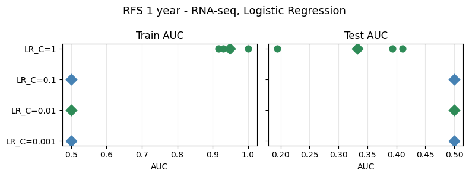
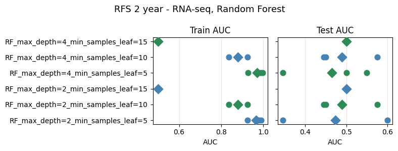

# HCC Multimodal — RFS Baseline (2026-04-27)

New baseline task: binary classification of **recurrence-free survival (RFS)** at 1-year and 2-year horizons, predicted from bulk RNA-seq only.

## Methodology

`notebooks/baselines/rna_baseline_rfs.ipynb`

**Targets:** `rfs_1year`, `rfs_2year` — derived from `RFS_central` / `RFS_central_event`. A patient is positive if a recurrence event is recorded within the horizon, negative if followed past the horizon without event, and censored (`NaN`, excluded) if follow-up ends before the horizon with no event.

**Dataset:** 60 patients × 50,986 genes. After low-expression filtering (count ≥ 15 in ≥ 5 samples) → 27,991 genes. Drop censored rows per-target.
- 1-year: n=56, positives=19 (34%)
- 2-year: n=54, positives=25 (46%)

**Pipeline (selector-first, raw counts in):**
1. `DeseqCPMSelector` — fit DESeq2 inside each training fold, select genes with BH-adjusted p < 0.1 (fallback: top 20 by padj if fewer pass); return log2(CPM+1) on the selected genes.
2. Median imputation + StandardScaler.
3. Model.

**Evaluation:** stratified 3-fold CV, AUC (ROC) primary metric. No hyperparameter grid search — a small manual sweep over the model's key regularisation knob is reported per fold.

**Model sweeps:**
- LR: `solver=liblinear, penalty=l1`, C ∈ {0.001, 0.01, 0.1, 1}
- RF: `max_depth ∈ {2, 4}` × `min_samples_leaf ∈ {5, 10, 15}`

---

## 1-year RFS

### Logistic Regression

| Model | AUC mean ± std | Accuracy mean ± std |
|-------|---------------|---------------------|
| LR_C=0.001 | 0.500 ± 0.000 | 0.661 ± 0.022 |
| LR_C=0.01  | 0.500 ± 0.000 | 0.661 ± 0.022 |
| LR_C=0.1   | 0.500 ± 0.000 | 0.661 ± 0.022 |
| LR_C=1     | 0.333 ± 0.098 | 0.426 ± 0.107 |

All strongly-regularised settings collapse to the constant-majority predictor (test AUC = 0.500, accuracy = 0.661 ≈ 37/56). C=1 lets the weights grow enough to fit the training folds (train AUC ≈ 0.95) but test AUC drops *below* chance (0.333) — the model overfits DESeq-selected genes that do not generalise across folds.

### Random Forest

| Model | AUC mean ± std | Accuracy mean ± std |
|-------|---------------|---------------------|
| RF_max_depth=2_min_samples_leaf=5  | 0.204 ± 0.049 | 0.590 ± 0.087 |
| RF_max_depth=2_min_samples_leaf=10 | 0.246 ± 0.136 | 0.661 ± 0.022 |
| RF_max_depth=2_min_samples_leaf=15 | 0.438 ± 0.108 | 0.661 ± 0.022 |
| RF_max_depth=4_min_samples_leaf=5  | 0.199 ± 0.070 | 0.554 ± 0.064 |
| RF_max_depth=4_min_samples_leaf=10 | 0.246 ± 0.136 | 0.661 ± 0.022 |
| RF_max_depth=4_min_samples_leaf=15 | 0.438 ± 0.108 | 0.661 ± 0.022 |

All configurations land below 0.5 test AUC. The best (leaf=15) approaches random (0.438); the more flexible settings (small leaf, any depth) sit near 0.20 — worse than inverted chance. Fold-level AUCs are widely dispersed (std up to 0.136), consistent with unstable selection from high-dimensional features + small n.

---

## 2-year RFS

### Logistic Regression

| Model | AUC mean ± std | Accuracy mean ± std |
|-------|---------------|---------------------|
| LR_C=0.001 | 0.500 ± 0.000 | 0.537 ± 0.026 |
| LR_C=0.01  | 0.500 ± 0.000 | 0.537 ± 0.026 |
| LR_C=0.1   | 0.473 ± 0.038 | 0.537 ± 0.026 |
| LR_C=1     | **0.534 ± 0.164** | 0.481 ± 0.114 |

C=1 edges above the constant baseline (0.534) but with large fold-to-fold variance (±0.164). Train AUC climbs with weaker regularisation (≈ 0.97 at C=1); strong regularisation pins the model to the majority vote.

### Random Forest

| Model | AUC mean ± std | Accuracy mean ± std |
|-------|---------------|---------------------|
| RF_max_depth=2_min_samples_leaf=5  | 0.474 ± 0.104 | 0.481 ± 0.026 |
| RF_max_depth=2_min_samples_leaf=10 | 0.490 ± 0.060 | 0.481 ± 0.069 |
| RF_max_depth=2_min_samples_leaf=15 | 0.500 ± 0.000 | 0.537 ± 0.026 |
| RF_max_depth=4_min_samples_leaf=5  | 0.465 ± 0.087 | 0.481 ± 0.026 |
| RF_max_depth=4_min_samples_leaf=10 | 0.490 ± 0.060 | 0.481 ± 0.069 |
| RF_max_depth=4_min_samples_leaf=15 | 0.500 ± 0.000 | 0.537 ± 0.026 |

All configurations hover at chance (0.465–0.500). `min_samples_leaf=15` collapses every tree's split budget so the forest reverts to the class prior. Unlike 1-year, no setting falls well below 0.5 — the class balance is less skewed (46% vs. 34% positives) so the "always predict majority" failure mode is less punitive.

---

## Takeaways

- **2-year RFS is easier than 1-year but still near chance.** Best test AUC is 0.534 (LR C=1), vs. 0.500-or-worse for every 1-year configuration. The extra 6 positives (19 → 25) shift the class balance closer to 50/50 and give the selector more signal to work with.
- **1-year RFS is hard for a pure RNA-seq + DESeq selector.** No model beats the 0.500 constant baseline; the only model that learns (LR C=1) overfits and generalises below chance (0.333). This contrasts with `death` on the same RNA-seq input (AUC 0.670 in the 0420 baseline) — longitudinal-recurrence signal in the bulk transcriptome is evidently weaker, and censoring drops further samples.
- **DESeq inside CV rarely finds significant genes**, falling back to top-20-by-padj on most folds (warnings "only 0 gene(s) passed padj<0.1"). The selected gene set therefore differs across folds — a likely driver of the large fold-wise AUC variance (up to ±0.164).
- Candidate next steps: widen the fallback-k, try a class-balanced loss, or pool 1-year + 2-year supervision via a multi-task head; add clinical covariates to see if they stabilise the RNA signal.
