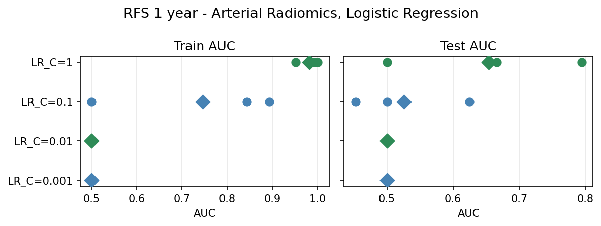
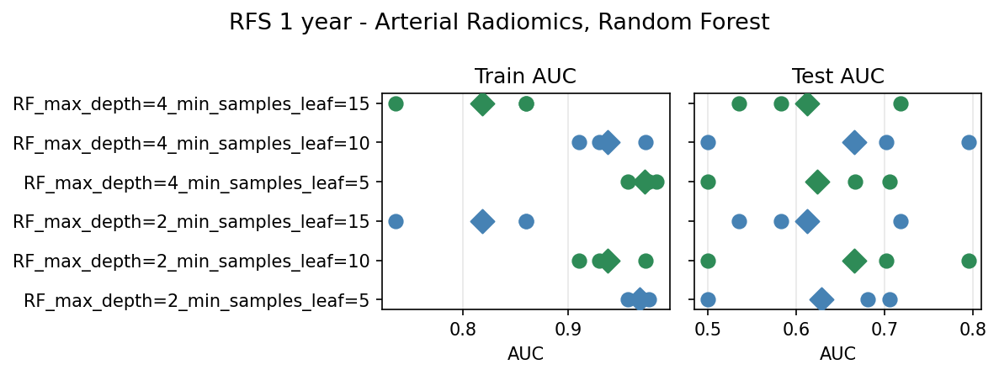
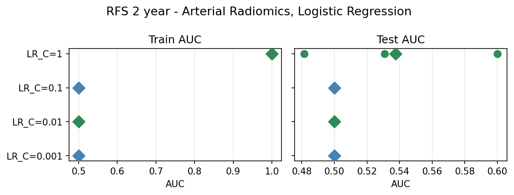
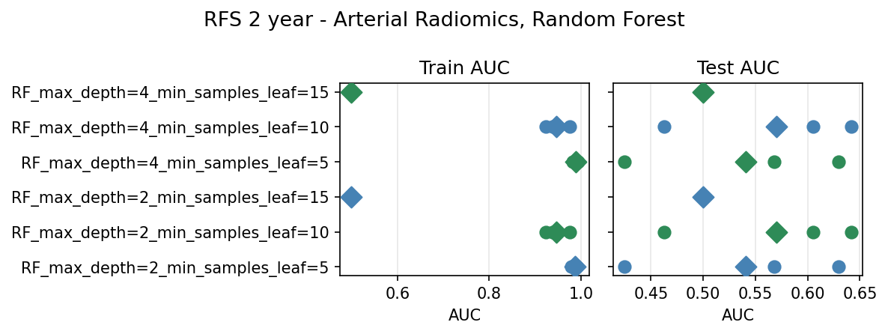
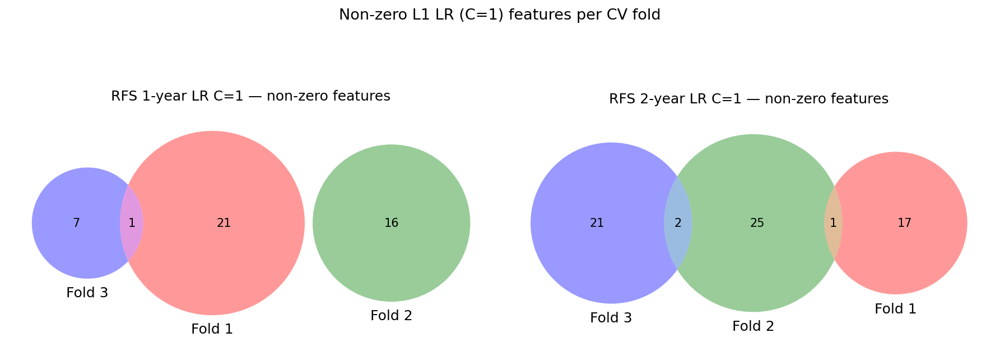

# HCC Multimodal — RFS Baseline: Arterial Radiomics (2026-04-27)

Binary classification of **recurrence-free survival (RFS)** at 1-year and 2-year horizons, predicted from arterial-phase CT radiomic features.

## Methodology

`notebooks/baselines/radiomic_arterial_baseline_rfs.ipynb`

**Targets:** `rfs_1year`, `rfs_2year` — derived from `RFS_central` / `RFS_central_event` (same definition as the RNA-seq baseline). Censored patients (follow-up ends before the horizon with no event) are excluded per target.

**Dataset:** 60 patients × 4132 arterial radiomic features. After merging with clinical data on SID, all 60 patients matched. Drop censored rows per-target.
- 1-year: n=56, positives=19 (34%)
- 2-year: n=54, positives=26 (48%)

**Note:** SelectKBest flags 13–14 constant ra
diomic features per fold (e.g. indices 58, 491, 924 …). These receive an undefined F-statistic and are automatically ranked below non-constant features, so they are never selected by `k=100`.

**Pipeline:**
1. `ColumnTransformer` — median imputation + StandardScaler on the continuous radiomic columns.
2. `SelectKBest(f_classif, k=100)` — fit on training fold, select top 100 features by ANOVA F-statistic.
3. Model.

Feature names are recovered after the fact by mapping `SelectKBest.get_support()` back onto `ColumnTransformer.get_feature_names_out()`, so coefficient extraction works even though the selector receives a numpy array from the preprocessor.

**Evaluation:** stratified 3-fold CV, AUC (ROC) primary metric.

**Model sweeps:**
- LR: `solver=saga, penalty=elasticnet, l1_ratio=1.0`, C ∈ {0.001, 0.01, 0.1, 1}
- RF: `max_depth ∈ {2, 4}` × `min_samples_leaf ∈ {5, 10, 15}`

**Non-zero feature files:** `reports/0427/arterial_rfs/nonzero_features_rfs_{1,2}y_{union.txt,all_folds.csv}`  
**Plots:** `notebooks/baselines/arterial_rfs/rfs_{1,2}y_{lr,rf}.png`

---

## 1-year RFS

### Logistic Regression

| Model | AUC mean ± std | Accuracy mean ± std |
|-------|---------------|---------------------|
| LR_C=0.001 | 0.500 ± 0.000 | 0.661 ± 0.022 |
| LR_C=0.01  | 0.500 ± 0.000 | 0.661 ± 0.022 |
| LR_C=0.1   | 0.526 ± 0.073 | 0.661 ± 0.022 |
| LR_C=1     | **0.654 ± 0.121** | 0.660 ± 0.055 |

C=0.001 and C=0.01 collapse to the majority-class predictor (all 3 folds: train AUC = test AUC = 0.500). C=0.1 begins to break symmetry in 2 of 3 folds (train AUC 0.843–0.893, test AUC 0.452–0.625). C=1 gives the best mean test AUC (0.654) with folds of 0.795, 0.500, 0.667 — fold 2 collapses to chance, driving the ±0.121 std. Train AUC at C=1 is 0.951–1.000, indicating substantial overfitting with 4132 → 100 → L1 compression on n≈37 training samples.

Fold-level AUCs (LR):

| Model | Fold 1 train/test | Fold 2 train/test | Fold 3 train/test |
|-------|-------------------|-------------------|-------------------|
| LR_C=0.001 | 0.500 / 0.500 | 0.500 / 0.500 | 0.500 / 0.500 |
| LR_C=0.01  | 0.500 / 0.500 | 0.500 / 0.500 | 0.500 / 0.500 |
| LR_C=0.1   | 0.500 / 0.500 | 0.893 / 0.452 | 0.843 / 0.625 |
| LR_C=1     | 1.000 / 0.795 | 0.993 / 0.500 | 0.951 / 0.667 |

### Random Forest

| Model | AUC mean ± std | Accuracy mean ± std |
|-------|---------------|---------------------|
| RF_max_depth=2_min_samples_leaf=5  | 0.629 ± 0.091 | 0.625 ± 0.086 |
| RF_max_depth=2_min_samples_leaf=10 | **0.665 ± 0.123** | 0.660 ± 0.093 |
| RF_max_depth=2_min_samples_leaf=15 | 0.612 ± 0.077 | 0.661 ± 0.022 |
| RF_max_depth=4_min_samples_leaf=5  | 0.624 ± 0.089 | 0.625 ± 0.086 |
| RF_max_depth=4_min_samples_leaf=10 | **0.665 ± 0.123** | 0.660 ± 0.093 |
| RF_max_depth=4_min_samples_leaf=15 | 0.612 ± 0.077 | 0.661 ± 0.022 |

The best RF configuration (leaf=10, either depth) essentially ties the best LR (0.665 vs 0.654 mean AUC) with similar variance (±0.123 vs ±0.121). Depth has minimal effect — once `min_samples_leaf` is fixed, adding depth does not change the result, suggesting the leaf constraint is the binding regulariser. The larger leaf size (15) reduces AUC relative to 10, pushing more folds toward a single split. All RF configs are above chance (>0.500).

Fold-level AUCs (RF, depth=2):

| Model | Fold 1 train/test | Fold 2 train/test | Fold 3 train/test |
|-------|-------------------|-------------------|-------------------|
| leaf=5  | 0.971 / 0.705 | 0.977 / 0.500 | 0.957 / 0.681 |
| leaf=10 | 0.910 / 0.795 | 0.973 / 0.500 | 0.929 / 0.701 |
| leaf=15 | 0.736 / 0.718 | 0.860 / 0.536 | 0.860 / 0.583 |

Fold 2 is consistently the weakest (0.500–0.536 test AUC) across all RF configs, matching the LR pattern. This suggests a data-partition-level issue (class imbalance or outlier distribution in one particular fold split) rather than a model-family issue.

---

## 2-year RFS

### Logistic Regression

| Model | AUC mean ± std | Accuracy mean ± std |
|-------|---------------|---------------------|
| LR_C=0.001 | 0.500 ± 0.000 | 0.481 ± 0.026 |
| LR_C=0.01  | 0.500 ± 0.000 | 0.481 ± 0.026 |
| LR_C=0.1   | 0.500 ± 0.000 | 0.481 ± 0.026 |
| LR_C=1     | **0.537 ± 0.049** | 0.500 ± 0.079 |

All strongly-regularised settings are degenerate (AUC = 0.500, constant majority predictor). C=0.1 still collapses — unlike the 1-year task — meaning the f-classif top-100 features contain weaker marginal signal for 2-year recurrence. C=1 edges above chance (0.537, folds: 0.600 / 0.531 / 0.481) with train AUC = 1.000 on all 3 folds — extreme overfitting.

### Random Forest

| Model | AUC mean ± std | Accuracy mean ± std |
|-------|---------------|---------------------|
| RF_max_depth=2_min_samples_leaf=5  | 0.541 ± 0.086 | 0.500 ± 0.079 |
| RF_max_depth=2_min_samples_leaf=10 | **0.570 ± 0.077** | 0.537 ± 0.069 |
| RF_max_depth=2_min_samples_leaf=15 | 0.500 ± 0.000 | 0.519 ± 0.026 |
| RF_max_depth=4_min_samples_leaf=5  | 0.541 ± 0.086 | 0.481 ± 0.069 |
| RF_max_depth=4_min_samples_leaf=10 | **0.570 ± 0.077** | 0.537 ± 0.069 |
| RF_max_depth=4_min_samples_leaf=15 | 0.500 ± 0.000 | 0.519 ± 0.026 |

`min_samples_leaf=15` completely collapses (train AUC = 0.500 all folds — cannot form any split that satisfies the leaf constraint given n≈36 training samples with 48% class balance). `leaf=10` gives the best result (0.570 ± 0.077), modestly above chance.

---

## L1 LR non-zero features

Non-zero coefficients extracted from the best-performing LR configuration (C=1, L1 penalty, `saga`/`elasticnet`) per fold. Feature names correspond to the arterial radiomic descriptor vocabulary (GLCM/GLSZM/GLRLM/NGTDM texture family with wavelet sub-band suffix `_XYZ` and quantization suffix `_Ngl`).

Full lists: `reports/0427/arterial_rfs/nonzero_features_rfs_{1,2}y_union.txt` and `_all_folds.csv`.

### 1-year RFS (LR C=1)

| Fold | n non-zero | Top features (by \|coef\|) |
|------|-----------|------------------------|
| 1 | 22 | GLCM_Homoge_HHL_32gl (+1.17), GLCM_AutoCorrel_HLH_32gl (+0.74), GLCM_sumAvg_HLH_256gl (+0.67), GLRLM_LGLRE_HLH_8gl (+0.56), FD_min_HLL_256gl (+0.37) |
| 2 | 16 | DifferenceAverageAveraged3D (+0.92), NormalisedRunLengthNonUniformityMerged3D (+0.62), FD_lacunarity_LLL_16gl (−0.58), GLCM_invVar_8gl (+0.57), FD_sd_LLL_16gl (+0.32) |
| 3 | 8  | GLCM_Homoge1_LHH_8gl (+0.67), GLCM_Entrop_HLH_64gl (+0.63), FD_mean_LHH_8gl (+0.48), GLCM_Contra_LHL_128gl (+0.43), GLCM_Contra_LHL_32gl (+0.42) |

**Pairwise intersections:**

| Pair | Features |
|------|---------|
| F1 ∩ F2 | — (empty) |
| F1 ∩ F3 | `GLCM_Entrop_HLH_64gl` (fold 1 coef +0.25, fold 3 coef +0.63) |
| F2 ∩ F3 | — (empty) |
| F1 ∩ F2 ∩ F3 | — (empty) |

**Total union across all folds and C values:** 45 unique features. Only one feature — **`GLCM_Entrop_HLH_64gl`** (GLCM entropy in the HLH wavelet sub-band, 64 grey levels) — appears in two folds (1 and 3). GLCM inverse variance (`GLCM_invVar`) appears across folds as different sub-band/quantization variants (8gl, 128gl, LHL_64gl), suggesting this texture family carries consistent but wavelet-specific signal.

### 2-year RFS (LR C=1)

| Fold | n non-zero | Top features (by \|coef\|) |
|------|-----------|------------------------|
| 1 | 18 | InverseDifferenceMomentAveraged3D (−1.23), AngularSecondMomentMerged3D (+0.78), InverseDifferenceMomentMerged3D (−0.74), GLSZM_SzoneHiGl_LHL_256gl (−0.68), GLCM_InfCo2_LLL_64gl (+0.47) |
| 2 | 28 | GLCM_Correl_HHL_128gl (−0.80), GLCM_Correl_HLL_8gl (+0.71), Asphericity3D (−0.52), GLCM_AutoCorrel_HHL_32gl (−0.48), AUC-CSH_HHL (−0.45) |
| 3 | 23 | FOS_Kurt_LHH (−0.78), GLSZM_ZoneLoGl_HLH_8gl (+0.70), FOS_Imean_LHL (−0.70), GLSZM_ZoneHiGl_HLH_8gl (−0.44), NGTDM_Complex_LHL_64gl (+0.42) |

**Pairwise intersections:**

| Pair | Features |
|------|---------|
| F1 ∩ F2 | `FD_max_HHH_8gl` (fold 1 coef +0.19, fold 2 coef +0.18) |
| F1 ∩ F3 | — (empty) |
| F2 ∩ F3 | `FD_mean_HLH_32gl` (fold 2 +0.18, fold 3 +0.18), `GLCM_Correl_HLL_16gl` (fold 2 −0.21, fold 3 −0.21) |
| F1 ∩ F2 ∩ F3 | — (empty) |

**Total union:** 66 unique features. No feature is shared across all three folds. Three pairwise-shared features: `FD_max_HHH_8gl` (max fractal dimension, HHH sub-band), `FD_mean_HLH_32gl` (mean fractal dimension, HLH sub-band), and `GLCM_Correl_HLL_16gl` (GLCM correlation, HLL sub-band, 16gl). The higher feature count per fold (18–28 vs 8–22 for 1y) with barely-above-chance test AUC (0.537) confirms more severe overfitting on the 2-year task.

---

## Comparison with RNA-seq baseline (from 0427_baseline_rfs_rna.md)

| Target | Modality | Best model | AUC mean | AUC std |
|--------|----------|-----------|----------|---------|
| 1-year | RNA-seq  | LR C=1 (DESeq sel.) | 0.333 | 0.098 |
| 1-year | RNA-seq  | RF leaf=15 | 0.438 | 0.108 |
| 1-year | Arterial radiomics | LR C=1 | **0.654** | 0.121 |
| 1-year | Arterial radiomics | RF leaf=10 | **0.665** | 0.123 |
| 2-year | RNA-seq  | LR C=1 | 0.534 | 0.164 |
| 2-year | RNA-seq  | RF leaf=10 | 0.490 | 0.060 |
| 2-year | Arterial radiomics | LR C=1 | 0.537 | 0.049 |
| 2-year | Arterial radiomics | RF leaf=10 | **0.570** | 0.077 |

- **1-year RFS**: Arterial radiomics substantially outperform RNA-seq. The RNA-seq baseline never exceeded 0.500 for 1-year (LR was degenerate or below chance; RF peaked at 0.438). Radiomics reach 0.654–0.665 — a meaningful lift, though the train/test gap still reveals overfitting.
- **2-year RFS**: RNA-seq LR C=1 and radiomics LR C=1 are close (0.534 vs 0.537) but RNA has much higher fold-level variance (±0.164 vs ±0.049). RF favours radiomics (0.570 vs 0.490). Both modalities hover near chance; neither is reliable.

---

## Takeaways

- **1-year RFS is learnable from arterial radiomics.** Best test AUC 0.665 (RF) / 0.654 (LR) — far above the RNA-seq baseline that could not beat 0.500. Fold 2 is consistently weak (0.500), and the large train/test gap (train ≈ 0.95–1.0 vs test ≈ 0.50–0.80) shows residual overfitting with n=56 and 4132 → 100 features.
- **2-year RFS remains near chance for both modalities.** The f-classif top-100 selection does not capture signal that generalises; best RF AUC is 0.570, best LR AUC is 0.537.
- **GLCM texture features dominate L1 selection for 1-year RFS.** GLCM homogeneity, entropy, inverse variance, autocorrelation, and sum-average appear across folds in different wavelet sub-bands — consistent with textural heterogeneity of the tumour as a predictor of short-term recurrence.
- **Minimal cross-fold stability.** 1-year: one pairwise-shared feature (`GLCM_Entrop_HLH_64gl`, F1∩F3), nothing across all three folds. 2-year: three pairwise-shared features (`FD_max_HHH_8gl`, `FD_mean_HLH_32gl`, `GLCM_Correl_HLL_16gl`), again none shared across all three. Reproducibility requires larger n.
- Candidate next steps: combine arterial radiomics + clinical covariates (tumour size, vascular invasion); try portal-phase or equilibrium-phase radiomics; increase feature robustness with ICC filtering before SelectKBest.
