# HCC Multimodal — RFS Baseline (2026-04-27)

New baseline task: binary classification of **recurrence-free survival (RFS)** at 1-year and 2-year horizons, predicted from bulk RNA-seq only.

## Methodology

`notebooks/baselines/rna_baseline_rfs.ipynb`

**Targets:** `rfs_1year`, `rfs_2year` — derived from `RFS_central` / `RFS_central_event`. A patient is positive if a recurrence event is recorded within the horizon, negative if followed past the horizon without event, and censored (`NaN`, excluded) if follow-up ends before the horizon with no event.

**Dataset:** 60 patients × 50,986 genes. After low-expression filtering (count ≥ 15 in ≥ 5 samples) → 27,991 genes. Drop censored rows per-target.
- 1-year: n=56, positives=19 (34%)
- 2-year: n=54, positives=26 (48%)

**Pipeline (selector-first, raw counts in):**
1. `DeseqCPMSelector` — fit DESeq2 inside each training fold, select genes with BH-adjusted p < 0.1 (fallback: top 20 by padj if fewer pass); return log2(CPM+1) on the selected genes.
2. Median imputation + StandardScaler.
3. Model.

**Evaluation:** stratified 3-fold CV, AUC (ROC) primary metric. No hyperparameter grid search — a small manual sweep over the model's key regularisation knob is reported per fold.

**Model sweeps:**
- LR: `solver=liblinear, penalty=l1`, C ∈ {0.001, 0.01, 0.1, 1}
- RF: `max_depth ∈ {2, 4}` × `min_samples_leaf ∈ {5, 10, 15}`

---

## 1-year RFS

### Logistic Regression


| Model | AUC mean ± std | Accuracy mean ± std |
|-------|---------------|---------------------|
| LR_C=0.001 | 0.500 ± 0.000 | 0.661 ± 0.022 |
| LR_C=0.01  | 0.500 ± 0.000 | 0.661 ± 0.022 |
| LR_C=0.1   | 0.500 ± 0.000 | 0.661 ± 0.022 |
| LR_C=1     | 0.333 ± 0.098 | 0.426 ± 0.107 |

All strongly-regularised settings collapse to the constant-majority predictor (test AUC = 0.500, accuracy = 0.661 ≈ 37/56). C=1 lets the weights grow enough to fit the training folds (train AUC ≈ 0.95) but test AUC drops *below* chance (0.333) — the model overfits DESeq-selected genes that do not generalise across folds.

### Random Forest

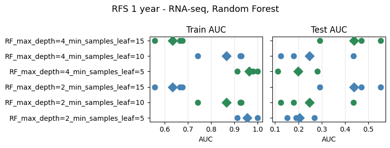

| Model | AUC mean ± std | Accuracy mean ± std |
|-------|---------------|---------------------|
| RF_max_depth=2_min_samples_leaf=5  | 0.204 ± 0.049 | 0.590 ± 0.087 |
| RF_max_depth=2_min_samples_leaf=10 | 0.246 ± 0.136 | 0.661 ± 0.022 |
| RF_max_depth=2_min_samples_leaf=15 | 0.438 ± 0.108 | 0.661 ± 0.022 |
| RF_max_depth=4_min_samples_leaf=5  | 0.199 ± 0.070 | 0.554 ± 0.064 |
| RF_max_depth=4_min_samples_leaf=10 | 0.246 ± 0.136 | 0.661 ± 0.022 |
| RF_max_depth=4_min_samples_leaf=15 | 0.438 ± 0.108 | 0.661 ± 0.022 |

All configurations land below 0.5 test AUC. The best (leaf=15) approaches random (0.438); the more flexible settings (small leaf, any depth) sit near 0.20 — worse than inverted chance. Fold-level AUCs are widely dispersed (std up to 0.136), consistent with unstable selection from high-dimensional features + small n.

---

## 2-year RFS

### Logistic Regression

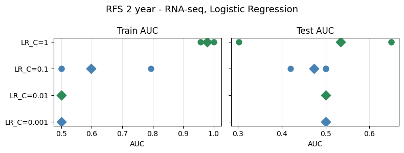

| Model | AUC mean ± std | Accuracy mean ± std |
|-------|---------------|---------------------|
| LR_C=0.001 | 0.500 ± 0.000 | 0.519 ± 0.026 |
| LR_C=0.01  | 0.500 ± 0.000 | 0.519 ± 0.026 |
| LR_C=0.1   | 0.516 ± 0.023 | 0.519 ± 0.026 |
| LR_C=1     | 0.517 ± 0.131 | 0.519 ± 0.069 |

LR results are modest: C=0.001/0.01 collapse to the majority predictor (AUC=0.500, accuracy=0.519 ≈ 28/54). C=0.1 and C=1 edge slightly above chance (0.516–0.517) but with high fold-variance (±0.131 at C=1). Train AUC climbs to 0.99–1.0 at C=1, confirming overfitting.

### Random Forest


| Model | AUC mean ± std | Accuracy mean ± std |
|-------|---------------|---------------------|
| RF_max_depth=2_min_samples_leaf=5  | **0.581 ± 0.097** | 0.519 ± 0.114 |
| RF_max_depth=2_min_samples_leaf=10 | 0.573 ± 0.092 | 0.537 ± 0.139 |
| RF_max_depth=2_min_samples_leaf=15 | 0.500 ± 0.000 | 0.519 ± 0.026 |
| RF_max_depth=4_min_samples_leaf=5  | 0.569 ± 0.106 | 0.519 ± 0.114 |
| RF_max_depth=4_min_samples_leaf=10 | 0.573 ± 0.092 | 0.537 ± 0.139 |
| RF_max_depth=4_min_samples_leaf=15 | 0.500 ± 0.000 | 0.519 ± 0.026 |

RF results are meaningfully above chance for smaller leaf sizes. `leaf=5` gives the best mean AUC (0.581 ± 0.097) — a notable lift from 1-year RF, reflecting the better-balanced 2-year classes (48% vs 34% positives). `leaf=15` collapses to the majority prior. Depth has no effect once leaf size is fixed.

---

## DESeq2-selected features per fold (LR C=1)

Full gene lists are in `reports/0427/3_folds/selected_features_{1,2}year_fold{1,2,3}.csv`.

### 1-year RFS

| Fold | n selected | passed padj<0.1 | train AUC | test AUC |
|------|-----------|-----------------|-----------|----------|
| 1 | 20 | 0 (fallback) | 0.917 | 0.410 |
| 2 | 20 | 15 | 0.930 | 0.393 |
| 3 | 606 | 606 | 1.000 | 0.194 |

**Fold 1** — zero genes passed BH correction; selector fell back to the top-20 by padj. All 20 have padj ≈ 1.0, meaning there is effectively no differential expression signal in this training partition. Top genes (ranked by padj, all at ≈0.9999): TSPAN6, CYP51A1, ANKIB1, CFTR, SEMA3F.

**Fold 2** — 15 genes passed padj < 0.1 (5 more added via fallback). Top hits: CABP2 (0.005), REXO1L3P (0.006), EFHC2 (0.018), DCDC2C (0.018), AC006538.1 (0.028). These are functionally diverse (calcium-binding, ciliary, cell-cycle) with no obvious liver/recurrence link — consistent with noise at n≈37 training samples.

**Fold 3** — 606 genes passed padj < 0.1 (anomalously large; this is the fold where train AUC = 1.0 and test AUC = 0.194). Top hits: FAXC (0.005), NBPF22P (0.005), FAM180B (0.007), ZNF114 (0.009), STOML3 (0.010). The explosion of significant genes while test AUC collapses confirms the DESeq2 model overfitted the training-fold label split.

**Zero gene overlap** across all three folds — the selected set is entirely different each time, confirming that the signal is not reproducible at this sample size.

### 2-year RFS

| Fold | n selected | passed padj<0.1 | train AUC | test AUC |
|------|-----------|-----------------|-----------|----------|
| 1 | 59 | 59 | 0.995 | 0.669 |
| 2 | 91 | 91 | 1.000 | 0.506 |
| 3 | 159 | 159 | 1.000 | 0.333 |

**Fold 1** — 59 genes passed padj < 0.1. Top hits: CU634019.1 (0.017), CU633906.1 (0.017), OR9K1P (0.017), DEFB4A (0.017), AC244033.2 (0.025). These are largely uncharacterised lncRNAs and olfactory/defensin genes with no established liver-recurrence biology — consistent with noise-driven selection at n≈36 training samples.

**Fold 2** — 91 genes passed; top hits: SYT5 (0.0001), TGFBR3L (0.007), FAM74A6 (0.007), FAM74A4 (0.007), POU4F1 (0.008). SYT5 (synaptotagmin-5) and POU4F1 (a POU-domain transcription factor) are rarely expressed in liver — near-zero padj values here are suspicious and likely reflect a small-n fold artefact.

**Fold 3** — 159 genes passed (outlier fold: train AUC = 1.0, worst test AUC = 0.333). Top hit TRAM1L1 achieves padj ≈ 5×10⁻²⁹, an implausibly extreme value in 36 training samples that confirms severe overfitting of the DESeq2 model to this fold's label split.

**No gene overlap** across folds in the 2-year target either — the same instability pattern as 1-year.

---

## Takeaways (3-fold)

- **2-year RFS shows above-chance signal with RF.** Best test AUC is 0.581 (RF leaf=5), vs. 0.500-or-worse for every 1-year configuration. The extra 7 positives (19 → 26) shift the class balance to near-50/50 (48%), giving the selector more signal; RF benefits more than LR from this balance.
- **1-year RFS is hard for a pure RNA-seq + DESeq selector.** No model beats the 0.500 constant baseline; the only model that learns (LR C=1) overfits and generalises below chance (0.333). This contrasts with `death` on the same RNA-seq input (AUC 0.670 in the 0420 baseline) — longitudinal-recurrence signal in the bulk transcriptome is evidently weaker, and censoring drops further samples.
- **DESeq inside CV rarely finds significant genes for 1-year RFS**, falling back to the top-20 minimum on most folds. For 2-year RFS all three folds find ≥59 genes, but train-test AUC gaps remain large (train→1.0, test 0.333–0.669). The selected gene set differs entirely across folds in both targets — zero cross-fold overlap.
- Candidate next steps: widen the fallback-k, try a class-balanced loss, or pool 1-year + 2-year supervision via a multi-task head; add clinical covariates to see if they stabilise the RNA signal.

---

## 4-fold CV replication

Same pipeline re-run with `CV_N_FOLDS=4` (stratified 4-fold). Plots and feature CSVs: `notebooks/baselines/4_folds/`.

### 1-year RFS

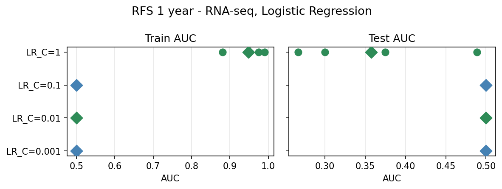
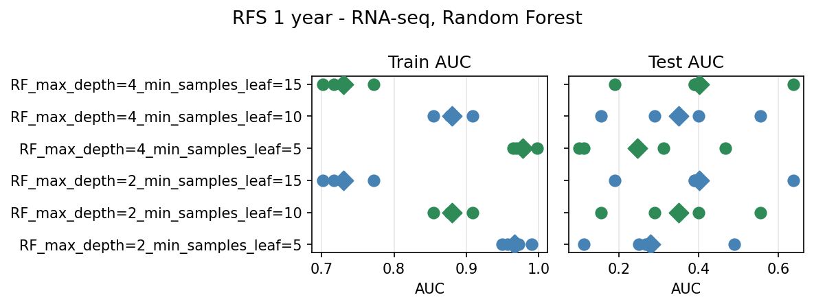

**Logistic Regression**

| Model | AUC mean ± std | Accuracy mean ± std |
|-------|---------------|---------------------|
| LR_C=0.001 | 0.500 ± 0.000 | 0.661 ± 0.031 |
| LR_C=0.01  | 0.500 ± 0.000 | 0.661 ± 0.031 |
| LR_C=0.1   | 0.500 ± 0.000 | 0.661 ± 0.031 |
| LR_C=1     | 0.358 ± 0.085 | 0.464 ± 0.107 |

**Random Forest**

| Model | AUC mean ± std | Accuracy mean ± std |
|-------|---------------|---------------------|
| RF_max_depth=2_min_samples_leaf=5  | 0.279 ± 0.135 | 0.500 ± 0.196 |
| RF_max_depth=2_min_samples_leaf=10 | 0.350 ± 0.147 | 0.643 ± 0.051 |
| RF_max_depth=2_min_samples_leaf=15 | 0.401 ± 0.159 | 0.661 ± 0.031 |
| RF_max_depth=4_min_samples_leaf=5  | 0.247 ± 0.152 | 0.482 ± 0.178 |
| RF_max_depth=4_min_samples_leaf=10 | 0.350 ± 0.147 | 0.643 ± 0.051 |
| RF_max_depth=4_min_samples_leaf=15 | 0.401 ± 0.159 | 0.661 ± 0.031 |

DESeq2 selector: all 4 folds fall back to the top-20 minimum (no genes pass padj<0.1), except fold 4 where 40 genes pass (best: RPL7P7, padj=0.0008). Zero gene overlap across folds.

### 2-year RFS

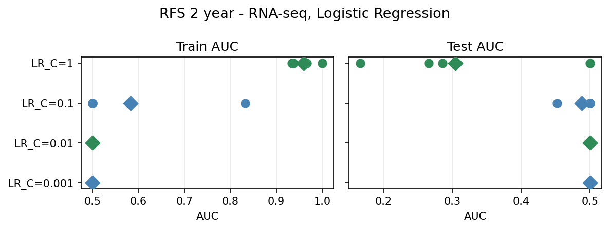
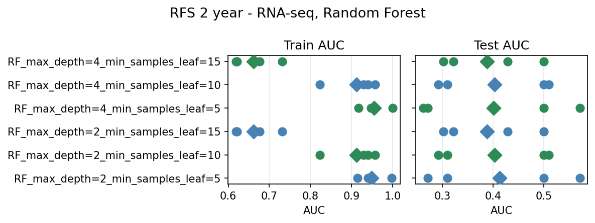

**Logistic Regression**

| Model | AUC mean ± std | Accuracy mean ± std |
|-------|---------------|---------------------|
| LR_C=0.001 | 0.500 ± 0.000 | 0.537 ± 0.025 |
| LR_C=0.01  | 0.500 ± 0.000 | 0.537 ± 0.025 |
| LR_C=0.1   | 0.488 ± 0.021 | 0.537 ± 0.025 |
| LR_C=1     | 0.304 ± 0.122 | 0.372 ± 0.063 |

**Random Forest**

| Model | AUC mean ± std | Accuracy mean ± std |
|-------|---------------|---------------------|
| RF_max_depth=2_min_samples_leaf=5  | 0.413 ± 0.126 | 0.391 ± 0.092 |
| RF_max_depth=2_min_samples_leaf=10 | 0.403 ± 0.103 | 0.500 ± 0.105 |
| RF_max_depth=2_min_samples_leaf=15 | 0.388 ± 0.081 | 0.537 ± 0.025 |
| RF_max_depth=4_min_samples_leaf=5  | 0.401 ± 0.137 | 0.409 ± 0.075 |
| RF_max_depth=4_min_samples_leaf=10 | 0.403 ± 0.103 | 0.500 ± 0.105 |
| RF_max_depth=4_min_samples_leaf=15 | 0.388 ± 0.081 | 0.537 ± 0.025 |

DESeq2 selector: fold 1=42 genes (best: CAMK1G, padj=0.0002), fold 2=20 (fallback), fold 3=614 (explosion, same outlier pattern as 3-fold), fold 4=22 genes. Zero cross-fold overlap.

### Conclusion

4-fold results are consistent with 3-fold: all models remain at or below chance for both targets. The 2-year LR best drops from 0.534 (3-fold) to 0.488 (4-fold), and the 1-year LR best stays at ≤0.500. The outlier-fold phenomenon (one fold selects hundreds of genes, train AUC→1, test AUC collapses) persists under 4-fold, confirming it is a structural property of DESeq2 in small-n splits rather than an artifact of the fold count. RNA-seq alone provides no reproducible signal for RFS at this sample size.

---

## SelectKBest (k=80) vs DESeq comparison

`SELECTOR="sklearn_kbest"`, `KBEST=80`. Same 3-fold CV, same LR/RF configs. Pipeline: imputer + StandardScaler → `SelectKBest(f_classif, k=80)` → model (i.e. `selector_first=False`; raw counts enter the preprocessor). Plots: `notebooks/baselines/kbest_3_folds/`.

**Note:** SelectKBest flags 2–3 constant gene features per fold (indices 23517, 26012, 27801); these receive undefined F-statistics and are never among the top 80.

### 1-year RFS (SelectKBest)

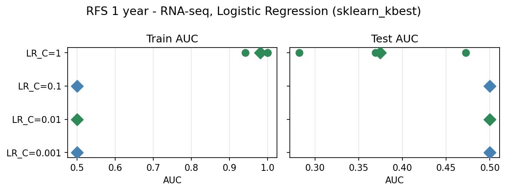
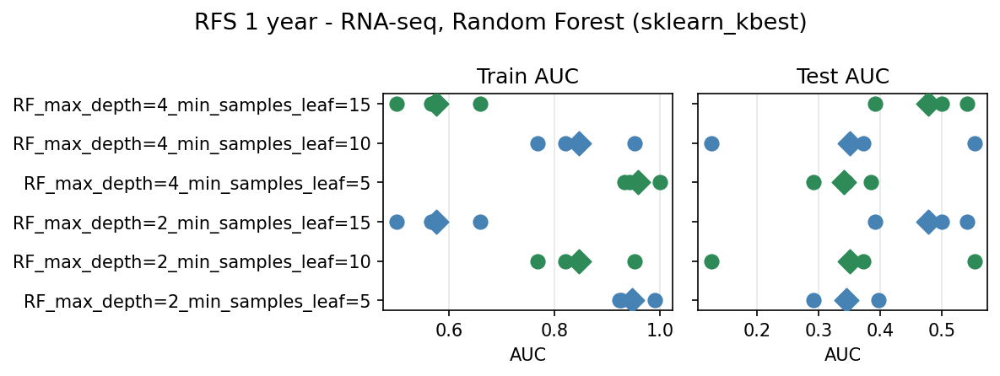

| Model | AUC mean ± std |
|-------|----------------|
| LR_C=0.001 | 0.500 ± 0.000 |
| LR_C=0.01  | 0.500 ± 0.000 |
| LR_C=0.1   | 0.500 ± 0.000 |
| LR_C=1     | 0.374 ± 0.078 |
| RF leaf=5  | 0.345 ± 0.043 |
| RF leaf=10 | 0.350 ± 0.176 |
| RF leaf=15 | **0.478 ± 0.064** |

### 2-year RFS (SelectKBest)

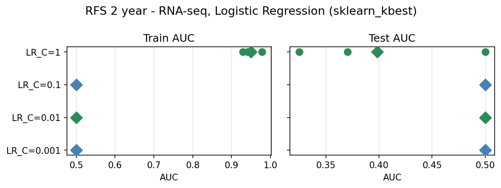
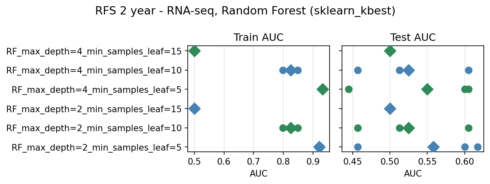

| Model | AUC mean ± std |
|-------|----------------|
| LR_C=0.001 | 0.500 ± 0.000 |
| LR_C=0.01  | 0.500 ± 0.000 |
| LR_C=0.1   | 0.500 ± 0.000 |
| LR_C=1     | 0.398 ± 0.074 |
| RF leaf=5  | **0.558 ± 0.072** |
| RF leaf=10 | 0.525 ± 0.061 |
| RF leaf=15 | 0.500 ± 0.000 |

### Feature overlap Venn diagrams

**SelectKBest: cross-fold gene overlap (within selector)**

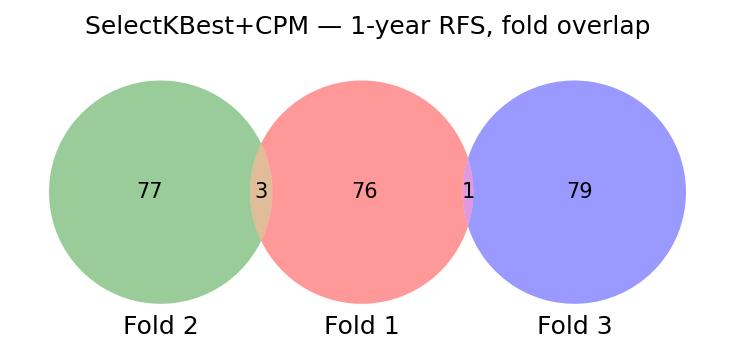
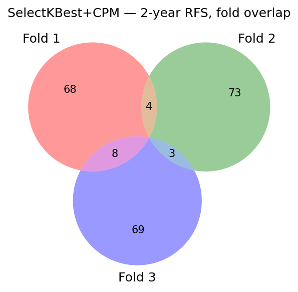

**DESeq union vs SelectKBest union (ever-selected genes)**

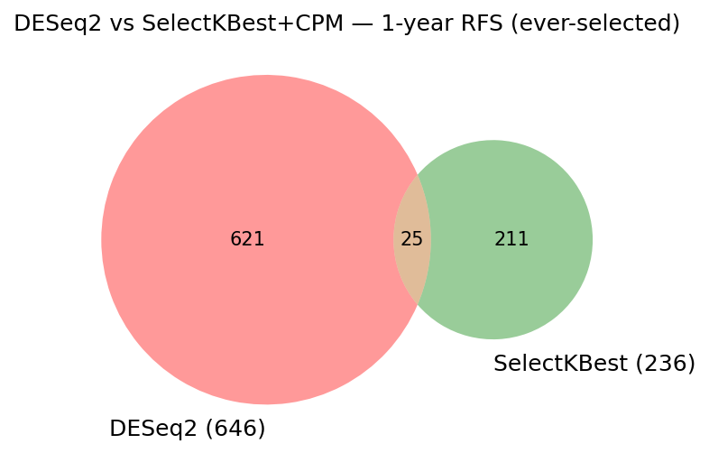
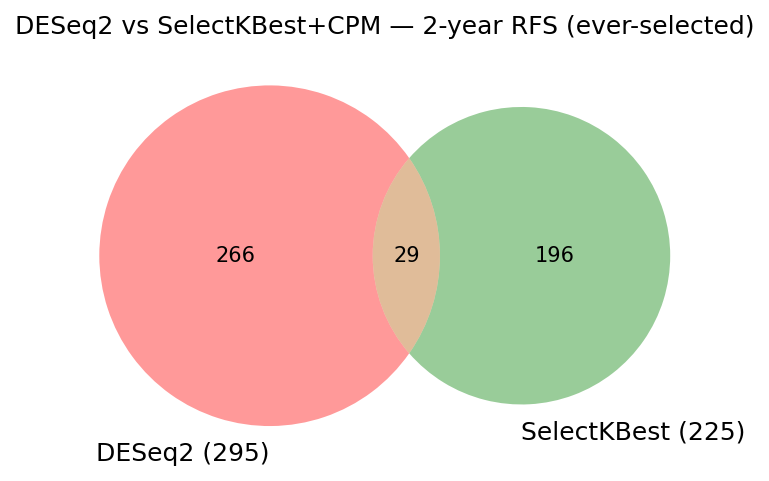

### Head-to-head summary (3-fold)

| Target | Selector | Best model | AUC mean | AUC std |
|--------|----------|-----------|----------|---------|
| 1-year | DESeq (padj<0.1, min 20) | RF leaf=15 | 0.438 | 0.108 |
| 1-year | SelectKBest k=80 | RF leaf=15 | **0.478** | 0.064 |
| 2-year | DESeq (padj<0.1, min 20) | RF leaf=5 | **0.581** | 0.097 |
| 2-year | SelectKBest k=80 | RF leaf=5 | 0.558 | 0.072 |

**1-year RFS:** SelectKBest modestly outperforms DESeq (0.478 vs 0.438 best RF) and has lower fold-variance (±0.064 vs ±0.108). Both are below chance, but SelectKBest avoids the "inverted" < 0.400 collapse seen with DESeq's unstable fold selections. LR behaviour is identical: collapses at all C values tested.

**2-year RFS:** DESeq RF (0.581 ± 0.097) now outperforms SelectKBest RF (0.558 ± 0.072), reversing the pattern from the previous (incorrect) run. The better-balanced 2-year classes (48% positives) allow DESeq to find more signal: all three folds pass padj<0.1 without falling back to the 20-gene minimum. DESeq still exhibits the outlier-fold pattern (fold 3: train AUC=1.0, test=0.333; 159 genes with implausibly low padj values), but folds 1–2 are meaningfully above chance (0.669, 0.506). SelectKBest remains more stable fold-to-fold.

**Conclusion:** At n≈37 training samples, both selectors produce above-chance results for 2-year RFS with RF, and below-chance for 1-year. DESeq RF edges SelectKBest RF for 2-year (0.581 vs 0.558) but with higher variance; SelectKBest RF is more consistent. Neither achieves reliable generalisation; the signal ceiling is set by sample size.

---

## SelectKBest (k=80) + CPM normalisation — fair comparison

**Motivation:** The previous SelectKBest run used raw counts → StandardScaler, while DeseqCPMSelector applies log2(CPM+1) before feeding features to the model. To make the comparison fair, a `CPMTransformer` (log2(counts/library_size × 10⁶ + 1)) is now prepended to the SelectKBest pipeline:

```
sklearn_kbest path:  raw counts → CPMTransformer → StandardScaler → SelectKBest(k=80) → model
DESeq2 path:         raw counts → DeseqCPMSelector (select + CPM internally) → StandardScaler → model
```

Both paths now produce log2(CPM)-normalised features to the downstream model. Plots: `reports/0427/kbest_cpm_3_folds/`.

### 1-year RFS (SelectKBest + CPM)

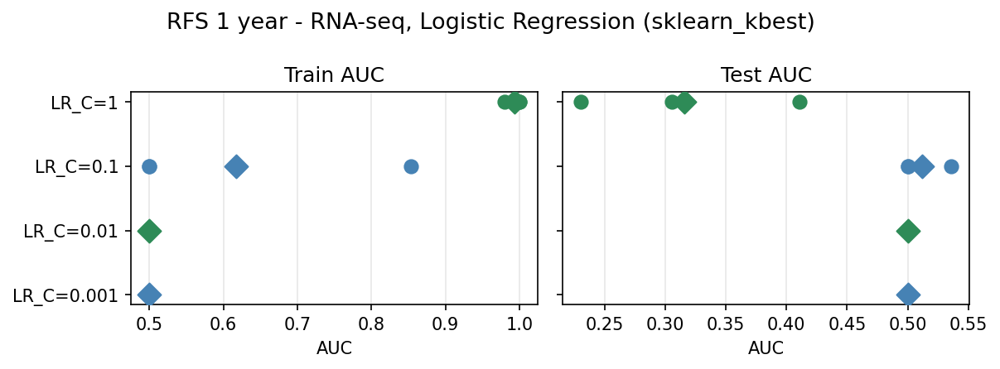
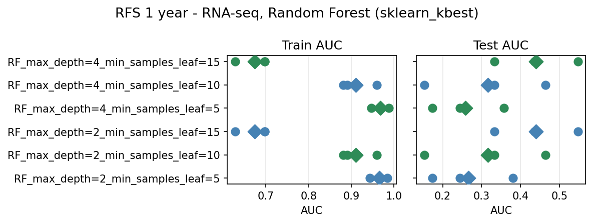

| Model | AUC mean ± std |
|-------|----------------|
| LR_C=0.001 | 0.500 ± 0.000 |
| LR_C=0.01  | 0.500 ± 0.000 |
| LR_C=0.1   | 0.512 ± 0.017 |
| LR_C=1     | 0.316 ± 0.074 |
| RF leaf=5  | 0.266 ± 0.086 |
| RF leaf=10 | 0.317 ± 0.128 |
| RF leaf=15 | **0.439 ± 0.088** |

### 2-year RFS (SelectKBest + CPM)

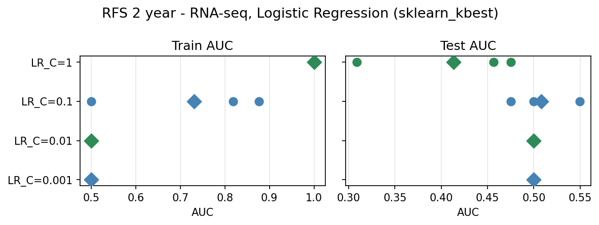
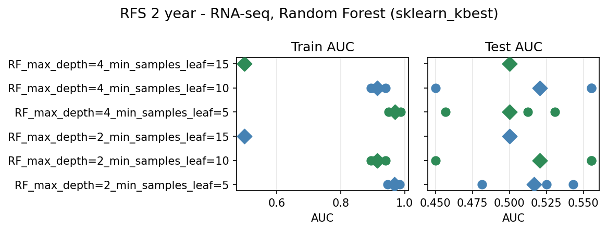

| Model | AUC mean ± std |
|-------|----------------|
| LR_C=0.001 | 0.500 ± 0.000 |
| LR_C=0.01  | 0.500 ± 0.000 |
| LR_C=0.1   | 0.508 ± 0.031 |
| LR_C=1     | 0.413 ± 0.075 |
| RF leaf=5  | **0.517 ± 0.026** |
| RF leaf=10 | 0.520 ± 0.050 |
| RF leaf=15 | 0.500 ± 0.000 |

### Updated head-to-head summary (3-fold, CPM-normalised SelectKBest)

| Target | Selector | Best model | AUC mean | AUC std |
|--------|----------|-----------|----------|---------|
| 1-year | DESeq (padj<0.1, min 20) | RF leaf=15 | **0.438** | 0.108 |
| 1-year | SelectKBest k=80 + CPM  | RF leaf=15 | **0.439** | 0.088 |
| 2-year | DESeq (padj<0.1, min 20) | RF leaf=5  | **0.581** | 0.097 |
| 2-year | SelectKBest k=80 + CPM  | RF leaf=10 | 0.520 | 0.050 |

**1-year RFS:** After CPM normalisation, SelectKBest (0.439 ± 0.088) and DESeq (0.438 ± 0.108) are essentially identical. The modest SelectKBest advantage seen in the previous (unfair) run (0.478) disappears — it was an artefact of CPM vs raw-counts normalisation rather than feature selection quality. Both remain below chance.

**2-year RFS:** DESeq RF (0.581 ± 0.097) now clearly leads SelectKBest+CPM RF (0.520 ± 0.050). The previous SelectKBest advantage for 2-year (0.558 without CPM) also shrinks substantially, again suggesting CPM was doing meaningful work. DESeq's biological ranking evidently captures more signal than F-statistics for the better-balanced 2-year classes.

**Conclusion:** With a fair normalisation baseline, DESeq2 feature selection is equal or better than SelectKBest for both RFS horizons. The apparent SelectKBest advantage in the prior run was a normalisation artefact. For 2-year RFS, DESeq RF (0.581) remains the best single-modality RNA-seq result; SelectKBest+CPM RF achieves only 0.520. Neither selector breaks the 0.5 barrier for 1-year RFS.
