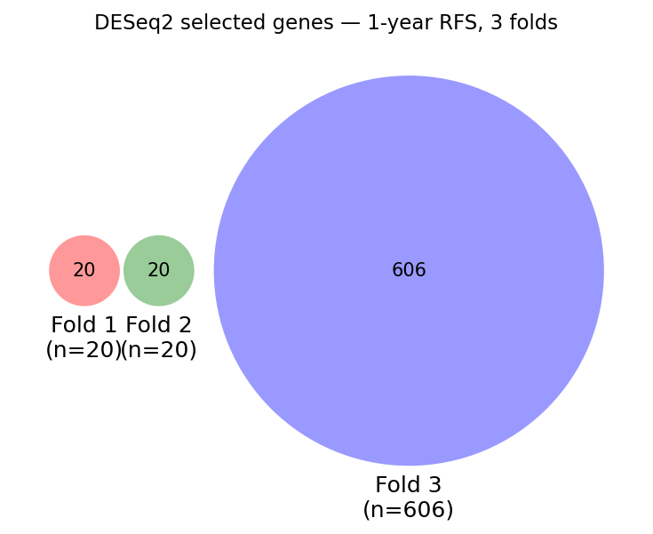
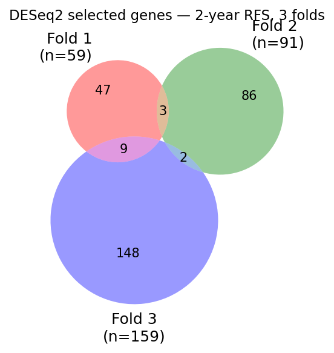
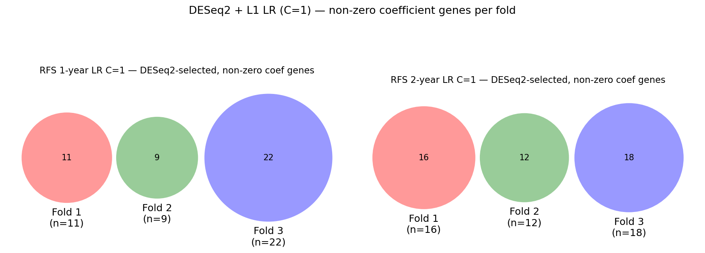

# HCC Multimodal — Baseline Summary (2026-04-27)

## 1. Tasks

Binary classification of **recurrence-free survival (RFS)** at 1 year & 2-year

Two input modalities are evaluated:
- **RNA-seq** (60 patients ×  50,986 genes after low-expression filtering) — tested with two feature selectors: DESeq2 (differential expression inside each CV fold) and SelectKBest with F-score.
- **Arterial-phase CT radiomics** (60 patients × 50,986 features) — SelectKBest with F-score.

---

## 2. Key Findings

Best mean test AUC (3-fold stratified CV) per modality, selector, and model:

| Target | Modality | Selector | Best LR AUC | Best RF AUC |
|--------|----------|----------|-------------|-------------|
| 1-year | RNA-seq | DESeq2 | 0.333 | 0.438 |
| 1-year | RNA-seq | SelectKBest F-score| 0.512 | 0.439 |
| 1-year | Arterial radiomics | SelectKBest F-score | 0.654 | 0.665 |
| 2-year | RNA-seq | DESeq2 | 0.517 | 0.581 |
| 2-year | RNA-seq | SelectKBest F-score | 0.508 | 0.520 |
| 2-year | Arterial radiomics | SelectKBest F-score | 0.537 | 0.570 |

**Summary:**
- 1-year RFS: arterial radiomics far outperform RNA-seq. RNA-seq (both selectors) never exceeds 0.513; radiomics reach 0.654–0.665.
- 2-year RFS: results are meaningfully above chance for RF models. RNA-seq DESeq RF leads at 0.581, followed by radiomics RF (0.570) and SelectKBest+CPM RF (0.520). LR results are weaker (0.517 for DESeq, 0.537 for radiomics). DESeq RF benefits from the near-balanced 2-year class split (48% positives).

→ [AUC plots by fold and model](#4-auc-plots-3-fold-cv)

---

## 3. Method

### Samples and targets

| Target | n | Positives (recurrence) | Negatives (recurrence-free) | Excluded |
|--------|---|------------------------|------------------------------|---------------------|
| 1-year | 56 | 19 (34%) | 37 (66%) | 4 |
| 2-year | 54 | 26 (48%) | 28 (52%) | 6 |

**RFS label logic:** a patient is **positive** if a recurrence event (`RFS_central_event=1`) is recorded within the horizon (`RFS_central ≤ horizon`); **negative** if followed past the horizon without event; and excluded if follow-up ends before the horizon with no event recorded.

### RNA-seq pipeline

1. Low-expression filter: keep genes with count ≥ 15 in ≥ 5 samples → 27,991 genes.
2. log2(CPM+1) normalisation + StandardScaler (applied to all genes before selection).
3. Feature selection inside each training fold:
   - **DESeq2**: 
     ```
      DESeq2 on raw count, select genes with BH-adjusted p < 0.1 (fallback: top 20 by padj if fewer pass).
      --> log2(CPM+1) normalisation
      --> StandardScaler
     ```
   - **SelectKBest** (k=80): 
      ```
      log2(CPM+1) normalisation 
      --> F-score (f_classif) on log2(CPM+1)-normalised values.
      --> StandardScaler
      ```
4. Model.

### Arterial radiomics pipeline

1. Median imputation + StandardScaler on 4,132 features (13–14 constant features automatically excluded by undefined F-stat).
2. SelectKBest(f_classif, k=100) inside each training fold.
3. Model.

### Models and hyperparameters

| Model | Hyperparameter sweep |
|-------|---------------------|
| Logistic Regression | L1 penalty (liblinear/saga+elasticnet), C ∈ {0.001, 0.01, 0.1, 1} |
| Random Forest | max_depth ∈ {2, 4} × min_samples_leaf ∈ {5, 10, 15} |

**Evaluation:** stratified 3-fold CV (replicated with 4-fold for RNA-seq); AUC (ROC) is the primary metric; no grid-search — manual sweep reported per fold.

---

## 4. AUC Plots (3-fold CV)

Each plot shows train AUC (left) and test AUC (right) per hyperparameter configuration. Circles = individual folds, diamonds = fold mean.

### RNA-seq — DESeq2

| | 1-year RFS | 2-year RFS |
|---|---|---|
| **Logistic Regression** |  |  |
| **Random Forest** |  |  |

### RNA-seq — SelectKBest (F-score, k=80) + CPM

| | 1-year RFS | 2-year RFS |
|---|---|---|
| **Logistic Regression** |  |  |
| **Random Forest** |  |  |

### Arterial Radiomics — SelectKBest (F-score, k=100)

| | 1-year RFS | 2-year RFS |
|---|---|---|
| **Logistic Regression** |  |  |
| **Random Forest** |  |  |

---

## 5. Other Findings

### Feature stability: Venn diagrams

**RNA-seq — DESeq2, cross-fold overlap (within selector):**

|  |  |
|---|---|
| 1-year RFS, 3 folds | 2-year RFS, 3 folds |

**RNA-seq — DESeq2 + L1 LR (C=1): non-zero coefficient genes across folds:**



Per-fold counts (DESeq2 selected → L1 non-zero at C=1): 1-year folds 1/2/3 = 20→11, 20→9, 606→22; 2-year folds 1/2/3 = 59→16, 91→12, 159→18. C ≤ 0.1 zeros all coefficients. Zero overlap across folds for non-zero genes. Data: [`deseq_lr_coef_counts_all.csv`](deseq_lr_coef_counts_all.csv), [`deseq_lr_nonzero_genes_all.csv`](deseq_lr_nonzero_genes_all.csv).

**RNA-seq — SelectKBest, cross-fold overlap (within selector):**

|  |  |
|---|---|
| 1-year RFS, 3 folds | 2-year RFS, 3 folds |

**RNA-seq — DESeq2 union vs SelectKBest union (ever-selected genes):**

|  |  |
|---|---|
| 1-year RFS | 2-year RFS |

**Arterial radiomics — LR C=1 non-zero features across folds:**


Key results: zero gene overlap across folds for both RNA-seq selectors and both targets. For radiomics, only 1 feature is shared across 2 folds for 1-year (GLCM_Entrop_HLH_64gl), and 3 pairwise features for 2-year — none shared across all three folds.

