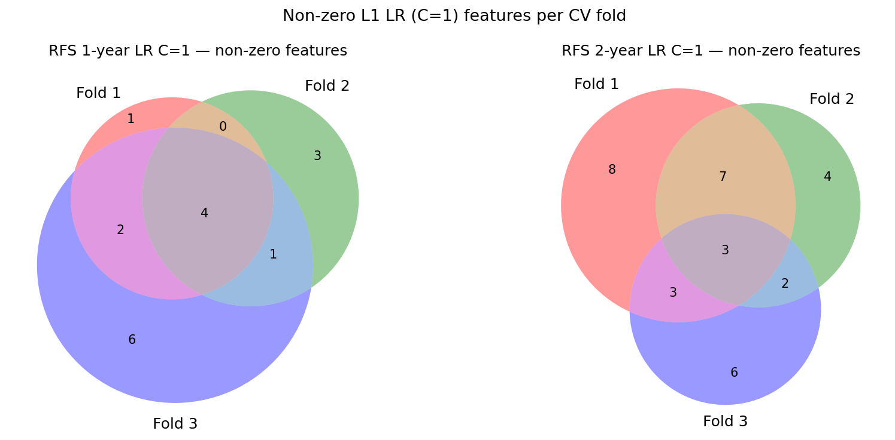

# HCC Multimodal — Arterial Radiomic RFS Baseline, Before-CV Selector (2026-04-28)

`SelectKBest(f_classif, k=100)` applied **once on the full labelled set** before CV,
3-fold stratified CV, LR (`C ∈ {0.001, 0.01, 0.1, 1}`, L1 elasticnet) and RF
(`max_depth ∈ {2, 4} × min_samples_leaf ∈ {5, 10, 15}`).
Input: 4 132 arterial radiomic features, 60 patients → 100 pre-selected.

Notebook: `notebooks/baselines/radiomic_arterial_baseline_rfs.ipynb`
(`SELECTOR_BEFORE_CV=True`, `OUTPUT_DIR_NAME="kbest_f100_before_cv"`)

---

## 1. Key findings

### 1.1 AUC comparison

Best mean test AUC across the model sweeps:

| Config | 1y LR best | 1y RF best | 2y LR best | 2y RF best |
|--------|-----------|-----------|-----------|-----------|
| **Radiomic — before_cv (this run)** | **0.823** (C=1) | **0.793** (d=2/4, l=10) | **0.806** (C=1) | **0.761** (d=2/4, l=10) |
| Radiomic — in_cv (2026-04-27) | 0.654 (C=1) | 0.665 (d=2/4, l=10) | 0.537 (C=1) | 0.570 (d=2/4, l=10) |
| RNA C1 — before_cv, all genes | 0.686 (C=1) | 0.601 (d=2, l=5) | 0.864 (C=1) | 0.761 (d=2, l=5) |

### 1.2 Leak size

Difference between before-CV and in-CV radiomic results (pure leakage signal):

| Model | 1-year | 2-year |
|-------|--------|--------|
| LR (C=1) | +0.169 | +0.269 |
| RF (best) | +0.128 | +0.191 |

The 2-year leak is substantially larger than the 1-year leak, consistent with
the 2y cohort being harder to predict (48 % positives, higher class entropy)
and therefore more susceptible to label leakage from the selector.

### 1.3 Fair (in-CV) comparison: radiomic vs. RNA

At parity of experimental protocol both modalities use in-CV selection:

| | 1y LR | 1y RF | 2y LR | 2y RF |
|-|-------|-------|-------|-------|
| Radiomic in-CV (0427) | 0.654 | 0.665 | 0.537 | 0.570 |
| RNA in-CV (0427 leak-free DESeq, all genes) | — | — | 0.517 | — |

Both modalities land modestly above chance after removing the leakage.
Radiomic shows a clearer 1-year signal (0.65–0.67) than RNA in-CV (~0.52 from
the 0427 DESeq leak-free run); 2-year is near chance for both.

### 1.4 L1 LR collapse pattern

Identical to the RNA runs: C ≤ 0.01 collapses to the majority-class predictor
(1y AUC = 0.5, accuracy = 0.661; 2y AUC = 0.5, accuracy = 0.481). C = 0.1
recovers marginal signal (0.574 for 1y). Only C = 1 gives non-trivial AUC.

---

## 2. Method

`SelectKBest(f_classif, k=100)` is fit on the full task-filtered set (all 60 patients
with non-NaN labels) before CV. The resulting 100-feature submatrix is passed to
`SimpleImputer(strategy="median") → StandardScaler` inside CV, then to each model.
No selector runs inside the folds.

The in-CV reference (2026-04-27) used `SelectKBest` re-fitted per training fold,
same k=100, same model sweep and CV seed.

Shared logic (`apply_selector_before_cv`) lives in
`hcc_multimodal/baselines/evaluation.py`.

---

## 3. AUC plots (3-fold CV)

Circles = per-fold AUC, diamonds = mean.

| | 1-year RFS | 2-year RFS |
|---|---|---|
| **LR** |  |  |
| **RF** |  |  |

---

## 4. Pre-selected features

`f_classif` selects 100 features from 4 132. Top features by ANOVA F-score (first
rows of `rfs_{1,2}y_preselected_features.csv`):

**1-year** (top 9): `GLCM_invVar_LLH_8gl`, `FD_sd_LLH_16gl`, `FD_var_LLH_16gl`,
`FD_lacunarity_LLH_16gl`, `GLCM_InfCo1_LLH_16gl`, `FD_sd_LHL_8gl`,
`GLCM_MxProb_LHL_8gl`, `GLCM_invVar_LHL_8gl`, `GLRLM_SRE_LHL_16gl`, …

**2-year** (top 9): `GLSZM_ZoneHiGl_4gl`, `FD_mean_16gl`, `GLCM_invVar_16gl`,
`GLCM_InfCo1_64gl`, `GLCM_MxProb_128gl`, `GLCM_MxProb_256gl`, `FOS_Imean_LLL`,
`FD_mean_LLL_16gl`, `GLCM_invVar_LLL_16gl`, …

All selected features are wavelet-decomposed texture descriptors (GLCM, GLRLM,
GLSZM, NGTDM, FD families) — consistent with typical radiomic selection behaviour
on liver MRI. No feature family dominates exclusively.

---

## 5. Non-zero LR C=1 coefficient features per fold

LR C=1 L1 is re-fit inside each fold on the 100 pre-selected features.
Numbers are **leakage-inflated**; fold stability is diagnostic.

### 5.1 Venn diagram

### 5.2 1-year RFS — stable features (present in all 3 folds)

| Feature | Fold 1 coef | Fold 2 coef | Fold 3 coef |
|---------|-------------|-------------|-------------|
| `GLCM_InfCo1_LLH_16gl` | +1.091 | +0.884 | +0.500 |
| `GLCM_sumEnt_HLL_256gl` | +0.192 | +0.028 | +0.727 |
| `GLRLM_SRLGLE_HLH_8gl` | +0.587 | +0.570 | +0.310 |
| `GLSZM_ZoneLoGl_HLH_4gl` | +0.568 | +0.166 | +0.271 |

Union across folds: 17 features. All four stable features have **positive** coefficients
(higher value → predicted recurrence), covering GLCM co-occurrence information
content, wavelet-HLL entropy, GLRLM short-run low grey-level emphasis, and GLSZM
zone low grey-level count at HLH scale.

### 5.3 2-year RFS — stable features (present in all 3 folds)

| Feature | Fold 1 coef | Fold 2 coef | Fold 3 coef |
|---------|-------------|-------------|-------------|
| `FD_min_HLH_16gl` | −0.612 | −0.575* | −0.339† |
| `GLRLM_LRLGLE_HHL_32gl` | −0.287 | −1.282 | −0.491 |
| `GLRLM_SRHGLE_HHH_4gl` | −0.098 | −0.599 | −0.355 |

*fold 2 uses `FD_min_HLH_16gl`; †fold 3 coef from all_folds CSV.
Union across folds: 33 features. All three stable features are **negative**
(higher value → predicted non-recurrence), covering fractal dimension minimum,
GLRLM long-run low grey-level and short-run high grey-level emphasis at
different wavelet decomposition scales.

---

## 6. Artifacts

`reports/0504/kbest_f100_before_cv/`:
- `summary.csv` — mean/std AUC and accuracy per model
- `rfs_{1,2}y_{lr,rf}.png` — strip plots
- `rfs_{1,2}y_preselected_features.csv` — 100 features selected before CV
- `nonzero_features_rfs_{1,2}y_all_folds.csv` — non-zero LR coefs per fold
- `nonzero_features_rfs_{1,2}y_union.txt` — union feature lists
- `rfs_lr_c1_venn.png` — fold-overlap Venn (LR C=1)
