# HCC Multimodal — RNA RFS Baseline Configs (2026-04-28)

Three follow-on RNA-seq RFS configurations from `notebooks/baselines/rna_baseline_rfs.ipynb`,
all using DESeq2 selection with `padj < 0.05` and `min_features=20` fallback,
3-fold stratified CV, no count-based pre-filter.

| Tag | `SELECTOR_BEFORE_CV` | `PREDEFINED_GENES` | Input genes | OUTPUT_DIR_NAME |
|-----|----------------------|--------------------|-------------|-----------------|
| C1  | True  | False | 50,986 (all) | `deseq_p0.05_before_cv_all_genes` |
| C2  | True  | True  | 2,146 (HCC gene sets ∩ matrix) | `deseq_p0.05_before_cv_predefined` |
| C3  | False | True  | 2,146 (HCC gene sets ∩ matrix) | `deseq_p0.05_in_cv_predefined` |

`SELECTOR_BEFORE_CV=True` runs `DeseqCPMSelector` once on the full task-filtered set before splitting (information leak — for diagnostic comparison only). `SELECTOR_BEFORE_CV=False` re-fits inside each training fold.

Sample counts unchanged from 2026-04-27: 1-year n=56 (19 pos, 34%); 2-year n=54 (26 pos, 48%).

---

## 1. Key findings

Best mean test AUC across the LR (`C ∈ {0.001,0.01,0.1,1}`, L1) and RF (`max_depth ∈ {2,4} × min_samples_leaf ∈ {5,10,15}`) sweeps:

| Config | 1y LR best | 1y RF best | 2y LR best | 2y RF best |
|--------|-----------|-----------|-----------|-----------|
| C1 — before_cv, all genes  | **0.686** (C=1) | **0.601** (d=2,l=5) | **0.864** (C=1) | **0.761** (d=2,l=5) |
| C2 — before_cv, predefined | 0.500 (C≤0.1, majority) | 0.570 (d=2,l=15) | 0.500 (C≤0.1, majority) | 0.505 (d=2,l=10) |
| C3 — in_cv, predefined     | 0.500 (C≤0.1, majority) | 0.500 (d=2,l=15) | 0.500 (C≤0.1, majority) | 0.508 (d=4,l=5) |

- **C1 numbers are leakage-inflated.** Fitting DESeq2 on the full labelled set before CV uses test-fold labels in selection. The 2-year LR jump to 0.864 (vs. 0.517 for the leak-free DESeq baseline on 2026-04-27) is the size of that leak signal, not real predictive lift.
- **Predefined gene set kills DESeq's signal.** With only 2,146 HCC-curated genes, no gene survives `padj < 0.05` in any fold/run for C2 or C3 — every selection collapses to the 20-feature fallback (top by `padj`, which is essentially the first 20 column-order genes when all `padj→1`). C2 and C3 land at or below chance for every model.
- **L1 LR collapses to majority below C=1.** All three configs show LR_C∈{0.001,0.01,0.1} → AUC=0.5 with majority-class accuracy (0.661 at 1y, 0.519 at 2y). Only C=1 has non-zero coefficients, and in C2/C3 it generalises *worse* than chance (1y AUC 0.117 / 0.154; 2y AUC 0.438 / 0.384).
- **Fallback fingerprint.** Configs 2 & 3 1-year top-20 starts with `CFH, CYP51A1, RAD52, AOC1, M6PR, ALS2, …` — the matrix's first columns after intersecting the HCC gene list. This is the diagnostic that no real DE was found.

---

## 2. Method

`notebooks/baselines/rna_baseline_rfs.ipynb` is parameterised by the four flags above plus `OUTPUT_DIR_NAME`. To reproduce: edit the params cell, run the notebook in place — artifacts land in `reports/0504/<OUTPUT_DIR_NAME>/`. RFS labels and CV splits match the 2026-04-27 baseline (see [`reports/0427/0427_rfs_baselines_summary.md`](../0427/0427_rfs_baselines_summary.md) §3).

Selector pipeline (`DeseqCPMSelector`):
1. Fit DESeq2 on raw counts; keep genes with BH-adjusted `p < 0.05`.
2. If fewer than 20 pass → fall back to top 20 by `padj` (this triggered in **every fold of every config** here).
3. log2(CPM + 1) on the selected genes; median impute + StandardScaler; fit model.

When `SELECTOR_BEFORE_CV=True` the selector runs once outside CV and the resulting feature matrix feeds straight to imputer + scaler + model inside CV.

---

## 3. AUC plots (3-fold CV)

Circles = per-fold AUC, diamonds = mean.

### C1 — `before_cv`, all genes

| | 1-year RFS | 2-year RFS |
|---|---|---|
| **LR** | 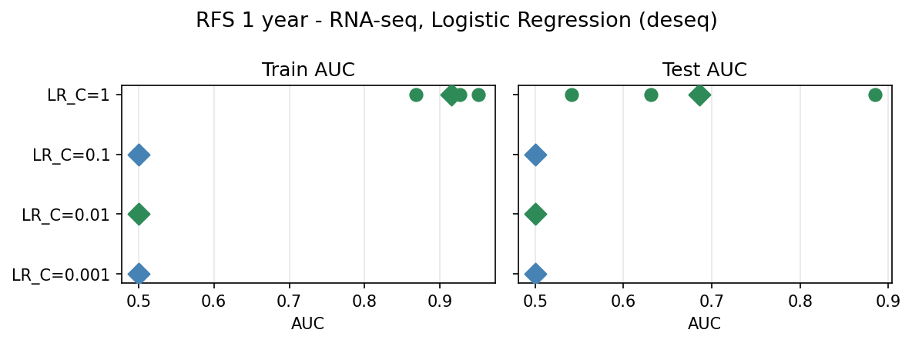 | 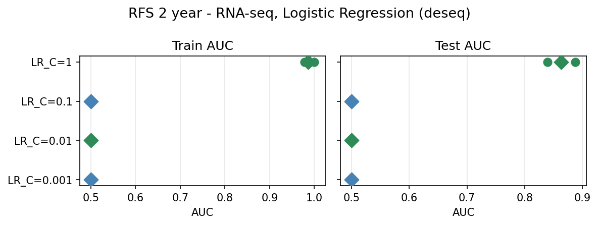 |
| **RF** | 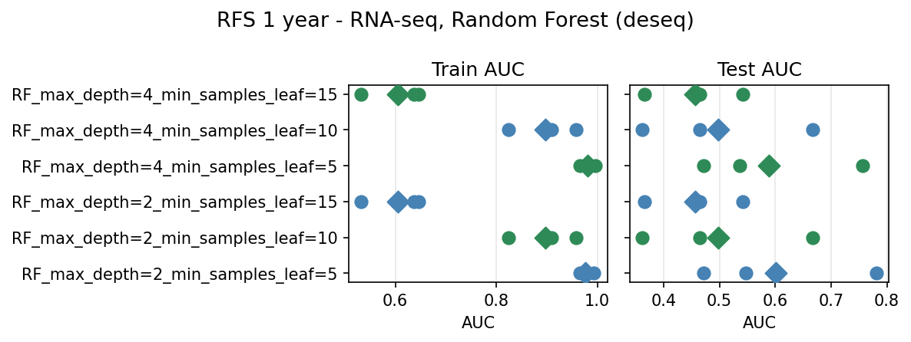 | 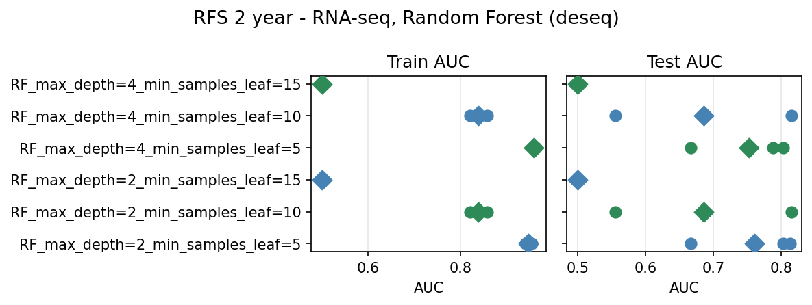 |

### C2 — `before_cv`, predefined HCC genes

| | 1-year RFS | 2-year RFS |
|---|---|---|
| **LR** | 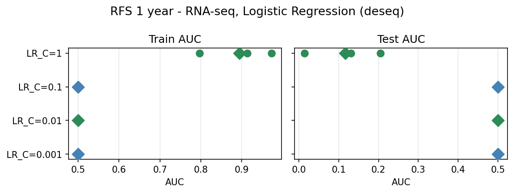 | 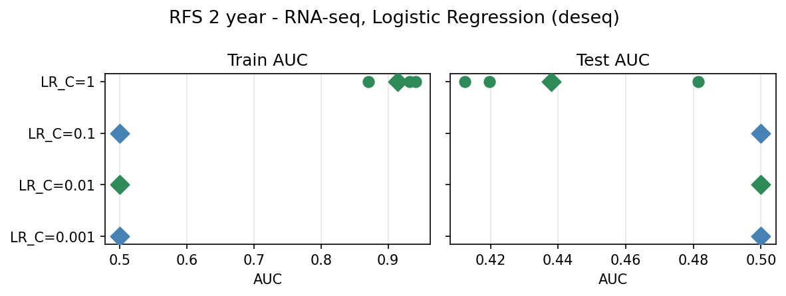 |
| **RF** | 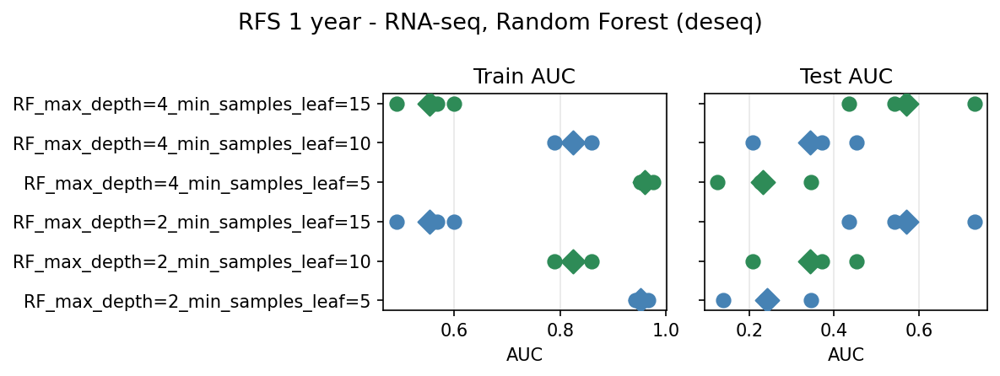 | 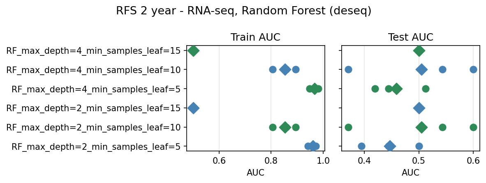 |

### C3 — `in_cv`, predefined HCC genes

| | 1-year RFS | 2-year RFS |
|---|---|---|
| **LR** | 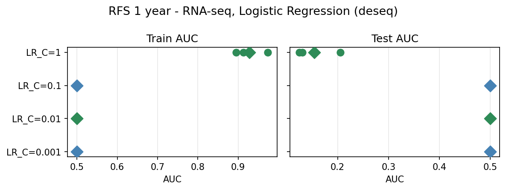 | 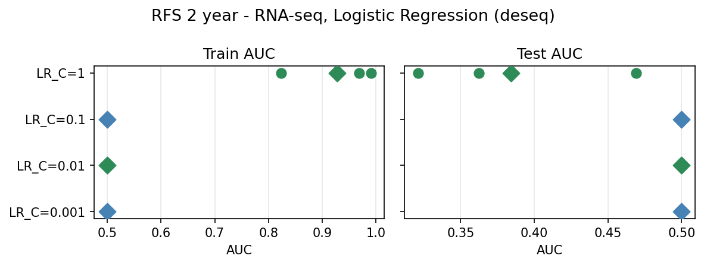 |
| **RF** | 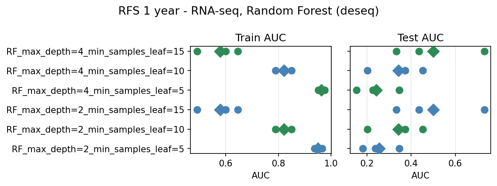 | 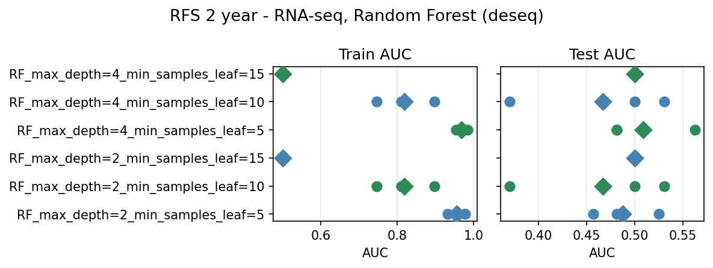 |

---

## 4. C1 — DESeq2-selected features and padj

Re-fit `DeseqCPMSelector(pvalue=0.05)` on the full task-filtered set (mirroring the `SELECTOR_BEFORE_CV=True` path). Only **3 genes per year** pass BH correction; the remaining 17 are the top-by-padj fallback. All 20 feed the models in C1.

### 1-year RFS

| Feature | padj |
|---------|------|
| AL138889.1 | 5.84e-04 |
| AC135731.1 | 5.84e-04 |
| AC004889.1 | 3.33e-02 |
| AL160272.1 | 5.61e-02 *(fallback)* |
| INAFM2 | 5.61e-02 |
| AC092068.2 | 6.24e-02 |
| LINC00514 | 6.24e-02 |
| AL031594.1 | 1.06e-01 |
| AL117328.2 | 1.19e-01 |
| AC005696.4 | 1.65e-01 |
| CCDC26 | 1.65e-01 |
| AC025580.2 | 2.11e-01 |
| EGFL8 | 2.11e-01 |
| AC006538.1 | 2.11e-01 |
| AC127070.4 | 2.53e-01 |
| AL353726.2 | 2.86e-01 |
| PCSK6-AS1 | 2.92e-01 |
| AC016355.1 | 3.13e-01 |
| AC008395.1 | 3.29e-01 |
| AL008638.3 | 3.29e-01 |

### 2-year RFS

| Feature | padj |
|---------|------|
| CAMK2N2 | 8.94e-03 |
| AC093826.2 | 3.18e-02 |
| LACC1 | 4.58e-02 |
| AC093525.8 | 1.98e-01 *(fallback)* |
| CSF2 | 1.98e-01 |
| AC022098.1 | 1.98e-01 |
| AC025198.1 | 1.98e-01 |
| AC025580.2 | 1.98e-01 |
| AC004241.5 | 1.98e-01 |
| AL445235.1 | 1.98e-01 |
| OR52N5 | 2.15e-01 |
| HNRNPA1P9 | 2.88e-01 |
| AL449283.1 | 3.03e-01 |
| LINC02241 | 5.18e-01 |
| AC138647.1 | 5.18e-01 |
| HIGD2B | 5.18e-01 |
| SGSM1 | 5.18e-01 |
| H19 | 5.18e-01 |
| CCR12P | 5.18e-01 |
| ZMYND12 | 5.18e-01 |

---

## 5. Artifacts

Each config folder contains:
- `summary.csv` — per-model mean/std AUC and accuracy
- `fold_records.csv` — per-fold train/test AUC
- `rfs_{1,2}y_{lr,rf}.png` — strip plots (above)
- `rfs_{1,2}y_{lr,rf}_selected_features.csv` — features selected per fold per model
- `rfs_{1,2}y_preselected_features.csv` *(C1 & C2 only)* — features selected once before CV

---

## 6. Threshold check — C2 & C3 at `padj < 0.1`

Re-ran C2 and C3 with `DESEQ_PVALUE=0.1` to verify the fallback-dominated regime:

| Run | OUTPUT_DIR_NAME | 1y LR best | 1y RF best | 2y LR best | 2y RF best |
|-----|----------------|-----------|-----------|-----------|-----------|
| C2 @ p=0.1 | `deseq_p0.1_before_cv_predefined` | 0.500 | 0.570 | 0.500 | 0.505 |
| C3 @ p=0.1 | `deseq_p0.1_in_cv_predefined`     | 0.500 | 0.500 | 0.500 | 0.508 |

**Numbers are identical to the p=0.05 runs** (every cell of `summary.csv` matches). This is the empirical confirmation that, on the 2,146-gene HCC subset, no gene passes BH at either threshold:

- C2 (before_cv, full set): preselected 20 genes for both 1y and 2y are the same `CFH, CYP51A1, RAD52, AOC1, M6PR, …` head-of-matrix sequence under both thresholds.
- C3 (in_cv, per-fold): of the 6 fold/year combinations, only 2y fold 3 has any gene at `padj < 0.1` (one gene, padj = 7.16e-3); the remaining 5 hit the `min_features=20` fallback. Per-fold padj minima:

  ```
  1y fold 1/2/3 : 0.9999 / 0.9995 / 0.1614
  2y fold 1/2/3 : 0.1123 / 0.5182 / 0.0072
  ```

So within the predefined HCC-gene regime, the BH threshold is inert across `[0.05, 0.1]` — only loosening past ~0.5 (or removing the predefined-gene constraint) would produce a different selection. Plots: [`deseq_p0.1_before_cv_predefined/`](deseq_p0.1_before_cv_predefined/), [`deseq_p0.1_in_cv_predefined/`](deseq_p0.1_in_cv_predefined/).

---

## 7. Venn diagrams — feature set overlap

Generated by `reports/0504/generate_venns.py`. All diagrams use `deseq_p0.05` runs only.

### 7.1 C3 — DESeq-selected features per fold (in_cv, predefined)

Each fold selects its own 20 genes (all fallback, padj≥BH threshold). The Venn shows how stable that selection is across the 3 CV folds.

| 1-year RFS | 2-year RFS |
|---|---|
| 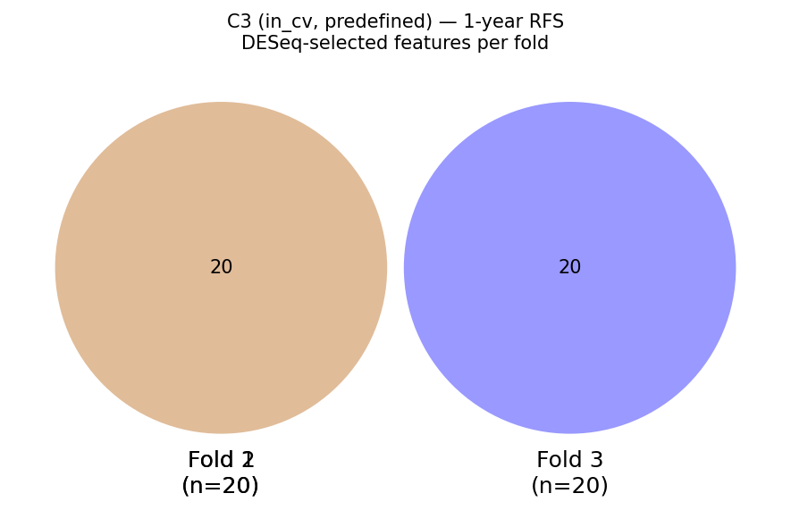 | 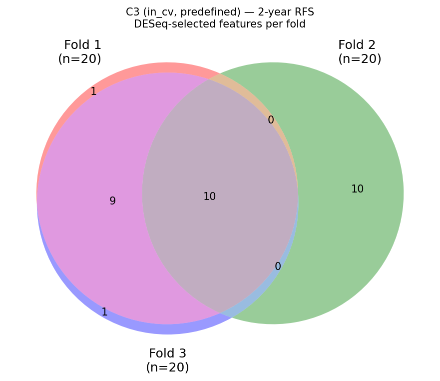 |

- **1y:** Folds 1 & 2 select an identical 20-gene fallback set; fold 3 selects a completely different 20 genes (0 shared). The split reflects differing top-padj orderings in the two training-set partitions.
- **2y:** 10 genes are stable across all three folds (`AOC1, AP2B1, ARF5, CFH, CYP51A1, M6PR, RAD52, RALA, SLC25A13, SLC7A2`). Folds 1 & 3 additionally share 9 more; fold 2 contributes 10 unique genes. The greater 2y stability matches the slightly lower padj minima in 2y folds.

### 7.2 C1 — non-zero LR C=1 coefficient features per fold (before_cv, all genes)

LR C=1 L1 is re-fit inside each fold on the 20 preselected log₂(CPM+1) features. Non-zero coefficients identify the genes the model actually uses. Numbers are leakage-inflated (preselection on full labelled data). `padj` is from the single pre-CV DESeq2 run (§4); `*` = passes BH < 0.05. "HCC set" = in the 2,146-gene predefined HCC curated set.

| 1-year RFS | 2-year RFS |
|---|---|
| 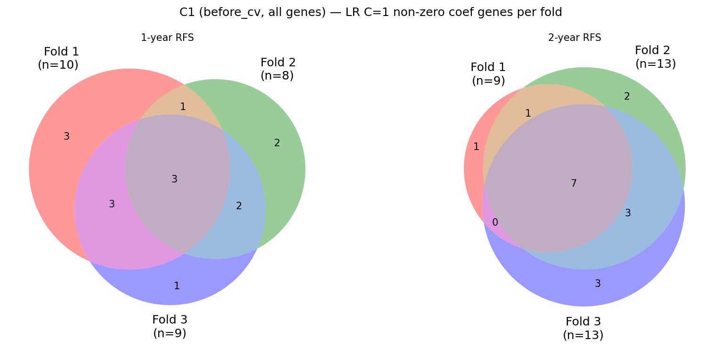 | |

*(Both years are shown in the single two-panel figure above.)*

#### 1-year RFS — non-zero features per fold

| Feature | padj | HCC set | Fold 1 coef | Fold 2 coef | Fold 3 coef |
|---------|------|---------|-------------|-------------|-------------|
| AC135731.1 | 5.84e-04 * | No | +0.240 | +0.537 | −0.112 |
| AL138889.1 | 5.84e-04 * | No | +0.222 | — | — |
| AC004889.1 | 3.33e-02 * | No | −0.173 | — | −0.284 |
| LINC00514 | 6.24e-02 | No | −0.260 | −0.225 | −0.209 |
| AC092068.2 | 6.24e-02 | No | — | −0.202 | −0.592 |
| AL160272.1 | 5.61e-02 | No | — | — | −0.178 |
| INAFM2 | 5.61e-02 | No | — | −0.512 | — |
| EGFL8 | 2.11e-01 | No | — | −0.520 | — |
| AC025580.2 | 2.11e-01 | No | −0.461 | — | −0.665 |
| AC005696.4 | 1.65e-01 | No | −0.081 | −0.082 | −0.615 |
| AC006538.1 | 2.11e-01 | No | −0.238 | — | — |
| AC016355.1 | 3.13e-01 | No | −0.366 | — | — |
| AC127070.4 | 2.53e-01 | No | −0.336 | — | −0.340 |
| PCSK6-AS1 | 2.92e-01 | No | −0.322 | −0.431 | — |
| AC008395.1 | 3.29e-01 | No | — | −0.033 | −0.396 |

Stable across all 3 folds: `AC135731.1` (only truly-significant gene), `LINC00514`, `AC005696.4`. No feature is in the HCC predefined set.

#### 2-year RFS — non-zero features per fold

| Feature | padj | HCC set | Fold 1 coef | Fold 2 coef | Fold 3 coef |
|---------|------|---------|-------------|-------------|-------------|
| LACC1 | 4.58e-02 * | No | +1.480 | +0.130 | +0.456 |
| AC093826.2 | 3.18e-02 * | No | −0.605 | −0.888 | −0.327 |
| CAMK2N2 | 8.94e-03 * | No | — | +0.187 | — |
| AC025580.2 | 1.98e-01 | No | −0.773 | −0.493 | −0.619 |
| AL449283.1 | 3.03e-01 | No | +0.636 | +1.018 | +1.021 |
| SGSM1 | 5.18e-01 | No | +0.687 | +0.804 | +0.734 |
| AL445235.1 | 1.98e-01 | No | −0.322 | +0.018 | −0.867 |
| H19 | 5.18e-01 | **Yes** | −0.227 | −0.667 | −0.284 |
| ZMYND12 | 5.18e-01 | No | — | +0.969 | +0.507 |
| AC004241.5 | 1.98e-01 | No | −0.263 | −0.266 | — |
| CCR12P | 5.18e-01 | No | — | +0.590 | +0.247 |
| AC093525.8 | 1.98e-01 | No | — | −0.426 | −0.294 |
| AC138647.1 | 5.18e-01 | No | −0.247 | — | — |
| AC022098.1 | 1.98e-01 | No | — | −0.166 | — |
| LINC02241 | 5.18e-01 | No | — | — | +0.221 |
| HNRNPA1P9 | 2.88e-01 | No | — | — | +0.198 |
| HIGD2B | 5.18e-01 | No | — | — | −0.062 |

Stable across all 3 folds: `LACC1`, `AC093826.2`, `AC025580.2`, `AL449283.1`, `SGSM1`, `AL445235.1`, `H19`. Of these, only `LACC1` and `AC093826.2` pass BH < 0.05. `H19` (the sole HCC-predefined gene) is non-zero in all folds despite padj = 0.518 — it carries leakage-inflated signal not captured by DESeq2 marginal testing. `CAMK2N2` (lowest padj, 8.94e-03) only appears in fold 2.

### 7.3 C2 — non-zero LR C=1 coefficient features per fold (before_cv, predefined)

Same approach as §7.2 but on the 20-gene fallback from the HCC gene set (C2). Despite near-chance AUC, L1 at C=1 retains non-zero coefficients in every fold.

| 1-year RFS | 2-year RFS |
|---|---|
| 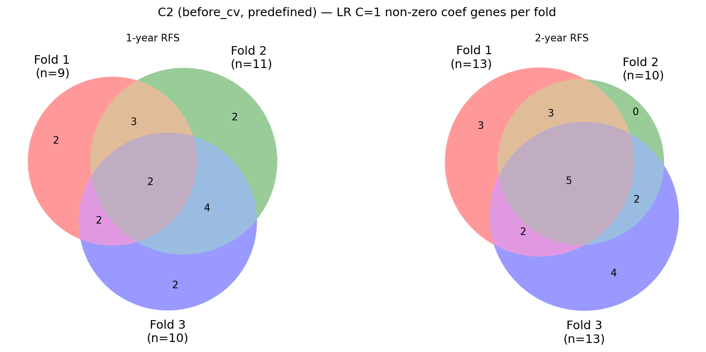 | |

*(Both years in one figure.)*

- **1y:** 2 genes stable across all folds: `CALCR, PDK4`. Only 2-of-3 overlap for the remaining 7–9 active genes.
- **2y:** 5 genes stable: `ANLN, AOC1, CSDE1, JARID2, SLC25A13`.

### 7.4 C1 — preselected features vs 2146 HCC gene set

The 20 genes DESeq2 selects from the full transcriptome vs the HCC curated set (2 160 genes ∩ matrix). Tests whether the DE signal from the full dataset overlaps the HCC-prior.

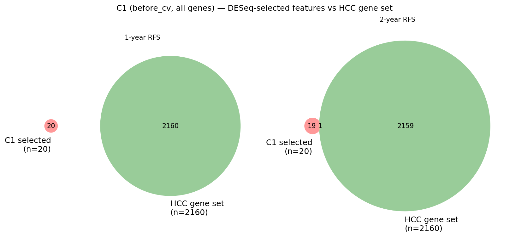

- **1y:** Zero overlap — the 20 DESeq-selected genes are entirely outside the HCC curated set.
- **2y:** One overlap — `H19`, a well-characterised HCC-associated lncRNA oncogene, is the sole intersection. It is also one of the 7 consistently-used genes in §7.2.
