## Table of Contents

- [1. Task](#1-task)
- [2. Key findings](#2-key-findings)
- [3. RNA-seq vs. radiomics](#3-rna-seq-vs-radiomics)
  - [Feature selection in cross-validation](#feature-selection-in-cross-validation)
  - [Feature selection before cross-validation](#feature-selection-before-cross-validation)
  - [Plot AUC in each fold](#plot-auc-in-each-fold)
- [4. Predefined HCC gene set](#4-predefined-hcc-gene-set)
  - [HCC Gene set description](#hcc-gene-set-description)
  - [Predefined HCC gene set CV results](#predefined-hcc-gene-set-cv-results)
- [5. Genes feature selection analysis](#5-genes-feature-selection-analysis)
  - [Pre CV selected features](#pre-cv-selected-features)
  - [Preselected features vs predefined HCC gene set](#preselected-features-vs-predefined-hcc-gene-set)
  - [Non-zero LR coefficient features per fold](#non-zero-lr-coefficient-features-per-fold-feature-selection-before-cross-validation)
- [6. Adding demographic confounders](#6-adding-demographic-confounders)
- [7. Ensemble (radiomics + RNA-seq)](#7-ensemble-radiomics--rna-seq)
  - [7.1 No confounders](#71-no-confounders)
  - [7.2 With Age/Sex confounders](#72-with-agesex-confounders)

# 1. Task
1. Binary classification of RFS at 1-year and 2-year horizons using RNA-seq (DESeq2, `padj < 0.05`, 3-fold CV) and arterial-phase CT radiomics (SelectKBest F-score, k=100, 3-fold CV), with in-CV vs before-CV selector placement.
2. Experiment with a predefined HCC gene set.
3. Analyse selected gene features.
4. Add Age/Sex as demographic confounders and measure their effect.
5. Ensemble radiomics + RNA-seq predictions.

# 2. Key findings
- **1y RFS**: Arterial radiomics outperform RNA-seq regardless of selector placement or model. ([in-CV](#feature-selection-in-cross-validation), [before-CV](#feature-selection-before-cross-validation))
- **2y RFS**: RNA-seq can outperform radiomics but is model-dependent — best is LR before-CV (AUC=0.867). [§3.2](#feature-selection-before-cross-validation)
- Predefined HCC gene set performs poorly; pre-CV selected genes show little overlap with it. [§4](#predefined-hcc-gene-set-cv-results)
- 6–12 pre-CV genes have non-zero LR coefficients; statistical significance does not guarantee a non-zero coefficient. [§5](#non-zero-lr-coefficient-features-per-fold-feature-selection-before-cross-validation)
- Age & Sex confounders improve the best model for each modality. [§6](#6-adding-demographic-confounders)
- Ensemble mean AUC = 0.892 (2y RFS), outperforming both individual modalities. [§7](#71-no-confounders)

# 3. RNA-seq vs. radiomics
source: `notebooks/baselines/radiomic_arterial_baseline_rfs.ipynb`, `notebooks/baselines/rna_baseline_rfs.ipynb`
## Feature selection in cross-validation

| Modality | Selector | 1y LR | 1y RF | 2y LR | 2y RF |
|----------|----------|-------|-------|-------|-------|
| Arterial radiomics | SelectKBest F-score (k=100) | 0.618 ± 0.098 | **0.718 ± 0.070** | 0.496 ± 0.081 | 0.569 ± 0.133 |
| RNA-seq | DESeq2 (`padj < 0.05`, min 20 features) | 0.348 ± 0.082 | 0.492 ± 0.089 | 0.516 ± 0.136 | **0.590 ± 0.191** |

## Feature Selection before cross-validation

| Modality | Selector | 1y LR | 1y RF | 2y LR | 2y RF |
|----------|----------|-------|-------|-------|-------|
| Arterial radiomics | SelectKBest F-score (k=100) | 0.780 ± 0.103 | **0.821 ± 0.068** | 0.752 ± 0.092 | 0.781 ± 0.069 |
| RNA-seq | DESeq2 (`padj < 0.05`, min 20 features) | 0.675 ± 0.059 | 0.779 ± 0.083 | **0.867 ± 0.097** | 0.805 ± 0.139 |

## Plot AUC in each fold

Circles = per-fold AUC, diamonds = mean.

### Feature selection in cross-validation

#### RNA-seq — DESeq2

| | 1-year RFS | 2-year RFS |
|---|---|---|
| **LR** |  |  |
| **RF** |  |  |

#### Arterial radiomics — SelectKBest (F-score, k=100)

| | 1-year RFS | 2-year RFS |
|---|---|---|
| **LR** |  |  |
| **RF** |  |  |

### Feature selection before cross-validation
#### Arterial radiomics — SelectKBest (F-score, k=100)

| | 1-year RFS | 2-year RFS |
|---|---|---|
| **LR** | 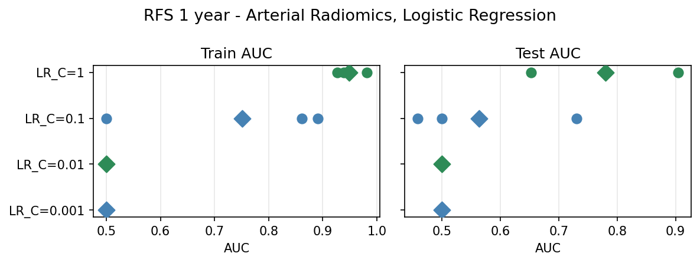 | 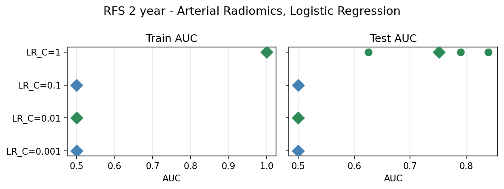 |
| **RF** | 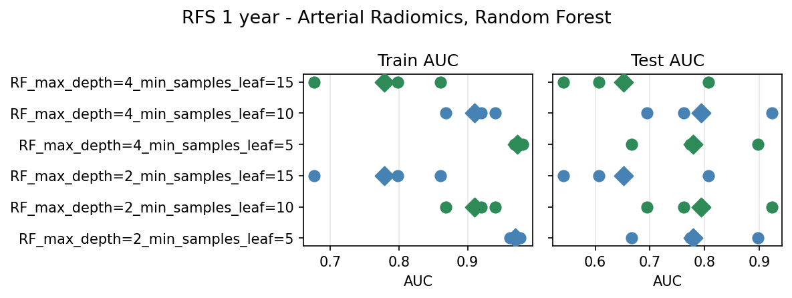 | 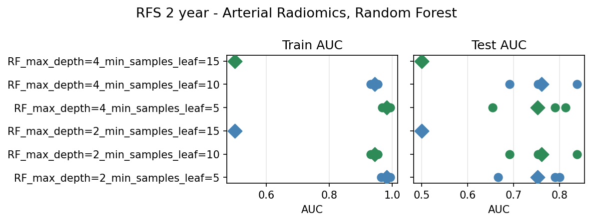 |

#### RNA-seq — DESeq2, all genes

| | 1-year RFS | 2-year RFS |
|---|---|---|
| **LR** |  |  |
| **RF** |  |  |

# 4. Predefined HCC gene set
## HCC Gene set description 
- Total number: 2,175 (unique gene symbols across 12 HCC gene sets in `data/RNA_seq/gene_sets_combined/`)
- Directly match to RNA-seq data set (`/data/RNA_seq/Matrix_output_radiology_only.csv`): 2,160
- 1-on-1 mapped to RNA-seq data set: 31

  | Gene set symbol | Matrix symbol | Rationale |
  |----------------|---------------|-----------|
  | AARS1 | AARS | HGNC approved symbol update |
  | BPNT2 | IMPAD1 | HGNC approved symbol update |
  | CCN1 | CYR61 | HGNC approved symbol update |
  | CCN2 | CTGF | HGNC approved symbol update |
  | CILK1 | ICK | HGNC approved symbol update |
  | DYNC2I2 | WDR60 | HGNC approved symbol update |
  | EPRS1 | EPRS | HGNC approved symbol update |
  | G6PC1 | G6PC | HGNC approved symbol update |
  | GBA1 | GBA | HGNC approved symbol update |
  | H1-0 | H1F0 | HGNC approved symbol update |
  | H1-6 | HIST1H1E | HGNC approved symbol update |
  | H2BC7 | HIST1H2BG | HGNC approved symbol update |
  | H2BC15 | HIST1H2BN | HGNC approved symbol update |
  | H2BC21 | HIST2H2BF | HGNC approved symbol update |
  | H4C1 | HIST1H4A | HGNC approved symbol update |
  | H4C3 | HIST1H4C | HGNC approved symbol update |
  | H4C14 | HIST2H4B | HGNC approved symbol update |
  | HJV | HFE2 | HGNC approved symbol update |
  | IARS1 | IARS | HGNC approved symbol update |
  | ILRUN | C6orf106 | HGNC approved symbol update |
  | ITPRID2 | PPIP5K2 | HGNC approved symbol update |
  | MACROH2A2 | H2AFY2 | HGNC approved symbol update |
  | MMUT | MUT | HGNC approved symbol update |
  | NARS1 | NARS | HGNC approved symbol update |
  | NHERF1 | SLC9A3R1 | HGNC approved symbol update |
  | NHERF2 | SLC9A3R2 | HGNC approved symbol update |
  | NIBAN1 | FAM129A | HGNC approved symbol update |
  | NTAQ1 | NTAN1 | HGNC approved symbol update |
  | PHB1 | PHB | HGNC approved symbol update |
  | PLAAT3 | PLA2G16 | HGNC approved symbol update |
  | RSC1A1 | SLC7A9 | HGNC approved symbol update |

- Cannot match: 15 — symbol absent from RNA-seq matrix and no clear matches:

  | Gene | Reason no distinct mapping can be defined |
  |------|------------------------------------------|
  | CIDEB | No known prior symbol; gene entirely absent from quantification reference (annotation version gap) |
  | FLJ30679 | Provisional FLJ-series EST name; potential HGNC successor CFAP97D1 is in the matrix, but FLJ names may map to multiple genomic loci — confirmed 1-to-1 correspondence requires HGNC validation |
  | GABARAPL3 | Annotated as a pseudogene (HGNC:33517); no protein-coding alias exists for an unambiguous mapping |
  | ID2B | Pseudogene of ID2 (which is in the matrix as a distinct entry); mapping pseudogene to its parent would conflate different genomic loci |
  | LINC02693 | lncRNA with prior chromosomal alias C3orf67 in the matrix, but LINC02693 coordinate boundaries differ from the older ORF definition across annotation versions |
  | MARCHF3 | Updated MARCHF-prefix symbol (was MARCH3); old symbol MARCH3 is also absent from the matrix — gene missing from quantification reference entirely |
  | METTL25B | Paralog of METTL25 (which is in the matrix as a distinct entry); METTL25B and METTL25 are different genes — mapping would conflate two distinct methyltransferases |
  | MTARC2 | Prior symbols MOSC2 and MARC2 also absent from the matrix — gene missing from quantification reference entirely |
  | PABIR2 | Two potential matrix aliases found (APPBP2, TNRC6C) — no distinct 1-to-1 mapping can be assigned |
  | PIGAP1 | Annotated as a pseudogene; no protein-coding alias present in the matrix |
  | POU2AF3 | Recently characterized gene; prior chromosomal alias C11orf53 is in the matrix but may encompass a broader locus not co-extensive with POU2AF3 |
  | PTGR3 | Prior alias ZADH2 is in the matrix, but ZADH2 was reclassified as PTGR3 only in recent HGNC releases — unambiguous correspondence requires HGNC validation |
  | SEPTIN4 | Updated SEPTIN-prefix symbol (was SEPT4); old symbol SEPT4 also absent from the matrix — gene missing from quantification reference entirely |
  | SEPTIN7 | Updated SEPTIN-prefix symbol (was SEPT7); old symbol SEPT7 also absent from the matrix — gene missing from quantification reference entirely |
  | UTP25 | Prior symbol KIAA1041 also absent from the matrix — gene missing from quantification reference entirely |

## Predefined HCC gene set CV results

Best mean test AUC for `before-CV, predefined genes` and  `in-CV, predefined genes`. All runs use `padj < 0.05`; results are identical at `padj < 0.1` (no gene passes BH in either case — fallback-dominated throughout).

| Config | Selector placement | 1y LR | 1y RF | 2y LR | 2y RF |
|--------|--------------------|-------|-------|-------|-------|
| before_cv, predefined | before CV | 0.485 ± 0.032 | 0.596 ± 0.109 | 0.500 ± 0.018 | **0.591 ± 0.058** |
| in_cv, predefined | inside CV | 0.512 ± 0.054 | 0.596 ± 0.109 | 0.512 ± 0.088 | **0.628 ± 0.045** |

# 5. Genes feature selection analysis
## Pre CV selected features 
padj threshold was set as 0.05, but there were too few below it, so 20 features with the min padj were selected.
### 1-year RFS

| Feature | padj |
|---------|------|
| AL138889.1 | 5.84e-04 *|
| AC135731.1 | 5.84e-04 *|
| AC004889.1 | 3.33e-02 *|
| CCDC26 | 3.93e-02 *|
| INAFM2 | 4.67e-02 *|
| AL160272.1 | 4.67e-02 *|
| AC092068.2 | 5.43e-02 |
| LINC00514 | 5.46e-02 |
| AL031594.1 | 9.46e-02 |
| AL117328.2 | 1.07e-01 |
| AC005696.4 | 1.54e-01 |
| EGFL8 | 2.11e-01 |
| AC025580.2 | 2.11e-01 |
| AC006538.1 | 2.11e-01 |
| AC127070.4 | 2.53e-01 |
| AL353726.2 | 2.86e-01 |
| AC016355.1 | 3.32e-01 |
| AC008395.1 | 3.46e-01 |
| AL008638.3 | 3.46e-01 |
| AC102953.2 | 3.83e-01 |

### 2-year RFS

| Feature | padj |
|---------|------|
| CAMK2N2 | 8.94e-03 *|
| AC093826.2 | 3.18e-02 *|
| LACC1 | 4.58e-02 *|
| CSF2 | 1.77e-01 |
| HNRNPA1P9 | 1.77e-01 |
| AL445235.1 | 1.77e-01 |
| AC025580.2 | 1.77e-01 |
| AC025198.1 | 1.77e-01 |
| AC093525.8 | 1.77e-01 |
| OR52N5 | 1.97e-01 |
| RBMXL3 | 1.97e-01 |
| AC004241.5 | 1.97e-01 |
| AC138647.1 | 2.23e-01 |
| AL449283.1 | 2.73e-01 |
| AC130366.1 | 2.73e-01 |
| AC063947.2 | 4.55e-01 |
| H19 | 4.63e-01 |
| SGSM1 | 4.63e-01 |
| HIGD2B | 4.63e-01 |
| ZMYND12 | 4.63e-01 |

## Preselected features vs predefined HCC gene set
  

## Non-zero LR coefficient features per fold (Feature Selection before cross-validation)
  

### 1-year RFS — non-zero features per fold

| Feature | padj | HCC set | Fold 1 coef | Fold 2 coef | Fold 3 coef |
|---------|------|---------|-------------|-------------|-------------|
| AC135731.1 | 5.84e-04 * | No | — | +0.036 | +0.701 |
| AL138889.1 | 5.84e-04 * | No | — | — | +0.410 |
| AC004889.1 | 3.33e-02 * | No | −0.284 | — | −0.240 |
| CCDC26 | 3.93e-02 * | No | −0.035 | — | — |
| INAFM2 | 4.67e-02 * | No | −0.267 | −0.550 | — |
| AC092068.2 | 5.43e-02 | No | −0.184 | — | −0.173 |
| LINC00514 | 5.46e-02 | No | −0.227 | — | −0.112 |
| AC005696.4 | 1.54e-01 | No | −0.754 | — | −0.434 |
| AC025580.2 | 2.11e-01 | No | −0.303 | −0.424 | −0.578 |
| AC006538.1 | 2.11e-01 | No | — | −0.367 | −0.219 |
| AC127070.4 | 2.53e-01 | No | −0.261 | — | −0.016 |
| AL008638.3 | 3.46e-01 | No | −0.221 | — | — |
| AC008395.1 | 3.46e-01 | No | — | −0.482 | −0.874 |
| AC102953.2 | 3.83e-01 | No | — | −0.678 | −0.705 |
| AL117328.2 | 1.07e-01 | No | — | — | −0.263 |

Stable across all 3 folds: `AC025580.2`. No feature is in the HCC predefined set.

### 2-year RFS — non-zero features per fold

| Feature | padj | HCC set | Fold 1 coef | Fold 2 coef | Fold 3 coef |
|---------|------|---------|-------------|-------------|-------------|
| CAMK2N2 | 8.94e-03 * | No | — | — | +0.434 |
| AC093826.2 | 3.18e-02 * | No | −0.806 | −0.204 | −0.664 |
| LACC1 | 4.58e-02 * | No | +0.291 | +0.621 | +1.308 |
| AC025580.2 | 1.77e-01 | No | −0.670 | −0.358 | −0.874 |
| AL445235.1 | 1.77e-01 | No | — | −0.620 | −0.223 |
| AC093525.8 | 1.77e-01 | No | — | −0.288 | −0.394 |
| AC004241.5 | 1.97e-01 | No | −0.201 | −0.192 | — |
| AC138647.1 | 2.23e-01 | No | −0.385 | — | — |
| AL449283.1 | 2.73e-01 | No | +0.976 | +0.443 | +0.921 |
| AC130366.1 | 2.73e-01 | No | — | +0.586 | +0.099 |
| AC063947.2 | 4.55e-01 | No | +0.739 | +0.459 | — |
| H19 | 4.63e-01 | **Yes** | — | −0.522 | −0.640 |
| SGSM1 | 4.63e-01 | No | +1.473 | +0.657 | +0.283 |
| ZMYND12 | 4.63e-01 | No | +0.417 | — | +0.026 |
| RBMXL3 | 1.97e-01 | No | — | −0.169 | — |

Stable across all 3 folds: `LACC1`, `AC093826.2`, `AC025580.2`, `AL449283.1`, `SGSM1`. Only `LACC1` and `AC093826.2` pass padj < 0.05. `H19` (in predefined HCC set) appears in folds 2 and 3 despite padj = 0.463.

# 6. Adding demographic confounders

`CONFOUNDING_VARS = ["Age", "Sex"]`
Age and Sex are concatenated to the selected features **after**. Source: `notebooks/baselines/radiomic_arterial_baseline_rfs.ipynb`, `notebooks/baselines/rna_baseline_rfs.ipynb`
(`CONFOUNDING_VARS = ["Age", "Sex"]`, `SELECTOR_BEFORE_CV = True` for radiomics and all-gene RNA-seq; `SELECTOR_BEFORE_CV = False` for predefined gene set).

| Modality | Selector | 1y LR | 1y RF | 2y LR | 2y RF |
|----------|----------|-------|-------|-------|-------|
| Arterial radiomics | SelectKBest F-score (k=100), before CV | 0.768 ± 0.089 | **0.846 ± 0.073** | 0.739 ± 0.117 | 0.776 ± 0.136 |
| RNA-seq | DESeq2 (`padj < 0.05`, min 20 features), before CV | 0.646 ± 0.083 | 0.754 ± 0.036 | **0.876 ± 0.087** | 0.793 ± 0.138 |
| RNA-seq (predefined HCC genes) | DESeq2 (`padj < 0.05`, min 20 features), in CV | 0.512 ± 0.143 | 0.588 ± 0.058 | 0.504 ± 0.065 | 0.591 ± 0.026 |

The best radiomic RF improves slightly (1y: 0.821 → 0.846; 2y: 0.781 → 0.776).
RNA-seq 2y LR also improves (0.867 → 0.876). Predefined HCC gene set + Age/Sex performs poorly across all horizons (best 2y RF: 0.591), consistent with the no-confounder result in §4.

## Plot AUC in each fold

Circles = per-fold AUC, diamonds = mean.

### Arterial radiomics — SelectKBest (F-score, k=100) + Age/Sex

| | 1-year RFS | 2-year RFS |
|---|---|---|
| **LR** | 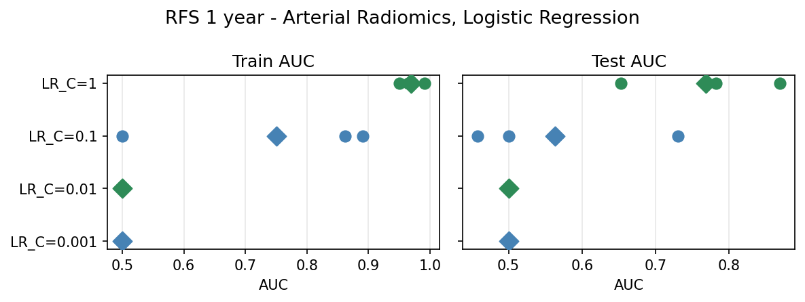 | 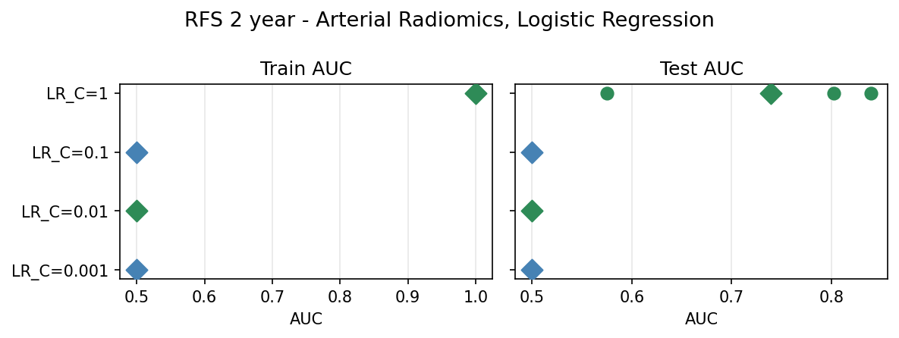 |
| **RF** | 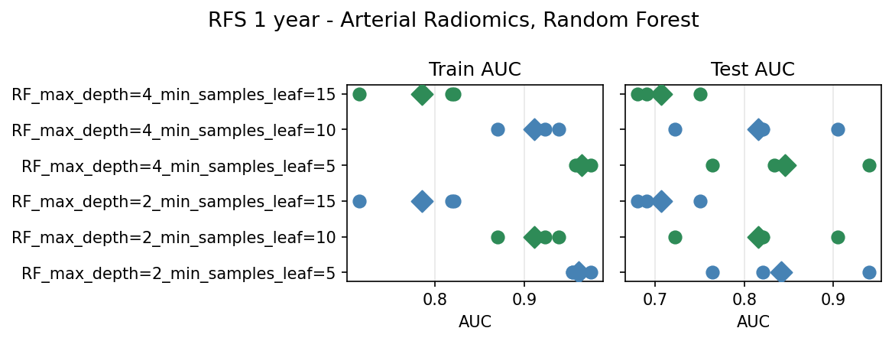 | 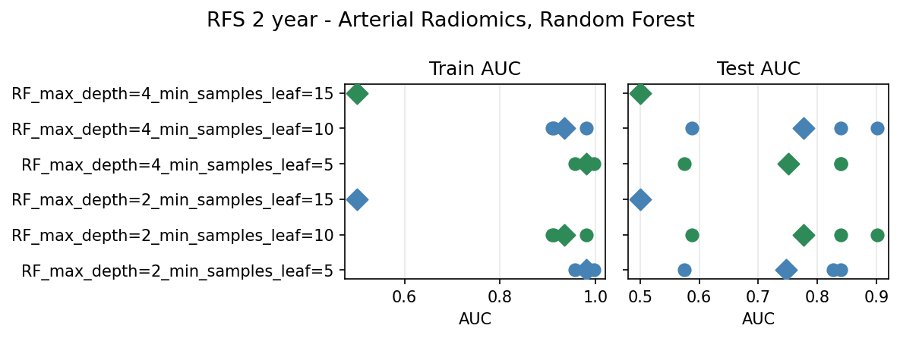 |

### RNA-seq — DESeq2, all genes + Age/Sex

| | 1-year RFS | 2-year RFS |
|---|---|---|
| **LR** | 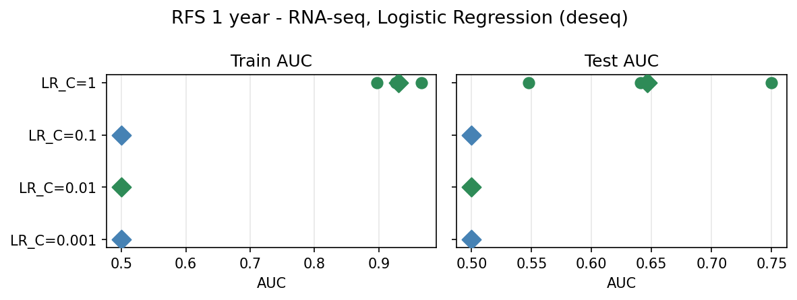 | 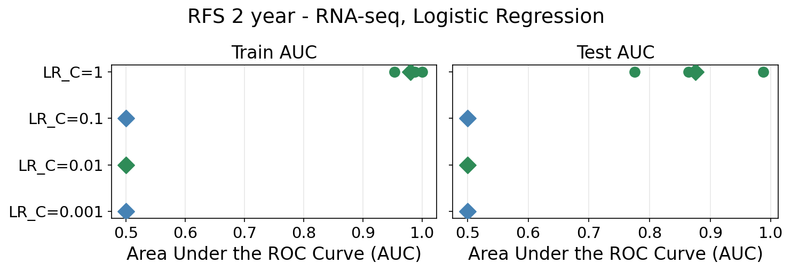 |
| **RF** | 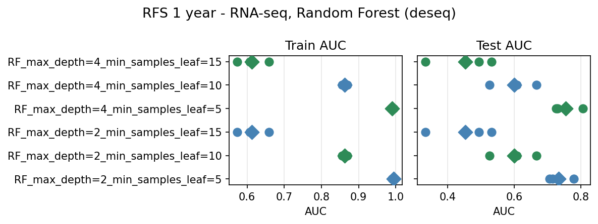 | 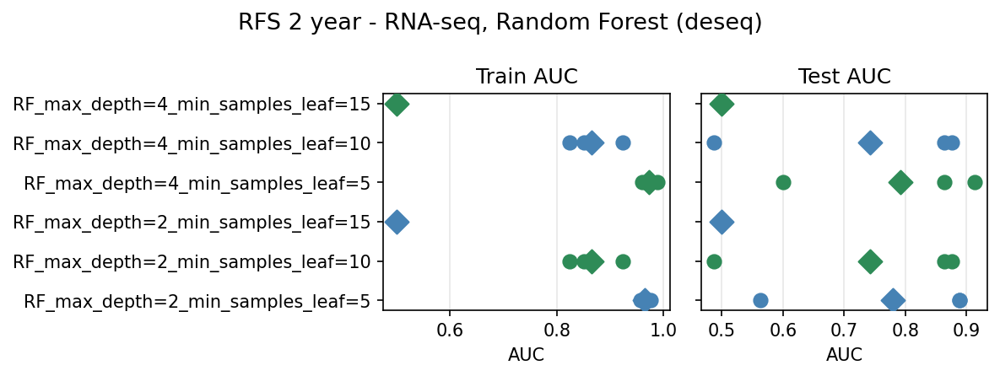 |

### RNA-seq — DESeq2, predefined HCC genes, in CV + Age/Sex

| | 1-year RFS | 2-year RFS |
|---|---|---|
| **LR** | 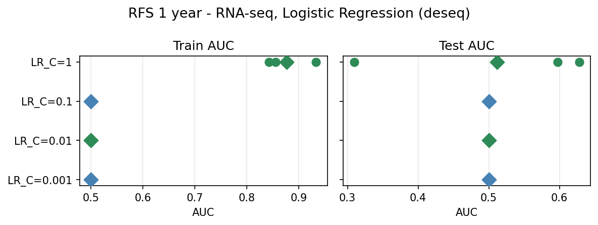 | 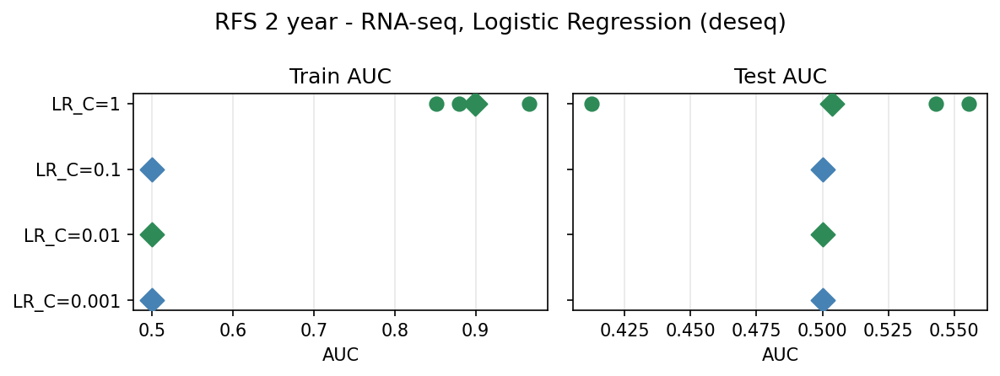 |
| **RF** | 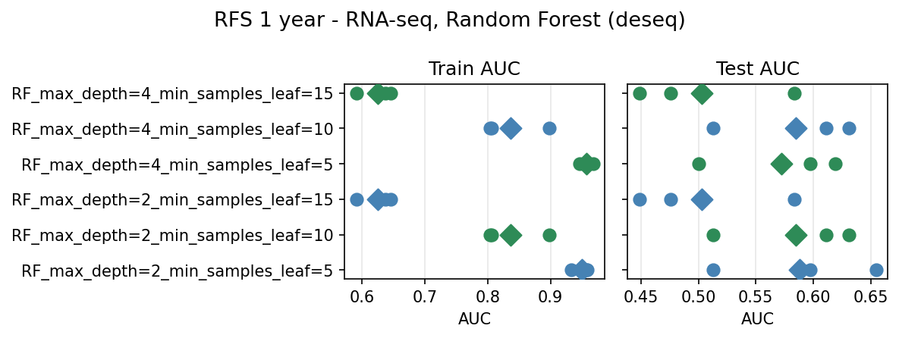 | 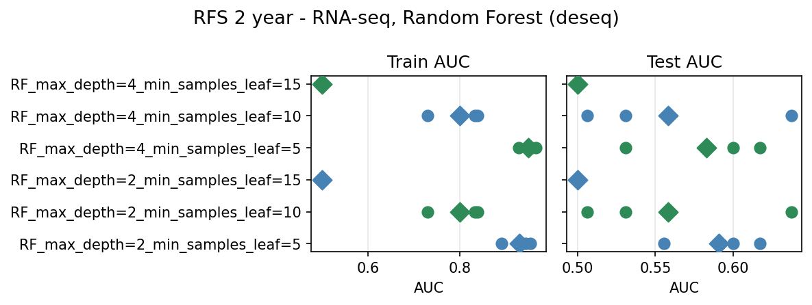 |

# 7. Ensemble (radiomics + RNA-seq)

Average of predicted probabilities from the best before-CV model per modality (2-year RFS): `RF_max_depth=2_min_samples_leaf=10` for radiomics, `LR_C=1` for RNA-seq. Source: `notebooks/baselines/ensemble_baseline_rfs.ipynb`.

## 7.1 No confounders

| Fold | Ensemble | Radiomics (RF) | RNA-seq (LR) |
|------|----------|----------------|--------------|
| 1 | 0.812 | 0.688 | 0.750 |
| 2 | 0.963 | 0.802 | 0.988 |
| 3 | 0.901 | 0.852 | 0.864 |
| **mean ± std** | **0.892 ± 0.062** | 0.781 ± 0.069 | 0.867 ± 0.097 |

The ensemble outperforms both individual modalities in mean AUC.

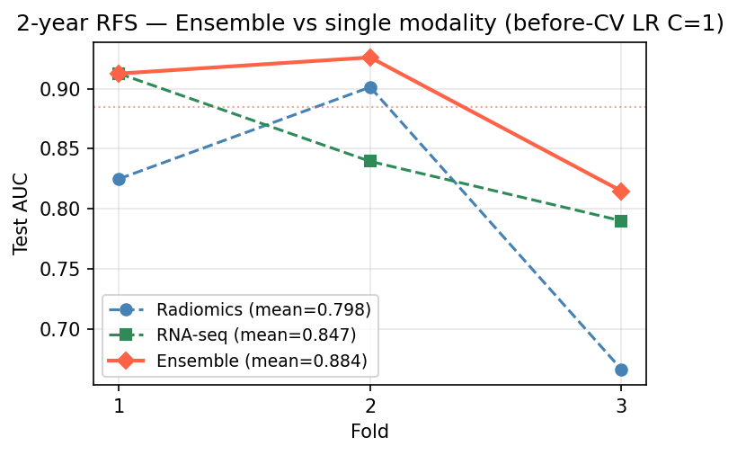

## 7.2 With Age/Sex confounders

Same models and selectors; Age and Sex concatenated to selected features after selection (before model fit), matching the approach in §6.

| Fold | Ensemble | Radiomics (RF) | RNA-seq (LR) |
|------|----------|----------------|--------------|
| 1 | 0.800 | 0.588 | 0.775 |
| 2 | 0.963 | 0.840 | 0.988 |
| 3 | 0.914 | 0.901 | 0.864 |
| **mean ± std** | **0.892 ± 0.068** | 0.776 ± 0.136 | 0.876 ± 0.087 |

Mean ensemble AUC is unchanged (0.892). Adding Age/Sex shifts the radiomics RF from 0.781 → 0.776 (−0.005) and RNA-seq LR from 0.867 → 0.876 (+0.009); the two changes cancel at the ensemble level.

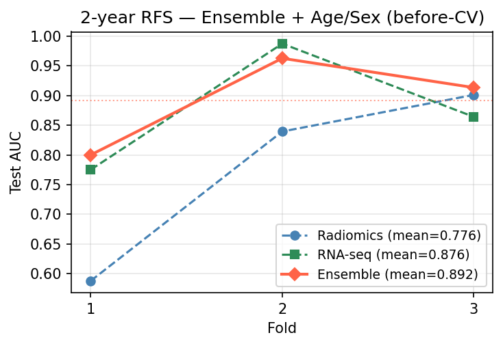