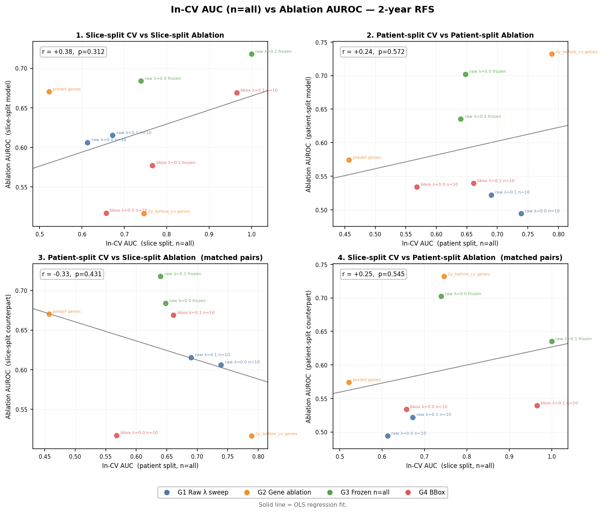

# Ablation Cohort Evaluation — 2-Year RFS Prediction
**Date:** 2026-06-01  

---

## Table of Contents

- [1. Setup](#1-setup)
- [2. Results](#2-results)
  - [2.1 Radiomic baselines](#21-radiomic-baselines)
  - [2.2 Embedding models — all configs](#22-embedding-models--all-configs)
  - [2.3 Summary table](#23-summary-table)
  - [2.4 CV vs ablation AUROC](#24-cv-vs-ablation-auroc)
- [3. Observations](#3-observations)
- [4. All metrics](#4-all-metrics)
- [5. File references](#5-file-references)

---

## 1. Setup

### 1.1 Cohorts

| | Training (resection) | Test (ablation) |
|---|---|---|
| Patients | 54 | 59 with 2 yr RFS outcome, 53 with radiomics features |
| Positives (RFS ≤ 2 yr) | 26 (48%) | 40 (68%) |

### 1.2 Radiomic pipeline

Trained on the full resection cohort (`models/radiomics/radiomic_rfs_2year_{lr,rf}.joblib`):

- 149 arterial-phase features → SelectKBest(f_classif, k=100) → classifier  
- **LR:** saga, elasticnet, l1_ratio=1.0, C=1.0  
- **RF:** max_depth=2, min_samples_leaf=10, n_estimators=100

### 1.3 Contrastive embedding pipeline

All 16 models from `reports/0601/0601_split_comparison.md` (8 slice-split × 8 patient-split).  
Downstream head applied identically to all: SelectKBest(f_classif, k=100) + LR or RF fitted on resection embeddings, evaluated on ablation embeddings.  
MRI: arterial phase (`MRI_dyn_arterial.nii.gz`), mean-pooled sagittal slices.

---

## 2. Results

### 2.1 Radiomic baselines

Target: rfs_2year | Multi-lesion: average | Threshold: 0.5

| Model | AUROC | AUPRC | Sensitivity | Specificity | PPV | NPV | F1 |
|-------|------:|------:|------------:|------------:|----:|----:|---:|
| LR | 0.518 | 0.671 | 0.657 | 0.389 | 0.677 | 0.368 | 0.667 |
| RF | **0.590** | 0.766 | 0.143 | 1.000 | 1.000 | 0.375 | 0.250 |

### 2.2 Embedding models — all configs

Best of LR / RF shown per model (best AUROC). "Split" is  the validation split unit during contrastive training.

#### Group 1 — 40 genes + 10 slices per patient

| Config | Split | Model ID | LR AUROC | RF AUROC | Best AUROC |
|--------|-------|----------|--------:|--------:|----------:|
| λ=0.1, unfrozen, n=10 | slice | `6a1a1bdf` | 0.615 | 0.583 | 0.615 |
| λ=0.1, unfrozen, n=10 | patient | `1361bef2` | 0.470 | 0.522 | 0.522 |
| λ=0.0, unfrozen, n=10 | slice | `982a6fa2` | 0.514 | 0.606 | 0.606 |
| λ=0.0, unfrozen, n=10 | patient | `a6f970d6` | 0.494 | 0.450 | 0.494 |

#### Group 2 — Gene set ablation

| Config | Split | Model ID | LR AUROC | RF AUROC | Best AUROC |
|--------|-------|----------|--------:|--------:|----------:|
| λ=0.1, predefined genes | slice | `12e4ba6a` | 0.578 | 0.670 | 0.670 |
| λ=0.1, predefined genes | patient | `34e6806f` | 0.574 | 0.507 | 0.574 |
| λ=0.1, 2y_before_cv genes | slice | `5d04e6ba` | 0.436 | 0.516 | 0.516 |
| λ=0.1, 2y_before_cv genes | patient | `9109a6c2` | 0.732 | 0.568 | 0.732 |

#### Group 3 — Full slices (n=all, frozen backbone)

| Config | Split | Model ID | LR AUROC | RF AUROC | Best AUROC |
|--------|-------|----------|--------:|--------:|----------:|
| λ=0.1, frozen, n=all | slice | `dc7e1d10` | 0.718 | 0.608 | 0.718 |
| λ=0.1, frozen, n=all | patient | `5e3f71a0` | 0.617 | 0.635 | 0.635 |
| λ=0.0, frozen, n=all | slice | `a64b245f` | 0.684 | 0.669 | 0.684 |
| λ=0.0, frozen, n=all | patient | `06c598c0` | 0.702 | 0.664 | 0.702 |

#### Group 4 — Bounding box

| Config | Split | Model ID | LR AUROC | RF AUROC | Best AUROC |
|--------|-------|----------|--------:|--------:|----------:|
| λ=0.1, unfrozen, n=10 | slice | `050d401d` | 0.669 | 0.515 | 0.669 |
| λ=0.1, unfrozen, n=10 | patient | `f8aabb75` | 0.539 | 0.497 | 0.539 |
| λ=0.0, unfrozen, n=10 | slice | `e12b0592` | 0.517 | 0.465 | 0.517 |
| λ=0.0, unfrozen, n=10 | patient | `8715461c` | 0.534 | 0.431 | 0.534 |
| λ=0.1, frozen, n=all | slice | `92b9afed` | 0.571 | 0.577 | 0.577 |

### 2.3 Summary table

Ranked by best AUROC:

| Rank | Model ID | Head | Config | Split | AUROC | AUPRC | Sensitivity | Specificity | PPV | NPV | F1 |
|------|----------|------|--------|-------|------:|------:|------------:|------------:|----:|----:|---:|
| 1 | `9109a6c2` | LR | raw, λ=0.1, 2y_before_cv genes, n=10 | patient | 0.732 | 0.865 | 0.846 | 0.389 | 0.750 | 0.538 | 0.795 |
| 2 | `dc7e1d10` | LR | raw, λ=0.1, frozen, n=all | slice | 0.718 | 0.838 | 0.846 | 0.389 | 0.750 | 0.538 | 0.795 |
| 3 | `06c598c0` | LR | raw, λ=0.0, frozen, n=all | patient | 0.702 | 0.840 | 0.897 | 0.222 | 0.714 | 0.500 | 0.795 |
| 4 | `a64b245f` | LR | raw, λ=0.0, frozen, n=all | slice | 0.684 | 0.804 | 0.974 | 0.278 | 0.745 | 0.833 | 0.844 |
| 5 | `12e4ba6a` | RF | raw, λ=0.1, predefined genes, n=10 | slice | 0.670 | 0.820 | 0.872 | 0.278 | 0.723 | 0.500 | 0.791 |
| 6 | `050d401d` | LR | bbox, λ=0.1, unfrozen, n=10 | slice | 0.669 | 0.791 | 1.000 | 0.000 | 0.667 | — | 0.800 |
| 7 | `5e3f71a0` | RF | raw, λ=0.1, frozen, n=all | patient | 0.635 | 0.819 | 1.000 | 0.000 | 0.684 | — | 0.812 |
| 8 | `6a1a1bdf` | LR | raw, λ=0.1, unfrozen, n=10 | slice | 0.615 | 0.816 | 0.385 | 0.778 | 0.789 | 0.368 | 0.517 |
| 9 | `982a6fa2` | RF | raw, λ=0.0, unfrozen, n=10 | slice | 0.606 | 0.734 | 1.000 | 0.000 | 0.684 | — | 0.812 |
| — | radiomic RF | RF | 149 art. features, resection-trained | — | 0.590 | 0.766 | 0.143 | 1.000 | 1.000 | 0.375 | 0.250 |
| 10 | `92b9afed` | RF | bbox, λ=0.1, frozen, n=all | slice | 0.577 | 0.719 | 0.972 | 0.000 | 0.660 | 0.000 | 0.787 |
| 11 | `34e6806f` | LR | raw, λ=0.1, predefined genes, n=10 | patient | 0.574 | 0.734 | 0.667 | 0.500 | 0.743 | 0.409 | 0.703 |
| 12 | `f8aabb75` | LR | bbox, λ=0.1, unfrozen, n=10 | patient | 0.539 | 0.710 | 0.944 | 0.056 | 0.667 | 0.333 | 0.782 |
| 13 | `8715461c` | LR | bbox, λ=0.0, unfrozen, n=10 | patient | 0.534 | 0.661 | 0.028 | 0.889 | 0.333 | 0.314 | 0.051 |
| 14 | `1361bef2` | RF | raw, λ=0.1, unfrozen, n=10 | patient | 0.522 | 0.707 | 1.000 | 0.000 | 0.684 | — | 0.812 |
| — | radiomic LR | LR | 149 art. features, resection-trained | — | 0.518 | 0.671 | 0.657 | 0.389 | 0.676 | 0.368 | 0.667 |
| 15 | `e12b0592` | LR | bbox, λ=0.0, unfrozen, n=10 | slice | 0.517 | 0.693 | 0.472 | 0.556 | 0.680 | 0.345 | 0.557 |
| 16 | `5d04e6ba` | RF | raw, λ=0.1, 2y_before_cv genes, n=10 | slice | 0.516 | 0.712 | 1.000 | 0.000 | 0.684 | — | 0.812 |
| 17 | `a6f970d6` | LR | raw, λ=0.0, unfrozen, n=10 | patient | 0.494 | 0.674 | 0.949 | 0.056 | 0.685 | 0.333 | 0.796 |

### 2.4 CV vs ablation AUROC

In-CV AUC: 3-fold stratified CV on the resection cohort (54 patients), best of LR/RF on embeddings task. Groups 1–4 from `reports/0601/0601_split_comparison.md`; Group 2 n=all and `92b9afed` newly run. All models use n=all sagittal slices at both CV inference and ablation inference.

#### Pearson correlation (CV AUC vs ablation AUROC)

| Comparison | n | r | p |
|------------|--:|--:|--:|
| Slice-split CV vs slice-split ablation | 9 | +0.38 | 0.312 |
| Patient-split CV vs patient-split ablation | 8 | +0.24 | 0.572 |
| Patient-split CV vs slice-split ablation (matched pairs) | 8 | −0.33 | 0.431 |
| Slice-split CV vs patient-split ablation (matched pairs) | 8 | +0.25 | 0.545 |

No comparison reaches significance. CV AUC is a poor predictor of ablation AUROC regardless of split strategy. The two heavily overfit slice-split models (`dc7e1d10` CV=1.00→ablation 0.718; `050d401d` CV=0.965→ablation 0.669) contribute most of the positive slope in comparison 1; without them r would be near zero.

*Figure: scatter plots for all four CV–ablation comparisons. Solid line = OLS regression fit. Generated by `scripts/cv_ablation_scatter.py`.*

#### Group 1 — Raw MRI, λ sweep (CV: n=all inference)

| Model ID | Config | Split | In-CV AUC ± std | Ablation AUROC | Δ |
|----------|--------|-------|----------------:|---------------:|--:|
| `6a1a1bdf` | raw, λ=0.1, unfrozen, n=10 | slice | 0.672 ± 0.090 (RF) | 0.615 | −0.057 |
| `1361bef2` | raw, λ=0.1, unfrozen, n=10 | patient | 0.690 ± 0.036 (RF) | 0.522 | −0.168 |
| `982a6fa2` | raw, λ=0.0, unfrozen, n=10 | slice | 0.717 ± 0.087 (RF) | 0.606 | −0.111 |
| `a6f970d6` | raw, λ=0.0, unfrozen, n=10 | patient | 0.739 ± 0.100 (LR) | 0.494 | −0.245 |

#### Group 2 — Gene set ablation (CV: n=all inference)

| Model ID | Config | Split | In-CV AUC ± std | Ablation AUROC | Δ |
|----------|--------|-------|----------------:|---------------:|--:|
| `12e4ba6a` | raw, λ=0.1, predefined genes | slice | 0.522 ± 0.087 (RF) | 0.670 | +0.148 |
| `34e6806f` | raw, λ=0.1, predefined genes | patient | 0.457 ± 0.040 (RF) | 0.574 | +0.117 |
| `5d04e6ba` | raw, λ=0.1, 2y_before_cv genes | slice | 0.746 ± 0.117 (RF) | 0.516 | −0.230 |
| `9109a6c2` | raw, λ=0.1, 2y_before_cv genes | patient | 0.789 ± 0.032 (LR) | 0.732 | −0.057 |

#### Group 3 — Full slices, frozen (CV: n=all inference)

| Model ID | Config | Split | In-CV AUC ± std | Ablation AUROC | Δ |
|----------|--------|-------|----------------:|---------------:|--:|
| `dc7e1d10` | raw, λ=0.1, frozen, n=all | slice | 1.000 ± 0.000 (RF) | 0.718 | −0.282 |
| `5e3f71a0` | raw, λ=0.1, frozen, n=all | patient | 0.640 ± 0.038 (LR) | 0.635 | −0.005 |
| `a64b245f` | raw, λ=0.0, frozen, n=all | slice | 0.739 ± 0.129 (LR) | 0.684 | −0.055 |
| `06c598c0` | raw, λ=0.0, frozen, n=all | patient | 0.648 ± 0.100 (RF) | 0.702 | +0.054 |

#### Group 4 — Bounding box (CV: n=all inference)

| Model ID | Config | Split | In-CV AUC ± std | Ablation AUROC | Δ |
|----------|--------|-------|----------------:|---------------:|--:|
| `050d401d` | bbox, λ=0.1, unfrozen, n=10 | slice | 0.965 ± 0.026 (RF) | 0.669 | −0.296 |
| `f8aabb75` | bbox, λ=0.1, unfrozen, n=10 | patient | 0.661 ± 0.117 (LR) | 0.539 | −0.122 |
| `e12b0592` | bbox, λ=0.0, unfrozen, n=10 | slice | 0.657 ± 0.100 (LR) | 0.517 | −0.140 |
| `8715461c` | bbox, λ=0.0, unfrozen, n=10 | patient | 0.568 ± 0.101 (RF) | 0.534 | −0.034 |
| `92b9afed` | bbox, λ=0.1, frozen, n=all | slice | 0.766 ± 0.074 (RF) | 0.577 | −0.189 |

---

## 3. Observations

1. **Top three models (AUROC 0.70–0.73) come from two different groups**: `9109a6c2` (LR, 0.732), `dc7e1d10` (LR, 0.718), and `06c598c0` (LR, 0.702). The 2y_before_cv patient-split model and both frozen n=all models transfer best, suggesting that avoiding slice-level leakage during training and using all slices are complementary paths to external generalization.

2. **Full-slice frozen models transfer consistently well.** All four frozen n=all models rank in the top 4, with AUROC 0.635–0.718. Their frozen ViT-B/32 backbone produces transferable representations regardless of λ or split strategy.

3. **`6a1a1bdf` (previously rank 1 at 0.742) drops to rank 8 (0.615) after the resampling fix.** The old results were extracted without resampling the ablation MRIs; with correct 1×1×3 mm resampling the advantage disappears, suggesting its prior lead was an artefact of resolution mismatch rather than a better model.

4. **The 2y_before_cv gene set reversal is preserved**: slice-split `5d04e6ba` remains the worst embedding model (0.516) while patient-split sibling `9109a6c2` is the best (0.732). The patient-level split forces the model to learn more transferable image features rather than overfitting the resection gene-expression distribution.

5. **`050d401d` (bbox, slice-split) jumped from rank 12 to rank 6 (0.583→0.669) after the resampling fix.** The bbox pipeline crops around segmentation masks that were themselves resampled — getting this right mattered more for bbox than for raw-MRI models.

6. **Radiomic RF (0.590) still sits mid-table**, ahead of 7 of the 16 embedding models. The relative standing is unchanged from before the resampling fix.

7. **LR head dominates across the board after the fix.** LR wins for 13 of 16 models, including all frozen and most unfrozen configs — a stronger pattern than before where RF won for several n=10 unfrozen models.

8. **Freezing the backbone hurts bbox but helps raw MRI.** `92b9afed` (bbox, frozen, n=all, slice) achieves only 0.577 — worse than the unfrozen n=10 bbox counterpart `050d401d` (0.669). For raw full-MRI, frozen + n=all adds +0.10 AUROC over unfrozen n=10; for bbox the same change costs −0.09. The difference is that tight lesion crops require backbone adaptation to learn lesion-specific features, whereas full-liver slices provide enough diversity that frozen ViT-B/32 features transfer without fine-tuning.

---

## 4. All metrics

Best head (LR or RF, whichever has higher AUROC) per model, ranked by AUROC. Multi-lesion: average. Threshold: 0.5. "—" = undefined NPV (all samples predicted positive, TN = 0 and FN = 0).

---

## 5. File references

| Artifact | Path |
|---|---|
| Radiomic LR | `results/eval/ablation/radiomic_lr_rfs_2year_{timestamp}.json` |
| Radiomic RF | `results/eval/ablation/radiomic_rf_rfs_2year_{timestamp}.json` |
| Embedding results (per model) | `results/eval/ablation/embedding_{model_id}_rfs_2year_{timestamp}.json` |
| Radiomic models | `models/radiomics/radiomic_rfs_2year_{lr,rf}.joblib` |
| Contrastive models | `training/contrastive/{model_id}/best_model.pt` |
| Cached ablation embeddings | `training/contrastive/{model_id}/cached_embeddings/ablation_img_emb_{raw,bbox}.parquet` |
