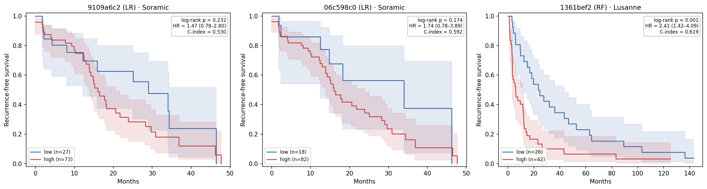

# Embedding-Based RFS Survival Stratification — 2026-06-20

## Table of Contents
- [1. Tasks](#1-tasks)
- [2. Key Findings](#2-key-findings)
- [3. Cohorts](#3-cohorts)
- [4. Method](#4-method)
- [5. Results](#5-results)

---

## 1. Tasks

Evaluate whether contrastive embedding–derived risk scores can split external
ablation cohorts into high- vs low-risk groups with separable Kaplan–Meier
curves. Test two risk-score routes and four cutoff strategies across the top
models from `reports/0608/0608_ablation_eval_v2.md`.

---

## 2. Key Findings

- **2-Year RFS classifier + kmeans** is the only robust risk-score × cutoff
  combination.
- Lausanne — `1361bef2` (RF), which has the highest AUC, also has the highest C-index and reach statistical significance on log-rank.
- Soramic - the models with the higher AUC and highest C-index both not reach statistical significance on log-rank p, though we can see the trend.

---

## 3. Cohorts

Survival endpoint = `RFS_central`, event = `RFS_central_event`.

| | Resection (train) | Soramic (test) | Lausanne (test) |
|---|---|---|---|
| Patients with embedding + time-to-event | 60 | 100 | 68 |
| Patients with 2-year RFS label (Route A training) | 54 | 57 | 66 |
| RFS events (recurrence/death) | 41 | 50 | 64 |
| Median follow-up (months) | 21.8 | 9.3 | 11.8 |
| Median RFS event time (months) | 24.4 | 17.7 | 11.7 |

---

## 4. Method

### 4.1 Risk score & high/low risk cutoff strategies

**Risk scores:**

| Risk score | Description |
|---|---|
| **2-Year RFS classifier** | Reuse the 2-year RFS classifier (`SelectKBest(f_classif, k=100)` + LR/RF head, exact 0608 pipeline). Score = `predict_proba(RFS ≤ 2yr)`. |
| **Cox Model** | `StandardScaler → PCA(10) → penalized Cox PH` (`penalizer=0.1`, ridge). Score = partial hazard. |

The resection score used to define cutoffs is the
**out-of-fold** (3-fold CV) score. The model is
then refit on all resection patients to score the ablation cohorts.

**Cutoff strategies:**

| Strategy | Cutoff source |
|---|---|
| **median** | Resection OOF median score |
| **kmeans** | KMeans(k=2) on raw test scores; boundary = midpoint between 1-D centroids |
| **log + kmeans** | KMeans(k=2) on log-transformed test scores (tames heavy-tailed Cox partial hazard) |
| **youden** | Youden-J threshold on resection vs `rfs_2year` (frozen) |

High = `score ≥ threshold`.

### 4.2 Statistics

For each combination: **n (hi/lo)**, **HR (95% CI)**, **log-rank p**,
**C-index**, **Median RFS hi/lo**.
Statistics are computed only when both groups have ≥5 patients (balanced);
otherwise only n (hi/lo) is reported.

---

## 5. Results

### 5.1 Risk score & high/low risk cutoff strategies — split balance and separation

Tables show the **top 5 AUROC models** per cohort (best head per model).
Each model is evaluated under 2 risk scores × 4 cutoff strategies.
`—` = imbalanced split (< 5 in one arm), no survival stats computed.

#### 5.1.1 Soramic

| model_id | configs | AUROC | Risk score | Cutoff | n (hi/lo) | Median RFS hi/lo (mo) |
|---|---|---:|---|---|---|---|
| `9109a6c2` | raw, λ=0.1, 2y_before_cv, n=10, patient | 0.732 | 2-Year RFS | median | 86/14 | 16.0 / 34.0 |
| `9109a6c2` | | | 2-Year RFS | kmeans | 73/27 | 16.0 / 29.0 |
| `9109a6c2` | | | 2-Year RFS | log + kmeans | 86/14 | 16.0 / 34.0 |
| `9109a6c2` | | | 2-Year RFS | youden | 74/26 | 16.0 / 29.0 |
| `9109a6c2` | | 0.711 | Cox Model | median | 22/78 | 15.2 / 18.1 |
| `9109a6c2` | | | Cox Model | kmeans | 2/98 | — |
| `9109a6c2` | | | Cox Model | log + kmeans | 55/45 | 14.8 / 25.1 |
| `9109a6c2` | | | Cox Model | youden | 23/77 | 15.2 / 18.1 |
| `dc7e1d10` | raw, λ=0.1, frozen, n=all, slice | 0.718 | 2-Year RFS | median | 83/17 | 16.0 / 29.7 |
| `dc7e1d10` | | | 2-Year RFS | kmeans | 81/19 | 16.0 / 29.7 |
| `dc7e1d10` | | | 2-Year RFS | log + kmeans | 89/11 | 15.8 / 29.7 |
| `dc7e1d10` | | | 2-Year RFS | youden | 82/18 | 16.0 / 29.7 |
| `dc7e1d10` | | 0.623 | Cox Model | median | 93/7 | 17.7 / 29.0 |
| `dc7e1d10` | | | Cox Model | kmeans | 1/99 | — |
| `dc7e1d10` | | | Cox Model | log + kmeans | 19/81 | 16.0 / 18.1 |
| `dc7e1d10` | | | Cox Model | youden | 82/18 | 16.0 / 28.3 |
| `06c598c0` | raw, λ=0.0, frozen, n=all, patient | 0.702 | 2-Year RFS | median | 91/9 | 16.0 / 34.0 |
| `06c598c0` | | | 2-Year RFS | kmeans | 82/18 | 16.0 / 34.0 |
| `06c598c0` | | | 2-Year RFS | log + kmeans | 99/1 | — |
| `06c598c0` | | | 2-Year RFS | youden | 92/8 | 16.0 / 34.0 |
| `06c598c0` | | 0.547 | Cox Model | median | 38/62 | 17.7 / 18.2 |
| `06c598c0` | | | Cox Model | kmeans | 3/97 | — |
| `06c598c0` | | | Cox Model | log + kmeans | 35/65 | 17.7 / 16.4 |
| `06c598c0` | | | Cox Model | youden | 8/92 | 16.0 / 18.1 |
| `a64b245f` | raw, λ=0.0, frozen, n=all, slice | 0.684 | 2-Year RFS | median | 91/9 | 16.0 / 34.0 |
| `a64b245f` | | | 2-Year RFS | kmeans | 90/10 | 16.0 / 29.7 |
| `a64b245f` | | | 2-Year RFS | log + kmeans | 91/9 | 16.0 / 34.0 |
| `a64b245f` | | | 2-Year RFS | youden | 90/10 | 16.0 / 29.7 |
| `a64b245f` | | 0.698 | Cox Model | median | 100/0 | — |
| `a64b245f` | | | Cox Model | kmeans | 15/85 | 16.0 / 17.7 |
| `a64b245f` | | | Cox Model | log + kmeans | 29/71 | 21.7 / 16.4 |
| `a64b245f` | | | Cox Model | youden | 97/3 | — |
| `12e4ba6a` | raw, λ=0.1, predefined, n=10, slice | 0.670 | 2-Year RFS | median | 89/11 | 16.0 / 29.0 |
| `12e4ba6a` | | | 2-Year RFS | kmeans | 34/66 | 14.2 / 21.7 |
| `12e4ba6a` | | | 2-Year RFS | log + kmeans | 46/54 | 14.8 / 20.6 |
| `12e4ba6a` | | | 2-Year RFS | youden | 97/3 | — |
| `12e4ba6a` | | 0.601 | Cox Model | median | 64/36 | 17.7 / 29.7 |
| `12e4ba6a` | | | Cox Model | kmeans | 4/96 | — |
| `12e4ba6a` | | | Cox Model | log + kmeans | 53/47 | 15.8 / 29.7 |
| `12e4ba6a` | | | Cox Model | youden | 49/51 | 15.2 / 29.0 |

#### 5.1.2 Lausanne

| model_id | configs | AUROC | Risk score | Cutoff | n (hi/lo) | Median RFS hi/lo (mo) |
|---|---|---:|---|---|---|---|
| `1361bef2` | raw, λ=0.1, unfrozen, n=10, patient | 0.771 | 2-Year RFS | median | 68/0 | — |
| `1361bef2` | | | 2-Year RFS | kmeans | 42/26 | 5.9 / 23.4 |
| `1361bef2` | | | 2-Year RFS | log + kmeans | 42/26 | 5.9 / 23.4 |
| `1361bef2` | | | 2-Year RFS | youden | 68/0 | — |
| `1361bef2` | | 0.557 | Cox Model | median | 68/0 | — |
| `1361bef2` | | | Cox Model | kmeans | 1/67 | — |
| `1361bef2` | | | Cox Model | log + kmeans | 36/32 | 11.5 / 11.7 |
| `1361bef2` | | | Cox Model | youden | 68/0 | — |
| `5d04e6ba` | raw, λ=0.1, 2y_before_cv, n=10, slice | 0.655 | 2-Year RFS | median | 68/0 | — |
| `5d04e6ba` | | | 2-Year RFS | kmeans | 67/1 | — |
| `5d04e6ba` | | | 2-Year RFS | log + kmeans | 67/1 | — |
| `5d04e6ba` | | | 2-Year RFS | youden | 68/0 | — |
| `5d04e6ba` | | 0.627 | Cox Model | median | 68/0 | — |
| `5d04e6ba` | | | Cox Model | kmeans | 10/58 | 3.5 / 12.2 |
| `5d04e6ba` | | | Cox Model | log + kmeans | 44/24 | 11.5 / 16.8 |
| `5d04e6ba` | | | Cox Model | youden | 68/0 | — |
| `a6f970d6` | raw, λ=0.0, unfrozen, n=10, patient | 0.618 | 2-Year RFS | median | 66/2 | — |
| `a6f970d6` | | | 2-Year RFS | kmeans | 65/3 | — |
| `a6f970d6` | | | 2-Year RFS | log + kmeans | 67/1 | — |
| `a6f970d6` | | | 2-Year RFS | youden | 66/2 | — |
| `a6f970d6` | | 0.522 | Cox Model | median | 47/21 | 11.9 / 9.6 |
| `a6f970d6` | | | Cox Model | kmeans | 2/66 | — |
| `a6f970d6` | | | Cox Model | log + kmeans | 26/42 | 13.9 / 7.5 |
| `a6f970d6` | | | Cox Model | youden | 57/11 | 12.0 / 9.3 |
| `92b9afed` | bbox, λ=0.1, frozen, n=all, slice | 0.614 | 2-Year RFS | median | 67/0 | — |
| `92b9afed` | | | 2-Year RFS | kmeans | 38/29 | 12.0 / 9.6 |
| `92b9afed` | | | 2-Year RFS | log + kmeans | 38/29 | 12.0 / 9.6 |
| `92b9afed` | | | 2-Year RFS | youden | 41/26 | 11.9 / 11.5 |
| `92b9afed` | | 0.466 | Cox Model | median | 22/45 | 11.7 / 12.1 |
| `92b9afed` | | | Cox Model | kmeans | 9/58 | 12.0 / 11.5 |
| `92b9afed` | | | Cox Model | log + kmeans | 48/19 | 11.7 / 12.2 |
| `92b9afed` | | | Cox Model | youden | 9/58 | 12.0 / 11.5 |
| `982a6fa2` | raw, λ=0.0, unfrozen, n=10, slice | 0.600 | 2-Year RFS | median | 66/2 | — |
| `982a6fa2` | | | 2-Year RFS | kmeans | 66/2 | — |
| `982a6fa2` | | | 2-Year RFS | log + kmeans | 67/1 | — |
| `982a6fa2` | | | 2-Year RFS | youden | 66/2 | — |
| `982a6fa2` | | 0.447 | Cox Model | median | 39/29 | 11.7 / 11.9 |
| `982a6fa2` | | | Cox Model | kmeans | 1/67 | — |
| `982a6fa2` | | | Cox Model | log + kmeans | 27/41 | 12.1 / 11.5 |
| `982a6fa2` | | | Cox Model | youden | 47/21 | 11.7 / 11.9 |

#### 5.1.3 Conclusion

- **Cox Model** splits are frequently imbalanced (raw kmeans collapses to 1–2
  outlier clusters) and, even when balanced, often show wrong-direction
  separation (high-risk group has longer median RFS) or no separation at all.
- **Frozen cutoffs (median, youden)** degenerate on the ablation cohorts: the
  resection-trained threshold sits too low for these higher-risk populations,
  sending most or all patients into "high" (e.g. 68/0, 100/0).
- **2-Year RFS classifier + kmeans** is the only combination that produces
  reasonably balanced, correct-direction splits across both cohorts and most
  models. It is used for the detailed analysis in §5.2.

---

### 5.2 KM curves and statistics — 2-Year RFS classifier + kmeans

Per cohort, the model with the highest AUROC and the model with the highest
C-index are selected. On Lausanne both metrics select the same model
(`1361bef2`).

| model_id | Cohort | Selected by | n (hi/lo) | HR (95% CI) | log-rank p | C-index | AUROC | Median RFS hi/lo (mo) | 12-mo RFS hi/lo | 24-mo RFS hi/lo |
|---|---|---|---|---|---:|---:|---:|---|---|---|
| `9109a6c2` | Soramic | top AUROC | 73/27 | 1.47 (0.78–2.80) | 0.232 | 0.530 | 0.732 | 16.0 / 29.0 | 74.9% / 75.4% | 28.4% / 62.6% |
| `06c598c0` | Soramic | top C-index | 82/18 | 1.74 (0.78–3.89) | 0.174 | 0.592 | 0.702 | 16.0 / 34.0 | 72.3% / 85.9% | 34.4% / 56.4% |
| `1361bef2` | Lausanne | top AUROC & C-index | 42/26 | **2.41 (1.42–4.09)** | **0.001** | **0.619** | **0.771** | 5.9 / 23.4 | 33.3% / 73.1% | 13.3% / 50.0% |

*Figure 1. Kaplan-Meier curves (with 95% CI) for the per-cohort best models,
2-Year RFS classifier risk score with kmeans split. Only `1361bef2` on Lausanne
reaches significance (log-rank p < 0.001). Editable SVG: `km_5_2.svg`.*

---

## File references

| Artifact | Path |
|---|---|
| Stratification results CSV | `results/eval/survival/stratify_top5.csv` |
| Screen table (all models) | `results/eval/survival/screen.csv` |
| KM figure — §5.2 | `reports/0620/km_5_2.{png,svg}` |
| Stratification script | `scripts/survival_stratify.py` |
| KM figure script | `scripts/survival_km.py` |
| Pipeline code | `hcc_multimodal/survival/` |
