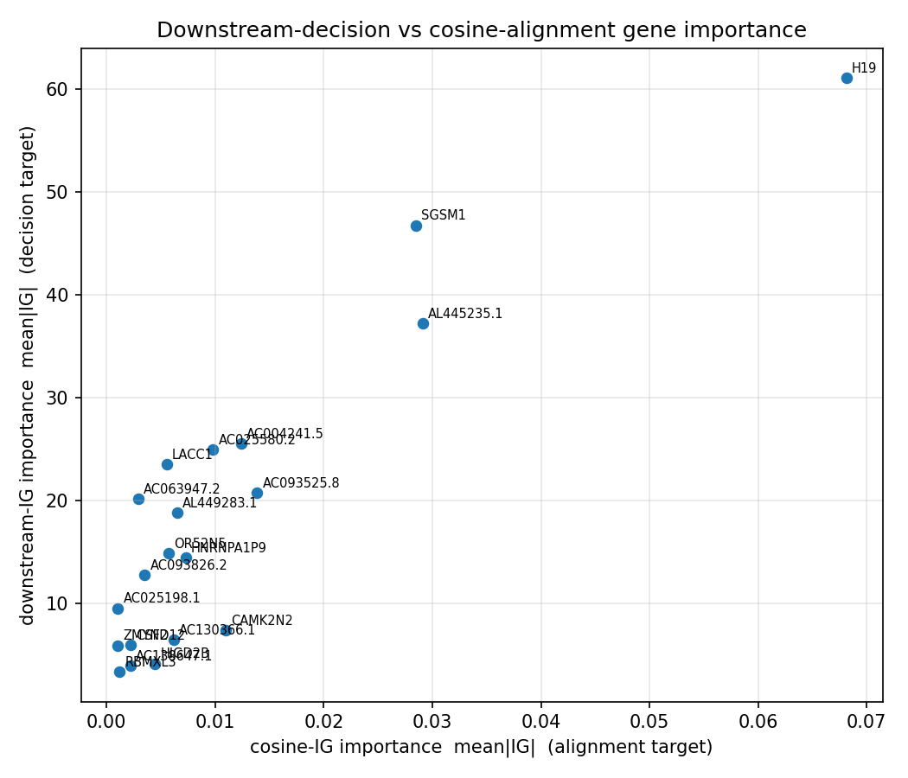
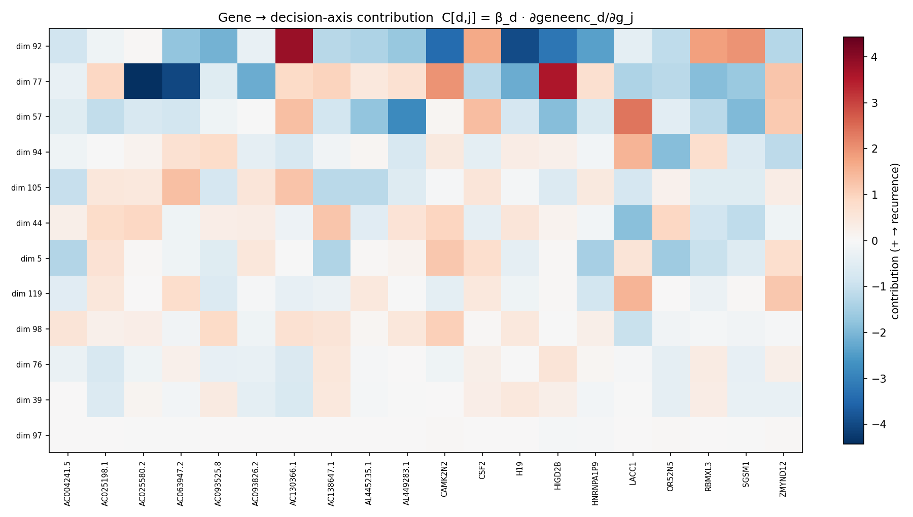
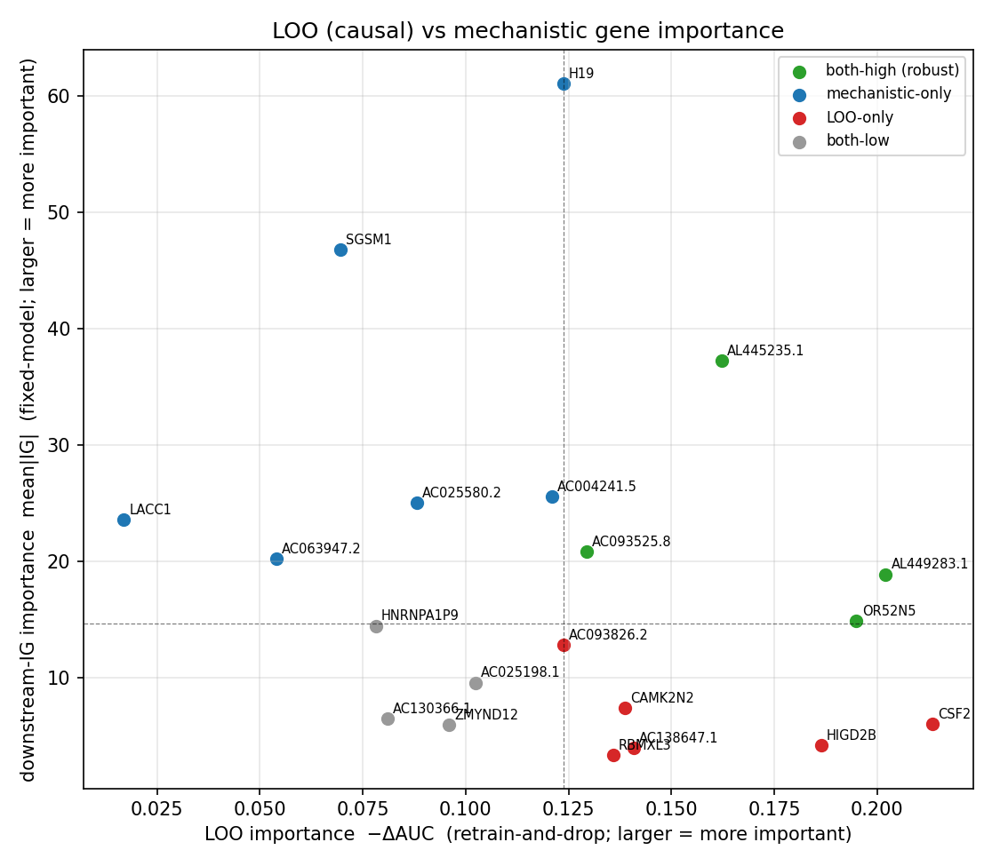

# Downstream-Classifier Gene Attribution — 2026-06-28

Attributes the RFS downstream classifier's decision back to the 20 genes of `2y_before_cv` for run `a0912600`, by decomposing it through the 128-dim shared embedding space. Complements the leave-one-out (LOO) ranking (`reports/0629/0629_gene_importance.md`) and the whole-vector cosine-IG ranking (`reports/0629/0629_gene_importance_ig.md`).

**Model provenance.** `a0912600` is a refit (`scripts/refit_gene_encoder.py`) of `9109a6c2`: the image encoder (and its cached embeddings) is reused **verbatim**, so the downstream LR is identical to `9109a6c2`'s (Soramic AUROC reproduced here = **0.732**), while only the GeneEncoder is re-aligned to that frozen image space under a pinned, sorted gene order.

**Method.** (1) The headline downstream pipeline (`SimpleImputer → StandardScaler → SelectKBest(f_classif, k=100) → LR`, L1) is fit on the 60 resection patients' image embeddings vs `rfs_2year`, then collapsed into a single decision direction `β ∈ R¹²⁸` with `logit(z) = β·z + b`. (2) The GeneEncoder Jacobian `J[d,j] = ∂geneenc(g)_d/∂g_j` (at the cohort-mean gene vector) gives each gene's effect on each shared dim; `C[d,j] = β_d·J[d,j]` is its contribution to the decision axis. (3) Integrated Gradients of `s(g) = β·geneenc(g)` w.r.t. the gene input (200 midpoint steps, baseline = `zero`) aggregated over 60 patients as `mean|IG|` (importance) and `mean IG` (signed; **+ = pushes toward recurrence ≤ 2yr**).

> **Caveat.** Genes never enter the predictor at inference — they shape the image encoder only through the contrastive alignment at training time. This is an *alignment-mediated proxy*, the per-dimension decomposition of the cosine target; it complements, not replaces, the LOO retrain-and-drop importance.

- Completeness check (max |Σ_j IG − (s(x)−s(baseline))|): **6.45e-01** = **9.29e-04** of the per-patient target range (s is unnormalized)
- β reconstruction check (max |β·z+b − decision_function|): **3.33e-14**
- Soramic AUROC of the unwound downstream LR: **0.732** (target 0.732)
- Spearman(downstream `mean|IG|`, LOO `−ΔAUC`): **rho = -0.335**, p = 0.148
- Spearman(downstream `mean|IG|`, cosine-IG `mean|IG|`): **rho = 0.788**, p = 0.000

## 1. Per-gene downstream importance (sorted by `mean|IG|`)

| Gene | mean\|IG\| | signed mean IG | rank | LOO ΔAUC | LOO rank | cos-IG rank |
|---|---:|---:|---:|---:|---:|---:|
| H19 | 61.0748 | -61.0748 | 1 | -0.124 | 11 | 1 |
| SGSM1 | 46.7718 | -45.2894 | 2 | -0.070 | 18 | 3 |
| AL445235.1 | 37.2142 | -34.0114 | 3 | -0.162 | 5 | 2 |
| AC004241.5 | 25.5503 | -24.6553 | 4 | -0.121 | 12 | 5 |
| AC025580.2 | 24.9944 | -24.6722 | 5 | -0.088 | 15 | 7 |
| LACC1 | 23.5402 | -23.5402 | 6 | -0.017 | 20 | 12 |
| AC093525.8 | 20.7948 | -20.7948 | 7 | -0.129 | 9 | 4 |
| AC063947.2 | 20.1723 | -20.1723 | 8 | -0.054 | 19 | 15 |
| AL449283.1 | 18.8602 | -18.8602 | 9 | -0.202 | 2 | 9 |
| OR52N5 | 14.8733 | -14.8733 | 10 | -0.195 | 3 | 11 |
| HNRNPA1P9 | 14.4368 | -14.4368 | 11 | -0.078 | 17 | 8 |
| AC093826.2 | 12.7844 | -10.9850 | 12 | -0.124 | 10 | 14 |
| AC025198.1 | 9.5504 | -9.2212 | 13 | -0.102 | 13 | 19 |
| CAMK2N2 | 7.3889 | +0.7700 | 14 | -0.139 | 7 | 6 |
| AC130366.1 | 6.4584 | -3.7555 | 15 | -0.081 | 16 | 10 |
| CSF2 | 5.9957 | -5.9957 | 16 | -0.213 | 1 | 16 |
| ZMYND12 | 5.9301 | -5.6676 | 17 | -0.096 | 14 | 20 |
| HIGD2B | 4.1718 | -3.8797 | 18 | -0.186 | 4 | 13 |
| AC138647.1 | 3.9546 | -1.3960 | 19 | -0.141 | 6 | 17 |
| RBMXL3 | 3.3479 | -2.3273 | 20 | -0.136 | 8 | 18 |

## 2. Top downstream dimensions by |β| (with bootstrap stability)

Bootstrap = 500 stratified patient resamples. `sel. freq` = fraction of resamples where SelectKBest+L1 keeps the dim. `top driver genes` = largest |C[d,j]|.

| dim | β | bootstrap mean±sd | sel. freq | top driver genes (signed C) |
|---|---:|---:|---:|---|
| 92 | +107.060 | +50.906±67.872 | 0.52 | H19 (-3.973), AC130366.1 (+3.837), CAMK2N2 (-3.416) |
| 77 | -92.625 | -88.663±110.922 | 0.56 | AC025580.2 (-4.428), AC063947.2 (-4.044), HIGD2B (+3.592) |
| 57 | -79.496 | -55.199±87.236 | 0.44 | AL449283.1 (-2.815), LACC1 (+2.356), SGSM1 (-1.943) |
| 94 | +67.983 | +72.373±103.577 | 0.55 | OR52N5 (-1.884), LACC1 (+1.514), ZMYND12 (-1.166) |
| 105 | +52.540 | +60.416±70.965 | 0.63 | AC063947.2 (+1.333), AC130366.1 (+1.250), AC138647.1 (-1.187) |
| 44 | -45.991 | -44.008±86.365 | 0.43 | LACC1 (-1.845), AC138647.1 (+1.219), SGSM1 (-1.135) |
| 5 | +44.714 | +33.957±77.258 | 0.28 | OR52N5 (-1.570), HNRNPA1P9 (-1.479), AC138647.1 (-1.315) |
| 119 | -26.878 | -4.824±13.130 | 0.19 | LACC1 (+1.518), ZMYND12 (+1.202), HNRNPA1P9 (-0.817) |
| 98 | +22.276 | +19.690±36.642 | 0.36 | CAMK2N2 (+1.050), LACC1 (-1.002), AC093525.8 (+0.842) |
| 76 | -19.716 | -31.211±65.601 | 0.38 | AC025198.1 (-0.722), AC130366.1 (-0.645), HIGD2B (+0.567) |
| 39 | +13.946 | +11.423±25.668 | 0.27 | AC130366.1 (-0.672), AC025198.1 (-0.615), H19 (+0.460) |
| 97 | +1.583 | +75.130±127.994 | 0.46 | HIGD2B (-0.076), OR52N5 (+0.054), CAMK2N2 (+0.046) |

## 3. LOO (causal) vs mechanistic importance

The two rankings answer different questions and largely disagree (Spearman rho = -0.335, p = 0.148; effectively unrelated). **LOO** (drop one gene, retrain the whole contrastive model, measure ΔAUC) is a *causal, end-to-end* importance that **lets correlated genes and the image encoder compensate** for the removed gene — and it measures the dominant channel by which genes act (shaping the image encoder at train time). **Mechanistic** importance (this report) holds the trained model and its image space **fixed** and asks how much each gene moves the decision axis — so it cannot see the image-encoder channel and credits genes the *current* model leans on, replaceable or not. Sampling noise (n=54, AUROC head-flips, unstable β) further weakens any correlation.

Splitting genes at the median of each axis (see figure):

- **both-high (robust)** — important by both, the most trustworthy: AC093525.8, AL445235.1, AL449283.1, OR52N5
- **mechanistic-only** — model leans on them but removal barely hurts ⇒ likely replaceable by correlated genes: AC004241.5, AC025580.2, AC063947.2, H19, LACC1, SGSM1
- **LOO-only** — irreplaceable for performance but the fixed gene branch doesn't lean on them: AC093826.2, AC138647.1, CAMK2N2, CSF2, HIGD2B, RBMXL3
- **both-low**: AC025198.1, AC130366.1, HNRNPA1P9, ZMYND12

**Notes**

- Stage-1 β says *which embedding dims the classifier uses*; stage-2 C and stage-3 IG say *which genes move the patient along those dims*. A gene ranks high here only if it drives dims the classifier weights — unlike cosine-IG, which weights all 128 dims equally.
- Signed IG > 0 ⇒ higher expression pushes the patient toward 2-year recurrence along the classifier's decision axis (orientation of `rfs_2year` positive class).
