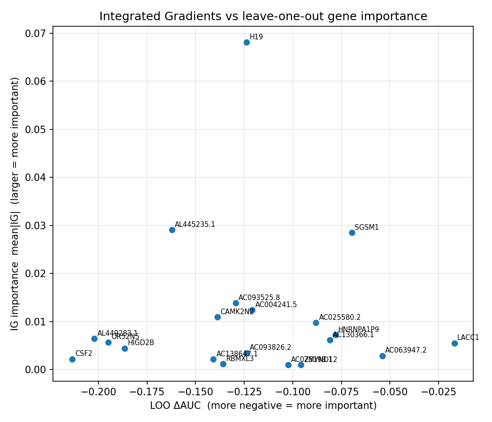

# Gene Importance via Integrated Gradients — 2026-06-27

Integrated-Gradients (IG) gene importance for run `a0912600` (gene set `2y_before_cv`, 20 genes), compared to the leave-one-out (LOO) ranking in `reports/0629/0629_gene_importance.md`.

**Model provenance.** The original run `9109a6c2` stored its genes in a non-deterministic column order (genes passed as a Python `set`), which was never persisted — so its trained GeneEncoder's gene→slot mapping is unrecoverable. `a0912600` is a refit (`scripts/refit_gene_encoder.py`): the image encoder of `9109a6c2` is reused **verbatim** (so downstream RFS performance is identical by construction — Soramic best-head AUROC = 0.732) while only the GeneEncoder is re-trained against that frozen image space using a pinned, sorted gene order. IG below is therefore computed on a gene branch re-aligned to `9109a6c2`'s image representation, not the original co-trained one.

**Method.** At inference the downstream RFS head consumes image embeddings only — genes never enter the predictor. Genes act on the model solely by shaping the image encoder through the contrastive alignment during training. IG is therefore computed on the cross-modal alignment target

    F_i(g) = cos( z_img_i , gene_enc(g) )

with patient *i*'s cached mean-pooled image embedding `z_img_i` held fixed; IG is integrated only through the GeneEncoder w.r.t. the gene input (200 midpoint steps, baseline = `zero`). Per-patient attributions over 60 resection patients are aggregated as `mean|IG|`. **IG measures alignment sensitivity — a proxy for, not a replacement of, the LOO retrain-and-drop importance.**

- Completeness check (max |sum_j IG − (F(x)−F(baseline))| over patients): **4.24e-03**
- Spearman( IG importance `mean|IG|`, LOO importance `−ΔAUC` ): **rho = -0.051**, p = 0.830 (positive ⇒ agreement)

## Per-gene importance (sorted by `mean|IG|`)

| Gene | mean\|IG\| | signed mean IG | IG rank | LOO ΔAUC | LOO rank |
|---|---:|---:|---:|---:|---:|
| H19 | 0.0681 | +0.0681 | 1 | -0.124 | 11 |
| AL445235.1 | 0.0291 | +0.0291 | 2 | -0.162 | 5 |
| SGSM1 | 0.0285 | +0.0248 | 3 | -0.070 | 18 |
| AC093525.8 | 0.0139 | +0.0127 | 4 | -0.129 | 9 |
| AC004241.5 | 0.0124 | +0.0124 | 5 | -0.121 | 12 |
| CAMK2N2 | 0.0110 | +0.0110 | 6 | -0.139 | 7 |
| AC025580.2 | 0.0098 | +0.0098 | 7 | -0.088 | 15 |
| HNRNPA1P9 | 0.0073 | +0.0073 | 8 | -0.078 | 17 |
| AL449283.1 | 0.0065 | +0.0065 | 9 | -0.202 | 2 |
| AC130366.1 | 0.0062 | +0.0062 | 10 | -0.081 | 16 |
| OR52N5 | 0.0057 | +0.0057 | 11 | -0.195 | 3 |
| LACC1 | 0.0055 | +0.0046 | 12 | -0.017 | 20 |
| HIGD2B | 0.0045 | +0.0045 | 13 | -0.186 | 4 |
| AC093826.2 | 0.0035 | +0.0024 | 14 | -0.124 | 10 |
| AC063947.2 | 0.0029 | +0.0029 | 15 | -0.054 | 19 |
| CSF2 | 0.0022 | +0.0022 | 16 | -0.213 | 1 |
| AC138647.1 | 0.0022 | +0.0020 | 17 | -0.141 | 6 |
| RBMXL3 | 0.0012 | -0.0007 | 18 | -0.136 | 8 |
| AC025198.1 | 0.0010 | +0.0010 | 19 | -0.102 | 13 |
| ZMYND12 | 0.0010 | +0.0006 | 20 | -0.096 | 14 |

**Notes**

- IG ranks genes by how much the *current* model's image–gene alignment depends on each gene; LOO ranks by how much downstream AUC drops when the gene is removed and the model retrained. They answer different questions, so disagreement is expected and informative (e.g. a high-IG gene with small LOO effect is likely replaceable by a correlated gene).
