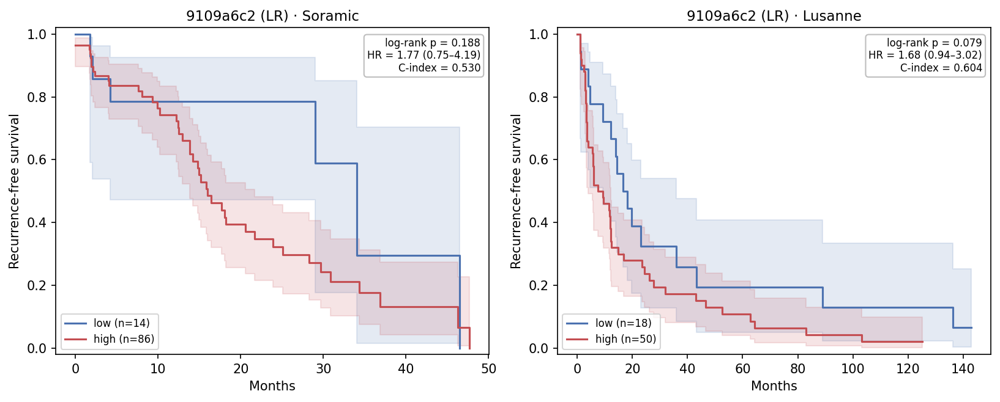
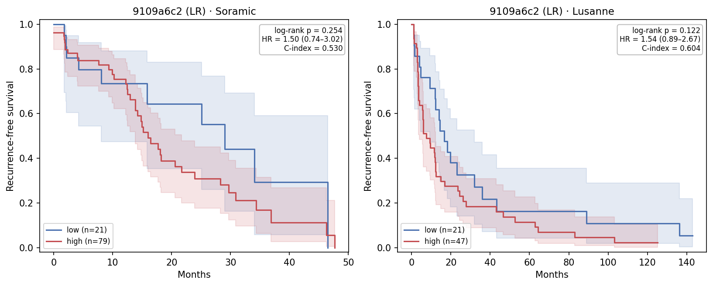
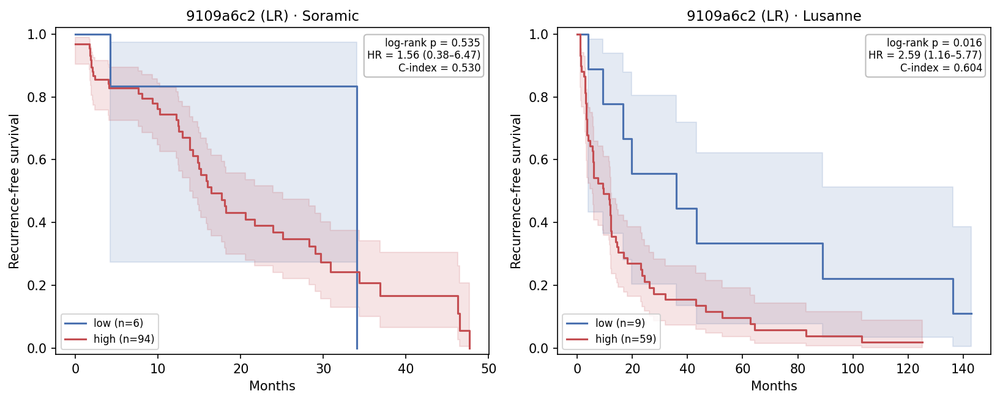

# Embedding-Based RFS Survival Stratification v2 — 2026-06-29

## Table of Contents
- [1. Tasks](#1-tasks)
- [2. Key Findings](#2-key-findings)
- [3. Cohorts](#3-cohorts)
- [4. Method](#4-method)
- [5. Results](#5-results)

---

## 1. Tasks

The previous report (`reports/0622/0622_survival_analysis.md`) screened the top-5
AUROC models per cohort. This v2 instead fixes a **single model — `9109a6c2`**, the
model with the **highest Soramic AUROC (0.732)** in
`reports/0608/0608_ablation_eval_v2.md` (raw MRI, λ=0.1, `2y_before_cv`, n=10,
patient-level split), and studies how its **risk scores** and **cutoff strategies**
behave on **both** the Soramic and Lausanne ablation cohorts.

A key methodological change: the **kmeans** cutoffs now **fit the 2-cluster boundary
on the resection cohort and predict cluster membership on the ablation cohort**,
rather than clustering the ablation scores within-cohort (see §4.1).

---

## 2. Key Findings

- **The best-Soramic-AUROC model does not stratify Soramic survival.** `9109a6c2`
  has the highest Soramic AUROC (0.732) but a near-chance C-index (0.530), and **no
  risk-score × cutoff combination reaches log-rank significance on Soramic** (best
  p = 0.19). Discrimination of the 2-year label does not translate into time-to-event
  separation here.
- **The same model stratifies Lausanne better despite a lower AUROC.** On Lausanne the
  2-Year RFS classifier has a higher C-index (0.604) and the **`kmeans on log` cutoff
  reaches significance** (HR 2.59, 95% CI 1.16–5.77, log-rank p = 0.016).
- **Resection-fit kmeans transfers sensibly.** With the boundary frozen from
  resection, the 2-Year RFS classifier gives correct-direction, balanced splits on
  both cohorts. The **Cox risk score** remains weak (low/wrong-direction C-index,
  imbalanced splits — e.g. Lausanne kmeans collapses to 2/66).

---

## 3. Cohorts

Survival endpoint = `RFS_central`, event = `RFS_central_event`.

| | Resection (train) | Soramic (test) | Lausanne (test) |
|---|---|---|---|
| Patients with embedding + time-to-event | 60 | 100 | 68 |
| Patients with 2-year RFS label (Route A training) | 54 | 57 | 66 |
| RFS events (recurrence/death) | 41 | 50 | 64 |
| Median follow-up (months) | 21.8 | 9.3 | 11.8 |
| Median RFS event time (months) | 24.4 | 17.7 | 11.7 |

---

## 4. Method

### 4.1 Risk score & high/low risk cutoff strategies

**Risk scores:**

| Risk score | Description |
|---|---|
| **2-Year RFS classifier** | Reuse the 2-year RFS classifier (`SelectKBest(f_classif, k=100)` + LR head, exact 0608 pipeline). Score = `predict_proba(RFS ≤ 2yr)`. |
| **Cox Model** | `StandardScaler → PCA(10) → penalized Cox PH` (`penalizer=0.1`, ridge). Score = partial hazard. |

The resection score used to define cutoffs is the **out-of-fold** (3-fold CV) score.
The model is then refit on all resection patients to score the ablation cohorts.

**Cutoff strategies** (all leakage-free w.r.t. the ablation outcome):

| Strategy | Cutoff source |
|---|---|
| **median** | Resection OOF median score (frozen) |
| **kmeans** | KMeans(k=2) **fit on resection OOF scores**; the boundary is frozen and the ablation cohort is assigned to the nearer 1-D centroid |
| **kmeans on log** | Same as kmeans but in log space (tames the heavy-tailed Cox partial hazard) |
| **youden** | Youden-J threshold on resection vs `rfs_2year` (frozen) |

High = `score ≥ threshold`.

> **Change vs 0622.** Previously the kmeans cutoffs clustered the *ablation* scores
> within-cohort. Here `kmeans` / `kmeans on log` **fit on the resection cohort and
> predict on the ablation cohort**, so the data-driven boundary is learned without
> seeing the held-out distribution. Implemented as `kmeans_frozen` /
> `kmeans_log_frozen` in `hcc_multimodal/survival/cutoffs.py`.

### 4.2 Statistics

For each combination: **n (hi/lo)**, **HR (95% CI)**, **log-rank p**, **C-index**,
**AUROC**, **Median RFS hi/lo**. C-index and AUROC are cutoff-free (per risk score).
Statistics are computed only when both groups have ≥5 patients (balanced); otherwise
only n (hi/lo) is reported.

---

## 5. Results

### 5.1 `9109a6c2` — risk score × cutoff strategy on each cohort

AUROC and C-index are reported once per risk score (cutoff-free). `—` = imbalanced
split (< 5 in one arm), no survival stats computed.

#### 5.1.1 Soramic

| Risk score | AUROC | C-index | Cutoff | n (hi/lo) | HR (95% CI) | log-rank p | Median RFS hi/lo (mo) |
|---|---:|---:|---|---|---|---:|---|
| 2-Year RFS | 0.732 | 0.530 | median | 86/14 | 1.77 (0.75–4.19) | 0.188 | 16.0 / 34.0 |
| | | | kmeans | 79/21 | 1.50 (0.74–3.02) | 0.254 | 16.0 / 29.0 |
| | | | kmeans on log | 94/6 | 1.56 (0.38–6.47) | 0.535 | 16.4 / 34.0 |
| | | | youden | 74/26 | 1.42 (0.74–2.72) | 0.296 | 16.0 / 29.0 |
| Cox Model | 0.711 | 0.559 | median | 22/78 | 1.36 (0.69–2.68) | 0.368 | 15.2 / 18.1 |
| | | | kmeans | 13/87 | 1.39 (0.49–3.95) | 0.531 | 14.8 / 18.1 |
| | | | kmeans on log | 22/78 | 1.36 (0.69–2.68) | 0.368 | 15.2 / 18.1 |
| | | | youden | 23/77 | 1.33 (0.67–2.62) | 0.407 | 15.2 / 18.1 |

No combination reaches significance. The 2-Year RFS classifier discriminates the
2-year label (AUROC 0.732) but its rank-ordering of time-to-event is near chance
(C-index 0.530); the resection-frozen cutoffs push 74–94% of patients into the
"high" arm, reflecting that this is a higher-risk population than resection.

#### 5.1.2 Lausanne

| Risk score | AUROC | C-index | Cutoff | n (hi/lo) | HR (95% CI) | log-rank p | Median RFS hi/lo (mo) |
|---|---:|---:|---|---|---|---:|---|
| 2-Year RFS | 0.563 | 0.604 | median | 50/18 | 1.68 (0.94–3.02) | 0.079 | 7.5 / 18.2 |
| | | | kmeans | 47/21 | 1.54 (0.89–2.67) | 0.122 | 7.5 / 16.7 |
| | | | **kmeans on log** | 59/9 | **2.59 (1.16–5.77)** | **0.016** | 9.6 / 36.0 |
| | | | youden | 43/25 | 1.53 (0.90–2.59) | 0.111 | 6.0 / 14.4 |
| Cox Model | 0.475 | 0.541 | median | 8/60 | 1.50 (0.71–3.18) | 0.288 | 3.9 / 12.1 |
| | | | kmeans | 2/66 | — | — | — |
| | | | kmeans on log | 8/60 | 1.50 (0.71–3.18) | 0.288 | 3.9 / 12.1 |
| | | | youden | 11/57 | 1.73 (0.89–3.35) | 0.101 | 3.9 / 12.2 |

Despite a lower AUROC (0.563), the 2-Year RFS classifier has a higher C-index (0.604)
on Lausanne, and the **`kmeans on log`** cutoff yields a significant, correct-direction
split (HR 2.59, p = 0.016). The other cutoffs trend the same way (p = 0.08–0.12). The
Cox risk score is below chance (AUROC 0.475) and its raw `kmeans` split collapses
(2/66).

#### 5.1.3 Conclusion

- The model selected for **best Soramic AUROC** does **not** produce significant
  survival separation on Soramic — AUROC (2-year label) and C-index (time-to-event)
  diverge sharply (0.732 vs 0.530).
- The strongest stratification for this model is on **Lausanne** with the **2-Year RFS
  classifier + `kmeans on log`** (resection-fit) cutoff.
- The **Cox** risk score is uniformly weak across cohorts and cutoffs.

---

### 5.2 KM curves and statistics

All panels use the 2-Year RFS classifier risk score; the three subsections differ
only in the resection-frozen cutoff applied to the ablation cohort.

#### 5.2.1 2-Year RFS classifier + median

| Cohort | n (hi/lo) | HR (95% CI) | log-rank p | C-index | AUROC | Median RFS hi/lo (mo) | 12-mo RFS hi/lo | 24-mo RFS hi/lo |
|---|---|---|---:|---:|---:|---|---|---|
| Soramic | 86/14 | 1.77 (0.75–4.19) | 0.188 | 0.530 | 0.732 | 16.0 / 34.0 | 74.4% / 78.6% | 32.3% / 78.6% |
| Lausanne | 50/18 | 1.68 (0.94–3.02) | 0.079 | 0.604 | 0.563 | 7.5 / 18.2 | 40.0% / 72.2% | 25.8% / 32.4% |

*Figure 1. Kaplan-Meier curves (with 95% CI) for `9109a6c2`, 2-Year RFS classifier
risk score with the resection-frozen median split. Lausanne trends toward separation
(p = 0.079) but neither cohort reaches significance. Editable SVG: `km_median.svg`.*

#### 5.2.2 2-Year RFS classifier + kmeans (resection-fit)

Direct parallel to 0622 §5.2, but with the kmeans boundary frozen from resection.

| Cohort | n (hi/lo) | HR (95% CI) | log-rank p | C-index | AUROC | Median RFS hi/lo (mo) | 12-mo RFS hi/lo | 24-mo RFS hi/lo |
|---|---|---|---:|---:|---:|---|---|---|
| Soramic | 79/21 | 1.50 (0.74–3.02) | 0.254 | 0.530 | 0.732 | 16.0 / 29.0 | 75.5% / 73.6% | 30.9% / 64.4% |
| Lausanne | 47/21 | 1.54 (0.89–2.67) | 0.122 | 0.604 | 0.563 | 7.5 / 16.7 | 40.4% / 66.7% | 25.4% / 32.7% |

*Figure 2. Kaplan-Meier curves (with 95% CI), 2-Year RFS classifier with the
resection-fit kmeans split. Neither cohort reaches significance under this cutoff.
Editable SVG: `km_5_2.svg`.*

#### 5.2.3 2-Year RFS classifier + kmeans on log (resection-fit)

| Cohort | n (hi/lo) | HR (95% CI) | log-rank p | C-index | AUROC | Median RFS hi/lo (mo) | 12-mo RFS hi/lo | 24-mo RFS hi/lo |
|---|---|---|---:|---:|---:|---|---|---|
| Soramic | 94/6 | 1.56 (0.38–6.47) | 0.535 | 0.530 | 0.732 | 16.4 / 34.0 | 74.5% / 83.3% | 36.9% / 83.3% |
| Lausanne | 59/9 | **2.59 (1.16–5.77)** | **0.016** | 0.604 | 0.563 | 9.6 / 36.0 | 44.1% / 77.8% | 23.2% / 55.6% |

*Figure 3. Kaplan-Meier curves (with 95% CI), 2-Year RFS classifier with the
resection-fit kmeans-on-log split. Only Lausanne reaches significance (log-rank
p = 0.016). Editable SVG: `km_kmeans_log.svg`.*

---

## File references

| Artifact | Path |
|---|---|
| Stratification results CSV | `results/eval/survival/stratify_9109a6c2_v2.csv` |
| KM figure — §5.2.1 (median) | `reports/0629/km_median.{png,svg}` |
| KM figure — §5.2.2 (kmeans) | `reports/0629/km_5_2.{png,svg}` |
| KM figure — §5.2.3 (kmeans on log) | `reports/0629/km_kmeans_log.{png,svg}` |
| Stratification script | `scripts/survival_stratify.py` |
| KM figure script | `scripts/survival_km.py` |
| Cutoff strategies (incl. `kmeans_frozen`, `kmeans_log_frozen`) | `hcc_multimodal/survival/cutoffs.py` |
| Pipeline code | `hcc_multimodal/survival/` |
