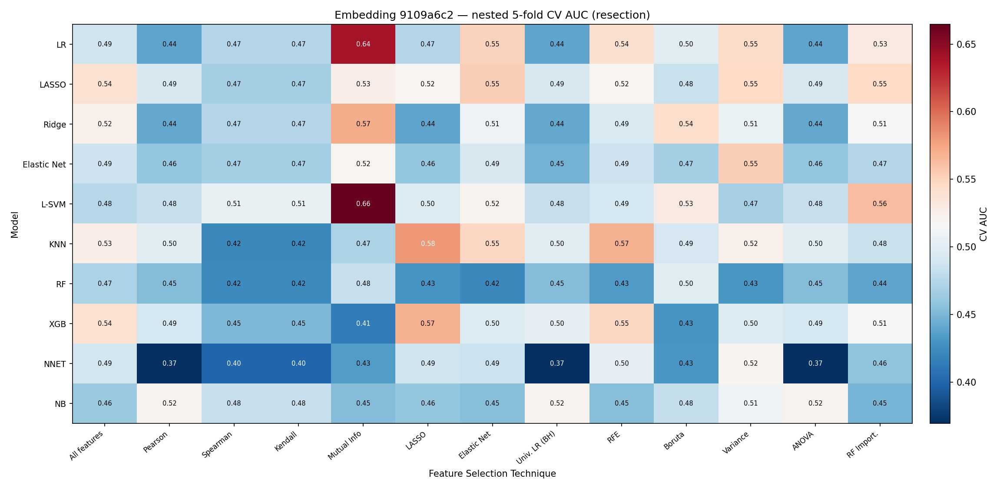
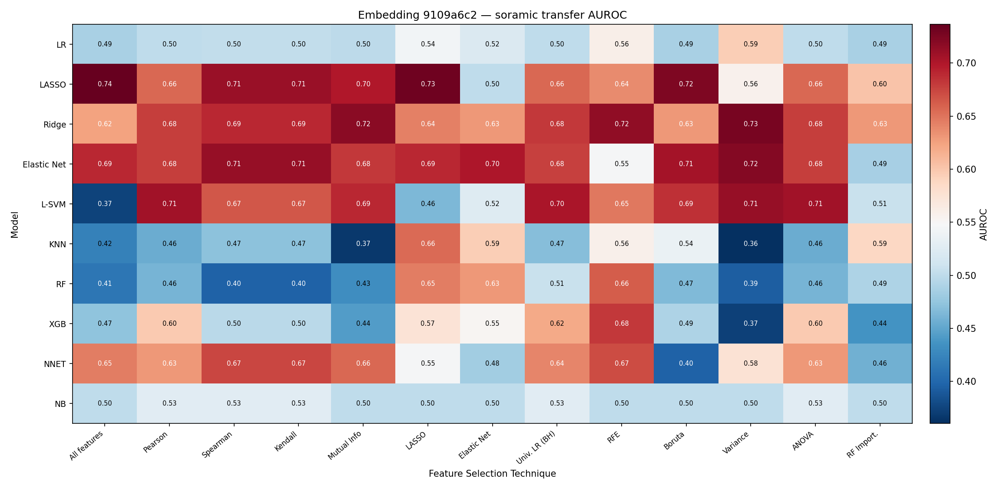
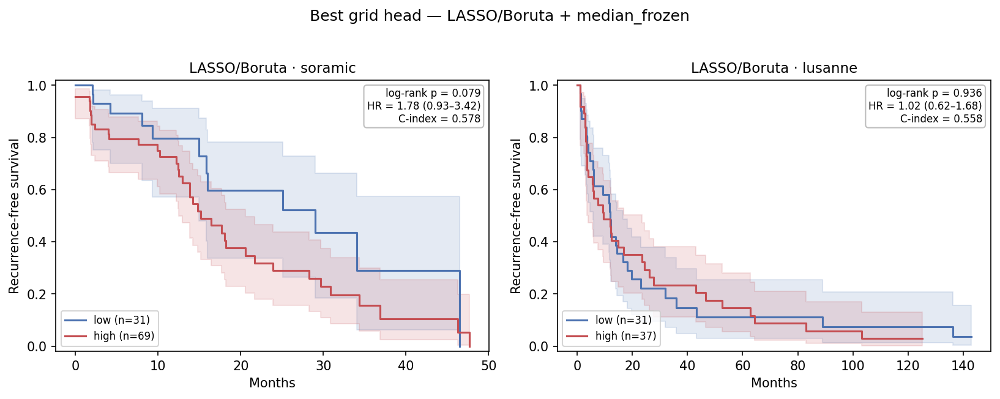

# Feature-Selection × Classifier Grid on the `9109a6c2` Embedding — 2026-07-06

## Table of Contents
- [1. Task](#1-task)
- [2. Key Findings](#2-key-findings)
- [3. Setup](#3-setup)
- [4. Method](#4-method)
- [5. Results — Resection nested-CV AUC](#5-results--resection-nested-cv-auc)
- [6. Results — Transfer to Soramic & Lausanne](#6-results--transfer-to-soramic--lausanne)
- [7. Survival stratification (Soramic → Lausanne)](#7-survival-stratification-soramic--lausanne)
- [8. Observations](#8-observations)
- [9. File references](#9-file-references)

## 1. Task

`9109a6c2` (raw MRI, λ=0.1, `2y_before_cv` genes) is the highest-Soramic-AUROC embedding
from `0608_ablation_eval_v2.md` (0.732). This report replaces its ad-hoc L1-LR/RF head with
a full **10 classifier × 13 feature-selection** grid, tuned by nested stratified CV on
resection, then refit and transferred to **Soramic** and **Lausanne**. Best combos also get
the 0629 survival stratification (select on Soramic, apply to Lausanne).

## 2. Key Findings

| # | Finding |
|---|---|
| 1 | **Best Soramic transfer = LASSO/All (AUROC 0.736)** — L1-LR on all 128 dims, matching the 0608 headline. No head beats the baseline meaningfully; Ridge/EN/L-SVM + Variance cluster at 0.71–0.73. |
| 2 | **Soramic and Lausanne favour opposite families.** Linear+variance/L1 wins Soramic and is near-chance on Lausanne; tree/nonlinear wins Lausanne and is near-chance on Soramic. **No single cell is good on both.** |
| 3 | **Resection CV does not predict transfer.** Outer-fold CV AUC tops out at 0.665 and the best transfer head (LASSO/All) scores only 0.54 — the 54-patient cohort can't rank heads. |
| 4 | **Feature selection helps survival, not AUROC.** LASSO/Boruta gives the best Soramic split (C-index 0.578, HR 1.78 [0.93–3.42], log-rank **p=0.079**, balanced 69/31) vs the degenerate 99/1 splits the all-features heads produce under frozen cutoffs. Still not <0.05. |
| 5 | **Soramic-selected head does not transfer to Lausanne** (AUROC 0.487, all log-rank p>0.4, HR≈1.0) — mirror of 0629. |

## 3. Setup

| | Resection (train) | Soramic (test) | Lausanne (test) |
|---|---|---|---|
| Embedding + `rfs_2year` | 54 (26 pos, 48%) | 57 (39 pos, 68%) | 66 (49 pos, 74%) |
| Embedding + time-to-event | 60 | 100 | 68 |

Embedding `9109a6c2`, 128-dim patient-level mean-pooled. Cohorts aligned on integer `SID`
(`load_source_aligned`).

## 4. Method

- **Grid axes** — 10 classifiers (`MODEL_ZOO`): linear family LR/LASSO/Ridge/Elastic Net
  spanning regularization, plus L-SVM, KNN, RF, XGB, NNET, NB. 13 FS settings (`FS_ZOO`):
  `All features` + 12 selectors keeping **k=30** (k chosen because 128-dim; larger k collapses
  onto All features).
- **Pipeline** — `SimpleImputer(median) → StandardScaler → selector → classifier`.
- **CV** — nested on resection: outer `StratifiedKFold(5)` for the AUC estimate, inner
  `StratifiedKFold(3)` `GridSearchCV(roc_auc)` for hyperparameters. Boruta/RFE memoized per fold.
- **Transfer** — refit on all resection, predict each cohort (`compute_metrics`, threshold 0.5;
  AUROC threshold-free). Ridge scored via `expit(decision_function)`.

## 5. Results — Resection nested-CV AUC

Top cells: L-SVM/Mutual-Info 0.665, LR/Mutual-Info 0.639, KNN/LASSO 0.581. `All features`
column 0.46–0.54. Values sit near chance with large fold-to-fold std (n=54) and do **not**
rank the good transfer heads. Full matrix: `results/eval/grid/grid_cv_auc_matrix.csv`.

## 6. Results — Transfer to Soramic & Lausanne

### 6.1 Top-15 by Soramic transfer AUROC

| Model | FS | Soramic | Lausanne | AUPRC | Sens | Spec |
|---|---|---:|---:|---:|---:|---:|
| LASSO | All features | **0.736** | 0.582 | 0.866 | 0.923 | 0.333 |
| LASSO | LASSO | 0.731 | 0.601 | 0.867 | 0.974 | 0.056 |
| Ridge | Variance | 0.726 | 0.651 | 0.848 | 1.000 | 0.000 |
| LASSO | Boruta | 0.724 | 0.487 | 0.854 | 0.718 | 0.500 |
| Elastic Net | Variance | 0.721 | 0.646 | 0.849 | 1.000 | 0.000 |
| Ridge | Mutual Info | 0.718 | 0.529 | 0.836 | 1.000 | 0.111 |
| Ridge | RFE | 0.715 | 0.557 | 0.842 | 0.974 | 0.167 |
| Elastic Net | Kendall / Spearman | 0.712 | 0.528 | 0.866 | 0.872 | 0.222 |
| L-SVM | Variance | 0.712 | 0.663 | 0.838 | 0.949 | 0.111 |
| LASSO | Spearman / Kendall | 0.711 | 0.532 | 0.869 | 0.872 | 0.111 |

### 6.2 Top-10 by Lausanne transfer AUROC

| Model | FS | Lausanne | Soramic |
|---|---|---:|---:|
| L-SVM | LASSO | **0.733** | 0.464 |
| Elastic Net | RF Import. | 0.731 | 0.486 |
| NNET | Elastic Net | 0.730 | 0.484 |
| XGB | All features | 0.727 | 0.473 |
| RF | ANOVA / Pearson | 0.724 | 0.462 |
| RF | Univ. LR (BH) | 0.716 | 0.506 |
| LASSO | RF Import. | 0.706 | 0.603 |

The two rankings are essentially disjoint. The only head respectable on both is **LASSO/RF-Import.**
(Soramic 0.603, Lausanne 0.706).

## 7. Survival stratification (Soramic → Lausanne)

Top-5 Soramic-AUROC heads scored with `route_grid_scores` under four resection-frozen cutoffs.
AUROC/C-index are cutoff-free; `—` = imbalanced (<5 in one arm).

### 7.1 Soramic — top-5 heads × cutoff

| Head | Cutoff | AUROC | C-idx | n hi/lo | HR (95% CI) | log-rank p | Median RFS hi/lo |
|---|---|---:|---:|---|---|---:|---|
| LASSO / All | median | 0.736 | 0.529 | 87/13 | 2.17 (0.85–5.51) | 0.096 | 16.0 / 34.0 |
| | kmeans / youden | | | 86/14, 82/18 | 1.77–1.81 | 0.12–0.19 | |
| LASSO / LASSO | median / kmeans | 0.731 | 0.525 | 94/6, 93/7 | 1.7–2.0 | 0.45–0.50 | |
| Ridge / Variance | (all) | 0.726 | 0.541 | 98–99/1–2 | — | — | — |
| **LASSO / Boruta** | **median** | **0.724** | **0.578** | **69/31** | **1.78 (0.93–3.42)** | **0.079** | **15.2 / 29.0** |
| | kmeans / kmeans-log / youden | | | balanced | 1.63–1.75 | 0.10–0.11 | |
| Elastic Net / Variance | (all) | 0.721 | 0.542 | 98–99/1 | — | — | — |

**LASSO/Boruta + median** is the strongest balanced split (lowest log-rank p, highest C-index).
The higher-AUROC linear+variance heads collapse to 98–99/1 under frozen cutoffs because Soramic
scores sit almost entirely above the resection boundary; Boruta's compact subset spreads scores
enough for a usable split.

### 7.2 Best head applied to Lausanne

| Cohort | Cutoff | AUROC | C-idx | n hi/lo | HR (95% CI) | log-rank p | Median RFS hi/lo |
|---|---|---:|---:|---|---|---:|---|
| Soramic | median | 0.724 | 0.578 | 69/31 | 1.78 (0.93–3.42) | 0.079 | 15.2 / 29.0 |
| Lausanne | median | 0.487 | 0.558 | 37/31 | 1.02 (0.62–1.68) | 0.936 | 9.6 / 11.9 |
| Lausanne | kmeans / youden | | | 36/32, 32/36 | 1.23 | 0.42 | |

*LASSO/Boruta + median_frozen. Soramic separates (p=0.079); Lausanne overlaps (p=0.936). SVG: `km_grid_best.svg`.*

The Soramic-selected head does not transfer to Lausanne — mirror image of 0629.

## 8. Observations

1. **No head beats the L1-LR baseline** (0.736 vs 0.732) — the ceiling is the representation, not the classifier.
2. **Cohort-specific families** — a head tuned for one external cohort is near-chance on the other; don't read one external AUROC as "the" downstream performance.
3. **Resection CV is not a selector** — near-chance and uncorrelated with transfer; external cohorts must drive selection.
4. **FS matters more for survival** — Boruta barely changes AUROC (0.724 vs 0.736) but is decisive for a balanced, near-significant split.
5. **Discrimination ≠ stratification** — highest-AUROC head has near-chance C-index (0.529); AUROC and time-to-event rank-ordering stay decoupled.

## 9. File references

| Artifact | Path |
|---|---|
| Model/FS zoo + pipeline | `hcc_multimodal/eval/grid.py` |
| Grid runner | `hcc_multimodal/eval/embedding_grid_eval.py` |
| Survival grid risk score / stratify | `hcc_multimodal/survival/grid_scores.py`, `hcc_multimodal/survival/survival_stratify_grid.py` |
| CV AUC / transfer tables | `results/eval/grid/grid_cv_auc{,_matrix}.csv`, `grid_transfer_{soramic,lusanne}.csv` |
| Survival tables | `results/eval/survival/grid_stratify_{soramic,lusanne}.csv` |
| Heatmaps / KM | `reports/0706/heatmap_{cv_auc,soramic_auroc,lusanne_auroc}.{png,svg}`, `km_grid_best.{png,svg}` |
