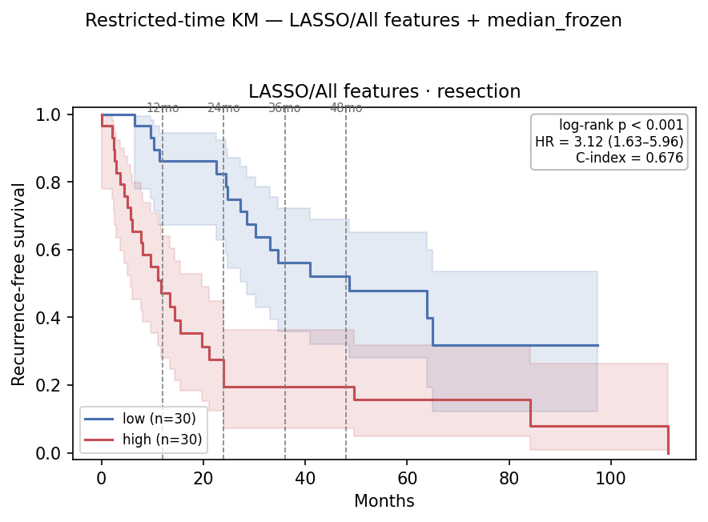

# Restricted-Time (Horizon-τ) RFS Survival Analysis on the `9109a6c2` Embedding — 2026-07-06

Companion to [`0706_embedding_grid_eval.md`](0706_embedding_grid_eval.md) §7. This report fixes a
single head — **LASSO / All features** (top Soramic transfer AUROC, 0.736) with the **in-sample
resection-frozen median** cutoff — and re-reads the split at horizons τ ∈ {12, 24, 36, 48} mo, with
two readouts on the RFS endpoint:

- **A — administrative censoring:** events after τ censored, times clipped to τ; recompute KM
  median / log-rank / Cox HR / Harrell C. Reads as "separation *within* τ months".
- **B — RMST:** area under each arm's KM curve on [0, τ] = event-free months accrued by τ. Reports
  per-arm RMST, ΔRMST (hi−lo, 95% CI), and the point-in-time survival-difference p at τ.

Both share `administrative_censor(time, event, τ)` so they describe the identical truncated data.
The `τ=full` row reproduces the full-follow-up analysis. RFS endpoint only; LASSO/All head only.

> **Cutoff note.** The frozen threshold is the **median of the in-sample refit resection scores**
> (`--freeze-on insample`) — the median of the actual LASSO/All score vector on resection (0.5155),
> applied to every cohort. This is a change from earlier drafts, which froze on the out-of-fold
> resection median (0.3377). The higher threshold reclassifies a handful of external-cohort
> patients and **weakens the transfer significance** (see §5–§6); it splits resection itself at its
> own median (30/30).

## Table of Contents
- [2. Key Findings](#2-key-findings)
- [3. Setup](#3-setup)
- [4. Resection — in-sample ceiling](#4-resection--in-sample-refit-30-hi--30-lo)
- [5. Soramic — transfer](#5-soramic--transfer-85-hi--15-lo)
- [6. Lausanne — transfer](#6-lausanne--transfer-50-hi--18-lo)
- [7. Observations](#7-observations)
- [8. File references](#8-file-references)

## 2. Key Findings

| # | Finding |
|---|---|
| 1 | **Resection is the in-sample ceiling.** Refit on its own labels and split at its own median (30/30), LASSO/All separates resection strongly at every horizon — C-index 0.71–0.75, all log-rank p≤0.001, τ=24 peak (C 0.753). Optimistically biased (the model saw these outcomes); it bounds apparent performance, not validation. |
| 2 | **Soramic transfer is a marginal 2-year point signal.** Under the in-sample cutoff (85/15) the τ=24 log-rank is borderline (**p=0.050**) and full follow-up is null (**p=0.205**), but the point-in-time test at τ=24 is the strongest readout (**point-p=0.006**). The 2-year separation survives; the log-rank does not clear 0.05. |
| 3 | **Lausanne transfer separates early, then fades** (50/18): τ=12 log-rank **p=0.034** (point-p 0.034), but τ=24–48 are null (0.11–0.21) and full follow-up is **p=0.079**. Borderline, not significant under this cutoff. |
| 4 | **The in-sample cutoff weakens both transfers vs the OOF cutoff.** Soramic τ=24 0.039→0.050; Lausanne full 0.038→0.079. Raising the threshold to the in-sample median dilutes the separation on the external cohorts. |
| 5 | **ΔRMST directional-only.** Negative and growing on resection (−3→−19 mo) but CIs cross 0 on Soramic/Lausanne at n≈100 — effect-size evidence, not a test. |

## 3. Setup

Head **LASSO / All features** (C=1.0), cutoff = **in-sample resection-frozen median** (`median_frozen`
with `--freeze-on insample`). Scores via `route_grid_scores`.

| | Resection | Soramic | Lausanne |
|---|---|---|---|
| Patients (embedding + RFS) | 60 | 100 | 68 |
| RFS events, full follow-up | 41 | 50 | 64 |
| Split (LASSO/All, in-sample median) | 30 hi / 30 lo* | 85 hi / 15 lo | 50 hi / 18 lo |
| Max follow-up (mo) | ≈111 | ≈48 | ≈143 |

Soramic follow-up tops out near 48 mo, so its **τ=48 ≈ full**. Lausanne (≈143 mo) and resection
(≈111 mo) both have long tails, so their horizons stay distinct.

\* **Resection is the training cohort.** Its scores are the refit LASSO/All predictions applied
in-sample to all 60 patients; the frozen threshold is the median of *those* scores, so resection
splits exactly 30/30 at its own median. The external cohorts (Soramic 85/15, Lausanne 50/18) meet
that same fixed threshold at a different quantile. Because the model has seen resection's outcomes,
resection is an **optimistically biased training-fit ceiling**, not independent validation.

## 4. Resection — in-sample refit, 30 hi / 30 lo

In-sample refit scores, split at the resection median (optimistically biased ceiling, not validation).

| τ (mo) | ev hi/lo | HR (95% CI) | log-rank p | C-idx | ‖ | RMST hi/lo | ΔRMST (95% CI) | point-p |
|---:|---:|---|---:|---:|:--:|---:|---:|---:|
| 12 | 15 / 4 | 5.47 (1.81–16.55) | 0.001 | 0.732 | ‖ | 8.7 / 11.6 | −3.0 (−11.1, +5.2) | 0.004 |
| 24 | 21 / 5 | 7.33 (2.74–19.60) | <0.001 | 0.753 | ‖ | 12.9 / 21.9 | −9.0 (−28.4, +10.4) | <0.001 |
| 36 | 22 / 12 | 3.85 (1.87–7.90) | <0.001 | 0.716 | ‖ | 15.3 / 30.0 | −14.7 (−44.6, +15.1) | 0.006 |
| 48 | 22 / 13 | 3.57 (1.77–7.20) | <0.001 | 0.709 | ‖ | 17.6 / 36.5 | −18.8 (−61.1, +23.4) | 0.014 |
| full | 25 / 16 | 3.12 (1.63–5.96) | <0.001 | 0.710 | ‖ | — | — | — |

Strong separation at every horizon — as expected when the head is refit on these labels. C-index
peaks at **τ=24 (0.753)**; ΔRMST grows monotonically to −19 mo. Compare to the ≈0.53 Soramic /
0.61 Lausanne transfer C-index (§5–§6) to read the generalization gap: most of this apparent
signal does not survive transfer.

*LASSO/All, RFS, resection (in-sample refit). Arms separate sharply. SVG alongside.*

## 5. Soramic — transfer, 85 hi / 15 lo

| τ (mo) | ev hi/lo | HR (95% CI) | log-rank p | C-idx | ‖ | RMST hi/lo | ΔRMST (95% CI) | point-p |
|---:|---:|---|---:|---:|:--:|---:|---:|---:|
| 12 | 17 / 3 | 1.23 (0.36–4.19) | 0.746 | 0.480 | ‖ | 10.0 / 10.1 | −0.1 (−10.5, +10.4) | 0.632 |
| **24** | **36 / 3** | 3.06 (0.94–9.97) | **0.050** | 0.533 | ‖ | 15.6 / 19.7 | −4.2 (−26.9, +18.6) | **0.006** |
| 36 | 40 / 6 | 1.76 (0.75–4.17) | 0.191 | 0.529 | ‖ | 18.6 / 26.2 | −7.6 (−40.9, +25.7) | 0.738 |
| 48 ≈ full | 43 / 7 | 1.68 (0.75–3.76) | 0.205 | 0.529 | ‖ | 20.2 / 28.8 | −8.7 (−49.3, +31.9) | — |

The 15-patient low arm has only 3 events through 2 years, so the τ=24 HR (3.06) is inflated — read
the log-rank (0.050, borderline) and the **point-p (0.006, the strongest 2-year readout)**. Full
follow-up is null (0.205). Same 2-year localization as earlier drafts, one significance tier down
under the in-sample cutoff (τ=24 log-rank 0.039→0.050).

*LASSO/All, RFS, Soramic. Low arm holds until ~28 mo (τ=24 point-p 0.006). SVG alongside.*

## 6. Lausanne — transfer, 50 hi / 18 lo

| τ (mo) | ev hi/lo | HR (95% CI) | log-rank p | C-idx | ‖ | RMST hi/lo | ΔRMST (95% CI) | point-p |
|---:|---:|---|---:|---:|:--:|---:|---:|---:|
| **12** | **30 / 5** | 2.68 (1.04–6.93) | **0.034** | 0.631 | ‖ | 7.7 / 9.8 | −2.1 (−13.5, +9.2) | **0.034** |
| 24 | 37 / 12 | 1.52 (0.79–2.93) | 0.205 | 0.610 | ‖ | 11.2 / 15.7 | −4.5 (−28.1, +19.1) | 0.607 |
| 36 | 41 / 12 | 1.69 (0.88–3.22) | 0.110 | 0.612 | ‖ | 13.6 / 19.6 | −6.0 (−41.2, +29.2) | 0.212 |
| 48 | 43 / 14 | 1.52 (0.83–2.79) | 0.172 | 0.611 | ‖ | 15.5 / 22.4 | −6.9 (−52.6, +38.9) | 0.534 |
| full | 48 / 16 | 1.68 (0.94–3.02) | 0.079 | 0.614 | ‖ | — | — | — |

Lausanne separates **early** (τ=12 log-rank and point-p both 0.034) but the mid-horizons are null
and full follow-up is only borderline (0.079). Under the in-sample cutoff the previously significant
Lausanne transfer (full 0.038 under the OOF cutoff) drops below significance. ΔRMST negative and
growing, but CIs cross 0 throughout.

*LASSO/All, RFS, Lausanne. Arms separate early then converge (full p=0.079). SVG alongside.*

## 7. Observations

1. **Resection is the in-sample ceiling, not validation** — C-index ≈0.71–0.75 refit on its own labels; the gap to ≈0.53 (Soramic) / 0.61 (Lausanne) transfer is the honest measure of what survives.
2. **Soramic recurrence is a marginal 2-year signal** — τ=24 point-p 0.006 is the residual evidence; the log-rank (0.050) sits on the line and full follow-up is null.
3. **Lausanne separates early only** — significant at τ=12, gone by τ=24; full follow-up borderline (0.079).
4. **The in-sample-frozen cutoff is stricter on transfer** — it weakens both external readouts vs the OOF-frozen cutoff (Soramic τ=24 0.039→0.050; Lausanne full 0.038→0.079). It is the self-consistent choice (threshold = median of the scores actually shown) but not the most favourable one.
5. **ΔRMST directional-only** — clear and growing on resection, CI-limited on the external cohorts.

## 8. File references

| Artifact | Path |
|---|---|
| Restricted-time core (A+B) | `hcc_multimodal/survival/restricted.py` |
| Runner (`--fs/--model/--force-cutoff/--freeze-on/--tag`) | `hcc_multimodal/survival/run_restricted.py` |
| Command | `python -m hcc_multimodal.survival.run_restricted --top 5 --km --taus 12 24 36 48 --fs "All features" --model LASSO --force-cutoff median_frozen --freeze-on insample --tag lasso_all` |
| Tables | `results/eval/survival/restricted_time_{resection,soramic,lusanne}_lasso_all.csv` |
| KM figures | `reports/0706/km_restricted_{resection,soramic,lusanne}_lasso_all.{png,svg}` |
| TTR counterpart | `reports/0706/0706_restricted_time_ttr.md` |
| Full-follow-up / grid | `0706_embedding_grid_eval.md` §7 |
