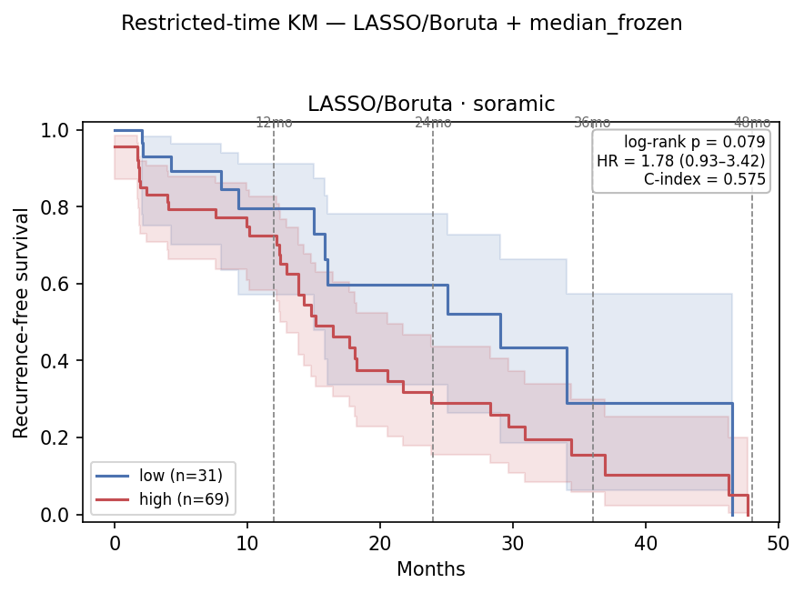
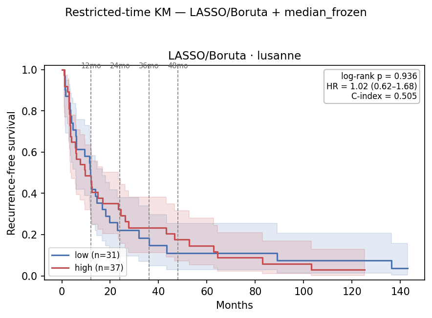
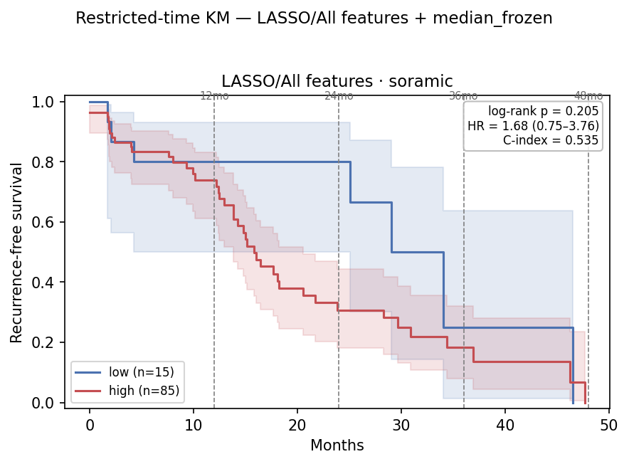
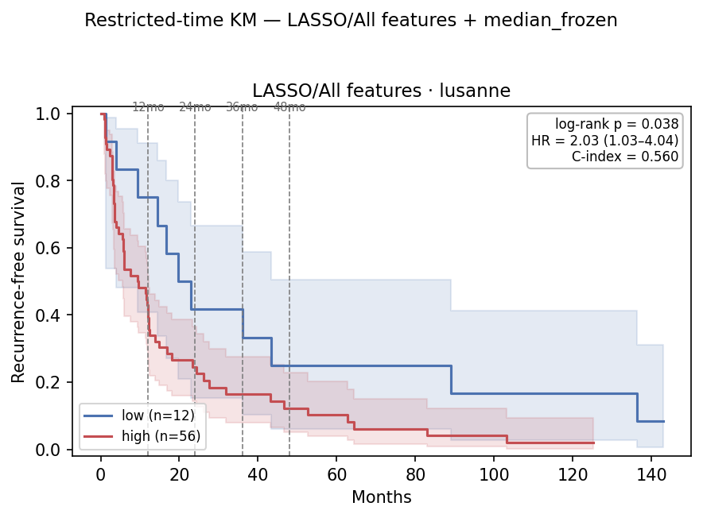

# Restricted-Time (Horizon-τ) RFS Survival Analysis on the `9109a6c2` Embedding — 2026-07-06

Companion to [`0706_embedding_grid_eval.md`](0706_embedding_grid_eval.md) §7, which stratified
**full-follow-up** RFS with the best grid head. Here we hold the *identical* head + cutoff fixed
and re-read the split at horizons τ ∈ {12, 24, 36, 48} mo, with two readouts on the RFS endpoint:

- **A — administrative censoring:** events after τ censored, times clipped to τ; recompute KM
  median / log-rank / Cox HR / Harrell C. Reads as "separation *within* τ months".
- **B — RMST:** area under each arm's KM curve on [0, τ] = event-free months accrued by τ. Reports
  per-arm RMST, ΔRMST (hi−lo, 95% CI), and the point-in-time survival-difference p at τ.

Both share `administrative_censor(time, event, τ)` so they describe the identical truncated data.
The `τ=full` row reproduces the full-follow-up analysis (matches §7 exactly). RFS endpoint only.

## Table of Contents
- [2. Key Findings](#2-key-findings)
- [4. Setup](#4-setup)
- [5. First head — LASSO / Boruta](#5-first-head--lasso--boruta--median)
- [7. Second head — LASSO / All features](#7-second-head--lasso--all-features--median)
- [8. Observations](#8-observations)
- [9. File references](#9-file-references)

## 2. Key Findings

| # | Finding |
|---|---|
| 1 | **The Soramic signal is a 2-year signal.** LASSO/Boruta peaks at **τ=24**: log-rank **p=0.040**, HR **2.21 (1.02–4.82)**, C-index 0.582, point-p 0.043 — all better than full follow-up (p=0.079, HR 1.78). Extending to the sparse 3–4-yr tail only dilutes it. |
| 2 | **No separation at 12 mo (p=0.34).** The discrimination window is **12–24 mo**, not the first year. |
| 3 | **RMST directional but under-powered.** ΔRMST(hi−lo) = −1.0/−3.5/−6.1/−8.0 mo (τ=12/24/36/48), growing monotonically, but CIs always cross 0 at n≈100. Effect-size evidence, not a test. |
| 4 | **Lausanne: no separation at any horizon** (all log-rank p≥0.70, HR≈0.9–1.1, ΔRMST sign-flips). Same non-transfer as full-follow-up and 0629. |
| 5 | **A second head (LASSO/All + median) mirrors Soramic but transfers to the *opposite* cohort (§7):** also significant on Soramic only at τ=24 (p=0.039, point-p **0.009**), but unlike Boruta it **separates Lausanne** (full p=0.038, HR 2.03). Splits are lopsided (87/13, 56/12) so trust log-rank/point tests over HR CIs. |

## 4. Setup

Inherited unchanged from `0706_embedding_grid_eval.md` §7. Head: **LASSO/Boruta + median**
(top-5 Soramic-AUROC heads, `route_grid_scores`; among four frozen cutoffs, pick balanced,
correct-direction, lowest full-follow-up log-rank p).

| | Resection | Soramic | Lausanne |
|---|---|---|---|
| Patients (embedding + RFS) | 60 | 100 | 68 |
| RFS events, full follow-up | 41 | 50 | 64 |
| Split (LASSO/Boruta + median) | — | 69 hi / 31 lo | 37 hi / 31 lo |
| Max follow-up (mo) | — | ≈48 | ≈143 |

Soramic follow-up tops out near 48 mo, so its **τ=48 ≈ full**. Lausanne has a long tail, so its
horizons stay distinct.

## 5. First head — LASSO / Boruta + median

Top-5 Soramic-AUROC heads; balanced, correct-direction, lowest full-follow-up log-rank p.

### 5.1 Soramic — 38 hi / 12 lo

| τ (mo) | ev hi/lo | HR (95% CI) | log-rank p | C-idx | ‖ | RMST hi/lo | ΔRMST (95% CI) | point-p |
|---:|---:|---|---:|---:|:--:|---:|---:|---:|
| 12 | 15 / 5 | 1.63 (0.59–4.48) | 0.344 | 0.541 | ‖ | 9.7 / 10.7 | −1.0 (−10.8, +8.9) | 0.523 |
| **24** | **31 / 8** | **2.21 (1.02–4.82)** | **0.040** | **0.582** | ‖ | 15.1 / 18.6 | −3.5 (−25.2, +18.3) | **0.043** |
| 36 | 35 / 11 | 1.81 (0.92–3.57) | 0.082 | 0.578 | ‖ | 17.9 / 24.0 | −6.1 (−39.1, +26.9) | 0.383 |
| 48 ≈ full | 38 / 12 | 1.78 (0.93–3.42) | 0.079 | 0.578 | ‖ | 19.1 / 27.1 | −8.0 (−48.8, +32.8) | — |

Separation peaks at τ=24 — the only horizon whose HR CI excludes 1 and log-rank crosses 0.05.
The point-in-time test at τ=24 (0.043) independently corroborates. τ=12 barely distinguishable.

*LASSO/Boruta + median, RFS, Soramic. Arms fan apart between the 12- and 24-mo marks. SVG: `km_restricted_soramic.svg`.*

### 5.2 Lausanne — 35 hi / 29 lo

| τ (mo) | ev hi/lo | HR (95% CI) | log-rank p | C-idx | ‖ | RMST hi/lo | ΔRMST (95% CI) | point-p |
|---:|---:|---|---:|---:|:--:|---:|---:|---:|
| 12 | 19 / 16 | 1.07 (0.55–2.08) | 0.845 | 0.574 | ‖ | 8.0 / 8.6 | −0.6 (−12.5, +11.3) | 0.983 |
| 24 | 25 / 24 | 0.89 (0.51–1.57) | 0.695 | 0.553 | ‖ | 12.4 / 12.4 | +0.0 (−24.5, +24.5) | 0.355 |
| 36 | 28 / 25 | 0.94 (0.55–1.62) | 0.824 | 0.558 | ‖ | 15.4 / 14.9 | +0.5 (−35.2, +36.2) | 0.622 |
| 48 | 30 / 27 | 0.90 (0.54–1.52) | 0.703 | 0.555 | ‖ | 18.0 / 16.5 | +1.5 (−44.3, +47.3) | 0.461 |
| full | 35 / 29 | 1.02 (0.62–1.68) | 0.936 | 0.558 | ‖ | — | — | — |

No separation at any horizon; ΔRMST sign flips across τ (noise). The Soramic-selected head does
not transfer.

*Same head, Lausanne. Arms overlap throughout (all p≥0.70). SVG: `km_restricted_lusanne.svg`.*

## 7. Second head — LASSO / All features + median

Top-1 by Soramic transfer AUROC (0.736). Frozen cutoff gives **lopsided** splits (Soramic 87/13,
Lausanne 56/12) → read log-rank / point tests, not the wide HR CIs.

### 7.1 Soramic — 45 hi / 5 lo

| τ (mo) | ev hi/lo | HR (95% CI) | log-rank p | C-idx | ‖ | RMST hi/lo | ΔRMST (95% CI) | point-p |
|---:|---:|---|---:|---:|:--:|---:|---:|---:|
| 12 | 18 / 2 | 1.73 (0.40–7.44) | 0.459 | 0.480 | ‖ | 10.0 / 10.6 | −0.7 (−10.5, +9.2) | 0.409 |
| **24** | **37 / 2** | 3.99 (0.96–16.6) | **0.039** | 0.533 | ‖ | 15.5 / 20.8 | −5.3 (−26.8, +16.3) | **0.009** |
| 36 | 42 / 4 | 2.41 (0.86–6.73) | 0.084 | 0.529 | ‖ | 18.5 / 28.8 | −10.4 (−42.2, +21.5) | 0.551 |
| 48 ≈ full | 45 / 5 | 2.17 (0.85–5.51) | 0.096 | 0.529 | ‖ | 20.0 / 32.2 | −12.2 (−51.4, +27.0) | — |

Same 2-year story as Boruta, crisper: null at full (0.096), significant at τ=24 (0.039), and
**point-p 0.009 is the strongest 2-year separation of any head**. The τ=24 HR 3.99 is inflated by
only 2 low-arm events — trust the log-rank/point tests.

### 7.2 Lausanne — 53 hi / 11 lo

| τ (mo) | ev hi/lo | HR (95% CI) | log-rank p | C-idx | ‖ | RMST hi/lo | ΔRMST (95% CI) | point-p |
|---:|---:|---|---:|---:|:--:|---:|---:|---:|
| 12 | 32 / 3 | 2.92 (0.89–9.54) | 0.063 | 0.631 | ‖ | 7.8 / 10.2 | −2.4 (−13.3, +8.5) | 0.075 |
| 24 | 42 / 7 | 1.91 (0.86–4.27) | 0.109 | 0.610 | ‖ | 11.3 / 17.4 | −6.1 (−29.2, +17.0) | 0.268 |
| 36 | 46 / 7 | 2.17 (0.98–4.82) | 0.052 | 0.612 | ‖ | 13.6 / 22.4 | −8.8 (−43.7, +26.1) | 0.089 |
| 48 | 48 / 9 | 1.83 (0.89–3.74) | 0.095 | 0.611 | ‖ | 15.4 / 26.0 | −10.6 (−56.3, +35.1) | 0.305 |
| **full** | **53 / 11** | **2.03 (1.03–4.04)** | **0.038** | **0.614** | ‖ | — | — | — |

**LASSO/All *does* stratify Lausanne** where Boruta was flat-null (§6, p=0.936): full p=0.038,
HR 2.03, ΔRMST negative and growing at every horizon (direction consistent, unlike Boruta). The
effect *strengthens* with follow-up (full < τ=48 < τ=24) — opposite of Soramic's 2-year peak.

*LASSO/All + median, RFS. Left Soramic: 13-patient low arm holds until ~28 mo (τ=24 p=0.039). Right Lausanne: arms separate and stay separated (full p=0.038). SVGs alongside.*

### 7.3 Boruta vs LASSO/All — which cohort each separates

| Head (median) | Soramic full | Soramic τ=24 | Lausanne full | Separates |
|---|---:|---:|---:|---|
| LASSO / **Boruta** | 0.079 | **0.040** | 0.936 | Soramic only |
| LASSO / **All features** | 0.096 | **0.039** | **0.038** | Lausanne (full) + Soramic (τ=24) |

Both carry the same 2-year Soramic signal (τ=24 ≈ 0.04) but differ entirely on the external
cohort. Neither separates *both* — 0629's "one cohort or the other" is a head-dependent trade-off,
not a fixed property of the embedding.

## 8. Observations

1. **Soramic recurrence is a 2-year signal** — τ=24 is significant where full follow-up (0.079) is not; reporting only the full number understates the effect.
2. **A and B agree and are complementary** — A gives the verdict, B the clinical units (~3.5 more event-free months by 2 yr in the low arm), point-p corroborates independently.
3. **ΔRMST is under-powered standalone** — CIs cross 0 even when truncated log-rank is significant; use it for direction/magnitude only.
4. **External transfer is head-dependent** — Boruta→Soramic, LASSO/All→Lausanne, neither both.
5. **Read lopsided-split heads by log-rank/point, not HR CI.**

## 9. File references

| Artifact | Path |
|---|---|
| Restricted-time core (A+B) | `hcc_multimodal/survival/restricted.py` |
| Runner (`--fs/--model/--force-cutoff/--tag`) | `hcc_multimodal/survival/run_restricted.py` |
| Command (Boruta) | `python -m hcc_multimodal.survival.run_restricted --top 5 --km --taus 12 24 36 48` |
| Command (LASSO/All) | same `+ --fs "All features" --model LASSO --force-cutoff median_frozen --tag lasso_all` |
| Tables | `results/eval/survival/restricted_time_{soramic,lusanne}{,_lasso_all}.csv` |
| KM figures | `reports/0706/km_restricted_{soramic,lusanne}{,_lasso_all}.{png,svg}` |
| Full-follow-up / TTR counterparts | `0706_embedding_grid_eval.md` §7 · `0706_ttr_central_survival_eval.md` |
