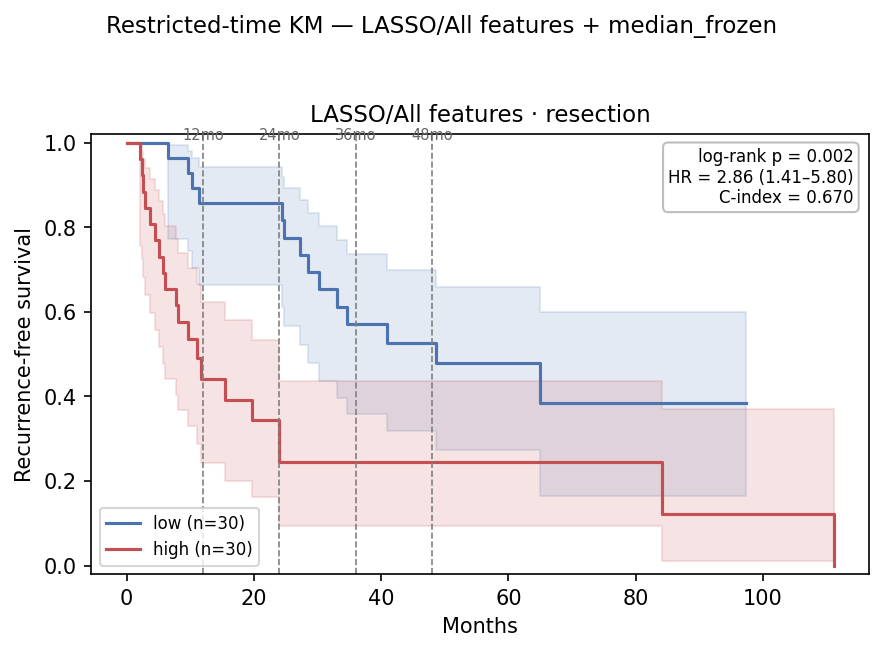
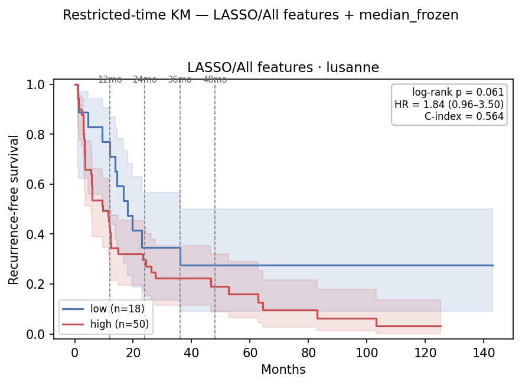

# Restricted-Time (Horizon-τ) TTR Survival Analysis on the `9109a6c2` Embedding — 2026-07-06

TTR_central companion to [`0706_restricted_time_rfs.md`](0706_restricted_time_rfs.md): same
embedding, head (**LASSO / All features**), **in-sample resection-frozen median** cutoff, splits,
and two readouts (**A** administrative censoring, **B** RMST), re-scored against **TTR_central**
instead of RFS.

**RFS vs TTR:** RFS counts recurrence *or* death; TTR counts *only* recurrence (deaths censored).
TTR isolates recurrence but carries fewer events (31 vs 50 on Soramic) → less power. Scores and
frozen cutoffs are endpoint-independent, so the high/low **splits are identical** to the RFS report
(resection 30/30, Soramic 85/15, Lausanne 50/18) — only `time`/`event` differ.

## Table of Contents
- [2. Key Findings](#2-key-findings)
- [3. Setup](#3-setup)
- [4. Resection — in-sample ceiling](#4-resection--in-sample-refit-30-hi--30-lo)
- [5. Soramic — transfer](#5-soramic--transfer-85-hi--15-lo)
- [6. Lausanne — transfer](#6-lausanne--transfer-50-hi--18-lo)
- [7. RFS vs TTR, side by side](#7-rfs-vs-ttr-side-by-side)
- [8. File references](#8-file-references)

## 2. Key Findings

| # | Finding |
|---|---|
| 1 | **Same story as RFS, one power tier down.** Resection stays strongly separated in-sample (C-index 0.71–0.76, all p≤0.002); the external transfers stay weak. Fewer TTR events lift the log-rank p's but leave HR, ΔRMST and point tests intact. |
| 2 | **Soramic 2-year point signal survives.** τ=24 log-rank is under-powered (0.248, 3 low-arm recurrences) but the point-p = **0.012** — the 2-year separation holds under recurrence-only, as under RFS (0.006). |
| 3 | **Lausanne separates early only.** τ=12 log-rank **p=0.026** (point-p 0.029), null at τ=24–48, full follow-up borderline (**p=0.061**). Recurrence-only slightly sharpens the early signal vs RFS (0.034). |
| 4 | **Resection is the in-sample ceiling.** Refit on its own labels, split at its own median (30/30): C-index peaks at τ=24 (0.763), all horizons p≤0.002. Optimistically biased, not validation. |
| 5 | **ΔRMST directional-only** — negative at every horizon but CIs cross 0 on the external cohorts at n≈100. |

## 3. Setup

Endpoint `TTR_central` / `TTR_central_event`; everything else inherited from the RFS report. Head
**LASSO / All features**, cutoff = **in-sample resection-frozen median**. Splits identical to RFS
(scores + frozen cutoff endpoint-independent).

| | Resection | Soramic | Lausanne |
|---|---:|---:|---:|
| Patients (embedding + TTR) | 60 | 100 | 68 |
| **TTR** events, full follow-up | 34 | **31** | 55 |
| (RFS events, reference) | 41 | 50 | 64 |
| Split (LASSO/All, in-sample median) | 30 hi / 30 lo | 85 hi / 15 lo | 50 hi / 18 lo |

All 31 Soramic TTR recurrences occur by ~34 mo, so **τ=36 ≈ τ=48 ≈ full** for Soramic. Lausanne
(≈143 mo) and resection (≈111 mo) keep their horizons distinct. Resection rows are the in-sample
refit LASSO/All scores split at their own median (optimistically biased ceiling — see RFS §3).

## 4. Resection — in-sample refit, 30 hi / 30 lo

In-sample refit scores split at the resection median (optimistically biased ceiling, not validation).

| τ (mo) | ev hi/lo | HR (95% CI) | log-rank p | C-idx | ‖ | RMST hi/lo | ΔRMST (95% CI) | point-p |
|---:|---:|---|---:|---:|:--:|---:|---:|---:|
| 12 | 14 / 4 | 5.67 (1.86–17.31) | 0.001 | 0.745 | ‖ | 8.7 / 11.6 | −2.9 (−10.6, +4.8) | 0.004 |
| 24 | 17 / 4 | 7.48 (2.50–22.39) | <0.001 | 0.763 | ‖ | 13.4 / 21.9 | −8.5 (−28.3, +11.3) | <0.001 |
| 36 | 18 / 11 | 3.51 (1.63–7.54) | 0.001 | 0.718 | ‖ | 16.4 / 30.2 | −13.9 (−44.9, +17.2) | 0.024 |
| 48 | 18 / 12 | 3.25 (1.54–6.85) | 0.001 | 0.710 | ‖ | 19.3 / 36.7 | −17.4 (−61.4, +26.5) | 0.049 |
| full | 20 / 14 | 2.86 (1.41–5.80) | 0.002 | 0.711 | ‖ | — | — | — |

Strong in-sample separation, mirroring the RFS resection table: C-index peaks at **τ=24 (0.763)**,
ΔRMST grows to −17 mo. The gap to Soramic's ≈0.53 transfer C-index is the generalization loss.

*LASSO/All, TTR, resection (in-sample refit). Arms separate sharply. SVG alongside.*

## 5. Soramic — transfer, 85 hi / 15 lo

| τ (mo) | ev hi/lo | HR (95% CI) | log-rank p | C-idx | ‖ | RMST hi/lo | ΔRMST (95% CI) | point-p |
|---:|---:|---|---:|---:|:--:|---:|---:|---:|
| 12 | 14 / 3 | 1.05 (0.30–3.64) | 0.946 | 0.515 | ‖ | 10.1 / 10.1 | +0.1 (−10.4, +10.5) | 0.800 |
| **24** | **26 / 3** | 2.00 (0.60–6.61) | 0.248 | 0.532 | ‖ | 15.6 / 19.6 | −4.0 (−26.7, +18.7) | **0.012** |
| 36 | 27 / 4 | 1.52 (0.53–4.36) | 0.435 | 0.529 | ‖ | 19.4 / 26.4 | −7.0 (−41.3, +27.3) | 0.558 |
| 48 ≈ full | 27 / 4 | 1.52 (0.53–4.36) | 0.435 | 0.529 | ‖ | 22.0 / 31.2 | −9.1 (−54.9, +36.7) | 0.558 |

Log-rank never clears 0.05 (only 3 low-arm recurrences), but the **τ=24 point-p 0.012** confirms the
2-year separation through the readout robust to the tiny low arm — the same signal as RFS (0.006).

*LASSO/All, TTR, Soramic. Low arm holds until ~28 mo. SVG alongside.*

## 6. Lausanne — transfer, 50 hi / 18 lo

| τ (mo) | ev hi/lo | HR (95% CI) | log-rank p | C-idx | ‖ | RMST hi/lo | ΔRMST (95% CI) | point-p |
|---:|---:|---|---:|---:|:--:|---:|---:|---:|
| **12** | **28 / 4** | 3.09 (1.08–8.83) | **0.026** | 0.627 | ‖ | 7.9 / 10.2 | −2.3 (−13.4, +8.8) | **0.029** |
| 24 | 34 / 11 | 1.52 (0.77–3.01) | 0.230 | 0.602 | ‖ | 11.8 / 16.5 | −4.6 (−28.2, +18.9) | 0.719 |
| 36 | 37 / 11 | 1.65 (0.84–3.24) | 0.146 | 0.606 | ‖ | 14.7 / 20.6 | −6.0 (−41.7, +29.8) | 0.351 |
| 48 | 38 / 12 | 1.55 (0.81–2.98) | 0.184 | 0.606 | ‖ | 17.3 / 23.9 | −6.7 (−54.7, +41.3) | 0.495 |
| full | 43 / 12 | 1.84 (0.96–3.50) | 0.061 | 0.609 | ‖ | — | — | — |

Lausanne separates **early** (τ=12 log-rank and point-p both ≈0.03), goes null across the mid
horizons, and lands at a borderline full-follow-up p=0.061 — same shape as RFS. Under the in-sample
cutoff the previously significant Lausanne TTR transfer (full 0.019 under the OOF cutoff) is no
longer significant.

*LASSO/All, TTR, Lausanne. Early separation, then convergence (full p=0.061). SVG alongside.*

## 7. RFS vs TTR, side by side

| Cohort | Metric | RFS | TTR |
|---|---|---:|---:|
| Resection (in-sample) | full log-rank / HR | **<0.001** / 3.12 | **0.002** / 2.86 |
| Soramic | τ=24 point-p | **0.006** | **0.012** |
| Soramic | full log-rank | 0.205 | 0.435 |
| Lausanne | τ=12 log-rank | **0.034** | **0.026** |
| Lausanne | full log-rank / HR | 0.079 / 1.68 | 0.061 / 1.84 |

Every qualitative conclusion holds across endpoints: resection is the strongly-separated in-sample
ceiling; Soramic carries a marginal 2-year point signal (point-p ≈0.01, log-rank null); Lausanne
separates only early (τ=12) and is borderline at full follow-up. TTR's lower event count softens
the log-rank p's while leaving HR, ΔRMST and point tests intact.

## 8. File references

| Artifact | Path |
|---|---|
| Core / runner | `hcc_multimodal/survival/{restricted,run_restricted}.py` |
| Command | `python -m hcc_multimodal.survival.run_restricted --top 5 --km --taus 12 24 36 48 --time-col TTR_central --event-col TTR_central_event --fs "All features" --model LASSO --force-cutoff median_frozen --freeze-on insample --tag ttr_central_lasso_all` |
| Tables | `results/eval/survival/restricted_time_{resection,soramic,lusanne}_ttr_central_lasso_all.csv` |
| KM figures | `reports/0706/km_restricted_{resection,soramic,lusanne}_ttr_central_lasso_all.{png,svg}` |
| RFS counterpart | `reports/0706/0706_restricted_time_rfs.md` |
