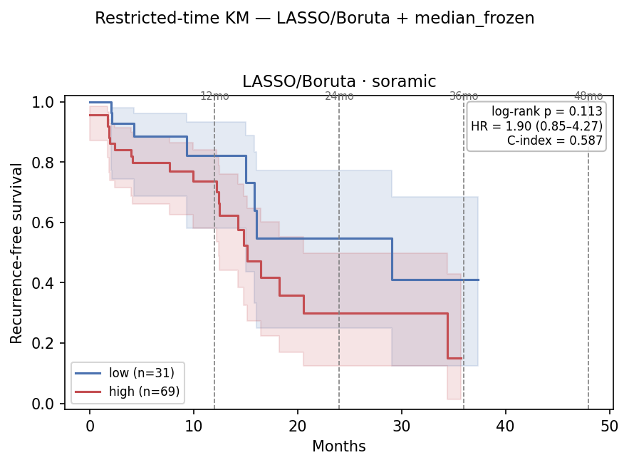
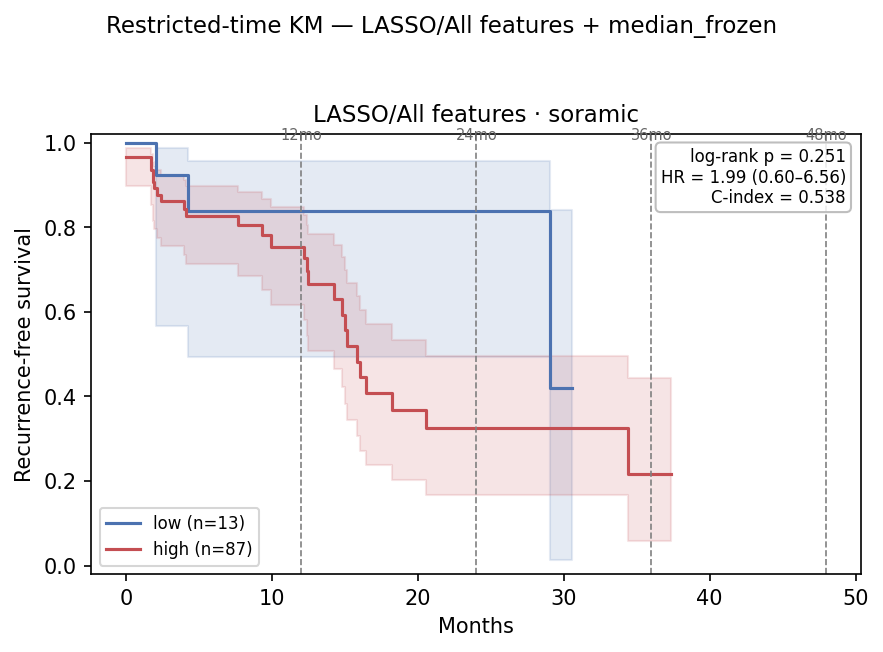

# Restricted-Time (Horizon-τ) TTR Survival Analysis on the `9109a6c2` Embedding — 2026-07-06

TTR_central companion to [`0706_restricted_time_rfs.md`](0706_restricted_time_rfs.md): same
embedding, heads, cutoffs, splits, and two readouts (**A** administrative censoring, **B** RMST),
re-scored against **TTR_central** instead of RFS.

**RFS vs TTR:** RFS counts recurrence *or* death; TTR counts *only* recurrence (deaths censored).
TTR isolates recurrence but carries fewer events (31 vs 50 on Soramic) → less power. Scores and
frozen cutoffs are endpoint-independent, so the high/low **splits are identical** to the RFS report
— only `time`/`event` differ.

## Table of Contents
- [2. Key Findings](#2-key-findings)
- [3. Setup](#3-setup)
- [4. Boruta head](#4-boruta-head-lasso--boruta--median)
- [5. LASSO / All features head](#5-lasso--all-features-head--median)
- [6. RFS vs TTR, side by side](#6-rfs-vs-ttr-side-by-side)
- [7. File references](#7-file-references)

## 2. Key Findings

| # | Finding |
|---|---|
| 1 | **Same story as RFS, one power tier down.** Boruta's Soramic separation still peaks at **τ=24** (HR 2.07, C-index 0.59), same effect size, but 31 events (vs 50) lift every p by ~0.03–0.05 → τ=24 **p=0.089** (RFS 0.040). Effect preserved, significance verdict softens. |
| 2 | **Point-in-time test still flags 2 years.** LASSO/All Soramic τ=24 log-rank is under-powered (0.124, 2 low-arm events) but point-p = **0.013** — the 2-year separation survives. |
| 3 | **LASSO/All transfers to Lausanne *more strongly* under TTR:** full log-rank **p=0.019** (RFS 0.038), HR **2.52 (1.13–5.61)**, τ=12 already significant; ΔRMST negative and growing (−2.9→−11.7 mo). Isolating recurrence sharpens the Lausanne signal. |
| 4 | **Boruta still does not transfer to Lausanne** (all p≥0.50, ΔRMST sign-flips) — same one-cohort-or-the-other trade-off as RFS. |
| 5 | **ΔRMST directional-only** — negative at every Soramic horizon but CIs always cross 0 at n≈100. |

## 3. Setup

Endpoint `TTR_central` / `TTR_central_event`; everything else inherited from the RFS report.
Splits identical (scores + frozen cutoffs endpoint-independent).

| | Resection | Soramic | Lausanne |
|---|---:|---:|---:|
| Patients (embedding + TTR) | 60 | 100 | 68 |
| **TTR** events, full follow-up | 34 | **31** | 55 |
| (RFS events, reference) | 41 | 50 | 64 |
| Split — Boruta + median | — | 69 hi / 31 lo | 37 hi / 31 lo |
| Split — LASSO/All + median | — | 87 hi / 13 lo | 56 hi / 12 lo |

All 31 Soramic TTR recurrences occur by ~34 mo, so **τ=36 ≈ τ=48 ≈ full** for Soramic. Lausanne's
long tail keeps its horizons distinct.

## 4. Boruta head (LASSO / Boruta + median)

### 4.1 Soramic — 69 hi / 31 lo

| τ (mo) | ev hi/lo | HR (95% CI) | log-rank p | C-idx | ‖ | RMST hi/lo | ΔRMST (95% CI) | point-p |
|---:|---:|---|---:|---:|:--:|---:|---:|---:|
| 12 | 13 / 4 | 1.87 (0.61–5.74) | 0.268 | 0.573 | ‖ | 9.8 / 10.8 | −1.0 (−10.8, +8.8) | 0.454 |
| **24** | **22 / 7** | **2.07 (0.88–4.86)** | **0.089** | **0.586** | ‖ | 14.9 / 18.4 | −3.4 (−24.6, +17.8) | 0.172 |
| 36 | 23 / 8 | 1.90 (0.85–4.27) | 0.113 | 0.584 | ‖ | 18.3 / 24.0 | −5.7 (−39.6, +28.2) | 0.205 |
| 48 ≈ full | 23 / 8 | 1.90 (0.85–4.27) | 0.113 | 0.584 | ‖ | 20.1 / 28.9 | −8.8 (−54.1, +36.4) | 0.205 |

τ=24 is the lowest-p horizon (0.089) — same 2-year localization as RFS, just under the line
because TTR halves the events. HR and ΔRMST track the RFS values.

### 4.2 Lausanne — 37 hi / 31 lo

| τ (mo) | ev hi/lo | HR (95% CI) | log-rank p | C-idx | ‖ | RMST hi/lo | ΔRMST (95% CI) | point-p |
|---:|---:|---|---:|---:|:--:|---:|---:|---:|
| 12 | 17 / 15 | 1.01 (0.51–2.03) | 0.969 | 0.562 | ‖ | 8.3 / 8.8 | −0.5 (−12.3, +11.3) | 0.826 |
| 24 | 22 / 23 | 0.82 (0.46–1.47) | 0.501 | 0.539 | ‖ | 13.3 / 12.8 | +0.6 (−24.2, +25.4) | 0.200 |
| 36 | 25 / 23 | 0.91 (0.52–1.61) | 0.746 | 0.545 | ‖ | 16.8 / 15.5 | +1.3 (−35.4, +38.0) | 0.686 |
| 48 | 26 / 24 | 0.89 (0.51–1.56) | 0.683 | 0.544 | ‖ | 20.1 / 17.7 | +2.4 (−46.3, +51.0) | 0.631 |
| full | 31 / 24 | 1.05 (0.62–1.80) | 0.847 | 0.549 | ‖ | — | — | — |

No separation; ΔRMST sign flips across τ (noise).

*Boruta + median, TTR. Soramic (left): arms fan apart across 12–24 mo (τ=24 p=0.089); Lausanne (right): overlap. Lausanne fig: `km_restricted_lusanne_ttr_central.png`; SVGs alongside.*

## 5. LASSO / All features head (+ median)

Lopsided splits (Soramic 87/13, Lausanne 56/12) → read log-rank/point tests, not HR CIs.

### 5.1 Soramic — 87 hi / 13 lo

| τ (mo) | ev hi/lo | HR (95% CI) | log-rank p | C-idx | ‖ | RMST hi/lo | ΔRMST (95% CI) | point-p |
|---:|---:|---|---:|---:|:--:|---:|---:|---:|
| 12 | 15 / 2 | 1.51 (0.34–6.61) | 0.583 | 0.515 | ‖ | 10.0 / 10.6 | −0.5 (−10.4, +9.3) | 0.532 |
| **24** | **27 / 2** | 2.93 (0.70–12.4) | 0.124 | 0.532 | ‖ | 15.5 / 20.7 | −5.2 (−26.6, +16.3) | **0.013** |
| 36 | 28 / 3 | 1.99 (0.60–6.56) | 0.251 | 0.529 | ‖ | 19.2 / 27.8 | −8.6 (−41.4, +24.2) | 0.525 |
| 48 ≈ full | 28 / 3 | 1.99 (0.60–6.56) | 0.251 | 0.529 | ‖ | 21.8 / 32.8 | −11.0 (−55.3, +33.3) | 0.525 |

Log-rank never crosses 0.05 (2 low-arm events), but the **τ=24 point-p 0.013** confirms the 2-year
separation through the readout robust to the tiny low arm.

### 5.2 Lausanne — 56 hi / 12 lo

| τ (mo) | ev hi/lo | HR (95% CI) | log-rank p | C-idx | ‖ | RMST hi/lo | ΔRMST (95% CI) | point-p |
|---:|---:|---|---:|---:|:--:|---:|---:|---:|
| 12 | 30 / 2 | 4.06 (0.97–17.0) | **0.038** | 0.627 | ‖ | 8.0 / 10.9 | −2.9 (−13.2, +7.5) | 0.055 |
| 24 | 39 / 6 | 2.06 (0.87–4.89) | 0.093 | 0.602 | ‖ | 11.9 / 18.7 | −6.9 (−29.1, +15.3) | 0.277 |
| 36 | 42 / 6 | 2.28 (0.97–5.39) | 0.053 | 0.606 | ‖ | 14.5 / 24.2 | −9.7 (−44.2, +24.8) | 0.126 |
| 48 | 43 / 7 | 2.05 (0.92–4.57) | 0.075 | 0.606 | ‖ | 17.0 / 28.6 | −11.7 (−58.7, +35.4) | 0.216 |
| **full** | **48 / 7** | **2.52 (1.13–5.61)** | **0.019** | **0.609** | ‖ | — | — | — |

**LASSO/All separates Lausanne more strongly than under RFS** (full 0.019 vs 0.038, HR 2.52 vs
2.03), τ=12 already significant, ΔRMST negative and monotonically growing. Effect *strengthens*
with follow-up — opposite of Soramic's 2-year peak.

*LASSO/All + median, TTR. Soramic (left): 13-patient low arm holds until ~28 mo; Lausanne (right): separated (full p=0.019). Lausanne fig: `km_restricted_lusanne_ttr_central_lasso_all.png`; SVGs alongside.*

## 6. RFS vs TTR, side by side

| Head | Cohort | Metric | RFS | TTR |
|---|---|---|---:|---:|
| Boruta | Soramic | τ=24 log-rank | **0.040** | 0.089 |
| Boruta | Soramic | full log-rank / HR | 0.079 / 1.78 | 0.113 / 1.90 |
| Boruta | Lausanne | full log-rank | 0.936 | 0.847 |
| LASSO/All | Soramic | τ=24 point-p | **0.009** | **0.013** |
| LASSO/All | Lausanne | full log-rank / HR | **0.038** / 2.03 | **0.019** / 2.52 |

Every qualitative conclusion holds across endpoints: Boruta's Soramic signal is a 2-year signal
(sub-0.05 under RFS, under-powered but same-shaped under TTR); LASSO/All transfers to Lausanne
(more strongly under TTR); neither head separates both cohorts. TTR's lower event count is the only
mover — it softens Soramic's log-rank while leaving HR, ΔRMST, and point tests intact, and it
*sharpens* the Lausanne transfer.

## 7. File references

| Artifact | Path |
|---|---|
| Core / runner | `hcc_multimodal/survival/{restricted,run_restricted}.py` |
| Command (Boruta) | `python -m hcc_multimodal.survival.run_restricted --top 5 --km --taus 12 24 36 48 --time-col TTR_central --event-col TTR_central_event --fs Boruta --model LASSO --force-cutoff median_frozen --tag ttr_central` |
| Command (LASSO/All) | same with `--fs "All features" --tag ttr_central_lasso_all` |
| Tables | `results/eval/survival/restricted_time_{soramic,lusanne}_ttr_central{,_lasso_all}.csv` |
| KM figures | `reports/0706/km_restricted_{soramic,lusanne}_ttr_central{,_lasso_all}.{png,svg}` |
| RFS counterpart | `reports/0706/0706_restricted_time_rfs.md` |
