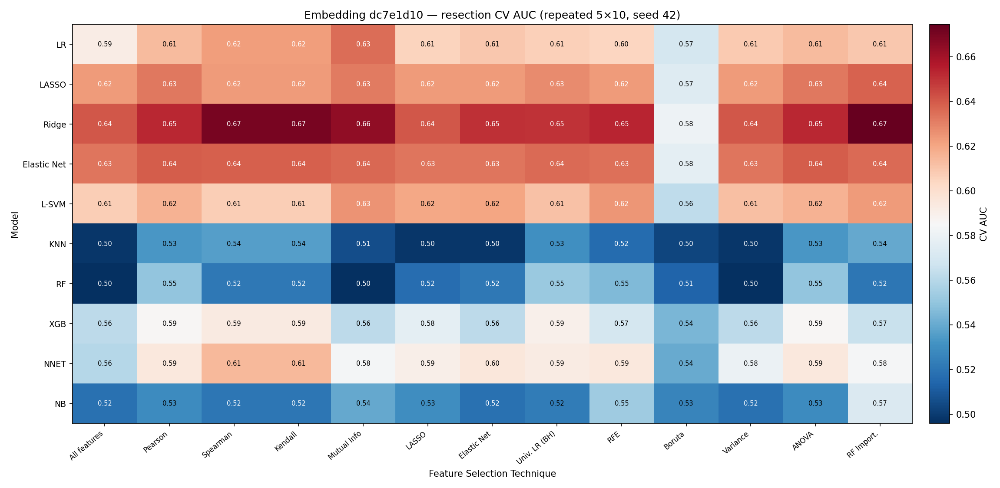
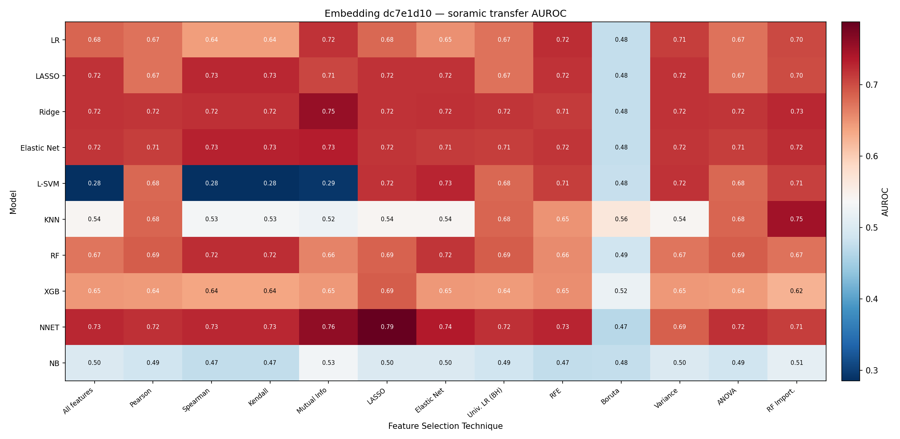
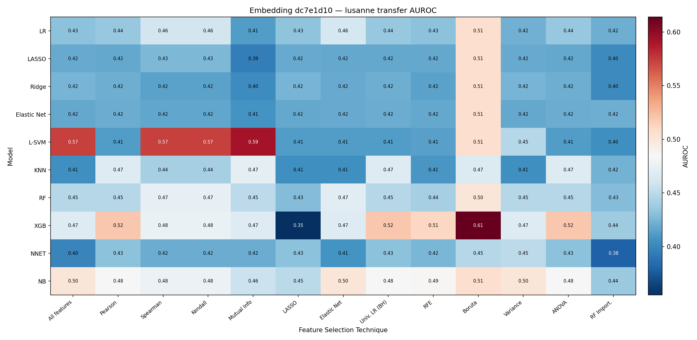
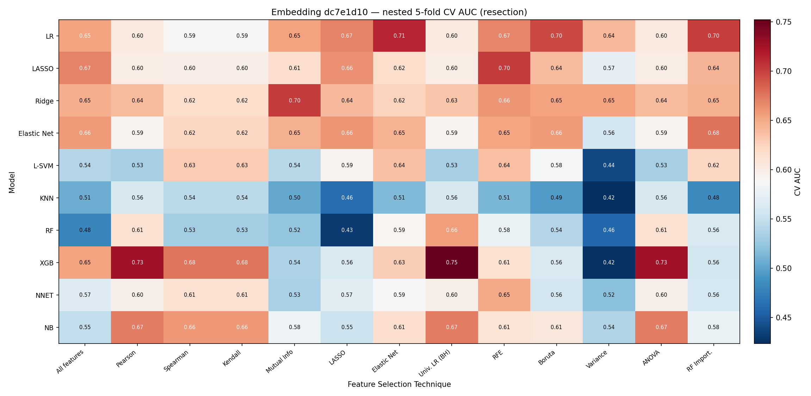
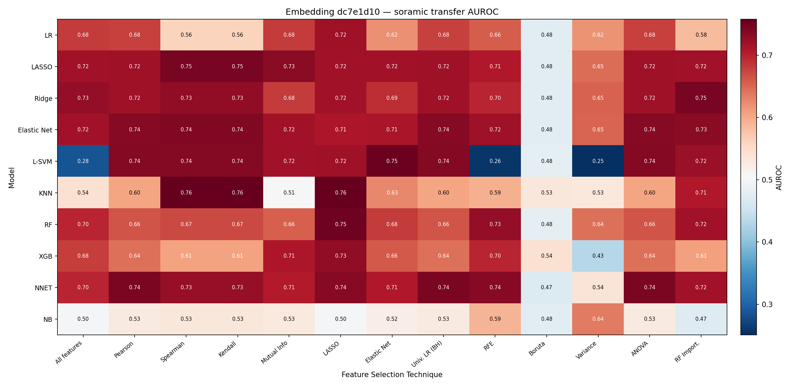
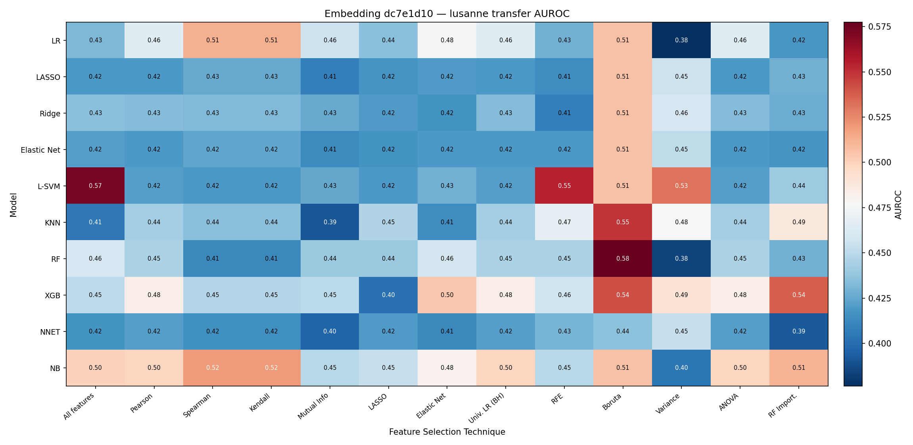

# Embedding Evaluation — All 17 Ablation Models — 2026-07-13

Successor to `reports/0706/0706_embedding_grid_eval.md`. Re-evaluates **all 17 ablation embeddings**
on the **image-only 128-dim** representation (the only externally deployable one) with fixed LR/RF
heads, no feature selection, 3-fold resection CV, and Soramic/Lausanne transfer (§5). §6 asks whether
a lower-variance CV can select a transferable head on the Soramic-good `dc7e1d10`; Appendix B holds
the original nested grid.

## Table of Contents
- [1. Task](#1-task)
- [2. Key findings](#2-key-findings)
- [3. Setup](#3-setup)
- [4. Method](#4-method)
- [5. Results — CV rank + transfer](#5-results--cv-rank--transfer)
- [6. Selecting a transferable head from resection CV](#6-selecting-a-transferable-head-from-resection-cv)
- [7. Observations](#7-observations)
- [8. File references](#8-file-references)
- [Appendix A. Seed robustness of the dc7e1d10 selection](#appendix-a-seed-robustness-of-the-dc7e1d10-selection)
- [Appendix B. Full FS × classifier grid on dc7e1d10 (nested 5-fold)](#appendix-b-full-fs--classifier-grid-on-dc7e1d10-nested-5-fold)

## 1. Task

The 0608 §4 CV column was computed on the 256-dim `img_emb ⊕ gene_emb` embedding, whose gene half
leaks the outcome and is unavailable on Soramic/Lausanne at inference. This report rebuilds the table
on the **image-only** embedding and pairs each model's resection CV AUC with its transfer on one
extraction. §5 is **identical to `0713_ablation_eval_v3.md` §4** (fixed LR/RF, no FS, 3-fold CV, all
read from `resection_img_emb.parquet`). §6 tests whether a lower-variance repeated-CV selection can
pick a transferable head on `dc7e1d10`.

## 2. Key findings

| # | Finding |
|---|---|
| 1 | **Resection CV does not predict Soramic transfer.** ρ(CV, Soramic) = **0.00**; ρ(CV, Lausanne) = 0.40. CV-top `a6f970d6` (0.714) is **chance on Soramic (0.494)**. |
| 2 | **Soramic and Lausanne favour opposite models** (ρ = **−0.46**). Frozen/gene models top Soramic (`9109a6c2` 0.732); patient/slice unfrozen models top Lausanne (`1361bef2` 0.771). No model wins both. |
| 3 | **Best external heads are modest.** Best Soramic 0.732, best Lausanne 0.771; the rest sit near the radiomic baselines (0.590 / 0.531). |
| 4 | **Only `dc7e1d10` is both high-CV and Soramic-good** (CV 0.699, Soramic 0.718) — but near-worst on Lausanne (0.453). |
| 5 | **A lower-variance CV *can* select a transferable head (§6).** Under repeated 5×10 CV with tuned feature count, the CV-best config on `dc7e1d10` → **Soramic 0.725** (+0.135), seed-stable; ρ(CV, Soramic) rises 0.04 → 0.55. It transfers where the embedding carries signal, not where it doesn't. |

## 3. Setup

| | Resection (train) | Soramic (test) | Lausanne (test) |
|---|---|---|---|
| Embedding + `rfs_2year` | 54 (26 pos, 48%) | 57 (39 pos, 68%) | 66 (49 pos, 74%) |

All embeddings **image-only 128-dim**, `raw`/`bbox` per `MODEL_INPUT`. CV, transfer, and §6 all read
the same **survival `resection_img_emb.parquet` / `ablation_{cohort}_img_emb_{raw,bbox}.parquet`**
extraction (patient-level mean-pooled, aligned on `SID`) — one cache throughout, so CV and transfer
are directly comparable.

## 4. Method

- **Classifiers** — LR and RF as-is from `baselines/config.py` (`MODELS`); no hyperparameter search.
- **Resection CV** — `SimpleImputer(median) → StandardScaler → classifier` on all 128 dims, plain
  3-fold stratified CV; best head = higher mean fold AUC.
- **Transfer** — Soramic/Lausanne AUROC = best-head values from `0713_ablation_eval_v3.md` §2–3
  (`SelectKBest(k=100)` + LR/RF, head chosen by cohort AUROC).

## 5. Results — CV rank + transfer

Ranked by resection 3-fold CV AUC. Parentheses show Δ vs. best radiomic baseline (Soramic RF=0.590;
Lausanne LR=0.531).

| Rank | Model ID | Config | Head | CV AUC ± std | Soramic | Lausanne |
|-----:|----------|--------|------|-------------:|--------:|---------:|
| 1 | `a6f970d6` | raw, λ=0.0, unfrozen, n=10, patient | LR | **0.714 ± 0.133** | 0.494 (−0.096) | 0.618 (+0.087) |
| 2 | `dc7e1d10` | raw, λ=0.1, frozen, n=all, slice | LR | 0.699 ± 0.112 | 0.718 (+0.128) | 0.453 (−0.078) |
| 3 | `982a6fa2` | raw, λ=0.0, unfrozen, n=10, slice | LR | 0.682 ± 0.040 | 0.606 (+0.016) | 0.600 (+0.069) |
| 4 | `a64b245f` | raw, λ=0.0, frozen, n=all, slice | LR | 0.665 ± 0.092 | 0.684 (+0.094) | 0.556 (+0.025) |
| 5 | `92b9afed` | bbox, λ=0.1, frozen, n=all, slice | RF | 0.651 ± 0.042 | 0.577 (−0.013) | 0.614 (+0.083) |
| 6 | `1361bef2` | raw, λ=0.1, unfrozen, n=10, patient | LR | 0.645 ± 0.024 | 0.522 (−0.068) | **0.771 (+0.240)** |
| 7 | `5e3f71a0` | raw, λ=0.1, frozen, n=all, patient | LR | 0.620 ± 0.066 | 0.635 (+0.045) | 0.534 (+0.003) |
| 8 | `5d04e6ba` | raw, λ=0.1, 2y_before_cv genes, slice | LR | 0.603 ± 0.085 | 0.516 (−0.074) | 0.655 (+0.124) |
| 9 | `06c598c0` | raw, λ=0.0, frozen, n=all, patient | LR | 0.603 ± 0.159 | 0.702 (+0.112) | 0.515 (−0.016) |
| 10 | `12e4ba6a` | raw, λ=0.1, predefined genes, slice | LR | 0.599 ± 0.092 | 0.670 (+0.080) | 0.477 (−0.054) |
| 11 | `050d401d` | bbox, λ=0.1, unfrozen, n=10, slice | LR | 0.579 ± 0.161 | 0.669 (+0.079) | 0.544 (+0.013) |
| 12 | `8715461c` | bbox, λ=0.0, unfrozen, n=10, patient | LR | 0.579 ± 0.079 | 0.534 (−0.056) | 0.494 (−0.037) |
| 13 | `e12b0592` | bbox, λ=0.0, unfrozen, n=10, slice | LR | 0.575 ± 0.079 | 0.517 (−0.073) | 0.595 (+0.064) |
| 14 | `6a1a1bdf` | raw, λ=0.1, unfrozen, n=10, slice | RF | 0.554 ± 0.031 | 0.615 (+0.025) | 0.497 (−0.034) |
| 15 | `9109a6c2` | raw, λ=0.1, 2y_before_cv genes, patient | LR | 0.541 ± 0.023 | **0.732 (+0.142)** | 0.563 (+0.032) |
| 16 | `34e6806f` | raw, λ=0.1, predefined genes, patient | LR | 0.525 ± 0.096 | 0.574 (−0.016) | 0.420 (−0.111) |
| 17 | `f8aabb75` | bbox, λ=0.1, unfrozen, n=10, patient | LR | 0.504 ± 0.089 | 0.539 (−0.051) | 0.515 (−0.016) |

Correlations across 17 models: ρ(CV, Soramic) = **0.00**, ρ(CV, Lausanne) = 0.40, ρ(Soramic, Lausanne) = **−0.46**.

## 6. Selecting a transferable head from resection CV

Appendix B (single noisy 5-fold, fixed `select_k=30`) concluded resection CV cannot pick a
transferable head — its argmax landed on `LR/Boruta`, Soramic 0.477. Here we test a **lower-variance
CV** with the **feature count folded into the tuned grid**, on `dc7e1d10`.

### 6.1 Method

- **Selection** — the external cohorts are the held-out test; resection CV only ranks
  candidates. We rank the 10×13 grid by `GridSearchCV.best_score_`, refit the single best config on
  all resection, and transfer. No nested outer loop (n=54; external cohorts carry the estimate).
- **CV protocol** — **repeated 5×10**, `random_state=42` (seeds 0/1 in App. A).

### 6.2 Variance reduction restores CV↔Soramic alignment (dc7e1d10, seed 42)

**Deployable config: `Ridge / RF Import.`, 43/128 (⅓) features** — resection CV 0.675, **Soramic 0.725**
(+0.135), Lausanne 0.402.

Soramic is broadly warm (0.65–0.79); the CV-strong Ridge band (0.72–0.75) sits in the warm zone,
which is what makes it selectable. The `Boruta` column is uniformly cold (~0.48). Grid maxima
(`NNET/LASSO` 0.79, `KNN/RF Import.` 0.75) fall in classifier rows that are cold on CV — visible only
against the test cohort, not selectable. (`L-SVM`'s 0.28 cells are an `SVC` proba-calibration artefact.)

Lausanne is uniformly cold (0.40–0.47) — `dc7e1d10` carries no Lausanne signal. The Ridge band that
tops Soramic is ~0.42 here: selecting for Soramic does not buy Lausanne.

### 6.3 Only the signal-carrying embedding recovers (5×10, seed 42)

Same repeated-CV selection on the five §5-top embeddings:

| Model ID | CV-best config | k | Resection CV | Soramic | Lausanne |
|---|---|---:|---:|---:|---:|
| `dc7e1d10` | Ridge / RF Import. | 43 | 0.675 | **0.725** | 0.402 |
| `982a6fa2` | Elastic Net / LASSO | 85 | 0.752 | 0.440 | **0.742** |
| `a6f970d6` | KNN / LASSO | 43 | 0.710 | 0.426 | 0.462 |
| `92b9afed` | NB / RFE | 43 | 0.636 | 0.500 | 0.500 |
| `a64b245f` | NB / Elastic Net | 43 | 0.614 | 0.500 | 0.490 |

Each embedding's CV-best lands on whichever cohort it carries: `dc7e1d10` → Soramic, `982a6fa2` →
Lausanne. Where an embedding carries neither, the CV-best stays at chance. The selection finds a
transferable head *when one exists*; it does not create transfer.

| CV protocol | ρ(CV, Soramic) | CV-best config | Resection CV | Soramic | Lausanne |
|---|---:|---|---:|---:|---:|
| 5-fold (App. B) | +0.04 | Elastic Net / RF Import. (k=85) | 0.748 | 0.711 | 0.414 |
| 10-fold | +0.47 | Ridge / Mutual Info (k=43) | 0.856 | 0.755 | 0.403 |
| **Repeated 5×10** | **+0.55** | **Ridge / RF Import. (k=43)** | 0.675 | **0.725** | 0.402 |

De-noising the CV monotonically restores alignment (ρ 0.04 → 0.55); the top-CV band collapses onto
**Ridge + a compact univariate/importance subset (k=43–85)** at Soramic 0.71–0.76. The bad-transfer
`Boruta` cell that won the noisy argmax drops out.

## 7. Observations

1. **CV rank ≠ transfer rank.** CV-top `a6f970d6` is chance on Soramic; best Soramic (`9109a6c2`) is
   CV rank 15; best Lausanne (`1361bef2`) is CV rank 6. At a single 5-fold, resection CV (n=54) cannot
   select the transferable embedding or head.
2. **Cohort-specific families, anti-correlated** (−0.46 across models, −0.58 within `dc7e1d10`'s grid).
   Frozen/gene models win Soramic and lose Lausanne; unfrozen patient/slice models the reverse.
3. **The representation, not the head, is the ceiling.** Best external heads ~0.73; scanning the full
   grid on `dc7e1d10` surfaces Soramic 0.758 but Lausanne only 0.577, each chosen against the test
   cohort.
4. **One extraction fixed a spurious result.** An earlier draft computed §5 CV on the
   `multimodal_prediction` cache (different extraction, ~0.77 cosine apart), inflating slice-split
   models to CV≈1.000. Reading CV and transfer off the same `resection_img_emb.parquet` removes the
   artefact.
5. **Appendix B's "not selectable" was a single-5-fold artefact (§6).** Repeated 5×10 CV with tuned
   feature count raises ρ(CV, Soramic) 0.04 → 0.55 on `dc7e1d10`, and the CV-best config transfers to
   Soramic 0.725 (seed-stable). Narrow but real: resection CV *can* select a transferable head **on an
   embedding that carries the signal**.

## 8. File references

| Artifact | Path |
|---|---|
| §5 CV | fixed LR/RF (`MODELS`), no selection, 3-fold on `resection_img_emb.parquet` |
| Grid pipeline (§6, App. B) | `hcc_multimodal/eval/grid.py`, `hcc_multimodal/eval/embedding_grid_eval.py` (`--task grid`) |
| Baseline hyperparameters | `hcc_multimodal/baselines/config.py` |
| §5 embedding cache | `training/contrastive/{id}/cached_embeddings/{resection_img_emb,ablation_*_img_emb_*}.parquet` |
| §5 transfer (best-head) | `0713_ablation_eval_v3.md` §2–3 |
| §6 selection grids | `results/eval/grid_fs_k/select/{model}_{5fold,10fold,5x10_seed{42,0,1}}.csv` |
| §6 heatmaps | `reports/0713/select/heatmap_{cv_auc,soramic_auroc,lusanne_auroc}.{png,svg}`, `results/eval/grid_fs_k/select/dc7e1d10/` |
| §6 selection script | `results/eval/grid_fs_k/select/cv_protocol_sweep.py` |
| App. B grid matrices | `results/eval/grid/dc7e1d10/grid_{cv_auc,cv_auc_matrix,transfer_soramic,transfer_lusanne}.csv` |
| App. B heatmaps | `reports/0713/heatmap_{cv_auc,soramic_auroc,lusanne_auroc}.{png,svg}` |
| Companion ablation report | `reports/0713/0713_ablation_eval_v3.md` |

Regenerate §6: `python -m hcc_multimodal.eval.embedding_grid_eval --task grid --model-id dc7e1d10 --cv-mode flat --cv-repeats 10 --outer-folds 5 --select-k-fracs 0.333 0.667 1.0 --output-dir results/eval/grid_fs_k/select/dc7e1d10 --fig-dir reports/0713/select`. Sweep: `python results/eval/grid_fs_k/select/cv_protocol_sweep.py dc7e1d10 982a6fa2 92b9afed a6f970d6 a64b245f`.
Regenerate App. B: `python -m hcc_multimodal.eval.embedding_grid_eval --task grid --model-id dc7e1d10 --outer-folds 5 --output-dir results/eval/grid/dc7e1d10 --fig-dir reports/0713`.

## Appendix A. Seed robustness of the dc7e1d10 selection

Repeated 5×10 ranking re-run with two further CV seeds (classifiers keep fixed `random_state`):

| CV seed | CV-best config | k | Resection CV | Soramic | Lausanne | ρ(CV, Soramic) |
|---:|---|---:|---:|---:|---:|---:|
| 42 | Ridge / RF Import. | 43 | 0.675 | **0.725** | 0.402 | +0.55 |
| 0  | Ridge / RF Import. | 43 | 0.681 | **0.725** | 0.402 | +0.40 |
| 1  | Ridge / RF Import. | 43 | 0.681 | **0.725** | 0.367 | +0.50 |

The argmax config is identical across all three seeds and lands on Soramic 0.725 — stable to the fold
partition, not a seed-42 artefact.

## Appendix B. Full FS × classifier grid on dc7e1d10 (nested 5-fold)

The original grid at **fixed `select_k=30`** with a **nested single 5-fold** outer CV — the noisy
setup §6 diagnoses and replaces. `dc7e1d10` (raw, λ=0.1, frozen, n=all, slice) is the highest-CV
embedding that also transfers on Soramic (§5 rank 2). Pipeline: `SimpleImputer(median) → StandardScaler
→ selector (k=30) → classifier`, nested 5-fold outer (inner 3-fold `GridSearchCV`), refit-and-transfer,
same `resection_img_emb.parquet` as §5.

### B.1 Resection nested-5-fold CV AUC

Top: **XGB/Univ. LR (BH) 0.752 ± 0.119**, XGB/Pearson & XGB/ANOVA 0.725. Grid ceiling ~+0.05 above §5
fixed-head CV (0.699) but noisy at ±0.12 fold std. Range 0.423–0.752.

### B.2 Soramic transfer AUROC

Top: **KNN/LASSO 0.758**, KNN/Kendall & KNN/Spearman 0.756. Grid max edges above §5 Soramic (0.718).
Range 0.251–0.758.

### B.3 Lausanne transfer AUROC

Top: **RF/Boruta 0.577**, L-SVM/All 0.573. Even the best head only reaches 0.577 — `dc7e1d10` carries
no Lausanne signal. Range 0.376–0.577.

### B.4 CV vs transfer on this embedding

| Correlation across 130 cells | Spearman |
|---|---:|
| Resection CV vs Soramic | 0.03 |
| Resection CV vs Lausanne | 0.02 |
| Soramic vs Lausanne | **−0.58** |

Resection CV uncorrelated with either transfer; the two cohorts strongly anti-correlated. No head is
jointly good on both, and none is selectable from CV **at this single 5-fold, fixed `select_k=30`** —
§6 overturns this on `dc7e1d10` with a lower-variance estimate.
