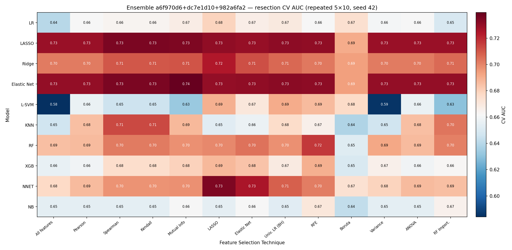
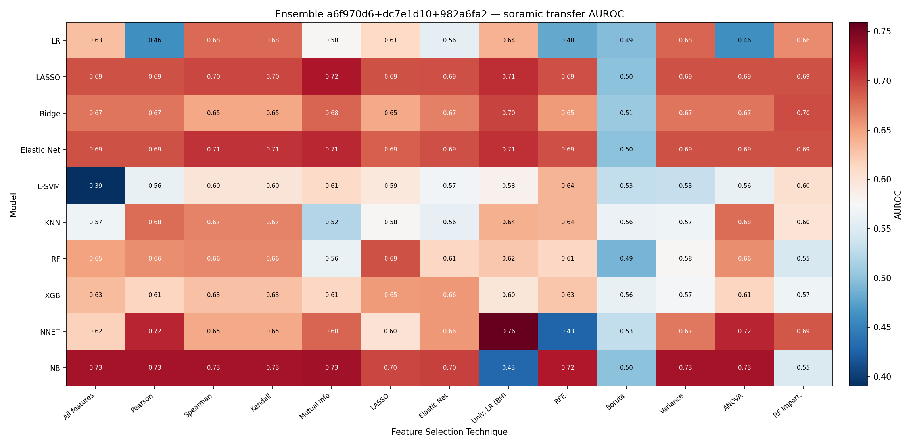
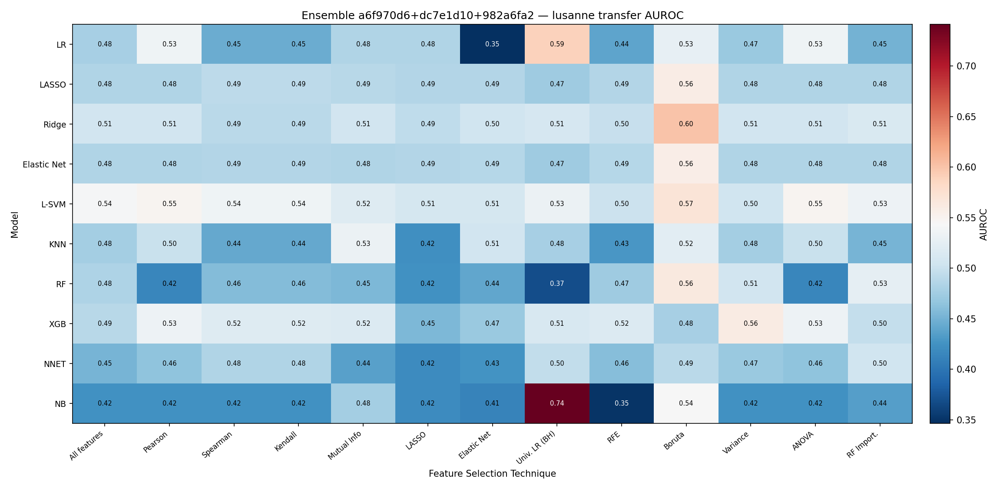
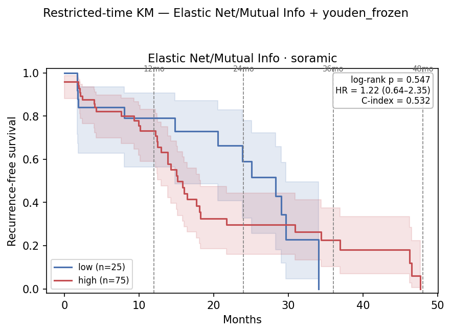
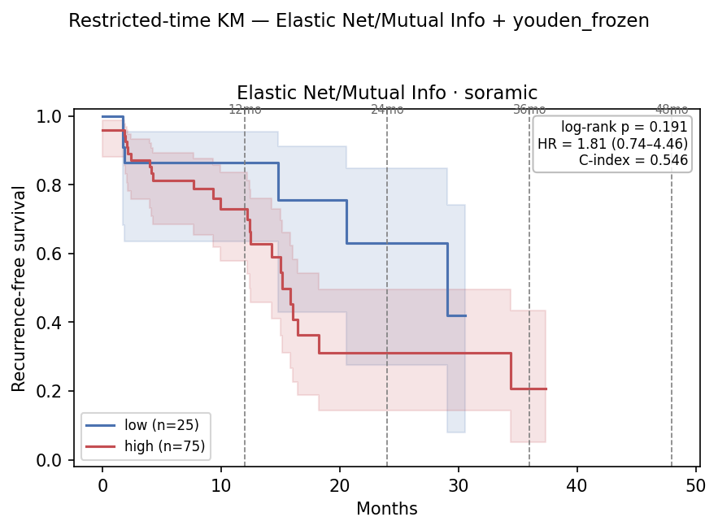

# Ensemble Embedding Grid Eval + Restricted-Time Survival — 2026-07-13

Mean-probability **ensemble** of the top-3 CV embeddings from
[`0713_embedding_grid_eval_v2.md`](0713_embedding_grid_eval_v2.md) §5 — **`a6f970d6` +
`dc7e1d10` + `982a6fa2`** (each image-only 128-dim). One grid pipeline is fit per
embedding (shared tuned hyperparameters); scores are averaged. The grid is ranked by
**repeated 5×10 resection CV** and transferred to Soramic/Lausanne (as v2 §6), then the
CV-best head is carried into restricted-time RFS/TTR (as
[`0713_restricted_time_survival_v2.md`](0713_restricted_time_survival_v2.md)).

## Table of Contents
- [1. Key findings](#1-key-findings)
- [2. Setup](#2-setup)
- [3. Ensemble grid — CV rank + transfer](#3-ensemble-grid--cv-rank--transfer)
- [4. Best head + cutoff selection](#4-best-head--cutoff-selection)
- [5. Restricted-time RFS](#5-restricted-time-rfs)
- [6. Restricted-time TTR](#6-restricted-time-ttr)
- [7. Ensemble vs single embeddings](#7-ensemble-vs-single-embeddings)
- [8. File references](#8-file-references)

## 1. Key findings

| # | Finding |
|---|---|
| 1 | **CV-best ensemble head = `Elastic Net / Mutual Info`, k=85** → resection CV **0.740**, Soramic **0.714**, Lausanne **0.485**. It recovers the Soramic-strong member's transfer (`dc7e1d10` 0.725) **and** lifts Lausanne off the floor (`dc7e1d10` 0.402 → 0.485, no longer inverted). |
| 2 | **Resection CV is selectable:** ρ(CV, Soramic) = **0.45**. Cohorts stay anti-correlated (ρ(Soramic, Lausanne) = −0.44); ρ(CV, Lausanne) = −0.09. |
| 3 | **Ensemble Elastic-Net scores saturate** (Soramic median 0.999), so median/kmeans frozen cutoffs collapse to **99/1**. Only **`youden_frozen`** (0.700) gives a deployable balanced split (Soramic **75/25**). |
| 4 | **Survival:** Soramic RFS τ=24 is a **borderline** signal (log-rank 0.073, point-p **0.055**); Lausanne is **null but not inverted** (HR≈1). Resection in-sample ceiling C-index 0.80–0.86. |

## 2. Setup

| | Resection (train) | Soramic (test) | Lausanne (test) |
|---|---:|---:|---:|
| Grid: embedding + `rfs_2year` | 54 (26 pos) | 57 (39 pos) | 66 (49 pos) |
| Survival: embedding + RFS | 60 (41 ev) | 100 (50 ev) | 68 (64 ev) |
| Survival: TTR events | 34 | 31 | 55 |

Patients are the **SID intersection** across the 3 embeddings (no loss here — all three share
the same cohort SIDs). Ensemble = mean of the per-embedding pipeline's positive-class score;
each pipeline is `SimpleImputer(median) → StandardScaler → selector(k) → classifier`. Grid CV
= flat repeated **5×10**, seed 42, `select_k ∈ {43, 85, 128}` tuned per embedding.

## 3. Ensemble grid — CV rank + transfer

10 classifiers × 13 feature-selection techniques (130 cells).





| Correlation across 130 cells | Spearman |
|---|---:|
| CV vs Soramic | **0.45** |
| CV vs Lausanne | −0.09 |
| Soramic vs Lausanne | **−0.44** |

**Top cells** (CV range 0.58–0.74, Soramic 0.39–0.76, Lausanne 0.35–0.74):

| Selected by | Classifier / FS | k | Res CV | Soramic | Lausanne |
|---|---|---:|---:|---:|---:|
| **CV (deployed)** | **Elastic Net / Mutual Info** | 85 | **0.740** | **0.714** | 0.485 |
| CV #2 | LASSO / Mutual Info | 85 | 0.735 | 0.724 | 0.489 |
| Soramic max | NNET / Univ. LR (BH) | 43 | 0.708 | 0.759 | 0.496 |
| Lausanne max | NB / Univ. LR (BH) | 43 | 0.653 | 0.429 | 0.741 |

The high-CV band (`Elastic Net`/`LASSO` + rank-correlation / Mutual-Info FS) sits at Soramic
0.70–0.72 — i.e. the CV argmax is inside the Soramic-warm zone, which is what makes it
selectable. Grid maxima (Soramic 0.759, Lausanne 0.741) fall in CV-cold rows, visible only
against the test cohort.

## 4. Best head + cutoff selection

Deployed head: **`Elastic Net` / `Mutual Info`, k=85** (`C=10, l1_ratio=0.8` by inner CV).
Its `predict_proba` saturates, so a frozen cutoff must be chosen to keep the low arm
populated. Frozen sweep (threshold from in-sample resection scores; `youden` uses the
training label only — leakage-free):

| Cutoff | Threshold | Soramic split | Lausanne split | Soramic τ=24 lr / pt-p | Soramic full lr | Lausanne full HR |
|---|---:|---:|---:|---:|---:|---:|
| median_frozen | 0.461 | 99 / 1 | 66 / 2 | — | 0.633 | 4.56 |
| kmeans_frozen | 0.494 | 99 / 1 | 66 / 2 | — | 0.633 | 4.56 |
| kmeans_log_frozen | 0.201 | 100 / 0 | 67 / 1 | — | — | 0.59 |
| **youden_frozen** | **0.700** | **75 / 25** | **33 / 35** | **0.073 / 0.055** | 0.547 | 1.12 |
| median_within* | 0.999 | 50 / 50 | 34 / 34 | 0.280 / 0.103 | 0.638 | 1.15 |

\*within-cohort (not deployable; shown for reference). **We adopt `youden_frozen`** — the only
frozen cutoff that avoids a degenerate low arm.

## 5. Restricted-time RFS

Head `Elastic Net / Mutual Info` (k=85), cutoff **youden_frozen**, RFS = `RFS_central`.
Splits: resection 28 hi / 32 lo (in-sample), Soramic 75 / 25, Lausanne 33 / 35.

**Resection — in-sample ceiling** (refit on own labels; complete separation early → HR→∞)

| τ | ev hi/lo | log-rank p | C-idx | ΔRMST (95% CI) |
|---:|---:|---:|---:|---:|
| 12 | 19 / 0 | <0.001 | 0.831 | −4.0 (−11.6, +3.6) |
| 24 | 26 / 0 | <0.001 | **0.859** | −14.1 (−27.0, −1.2) |
| 36 | 26 / 8 | <0.001 | 0.806 | −23.9 (−39.0, −8.8) |
| full | 26 / 15 | <0.001 | 0.804 | — |

**Soramic — transfer, 75 / 25**

| τ | ev hi/lo | HR (95% CI) | log-rank p | C-idx | point-p |
|---:|---:|---|---:|---:|---:|
| 12 | 15 / 5 | 1.20 (0.44–3.30) | 0.727 | 0.500 | 0.589 |
| **24** | **31 / 8** | 2.02 (0.92–4.42) | **0.073** | 0.537 | **0.055** |
| 36 | 33 / 13 | 1.22 (0.64–2.35) | 0.547 | 0.523 | — |
| full | 37 / 13 | 1.22 (0.64–2.35) | 0.547 | 0.523 | — |



**Lausanne — transfer, 33 / 35** — null, HR≈1 at every horizon (full HR 1.12, 0.68–1.85,
log-rank 0.643, C-idx ≈0.51). Not inverted, unlike `dc7e1d10`.

## 6. Restricted-time TTR

Endpoint `TTR_central`; identical splits, fewer events → less power.

| Cohort | τ=24 HR | τ=24 log-rank / point-p | full log-rank / HR | peak C-idx |
|---|---:|---:|---:|---:|
| Resection (in-sample) | ∞ (sep.) | <0.001 / — | <0.001 / — | 0.858 (τ=24) |
| Soramic (75/25) | 2.16 (0.82–5.69) | 0.112 / 0.112 | 0.191 / 1.81 | 0.522 |
| Lausanne (33/35) | 0.80 | 0.447 / 0.142 | 0.914 / 0.97 | 0.515 |



Same shape as RFS one power tier weaker: Soramic τ=24 softens to point-p 0.112; Lausanne null.

## 7. Ensemble vs single embeddings

Single-member CV-best from v2 §6.3 (same flat repeated-5×10 grid), vs the ensemble here:

| Head source | CV-best config | k | Res CV | Soramic | Lausanne |
|---|---|---:|---:|---:|---:|
| `dc7e1d10` | Ridge / RF Import. | 43 | 0.675 | **0.725** | 0.402 (inv.) |
| `982a6fa2` | Elastic Net / LASSO | 85 | 0.752 | 0.440 | **0.742** |
| `a6f970d6` | KNN / LASSO | 43 | 0.710 | 0.426 | 0.462 |
| **Ensemble** | Elastic Net / Mutual Info | 85 | 0.740 | **0.714** | 0.485 |

Restricted-time, deployable frozen cutoff:

| | `dc7e1d10` Ridge/RF Import. (kmeans, v2) | Ensemble Elastic Net/Mutual Info (youden) |
|---|---|---|
| Soramic split | 92 / 8 | 75 / 25 |
| Soramic RFS τ=24 log-rank / pt-p | **0.040 / 0.036** | 0.073 / 0.055 |
| Lausanne full HR | 0.85 (**inverted**) | 1.12 (null) |

**Net:** the ensemble matches the best single member's Soramic AUROC (0.714 vs 0.725) and is
slightly weaker on the Soramic 2-year survival split (borderline, pt-p 0.055 vs 0.036), but
**removes the Lausanne inversion** (null instead of anti-ranked) and is more CV-selectable
(ρ(CV,Soramic) 0.45). It does not create transfer where no member carries it.

## 8. File references

| Artifact | Path |
|---|---|
| Ensemble estimator + loader | `hcc_multimodal/eval/ensemble.py` (`EnsembleGrid`, `load_ensemble_aligned`) |
| Grid runner | `hcc_multimodal/eval/embedding_grid_eval.py --ensemble` |
| Survival scorer / runner | `hcc_multimodal/survival/grid_scores.py` (`route_grid_scores_ensemble`), `run_restricted.py --ensemble` |
| Grid CV / transfer CSVs + best | `results/eval/grid_ensemble/grid_{cv_auc,transfer_soramic,transfer_lusanne,best_by_cv}.csv` |
| Grid heatmaps | `reports/0713/ensemble/heatmap_{cv_auc,soramic_auroc,lusanne_auroc}.{png,svg}` |
| Cutoff sweep | `results/eval/survival/ensemble_cutoff_sweep.py` |
| Restricted tables | `results/eval/survival/restricted_time_{resection,soramic,lusanne}_ensemble3_enet_mi_youden{,_ttr}.csv` |
| KM figures | `reports/0713/ensemble/km_restricted_{cohort}_ensemble3_enet_mi_youden{,_ttr}.{png,svg}` |
| Members / parent report | [`0713_embedding_grid_eval_v2.md`](0713_embedding_grid_eval_v2.md), [`0713_restricted_time_survival_v2.md`](0713_restricted_time_survival_v2.md) |

Regenerate grid:
```
python -m hcc_multimodal.eval.embedding_grid_eval --task grid \
  --model-id a6f970d6 dc7e1d10 982a6fa2 --ensemble --cv-mode flat \
  --cv-repeats 10 --outer-folds 5 --select-k-fracs 0.333 0.667 1.0 \
  --output-dir results/eval/grid_ensemble --fig-dir reports/0713/ensemble
```
Regenerate survival (RFS; TTR adds `--time-col TTR_central --event-col TTR_central_event --tag …_ttr`):
```
python -m hcc_multimodal.survival.run_restricted --ensemble \
  --model-ids a6f970d6 dc7e1d10 982a6fa2 --fs "Mutual Info" --model "Elastic Net" \
  --select-k 85 --km --taus 12 24 36 48 --force-cutoff youden_frozen --freeze-on insample \
  --output-dir results/eval/survival --fig-dir reports/0713/ensemble --tag ensemble3_enet_mi_youden
```
