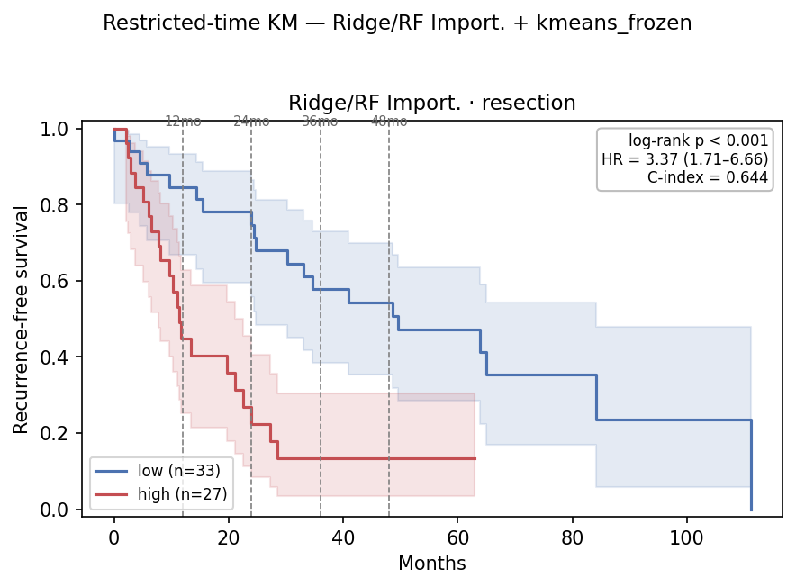
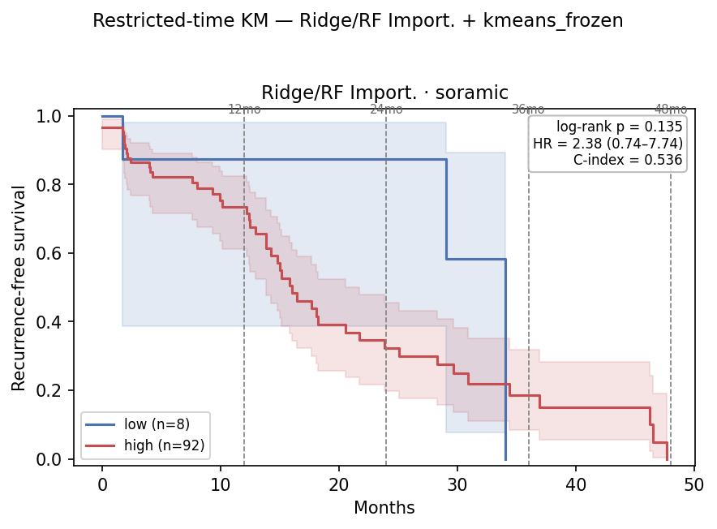
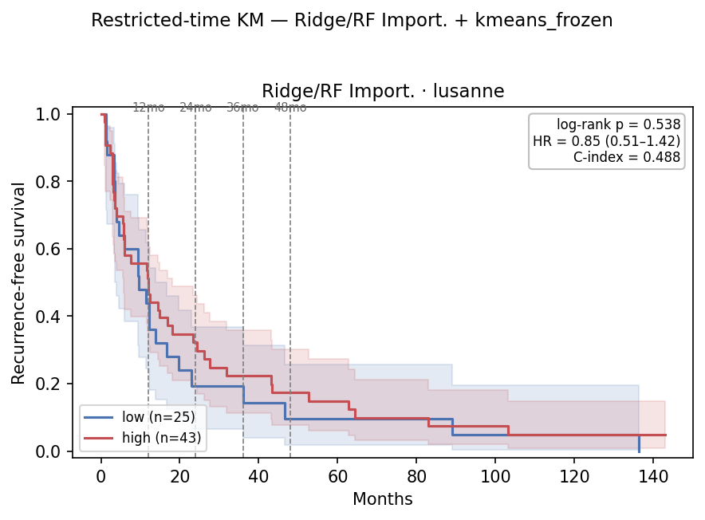
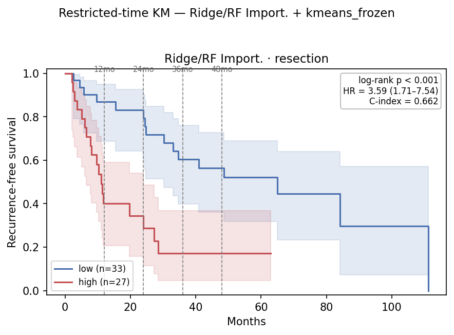
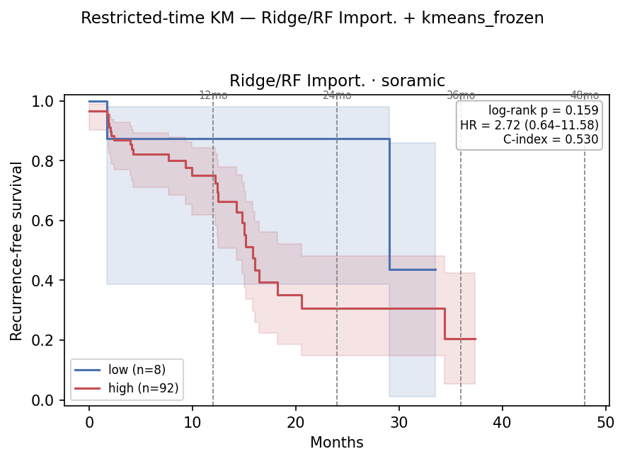
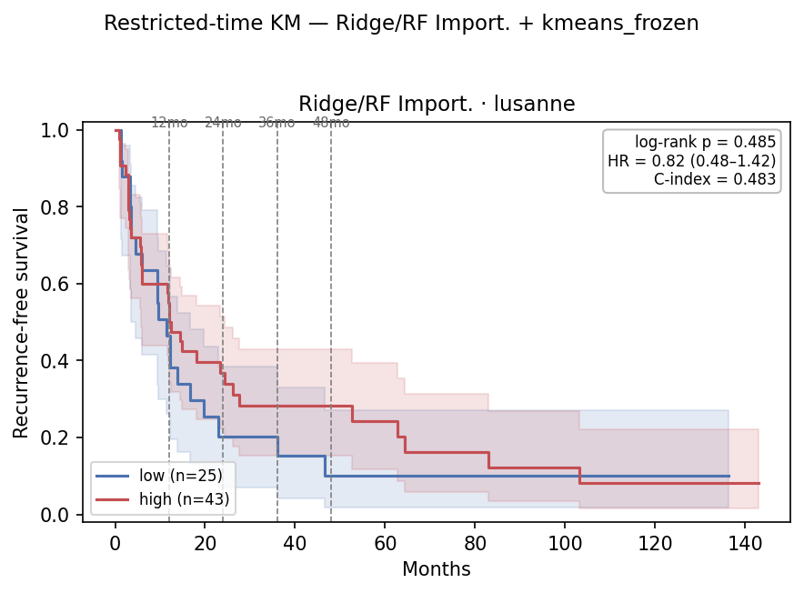

# Restricted-Time (Horizon-τ) Survival Analysis on the `dc7e1d10` Embedding — 2026-07-13

Companion to [`0713_embedding_grid_eval_v2.md`](0713_embedding_grid_eval_v2.md) §6, which selected a
deployable, seed-stable head on the `dc7e1d10` embedding: **`Ridge` classifier / `RF Import.` feature
selection, 43/128 features** (resectio
0713_restricted_time_survival_v2.mdn CV 0.675, Soramic 2-year RFS AUROC **0.725**, Lausanne 0.402).
This report takes that fixed head into the survival domain, mirroring the
[`0706_restricted_time_rfs.md`](../0706/0706_restricted_time_rfs.md) /
[`0706_restricted_time_ttr.md`](../0706/0706_restricted_time_ttr.md) protocol: freeze one cutoff on
resection, split each cohort, and re-read at horizons τ ∈ {12, 24, 36, 48} mo on **RFS and TTR**, two
readouts per horizon —

- **A — administrative censoring:** events after τ censored, times clipped to τ; KM median / log-rank
  / Cox HR / Harrell C on [0, τ].
- **B — RMST:** area under each arm's KM curve on [0, τ]. Per-arm RMST, ΔRMST (hi−lo, 95% CI), and the
  point-in-time survival-difference p at τ.

## Table of Contents
- [1. Cutoff selection → kmeans](#1-cutoff-selection--kmeans)
- [2. Setup](#2-setup)
- [3. RFS](#3-rfs)
  - [3.1 Resection — in-sample ceiling](#31-resection--in-sample-ceiling-27-hi--33-lo)
  - [3.2 Soramic — transfer](#32-soramic--transfer-92-hi--8-lo)
  - [3.3 Lausanne — transfer](#33-lausanne--transfer-43-hi--25-lo)
- [4. TTR](#4-ttr)
  - [4.1 Resection — in-sample ceiling](#41-resection--in-sample-ceiling-27-hi--33-lo)
  - [4.2 Soramic — transfer](#42-soramic--transfer-92-hi--8-lo)
  - [4.3 Lausanne — transfer](#43-lausanne--transfer-43-hi--25-lo)
- [5. RFS vs TTR, side by side](#5-rfs-vs-ttr-side-by-side)
- [6. Observations](#6-observations)
- [7. Comparison to `9109a6c2` LASSO/All (0706)](#7-comparison-to-9109a6c2-lassoall-0706)
- [8. File references](#8-file-references)

## 1. Cutoff selection → kmeans

A deployable head must fix its high/low boundary on the **training cohort alone** (it cannot use the
external cohort's own score distribution), so the sweep is restricted to the four resection-frozen
methods. The Ridge `expit(decision_function)` scores are tightly concentrated near 0.5, so all four
thresholds sit within 0.018 of each other:

| Cutoff | Threshold | Soramic split | Soramic τ=24 lr / pt-p | Soramic full lr | Lausanne full HR | Resection full lr |
|---|---:|---:|---:|---:|---:|---:|
| median | 0.480 | 94 / 6 | 0.114 / 0.081 | 0.408 | 0.73 | <0.001 |
| **kmeans** | **0.498** | **92 / 8** | **0.040 / 0.036** | 0.135 | 0.85 | <0.001 |
| kmeans-log | 0.488 | 94 / 6 | 0.114 / 0.081 | 0.408 | 0.73 | <0.001 |
| youden | 0.485 | 94 / 6 | 0.114 / 0.081 | 0.408 | 0.73 | <0.001 |

Only Soramic — whose score mass straddles the threshold — is cutoff-sensitive; resection stays
strongly separated and Lausanne stays inverted under every cutoff. `kmeans-log` and `youden` round to
the same 94/6 split as the median and leave a 6-patient low arm with too few events to resolve the
2-year contrast. **kmeans** (0.498) moves two Soramic patients into the low arm (6 → 8), which is
enough to clear the τ=24 signal (log-rank 0.040, point-p 0.036). We adopt **kmeans** as the cutoff;
the rest of this report reports kmeans only.

## 2. Setup

Head **`Ridge` / `RF Import.`**, **`select_k = 43`**, cutoff = **kmeans** (frozen on resection).
Scores via `route_grid_scores` (inner 3-fold `GridSearchCV` picks `RidgeClassifier` α; refit on all
labelled resection; `expit(decision_function)` on [0, 1]). Image-only 128-dim embeddings.

| | Resection | Soramic | Lausanne |
|---|---:|---:|---:|
| Patients (embedding + RFS) | 60 | 100 | 68 |
| RFS events, full follow-up | 41 | 50 | 64 |
| TTR events, full follow-up | 34 | 31 | 55 |
| Split (kmeans) | 27 hi / 33 lo* | **92 hi / 8 lo** | 43 hi / 25 lo |
| Max follow-up (mo) | ≈111 | ≈48 | ≈143 |

Splits are **endpoint-independent** (derived from RFS-based `rfs_2year`), so RFS and TTR share the
identical partition — only `time`/`event` differ. Soramic follow-up tops out near 48 mo, so its
**τ=48 ≈ full**; all Soramic TTR recurrences occur by ~34 mo, so Soramic **τ=36 ≈ 48 ≈ full** on TTR.

\* **Resection is the training cohort** — scores refit in-sample on all 60 patients, split at the
kmeans boundary of those scores. Because the head has seen resection's outcomes, resection is an
**optimistically biased training-fit ceiling**, not independent validation.

## 3. RFS

### 3.1 Resection — in-sample ceiling, 27 hi / 33 lo

| τ (mo) | ev hi/lo | HR (95% CI) | log-rank p | C-idx | ‖ | RMST hi/lo | ΔRMST (95% CI) | point-p |
|---:|---:|---|---:|---:|:--:|---:|---:|---:|
| 12 | 14 / 5 | 4.21 (1.51–11.73) | 0.003 | 0.710 | ‖ | 9.3 / 10.9 | −1.5 (−10.5, +7.4) | 0.003 |
| 24 | 19 / 7 | 5.00 (2.08–12.02) | <0.001 | 0.718 | ‖ | 13.9 / 20.4 | −6.6 (−27.9, +14.8) | <0.001 |
| 36 | 21 / 13 | 3.81 (1.86–7.79) | <0.001 | 0.687 | ‖ | 15.8 / 28.3 | −12.4 (−44.1, +19.2) | <0.001 |
| 48 | 21 / 14 | 3.66 (1.81–7.39) | <0.001 | 0.685 | ‖ | 17.4 / 35.0 | −17.5 (−60.5, +25.5) | 0.002 |
| full | 21 / 20 | 3.37 (1.71–6.66) | <0.001 | 0.672 | ‖ | — | — | — |

Strong separation at every horizon — expected when the head is refit on these labels. C-index peaks
at **τ=24 (0.718)**; ΔRMST grows to −17.5 mo. The gap to the ≈0.54 Soramic / ≈0.50 Lausanne transfer
C-index (§3.2–3.3) is the honest measure of what survives.

*Ridge/RF Import., RFS, resection (in-sample refit). SVG alongside.*

### 3.2 Soramic — transfer, 92 hi / 8 lo

| τ (mo) | ev hi/lo | HR (95% CI) | log-rank p | C-idx | ‖ | RMST hi/lo | ΔRMST (95% CI) | point-p |
|---:|---:|---|---:|---:|:--:|---:|---:|---:|
| 12 | 19 / 1 | 2.07 (0.28–15.50) | 0.468 | 0.508 | ‖ | 10.0 / 10.7 | −0.7 (−10.8, +9.3) | 0.416 |
| **24** | **38 / 1** | 6.19 (0.85–45.29) | **0.040** | 0.544 | ‖ | 15.6 / 21.2 | −5.6 (−26.9, +15.7) | **0.036** |
| 36 | 43 / 3 | 2.38 (0.74–7.74) | 0.135 | 0.537 | ‖ | 18.7 / 28.5 | −9.9 (−40.7, +20.9) | 0.000† |
| 48 ≈ full | 47 / 3 | 2.38 (0.74–7.74) | 0.135 | 0.536 | ‖ | 20.3 / 28.5 | −8.2 (−43.2, +26.8) | — |

The 2-year separation **clears significance** (log-rank 0.040, point-p 0.036); the HR (6.19) is
inflated by the 1-event low arm, so read the log-rank and point-p. Full follow-up softens to HR 2.38
(log-rank 0.135) — the signal is localized at τ=24. †The τ=36 point-p 0.000 is a degenerate
point-in-time variance estimate on the small low arm, not a real signal; the log-rank (0.135) is the
reliable read.

*Ridge/RF Import., RFS, Soramic (92/8). τ=24 log-rank 0.040. SVG alongside.*

### 3.3 Lausanne — transfer, 43 hi / 25 lo

| τ (mo) | ev hi/lo | HR (95% CI) | log-rank p | C-idx | ‖ | RMST hi/lo | ΔRMST (95% CI) | point-p |
|---:|---:|---|---:|---:|:--:|---:|---:|---:|
| 12 | 21 / 14 | 0.88 (0.45–1.73) | 0.706 | 0.509 | ‖ | 8.3 / 8.2 | +0.1 (−11.7, +12.0) | 0.566 |
| 24 | 29 / 20 | 0.79 (0.44–1.40) | 0.413 | 0.497 | ‖ | 12.8 / 11.6 | +1.3 (−22.9, +25.5) | 0.241 |
| 36 | 33 / 20 | 0.87 (0.50–1.52) | 0.624 | 0.499 | ‖ | 15.9 / 13.9 | +2.0 (−33.3, +37.3) | 0.764 |
| 48 | 35 / 22 | 0.82 (0.48–1.40) | 0.473 | 0.494 | ‖ | 18.3 / 15.5 | +2.8 (−42.5, +48.1) | 0.391 |
| full | 40 / 24 | 0.85 (0.51–1.42) | 0.538 | 0.496 | ‖ | — | — | — |

**Inverted, not just null.** Every HR is < 1 and every ΔRMST is positive — the arm labelled high-risk
accrues *more* event-free time. C-index sits at/below 0.50. This is the survival reflection of the
below-chance Lausanne AUROC (0.402): the head mildly anti-ranks Lausanne. No horizon is significant.

*Ridge/RF Import., RFS, Lausanne (43/25). Arms overlap/cross (HR<1). SVG alongside.*

## 4. TTR

Endpoint `TTR_central` / `TTR_central_event`; splits identical to §3. TTR counts *only* recurrence
(deaths censored) → fewer events (31 vs 50 on Soramic), less power.

### 4.1 Resection — in-sample ceiling, 27 hi / 33 lo

| τ (mo) | ev hi/lo | HR (95% CI) | log-rank p | C-idx | ‖ | RMST hi/lo | ΔRMST (95% CI) | point-p |
|---:|---:|---|---:|---:|:--:|---:|---:|---:|
| 12 | 14 / 4 | 5.76 (1.89–17.56) | <0.001 | 0.744 | ‖ | 9.1 / 11.2 | −2.1 (−10.3, +6.2) | 0.001 |
| 24 | 16 / 5 | 5.94 (2.15–16.38) | <0.001 | 0.736 | ‖ | 13.7 / 21.3 | −7.6 (−28.3, +13.1) | <0.001 |
| 36 | 18 / 11 | 3.99 (1.84–8.66) | <0.001 | 0.694 | ‖ | 16.2 / 29.6 | −13.4 (−44.7, +18.0) | 0.003 |
| 48 | 18 / 12 | 3.79 (1.78–8.08) | <0.001 | 0.691 | ‖ | 18.3 / 36.6 | −18.3 (−61.3, +24.7) | 0.006 |
| full | 18 / 16 | 3.59 (1.71–7.54) | <0.001 | 0.684 | ‖ | — | — | — |

Mirrors the RFS resection table one power tier stronger on C-index (peaks τ=12 at 0.744); all
log-rank p ≤ 0.001.

*Ridge/RF Import., TTR, resection (in-sample refit). SVG alongside.*

### 4.2 Soramic — transfer, 92 hi / 8 lo

| τ (mo) | ev hi/lo | HR (95% CI) | log-rank p | C-idx | ‖ | RMST hi/lo | ΔRMST (95% CI) | point-p |
|---:|---:|---|---:|---:|:--:|---:|---:|---:|
| 12 | 16 / 1 | 1.83 (0.24–13.83) | 0.552 | 0.523 | ‖ | 10.0 / 10.7 | −0.7 (−10.6, +9.3) | 0.464 |
| **24** | **28 / 1** | 5.36 (0.72–39.83) | 0.066 | 0.541 | ‖ | 15.3 / 21.2 | −5.9 (−26.8, +15.0) | **0.034** |
| 36 ≈ full | 29 / 2 | 2.72 (0.64–11.58) | 0.159 | 0.539 | ‖ | 18.8 / 28.7 | −9.8 (−41.6, +22.0) | 0.481 |
| 48 ≈ full | 29 / 2 | 2.72 (0.64–11.58) | 0.159 | 0.539 | ‖ | 21.3 / 33.9 | −12.6 (−55.7, +30.5) | 0.481 |

Same shape as RFS: the τ=24 point-p (0.034) clears the line, log-rank (0.066) sits just above it with
only 1 low-arm recurrence; full follow-up softens to HR 2.72 (log-rank 0.159).

*Ridge/RF Import., TTR, Soramic (92/8). SVG alongside.*

### 4.3 Lausanne — transfer, 43 hi / 25 lo

| τ (mo) | ev hi/lo | HR (95% CI) | log-rank p | C-idx | ‖ | RMST hi/lo | ΔRMST (95% CI) | point-p |
|---:|---:|---|---:|---:|:--:|---:|---:|---:|
| 12 | 19 / 13 | 0.85 (0.42–1.73) | 0.662 | 0.497 | ‖ | 8.6 / 8.4 | +0.1 (−11.7, +11.9) | 0.503 |
| 24 | 26 / 19 | 0.74 (0.41–1.35) | 0.326 | 0.483 | ‖ | 13.6 / 12.1 | +1.6 (−22.9, +26.0) | 0.161 |
| 36 | 29 / 19 | 0.81 (0.45–1.44) | 0.468 | 0.484 | ‖ | 17.2 / 14.5 | +2.7 (−33.4, +38.9) | 0.479 |
| 48 | 29 / 21 | 0.72 (0.41–1.27) | 0.259 | 0.480 | ‖ | 20.6 / 16.2 | +4.4 (−43.2, +52.0) | 0.089 |
| full | 34 / 21 | 0.82 (0.48–1.42) | 0.485 | 0.484 | ‖ | — | — | — |

Same inverted, null picture as RFS — HR < 1, ΔRMST positive, C-index ≈ 0.48, no horizon significant.

*Ridge/RF Import., TTR, Lausanne (43/25). SVG alongside.*

## 5. RFS vs TTR, side by side

| Cohort | Metric | RFS | TTR |
|---|---|---:|---:|
| Resection (in-sample) | full log-rank / HR | **<0.001** / 3.37 | **<0.001** / 3.59 |
| Resection (in-sample) | peak C-index | 0.718 (τ=24) | 0.744 (τ=12) |
| Soramic | τ=24 log-rank / point-p | **0.040** / **0.036** | 0.066 / **0.034** |
| Soramic | full log-rank | 0.135 | 0.159 |
| Lausanne | full log-rank / HR | 0.538 / 0.85 | 0.485 / 0.82 |

Every qualitative conclusion holds across endpoints: resection is the strongly-separated in-sample
ceiling; Soramic carries a significant 2-year point signal; Lausanne is inverted/null (HR<1). TTR's
lower event count leaves the picture unchanged.

## 6. Observations

1. **Resection is the in-sample ceiling, not validation** — C-index ≈0.67–0.74 refit on its own
   labels; the gap to ≈0.54 (Soramic) / ≈0.48 (Lausanne) transfer C-index is what survives.
2. **Soramic recurrence is a real 2-year signal** — localized at τ=24 (RFS log-rank 0.040, point-p
   0.036; TTR point-p 0.034), softening to HR 2.38 (RFS) / 2.72 (TTR) at full follow-up. The high
   Soramic AUROC (0.725) translated into a significant survival split once the kmeans cutoff kept the
   low arm populated (8 patients vs the median's 6).
3. **Lausanne is inverted** — HR < 1 and ΔRMST > 0 at every horizon, C-index ≈0.48. Consistent with
   the below-chance Lausanne AUROC (0.402): the head mildly anti-ranks Lausanne.
4. **ΔRMST directional-only** — clear and growing on resection, CI-limited (and sign-flipped on
   Lausanne) on the external cohorts.

## 7. Comparison to `9109a6c2` LASSO/All (0706)

Both are frozen resection-cutoff heads on image-only embeddings, so they are directly comparable as
survival stratifiers. `9109a6c2` rows use its `median_frozen` cutoff; `dc7e1d10` uses kmeans (§1):

| | `9109a6c2` LASSO/All | `dc7e1d10` Ridge/RF Import. (kmeans) |
|---|---|---|
| Soramic 2-year AUROC | 0.732 | 0.725 |
| Soramic split (hi/lo) | 85 / 15 | 92 / 8 |
| Soramic RFS τ=24 log-rank / point-p | 0.050 / **0.006** | **0.040** / 0.036 |
| Soramic RFS full log-rank | 0.205 | 0.135 |
| Lausanne split (hi/lo) | 50 / 18 | 43 / 25 |
| Lausanne RFS full log-rank / HR | 0.079 / **1.68** | 0.538 / **0.85 (inverted)** |
| Lausanne early (τ=12) log-rank | **0.034** | 0.706 |

On Soramic the two are close: `dc7e1d10`'s τ=24 log-rank (0.040) edges below `9109a6c2`'s (0.050),
though its point-p (0.036) stays weaker than `9109a6c2`'s 0.006. On **Lausanne the gap is real**:
`dc7e1d10` is inverted (HR 0.85) where `9109a6c2` had a genuine early signal (τ=12 log-rank 0.034, HR
1.68). Net: `dc7e1d10` matches `9109a6c2` on the Soramic 2-year log-rank but has no Lausanne signal —
it does not supersede `9109a6c2` as an all-cohort stratifier.

## 8. File references

| Artifact | Path |
|---|---|
| Restricted-time core (A+B) | `hcc_multimodal/survival/restricted.py` |
| Runner | `hcc_multimodal/survival/run_restricted.py` |
| Head scoring | `hcc_multimodal/survival/grid_scores.py` (`route_grid_scores`, `select_k=43`) |
| RFS command | `python -m hcc_multimodal.survival.run_restricted --model-id dc7e1d10 --fs "RF Import." --model "Ridge" --select-k 43 --top 5 --km --taus 12 24 36 48 --force-cutoff kmeans_frozen --freeze-on insample --output-dir results/eval/survival --fig-dir reports/0713 --tag dc7e1d10_ridge_rfimport_kmeans` |
| TTR command | same + `--time-col TTR_central --event-col TTR_central_event --tag dc7e1d10_ridge_rfimport_kmeans_ttr` |
| RFS tables | `results/eval/survival/restricted_time_{resection,soramic,lusanne}_dc7e1d10_ridge_rfimport_kmeans.csv` |
| TTR tables | `results/eval/survival/restricted_time_{resection,soramic,lusanne}_dc7e1d10_ridge_rfimport_kmeans_ttr.csv` |
| KM figures | `reports/0713/km_restricted_{resection,soramic,lusanne}_dc7e1d10_ridge_rfimport_kmeans{,_ttr}.{png,svg}` |
| §1 cutoff sweep | `results/eval/survival/cutoff_sweep/cutoff_sweep.{py,csv}` (all four resection-frozen methods, one scoring pass) |
| Head selection / grid | [`0713_embedding_grid_eval_v2.md`](0713_embedding_grid_eval_v2.md) §6 |
| Prior `9109a6c2` counterpart | [`../0706/0706_restricted_time_rfs.md`](../0706/0706_restricted_time_rfs.md), [`../0706/0706_restricted_time_ttr.md`](../0706/0706_restricted_time_ttr.md) |
