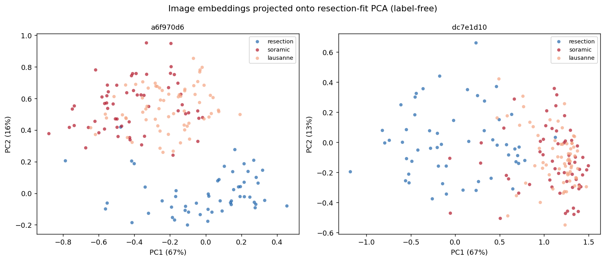

# Why CV-#1 `a6f970d6` Collapses on Soramic — 2026-07-20

Diagnoses why the resection-CV-top embedding (`a6f970d6`, CV 0.714) is **chance on Soramic
(0.494)** while CV-#2 (`dc7e1d10`, CV 0.695) transfers to **0.718** — using only label-free
signals (training config, embedding geometry, distribution drift). All embeddings are the
**image-only 128-dim** best-val checkpoint (`data.py:41` loads `best_model.pt`), read from the
same caches as `0713_embedding_grid_eval_v2.md` §5.

**Population.** All numbers below are on the **2yr-RFS-labeled** patients only — the exact
population the transfer AUCs are computed on: **resection 54, Soramic 57, Lausanne 66**
(cache ∩ outcome table). The geometry is label-free but is measured on this subset so it is
apples-to-apples with the AUCs. (Using all cached patients instead shifts every number ≤0.07 and
flips no gate — the conclusion is robust to the choice.)

## 1. Key findings

| # | Finding |
|---|---|
| 1 | `a6f970d6`'s failure is **predictable without Soramic labels.** It is a collapsed representation whose Soramic points land outside the resection training manifold. |
| 2 | **Representational collapse.** resection embeddings are near-collinear: mean pairwise cosine **0.995 (≈6°)** vs `dc7e1d10` 0.956 (≈17°); norms constant to ±0.9% vs ±16%. |
| 3 | **Soramic lands off-manifold.** 54% of Soramic cells fall outside resection's per-dim support (vs 40%); centroid gap 47 vs 24 resection-σ. See PCA figure §5. |
| 4 | **KS drift is a real label-free selector.** Across 17 models ρ(resection→Soramic KS D, Soramic AUC) = **−0.62**, vs resection CV's **+0.06**. Higher drift → worse transfer. |
| 5 | **Not an overtraining artifact.** Embeddings use the min-val checkpoint, so val-loss divergence does not apply; collapse is present *at* best-val — it is the config (unfrozen, λ=0), not training duration. |
| 6 | **A 2-gate label-free filter picks the winner (§7).** Across the top-5 CV models ρ(CV, Soramic) = **−0.10**; gating on *no collapse* (cosine < 0.98) **and** *in-support* (oos < 0.45, centroid < 3σ/dim) leaves only `dc7e1d10` & `a64b245f` — the two best transfers — and `dc7e1d10` wins both. |

## 2. The two models

| | `a6f970d6` (CV #1) | `dc7e1d10` (CV #2) |
|---|---|---|
| Config | raw, λ=**0.0**, **unfrozen**, n=10, patient | raw, λ=**0.1**, **frozen**, n=all, slice |
| epochs / base | 50 / none | 5 / `3e598f36` |
| Resection CV / Soramic / Lausanne | 0.714 / **0.494** / 0.618 | 0.695 / **0.718** / 0.453 |

An unfrozen ViT-B fine-tuned 50 epochs on 54 resection patients with no gene regularization
(λ=0) collapses the backbone onto resection; a frozen 5-epoch head cannot.

## 3. Representational collapse (on resection embeddings only)

| resection metric | `a6f970d6` | `dc7e1d10` | reads as |
|---|--:|--:|---|
| norm ‖x‖ (mean ± std) | 4.531 ± **0.040** (~0.9%) | 2.454 ± 0.400 (~16%) | a6 lengths near-constant |
| mean pairwise cosine | **0.995** (≈5.9°) | 0.956 (≈17.0°) | a6 vectors near-parallel |
| effective rank (PR) | 2.07 / 128 | 2.12 / 128 | both low-dim |

`a6f970d6`'s resection cloud is a razor-thin spherical cap (fixed radius, ~6° angular spread).
The pipeline's `StandardScaler` then rescales these near-zero-variance directions to unit
variance, so the LR head keys on **resection-idiosyncratic noise axes** — high in-sample CV, zero
generalization. `dc7e1d10` retains angular spread (~17°) carrying real structure.

## 4. Soramic lands outside the training support

| resection → Soramic | `a6f970d6` | `dc7e1d10` |
|---|--:|--:|
| cells outside resection per-dim support | **54.2%** | 39.7% |
| centroid gap (resection-σ units) | **47.4** (≈4.2σ/dim) | 24.4 (≈2.2σ/dim) |
| proxy-A domain AUC | 1.000 | 1.000 |

Over half of `a6f970d6`'s Soramic inputs fall in a range resection never produced — the head
extrapolates on the majority of inputs. The centroid gap is measured in **resection-σ** because
`StandardScaler` divides by resection σ, so this is literally the shift the classifier sees; a6's
thin cloud (small σ) amplifies it to ~4σ/dim. **proxy-A AUC saturates at 1.000 for both** (small n,
128 dims) — not discriminative; the σ-normalized metrics are.

## 5. PCA projection (resection-fit axes, label-free)



Projecting all three cohorts onto **resection-fit** PCA: `a6f970d6` (left) places Soramic/Lausanne
in a band **disjoint** from resection — no overlap, so any resection-fit boundary is meaningless.
`dc7e1d10` (right) Soramic **overlaps** the resection cloud, so the head partially generalizes.

## 6. KS distribution drift

### 6.1 Per-dimension D distribution (128 dims)

| model | pair | min | p25 | med | p75 | p95 | max | frac_sig |
|---|---|--:|--:|--:|--:|--:|--:|--:|
| `a6f970d6` | resection·soramic | 0.194 | 0.524 | **0.690** | 0.911 | 1.000 | 1.000 | 0.977 |
| `a6f970d6` | resection·lausanne | 0.157 | 0.511 | 0.756 | 0.922 | 1.000 | 1.000 | 0.938 |
| `a6f970d6` | soramic·lausanne | 0.071 | 0.143 | **0.211** | 0.278 | 0.427 | 0.500 | 0.391 |
| `dc7e1d10` | resection·soramic | 0.135 | 0.463 | **0.659** | 0.821 | 0.947 | 1.000 | 0.938 |
| `dc7e1d10` | resection·lausanne | 0.118 | 0.444 | 0.669 | 0.837 | 0.945 | 0.966 | 0.938 |
| `dc7e1d10` | soramic·lausanne | 0.062 | 0.203 | 0.275 | 0.373 | 0.470 | 0.514 | 0.617 |

Two things beyond the median: (a) a6's **upper tail is heavier** — p95 = **1.000** (its top ~5% of
dims are fully disjoint between resection and Soramic) vs dc 0.947. (b) a6's soramic·lausanne D =
**0.211** (the two external cohorts look near-identical) while both sit ~0.69–0.76 from resection —
**resection is the outlier**, matching the disjoint blue cluster in §5.

### 6.2 KS drift predicts Soramic transfer (17 models)

| Label-free predictor | ρ with Soramic AUC |
|---|--:|
| **resection→Soramic KS median D** | **−0.620** |
| resection→Soramic frac_sig | −0.515 |
| resection CV AUC (report §5) | +0.06 |

Resection CV cannot pick a transferable model (ρ=+0.06); unlabeled-Soramic KS drift predicts it at
**ρ=−0.62**. Caveats: (a) KS D alone doesn't make a6 the single worst (0.690 = 11th of 17), but the
top-drift models (`8715461c` 0.972, `f8aabb75` 0.963) transfer at ~0.53 — a6's *chance* result needs
the collapse/off-support geometry too; use KS **with** out-of-support. (b) KS predicts Soramic but
**not** Lausanne (ρ=+0.21) — consistent with the two cohorts being anti-correlated (report §2).

## 7. Compare top-5 CV models

To justify picking CV-#2 `dc7e1d10` we run the §3–6 label-free diagnostics on all **top-5
resection-CV** embeddings. Columns are the discriminating metrics only (resection cohort;
`→soramic` for support/KS).

| CV# | Model | CV | **Soramic** | cosine (∠) | norm variation | oos | centroid σ/dim | KS med |
|:--:|---|--:|--:|--:|--:|--:|--:|--:|
| 1 | `a6f970d6` | 0.714 | 0.494 | 0.995 (6°) | 0.9% | 0.542 | 4.19 | 0.690 |
| **2** | **`dc7e1d10`** | 0.695 | **0.718** | 0.956 (17°) | 16.3% | 0.397 | 2.15 | 0.659 |
| 3 | `982a6fa2` | 0.677 | 0.606 | 0.992 (7°) | 3.0% | 0.473 | 3.49 | 0.743 |
| 4 | `a64b245f` | 0.665 | 0.684 | 0.901 (26°) | 12.9% | 0.325 | 2.43 | 0.603 |
| 5 | `92b9afed` | 0.662 | 0.577 | 0.943 (19°) | 7.4% | 0.610 | 4.80 | 0.843 |


## 8. Conclusion

`a6f970d6`'s high CV is an artifact of an unfrozen/λ=0 backbone collapsing resection into a
near-collinear thin cloud, on which `StandardScaler`+LR fits noise directions. It is predictably
un-transferable from three independent label-free signals: **collapse geometry** (cosine 0.995),
**off-manifold target** (54% out-of-support, 4σ/dim), and **KS drift** (−0.62 vs Soramic AUC across
17 models). `dc7e1d10` is milder on every axis, and among the top-5 CV models it is the only one
(with `a64b245f`) that clears both the collapse and support gates (§7) — that is the affirmative
case for selecting it. **Select for transfer with collapse + drift on the unlabeled target, not
resection CV.**

## 9. Reproduce

All four angles are scripted under `hcc_multimodal/eval/diagnose/` (reusing
`embedding_drift.py`); see its `README.md`. `--labeled-only` restricts to the 2yr-RFS-labeled
population used throughout this report. `TOP5="a6f970d6 dc7e1d10 982a6fa2 a64b245f 92b9afed"`
reproduces §7 (drop to the first two for §3–6).

```bash
python -m hcc_multimodal.eval.diagnose.collapse $TOP5 --cohort resection --labeled-only                    # §3, §7
python -m hcc_multimodal.eval.diagnose.support  $TOP5 --src resection --dst soramic lausanne --labeled-only # §4, §7
python -m hcc_multimodal.eval.diagnose.pca      a6f970d6 dc7e1d10 --labeled-only --out reports/0720/drift_pca_a6_vs_dc.png  # §5
python -m hcc_multimodal.eval.diagnose.ks       $TOP5 --labeled-only                                        # §6.1, §7
python -m hcc_multimodal.eval.diagnose.ks       --corr --target soramic --labeled-only                      # §6.2
```

## 10. File references

| Artifact | Path |
|---|---|
| Diagnose scripts | `hcc_multimodal/eval/diagnose/{collapse,support,pca,ks,common}.py` |
| Labeled population | `load_{resection,ablation}_outcomes('rfs_2year')` ∩ cache SID → 54 / 57 / 66 |
| Embedding caches | `training/contrastive/{a6f970d6,dc7e1d10}/cached_embeddings/{resection_img_emb,ablation_{soramic,lusanne}_img_emb_raw}.parquet` |
| Checkpoint used | `best_model.pt` (min-val), via `hcc_multimodal/eval/data.py:41` |
| KS drift table (all 17) | `results/eval/embedding_drift.csv`, `hcc_multimodal/eval/embedding_drift.py` |
| Transfer / CV source | `reports/0713/0713_embedding_grid_eval_v2.md` §5 |
| PCA figure | `reports/0720/drift_pca_a6_vs_dc.png` |
