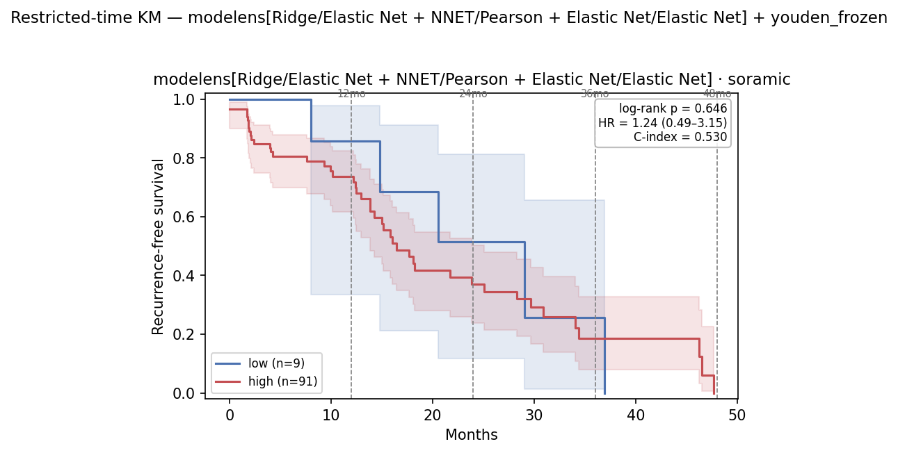

# Embedding Grid Eval v3 — Flat 3-fold CV + Decoupled Model Ensemble — 2026-07-20

Successor to [`0713_embedding_grid_eval_v2.md`](../0713/0713_embedding_grid_eval_v2.md) and
[`0713_ensemble_grid_eval.md`](../0713/0713_ensemble_grid_eval.md). Two changes:

1. **Flat, non-repeated 3-fold** resection CV for the grid (was repeated 5×10), so the grid
   is on the same CV scale as the v2 §5 "Results — CV rank" table. Anchor check: the
   `LASSO`/`All features` grid cell (= saga-L1 LR, no FS — the §5 head) should reproduce the
   §5 CV number.
2. A **model ensemble** — the top-3 *distinct* classifiers (each at its own best FS),
   mean-averaged — that is **fully decoupled** from the existing *embedding* ensemble. Both
   are run for two settings: **A** the single embedding `dc7e1d10`, **B** the
   `a6f970d6 + dc7e1d10 + 982a6fa2` embedding ensemble. Each setting reports **both** the
   best single model×feature cell **and** the top-3 model ensemble.

## Table of Contents
- [1. Key findings](#1-key-findings)
- [2. Setup](#2-setup)
- [3. Method](#3-method)
- [4. Setting A — dc7e1d10 (single embedding)](#4-setting-a--dc7e1d10-single-embedding)
- [5. Setting B — 3-embedding ensemble](#5-setting-b--3-embedding-ensemble)
- [6. Restricted-time survival — Soramic (4 heads)](#6-restricted-time-survival--soramic-4-heads)
- [7. File references](#7-file-references)

## 1. Key findings

| embedding | best single model | top-3 model ensemble |
|---|---:|---:|
|dc7e1d10 (second best on Resection)|0.709|0.697|
|top 3 on Resection - ensemble|0.668|0.694|


## 2. Setup


| | Resection (train) | Soramic (test) | Lausanne (test) |
|---|---:|---:|---:|
| Embedding + `rfs_2year` | 54 (26 pos, 48%) | 57 (39 pos, 68%) | 66 (49 pos, 74%) |

All embeddings image-only 128-dim, read from the survival `resection_img_emb.parquet` /
`ablation_{cohort}_img_emb_{raw,bbox}.parquet` extraction (patient-level, aligned on `SID`) —
the same cache as v2 §5, so the grid CV and the §5 CV-rank numbers are directly comparable.
Setting B patients are the SID intersection across the 3 embeddings (no loss).

## 3. Method

- **Grid** — 10 classifiers × 13 feature-selection techniques (130 cells), pipeline
  `SimpleImputer(median) → StandardScaler → selector(k) → classifier`, `select_k ∈ {43, 85, 128}`
  tuned per cell. Ranked by **flat non-repeated 3-fold** resection CV (`GridSearchCV.best_score_`),
  refit, transferred to Soramic/Lausanne. Setting B fits one pipeline per embedding with one
  shared tuned head and averages the scores (`EnsembleGrid`).
- **Model ensemble** — for each classifier take its **max CV AUC across the 13 FS** (its
  "potential"); rank; take the **top-3 distinct** classifiers, each frozen at its argmax-FS cell
  (fs + `select_k` + tuned hyperparameters). Mean-average the 3 members' positive-class scores
  (`HeteroEnsembleGrid`). Ensemble CV = plain 3-fold over the frozen ensemble; transfer = refit
  on all resection. In Setting B each member is itself an embedding ensemble → net mean over
  (embedding × model). Members' configs are chosen on all resection folds, so the ensemble's own
  CV is mildly optimistic — resection CV is a selection signal, the external cohorts are the estimate.

## 4. Setting A — dc7e1d10 (single embedding)

### 4.1 Flat 3-fold grid + anchor check


| | CV AUC | Soramic | Lausanne |
|---|---:|---:|---:|
| Anchor `LASSO`/`All features` | 0.695 ± 0.117 | 0.718 | 0.419 |
| Best single cell — `Ridge`/`Variance`, k=85 | **0.744** | 0.709 | 0.436 |

Grid CV range 0.428–0.744. The anchor matches §5's dc7e1d10 LR-head number: §5 originally read
**0.699** using the `baselines/config.py` LR at `max_iter=1000`, which does not converge on the
128-dim embedding. The baseline LR is now bumped to `max_iter=5000` (matching the grid's `LASSO`),
so §5 reads **0.695** and equals this anchor; forcing either estimator to `max_iter=20000` also gives
**0.6947**. (Updated `0713_ablation_eval_v3.md` §4 / `0713_embedding_grid_eval_v2.md` §5.)

### 4.2 Top-3 model ensemble

Per-classifier potential (best CV across FS): Ridge 0.744, Elastic Net 0.744, L-SVM 0.740,
LASSO 0.736, LR 0.715, XGB 0.693, NB 0.674, NNET 0.665, RF 0.641, KNN 0.618.

| Member | FS | k | CV AUC | Soramic | Lausanne |
|---|---|---:|---:|---:|---:|
| Ridge | Variance | 85 | 0.744 | | |
| Elastic Net | RF Import. | 43 | 0.744 | | |
| L-SVM | RF Import. | 43 | 0.740 | | |
| **Ensemble (mean)** | — | — | **0.728** | **0.697** | **0.397** |

## 5. Setting B — 3-embedding ensemble

### 5.1 Flat 3-fold grid (embedding-ensemble cells)


| | CV AUC | Soramic | Lausanne |
|---|---:|---:|---:|
| Anchor `LASSO`/`All features` | 0.789 | 0.692 | 0.485 |
| Best single cell — `Ridge`/`Elastic Net`, k=43 | **0.814** | 0.668 | 0.504 |

Grid CV range 0.575–0.814.

### 5.2 Top-3 model ensemble (each member an embedding ensemble)

Per-classifier potential: Ridge 0.814, NNET 0.814, Elastic Net 0.806, LASSO 0.806, LR 0.777,
RF 0.776, NB 0.773, XGB 0.764, KNN 0.723, L-SVM 0.715.

| Member | FS | k | CV AUC | Soramic | Lausanne |
|---|---|---:|---:|---:|---:|
| Ridge | Elastic Net | 43 | 0.814 | | |
| NNET | Pearson | 43 | 0.814 | | |
| Elastic Net | Elastic Net | 43 | 0.806 | | |
| **Ensemble (mean)** | — | — | **0.830** | **0.694** | **0.487** |

## 6. Restricted-time survival — Soramic (4 heads)

Each of the four §1 heads is carried into the restricted-time domain following the
[`0713_restricted_time_survival_v2.md`](../0713/0713_restricted_time_survival_v2.md) protocol:
score refit on all labelled resection, freeze the high/low cutoff on the in-sample resection scores,
then re-read on Soramic at τ ∈ {12, 24, 36, 48} mo + full follow-up on **RFS and TTR** — readout
**A** (administrative-censoring KM / log-rank / Cox HR / Harrell C) and **B** (RMST: per-arm, ΔRMST
95% CI, point-in-time survival-difference p). Splits are endpoint-independent (frozen from the
`rfs_2year`-based scores), so RFS and TTR share the partition. This section reports **Soramic only**;
resection (in-sample ceiling) and Lausanne to follow. Soramic n = 100 (RFS 50 events, TTR 31 events),
scored across all patients regardless of 2-year label availability (as in v2 §2).

**Cutoff selection (per head).** As in v2 §1, the deployable cutoff must be frozen on resection, so for
each head all three resection-frozen strategies — **median**, **kmeans**, **youden** — are swept and the
one with the **best Soramic power** is chosen: minimum full-follow-up log-rank among cutoffs that leave a
populated low arm (≥ 5 patients) in the correct direction (HR > 1). The sweep (Soramic RFS):


- A1 - dc7e1d10 x best single model
- A2 - dc7e1d10 x top 3 model ensemble
- B1 - top 3 embeddings on Resection - ensemble x best single model
- B2 - top 3 embeddings on Resection - ensemble x top 3 model ensemble

| Head | cutoff | thr | hi/lo | τ=24 log-rank | τ=24 point-p | full log-rank | full HR | selected |
|---|---|---:|---:|---:|---:|---:|---:|:--:|
| **A1** | median | 0.484 | 93 / 7 | 0.044 | 0.077 | 0.147 | 2.33 | |
| **A1** | **kmeans** | 0.505 | 90 / 10 | **0.043** | **0.033** | **0.114** | 2.25 | ★ |
| **A1** | youden | 0.508 | 90 / 10 | 0.043 | 0.033 | 0.114 | 2.25 | (≡ kmeans) |
| **A2** | **median** | 0.512 | 75 / 25 | 0.443 | 0.072 | 0.760 | 0.91 | ★ |
| **A2** | kmeans / youden | 0.485 / 0.513 | 75 / 25 | 0.443 | 0.072 | 0.760 | 0.91 | (≡ median) |
| **B1** | median / kmeans / youden | 0.49–0.51 | **100 / 0** | — | — | — | — | ✗ all degenerate |
| **B2** | median | 0.614 | 92 / 8 | 0.585 | 0.884 | 0.887 | 1.08 | |
| **B2** | kmeans | 0.483 | **100 / 0** | — | — | — | — | ✗ degenerate |
| **B2** | **youden** | 0.625 | 91 / 9 | 0.342 | 0.520 | 0.646 | 1.24 | ★ |

Two structural facts drive the picks. **A1/A2 are essentially cutoff-insensitive** — their scores
straddle ~0.5 so all three thresholds land in the same place (A2 identical to 3 decimals; A1's median
edges the low arm down to 7 and slightly weakens it, so kmeans wins). **The embedding ensembles shift
Soramic scores upward** (averaging over embeddings pushes Soramic score min to 0.586 for B1 / 0.517 for
B2, above most resection-frozen boundaries) — a calibration/base-rate shift matching Soramic's higher
event rate (68% vs resection 48%). This sinks **B1 under every cutoff** (100/0, no low arm) and sinks
B2's kmeans, but **B2's youden threshold (0.625) sits high enough to carve out a 9-patient low arm**, so
youden is the only cutoff that makes B2 evaluable. Selected split per head:

| Head | Description | cutoff | Soramic hi/lo | Evaluable? |
|---|---|---|---:|:--:|
| **A1** | dc7e1d10 · Ridge/Variance k=85 (best single) | kmeans | 90 / 10 | ✔ significant τ=24 |
| **A2** | dc7e1d10 · top-3 model ensemble | median | 75 / 25 | ✔ null |
| **B1** | 3-emb ensemble · Ridge/Elastic Net k=43 (best single) | — | 100 / 0 | ✗ degenerate (C-index only) |
| **B2** | 3-emb ensemble · top-3 model ensemble | youden | 91 / 9 | ✔ null |

### 6.1 A1 — dc7e1d10 · Ridge/Variance k=85 (best single), kmeans, 90 hi / 10 lo

Soramic RFS KM (full follow-up, frozen kmeans cutoff; τ = 12/24/36/48 mo marked):


RFS:

| τ (mo) | ev hi/lo | HR (95% CI) | log-rank p | C-idx | ‖ | RMST hi/lo | ΔRMST (95% CI) | point-p |
|---:|---:|---|---:|---:|:--:|---:|---:|---:|
| 12 | 19 / 1 | 2.77 (0.37–20.73) | 0.301 | 0.485 | ‖ | 9.9 / 11.0 | −1.0 (−10.7, +8.6) | 0.281 |
| **24** | **37 / 2** | 3.93 (0.94–16.38) | **0.043** | 0.529 | ‖ | 15.5 / 20.6 | −5.1 (−26.1, +15.9) | **0.033** |
| 36 | 42 / 4 | 2.25 (0.80–6.32) | 0.114 | 0.521 | ‖ | 18.5 / 27.5 | −9.1 (−40.1, +22.0) | 0.000† |
| 48 ≈ full | 46 / 4 | 2.25 (0.80–6.32) | 0.114 | 0.521 | ‖ | 20.1 / 27.5 | −7.5 (−42.6, +27.7) | — |
| full | 46 / 4 | 2.25 (0.80–6.32) | 0.114 | 0.521 | ‖ | — | — | — |

TTR:

| τ (mo) | ev hi/lo | HR (95% CI) | log-rank p | C-idx | ‖ | RMST hi/lo | ΔRMST (95% CI) | point-p |
|---:|---:|---|---:|---:|:--:|---:|---:|---:|
| 12 | 16 / 1 | 2.48 (0.33–18.74) | 0.364 | 0.498 | ‖ | 10.0 / 11.0 | −1.0 (−10.6, +8.6) | 0.317 |
| **24** | **28 / 1** | 7.26 (0.98–54.01) | **0.024** | 0.521 | ‖ | 15.0 / 21.8 | −6.8 (−26.7, +13.1) | **0.015** |
| 36 | 29 / 2 | 3.74 (0.88–15.96) | 0.056 | 0.518 | ‖ | 18.2 / 30.5 | −12.3 (−42.9, +18.3) | 0.175 |
| 48 ≈ full | 29 / 2 | 3.74 (0.88–15.96) | 0.056 | 0.518 | ‖ | 20.4 / 37.7 | −17.3 (−59.3, +24.7) | 0.175 |
| full | 29 / 2 | 3.74 (0.88–15.96) | 0.056 | 0.518 | ‖ | — | — | — |

Same shape as v2's dc7e1d10 head: a **significant 2-year Soramic signal** (RFS τ=24 log-rank 0.043 /
point-p 0.033; TTR τ=24 log-rank 0.024 / point-p 0.015), softening past τ=24 (full RFS log-rank 0.114).
The 1–2-event low arm inflates the HR CIs, so read log-rank / point-p. †τ=36 RFS point-p 0.000 is a
degenerate point-in-time variance estimate on the 4-event low arm, not signal (log-rank 0.114 is the
reliable read).

### 6.2 A2 — dc7e1d10 · top-3 model ensemble, median, 75 hi / 25 lo

Soramic RFS KM (full follow-up, frozen median cutoff; τ = 12/24/36/48 mo marked):


RFS:

| τ (mo) | ev hi/lo | HR (95% CI) | log-rank p | C-idx | ‖ | RMST hi/lo | ΔRMST (95% CI) | point-p |
|---:|---:|---|---:|---:|:--:|---:|---:|---:|
| 12 | 13 / 7 | 0.58 (0.23–1.47) | 0.244 | 0.477 | ‖ | 10.4 / 9.0 | +1.4 (−9.6, +12.4) | 0.350 |
| 24 | 30 / 9 | 1.34 (0.63–2.84) | 0.443 | 0.522 | ‖ | 16.1 / 16.0 | +0.1 (−23.8, +24.1) | 0.072 |
| 36 | 32 / 14 | 0.91 (0.48–1.72) | 0.760 | 0.511 | ‖ | 19.4 / 19.8 | −0.5 (−34.6, +33.6) | 0.000† |
| 48 ≈ full | 36 / 14 | 0.91 (0.48–1.72) | 0.760 | 0.510 | ‖ | 21.4 / 19.8 | +1.6 (−37.1, +40.2) | — |
| full | 36 / 14 | 0.91 (0.48–1.72) | 0.760 | 0.510 | ‖ | — | — | — |

TTR:

| τ (mo) | ev hi/lo | HR (95% CI) | log-rank p | C-idx | ‖ | RMST hi/lo | ΔRMST (95% CI) | point-p |
|---:|---:|---|---:|---:|:--:|---:|---:|---:|
| 12 | 12 / 5 | 0.71 (0.25–2.00) | 0.506 | 0.489 | ‖ | 10.3 / 9.4 | +1.0 (−10.1, +12.0) | 0.754 |
| 24 | 23 / 6 | 1.38 (0.56–3.40) | 0.488 | 0.505 | ‖ | 15.7 / 17.2 | −1.6 (−25.2, +22.0) | 0.066 |
| 36 | 24 / 7 | 1.20 (0.51–2.82) | 0.675 | 0.502 | ‖ | 19.1 / 23.3 | −4.2 (−40.4, +32.0) | 0.320 |
| 48 ≈ full | 24 / 7 | 1.20 (0.51–2.82) | 0.675 | 0.502 | ‖ | 21.6 / 28.4 | −6.8 (−55.2, +41.6) | 0.320 |
| full | 24 / 7 | 1.20 (0.51–2.82) | 0.675 | 0.502 | ‖ | — | — | — |

A more balanced 75/25 split (cutoff-insensitive — all three thresholds coincide), but **null on every
horizon** — no log-rank clears 0.24, HRs straddle 1, C-index ≈ 0.50–0.52. Mean-averaging three
classifiers spreads the low arm out to 25 patients but dissolves the localized τ=24 signal that A1's
sharper 90/10 split carried; the point-p only flirts with the line (RFS/TTR τ=24 ≈ 0.07). †τ=36 RFS
point-p 0.000 is again a degenerate estimate, not signal.

### 6.3 B1 — 3-emb ensemble · Ridge/Elastic Net k=43 (best single), degenerate (C-index only)

**No deployable cutoff separates B1 on Soramic.** All 100 Soramic scores exceed even the highest
resection-frozen boundary (youden 0.510 < Soramic min 0.586), so median / kmeans / youden all give a
100/0 split and KM / log-rank / HR / RMST are undefined. The continuous-score C-index is the only
defined readout — weakly positive but not a stratifier:

| endpoint | C-idx τ=24 | C-idx full |
|---|---:|---:|
| RFS | 0.543 | 0.533 |
| TTR | 0.532 | 0.529 |

### 6.4 B2 — 3-emb ensemble · top-3 model ensemble, youden, 91 hi / 9 lo

kmeans degenerates (100/0) here too, but the **youden** threshold (0.625) sits high enough to hold a
9-patient low arm, so B2 *is* evaluable under the best-power cutoff:

Soramic RFS KM (full follow-up, frozen youden cutoff; τ = 12/24/36/48 mo marked):



RFS:

| τ (mo) | ev hi/lo | HR (95% CI) | log-rank p | C-idx | ‖ | RMST hi/lo | ΔRMST (95% CI) | point-p |
|---:|---:|---|---:|---:|:--:|---:|---:|---:|
| 12 | 19 / 1 | 2.42 (0.32–18.13) | 0.373 | 0.524 | ‖ | 9.9 / 11.4 | −1.5 (−9.7, +6.6) | 0.507 |
| 24 | 36 / 3 | 1.76 (0.54–5.72) | 0.342 | 0.565 | ‖ | 15.8 / 19.6 | −3.7 (−23.5, +16.0) | 0.520 |
| 36 | 42 / 4 | 1.53 (0.55–4.28) | 0.411 | 0.554 | ‖ | 19.3 / 23.9 | −4.6 (−35.4, +26.2) | 0.732 |
| 48 ≈ full | 45 / 5 | 1.24 (0.49–3.15) | 0.646 | 0.554 | ‖ | 21.3 / 24.2 | −2.8 (−38.8, +33.2) | — |
| full | 45 / 5 | 1.24 (0.49–3.15) | 0.646 | 0.554 | ‖ | — | — | — |

TTR:

| τ (mo) | ev hi/lo | HR (95% CI) | log-rank p | C-idx | ‖ | RMST hi/lo | ΔRMST (95% CI) | point-p |
|---:|---:|---|---:|---:|:--:|---:|---:|---:|
| 12 | 17 / 0 | — ‡ | 0.145 | 0.525 | ‖ | 9.9 / 12.0 | −2.1 (−9.7, +5.6) | — |
| 24 | 27 / 2 | 2.18 (0.52–9.24) | 0.276 | 0.532 | ‖ | 15.6 / 20.8 | −5.2 (−22.8, +12.4) | 0.677 |
| 36 | 28 / 3 | 1.45 (0.44–4.79) | 0.546 | 0.529 | ‖ | 20.0 / 23.4 | −3.3 (−31.6, +25.0) | 0.000† |
| 48 ≈ full | 28 / 3 | 1.45 (0.44–4.79) | 0.546 | 0.529 | ‖ | 23.1 / 23.4 | −0.2 (−36.1, +35.6) | 0.000† |
| full | 28 / 3 | 1.45 (0.44–4.79) | 0.546 | 0.529 | ‖ | — | — | — |


## 7. File references

| Artifact | Path |
|---|---|
| Grid pipeline + ensembles | `hcc_multimodal/eval/grid.py`, `hcc_multimodal/eval/ensemble.py` (`EnsembleGrid`, `HeteroEnsembleGrid`, `build_member`) |
| Grid runner | `hcc_multimodal/eval/embedding_grid_eval.py` (`--model-ensemble`, `--model-ensemble-top-k`) |
| Setting A CSVs | `results/eval/grid_flat3/dc7e1d10/{grid_cv_auc,grid_cv_auc_matrix,grid_transfer_*,grid_best_by_cv,model_ensemble_members,model_ensemble_best}.csv` |
| Setting B CSVs | `results/eval/grid_flat3_ensemble/{…same…}.csv` |
| Heatmaps | `reports/0720/flat3/{dc7e1d10,ensemble}/heatmap_{cv_auc,soramic_auroc,lusanne_auroc}.{png,svg}` |
| §6 runner + scoring | `hcc_multimodal/survival/run_restricted.py` (`--members-csv`, `--select-cutoff-by-power`), `hcc_multimodal/survival/grid_scores.py` (`route_grid_scores_hetero`), `restricted.py`, `cutoffs.py`, `hcc_multimodal/eval/ensemble.py` |
| §6 cutoff sweeps | `results/eval/survival/cutoff_sweep_{A1_ridge_var_k85,A2_modelens,B1_ridge_enet_k43,B2_modelens}_rfs.csv` (median/kmeans/youden per head) |
| §6 Soramic tables | `results/eval/survival/restricted_time_soramic_{A1_ridge_var_k85,A2_modelens,B1_ridge_enet_k43,B2_modelens}_{rfs,ttr}.csv` (B1 = degenerate 100/0 table, C-index only) |
| §6.1/6.2/6.4 RFS KM figures | `reports/0720/km/km_restricted_soramic_{A1_ridge_var_k85,A2_modelens,B2_modelens}_rfs.{png,svg}` — full-follow-up Soramic RFS KM at the frozen best-power cutoff (kmeans/median/youden), τ marked. Drawn by `run_restricted._draw_km` / `plots._draw_subplot`. B1 has no KM (100/0 degenerate). Annotation C-index is the hi/lo-dichotomy concordance and differs from the continuous-score C-index in the §6 tables. |
| §6 protocol reference | [`0713_restricted_time_survival_v2.md`](../0713/0713_restricted_time_survival_v2.md) |
| §5 CV-rank baseline | [`0713_embedding_grid_eval_v2.md`](../0713/0713_embedding_grid_eval_v2.md) §5 |
| Prior 5×10 grid / ensemble | v2 §6, [`0713_ensemble_grid_eval.md`](../0713/0713_ensemble_grid_eval.md) |

Regenerate — Setting A (single embedding: grid + model ensemble):
```
python -m hcc_multimodal.eval.embedding_grid_eval --task grid --model-id dc7e1d10 \
  --cv-mode flat --outer-folds 3 --cv-repeats 1 --select-k-fracs 0.333 0.667 1.0 \
  --model-ensemble --model-ensemble-top-k 3 \
  --output-dir results/eval/grid_flat3/dc7e1d10 --fig-dir reports/0720/flat3/dc7e1d10
```
Regenerate — Setting B (embedding ensemble + model ensemble = both axes):
```
python -m hcc_multimodal.eval.embedding_grid_eval --task grid \
  --model-id a6f970d6 dc7e1d10 982a6fa2 --ensemble \
  --cv-mode flat --outer-folds 3 --cv-repeats 1 --select-k-fracs 0.333 0.667 1.0 \
  --model-ensemble --model-ensemble-top-k 3 \
  --output-dir results/eval/grid_flat3_ensemble --fig-dir reports/0720/flat3/ensemble
```
Decoupling: drop `--model-ensemble` for grid-only; drop `--ensemble` for the single-embedding
axis; both flags together = embedding × model.

Regenerate — §6 restricted-time survival is driven by the survival runner
`hcc_multimodal.survival.run_restricted` (extended with `--members-csv` for a `HeteroEnsembleGrid`
model-ensemble head and `--select-cutoff-by-power` for the median/kmeans/youden sweep; scoring in
`grid_scores.route_grid_scores_hetero`). Each head is one RFS invocation (`--select-cutoff-by-power`
writes `cutoff_sweep_<tag>.csv` and prints the pick) plus a TTR invocation that forces that pick. All
use `--freeze-on insample --cutoffs median_frozen kmeans_frozen youden_frozen --taus 12 24 36 48
--no-resection`. RFS commands (TTR = same head + `--force-cutoff <pick> --time-col TTR_central
--event-col TTR_central_event`):
```
# A1 (kmeans) — single cell
python -m hcc_multimodal.survival.run_restricted --model-id dc7e1d10 --fs Variance --model Ridge \
  --select-k 85 --freeze-on insample --select-cutoff-by-power \
  --cutoffs median_frozen kmeans_frozen youden_frozen --taus 12 24 36 48 --no-resection \
  --output-dir results/eval/survival --tag A1_ridge_var_k85_rfs
# A2 (median) — model ensemble, single embedding
python -m hcc_multimodal.survival.run_restricted --model-id dc7e1d10 \
  --members-csv results/eval/grid_flat3/dc7e1d10/model_ensemble_members.csv --select-k 43 \
  --freeze-on insample --select-cutoff-by-power \
  --cutoffs median_frozen kmeans_frozen youden_frozen --taus 12 24 36 48 --no-resection \
  --output-dir results/eval/survival --tag A2_modelens_rfs
# B1 (degenerate → kmeans fallback) — single cell, embedding ensemble
python -m hcc_multimodal.survival.run_restricted --ensemble --model-ids a6f970d6 dc7e1d10 982a6fa2 \
  --fs "Elastic Net" --model Ridge --select-k 43 --freeze-on insample --select-cutoff-by-power \
  --cutoffs median_frozen kmeans_frozen youden_frozen --taus 12 24 36 48 --no-resection \
  --output-dir results/eval/survival --tag B1_ridge_enet_k43_rfs
# B2 (youden) — model ensemble, embedding ensemble
python -m hcc_multimodal.survival.run_restricted --ensemble --model-ids a6f970d6 dc7e1d10 982a6fa2 \
  --members-csv results/eval/grid_flat3_ensemble/model_ensemble_members.csv --select-k 43 \
  --freeze-on insample --select-cutoff-by-power \
  --cutoffs median_frozen kmeans_frozen youden_frozen --taus 12 24 36 48 --no-resection \
  --output-dir results/eval/survival --tag B2_modelens_rfs
```
Member configs for the two model-ensemble heads are frozen from the grid's `model_ensemble_members.csv`
(Setting A / Setting B); the single-cell heads reuse the §4/§5 best-by-CV cell (Ridge/Variance k=85,
Ridge/Elastic Net k=43). Cutoff picks are made on RFS and forced for TTR so both endpoints share the
split (endpoint-independent). The picks in the sweep table above are `--force-cutoff` values:
A1 `kmeans_frozen`, A2 `median_frozen`, B1 `kmeans_frozen` (fallback; degenerate under all), B2
`youden_frozen`.

The §6.1/6.2/6.4 RFS KM figures re-run the same three RFS heads with the pick forced (`--force-cutoff
<pick>`) plus `--km --fig-dir reports/0720/km` (RFS is the default endpoint), e.g. A1:
```
python -m hcc_multimodal.survival.run_restricted --model-id dc7e1d10 --fs Variance --model Ridge \
  --select-k 85 --freeze-on insample --force-cutoff kmeans_frozen --taus 12 24 36 48 --no-resection \
  --km --output-dir results/eval/survival --fig-dir reports/0720/km --tag A1_ridge_var_k85_rfs
```
A2 / B2 add their `--members-csv` (and `--ensemble --model-ids …` for B2) and force `median_frozen` /
`youden_frozen`. B1 is omitted (degenerate 100/0 → no KM).
