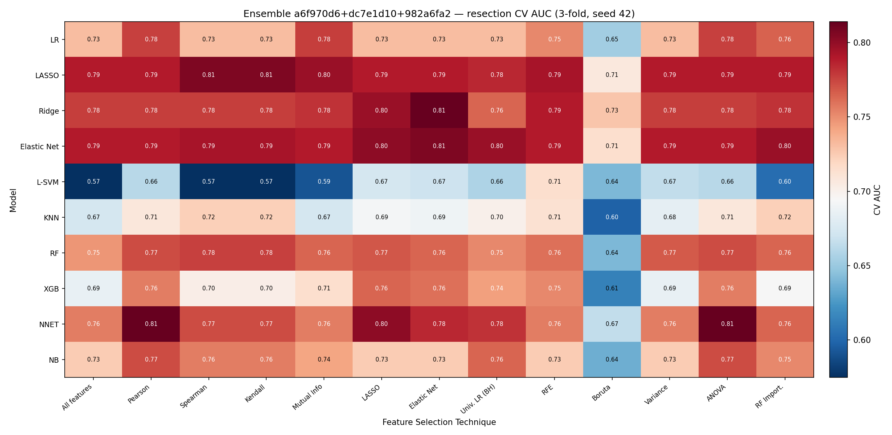
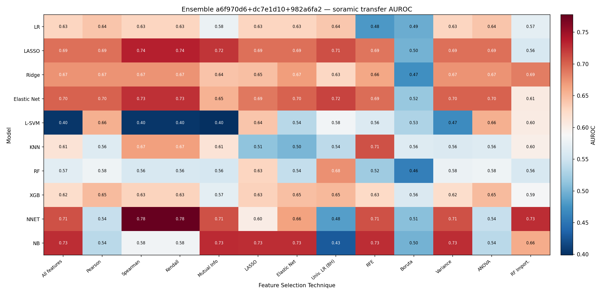
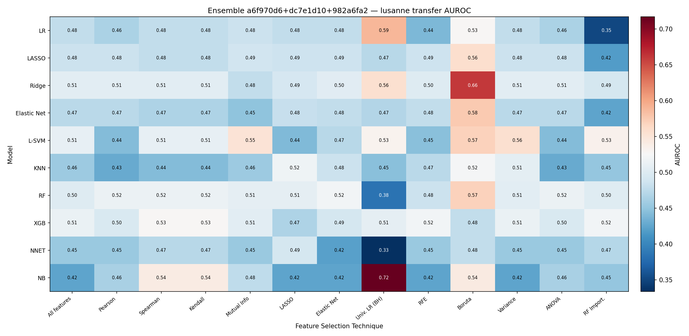

# Embedding Grid Eval v3 — Flat 3-fold CV + Decoupled Model Ensemble — 2026-07-20

Successor to [`0713_embedding_grid_eval_v2.md`](../0713/0713_embedding_grid_eval_v2.md) and
[`0713_ensemble_grid_eval.md`](../0713/0713_ensemble_grid_eval.md). Two changes:

1. **Flat, non-repeated 3-fold** resection CV for the grid (was repeated 5×10), so the grid
   is on the same CV scale as the v2 §5 "Results — CV rank" table. Anchor check: the
   `LASSO`/`All features` grid cell (= saga-L1 LR, no FS — the §5 head) should reproduce the
   §5 CV number.
2. A **model ensemble** — the top-3 *distinct* classifiers (each at its own best FS),
   mean-averaged — that is **fully decoupled** from the existing *embedding* ensemble. Both
   are run for two settings: **A** the single embedding `dc7e1d10`, **B** the
   `a6f970d6 + dc7e1d10 + 982a6fa2` embedding ensemble. Each setting reports **both** the
   best single model×feature cell **and** the top-3 model ensemble.

## Table of Contents
- [1. Key findings](#1-key-findings)
- [2. Setup](#2-setup)
- [3. Method](#3-method)
- [4. Setting A — dc7e1d10 (single embedding)](#4-setting-a--dc7e1d10-single-embedding)
- [5. Setting B — 3-embedding ensemble](#5-setting-b--3-embedding-ensemble)
- [6. File references](#6-file-references)

## 1. Key findings

| # | Finding |
|---|---|
| 1 | Anchor `LASSO`/`All features` (dc7e1d10) CV **0.695** matches §5's LR-head **0.695**. (§5's earlier 0.699 was a `max_iter=1000` non-convergence artifact; the baseline LR is now bumped to `max_iter=5000` and both agree at 0.695.) |
| 2 | Flat 3-fold ceilings higher/noisier than 5×10: `dc7e1d10` **0.744 ± 0.14** (was 0.675); ensemble **0.814 ± 0.08** (was 0.740). |
| 3 | Model-ensemble Soramic A **0.697** / B **0.694** — at or below the single best cell (0.709 / 0.668). |
| 4 | Model-ensemble CV: A **0.728 < 0.744** single; B **0.830 > 0.814** single. |
| 5 | Two axes decoupled/composable; grid CSVs byte-identical with/without `--model-ensemble`. |

## 2. Setup

| | Resection (train) | Soramic (test) | Lausanne (test) |
|---|---:|---:|---:|
| Embedding + `rfs_2year` | 54 (26 pos, 48%) | 57 (39 pos, 68%) | 66 (49 pos, 74%) |

All embeddings image-only 128-dim, read from the survival `resection_img_emb.parquet` /
`ablation_{cohort}_img_emb_{raw,bbox}.parquet` extraction (patient-level, aligned on `SID`) —
the same cache as v2 §5, so the grid CV and the §5 CV-rank numbers are directly comparable.
Setting B patients are the SID intersection across the 3 embeddings (no loss).

## 3. Method

- **Grid** — 10 classifiers × 13 feature-selection techniques (130 cells), pipeline
  `SimpleImputer(median) → StandardScaler → selector(k) → classifier`, `select_k ∈ {43, 85, 128}`
  tuned per cell. Ranked by **flat non-repeated 3-fold** resection CV (`GridSearchCV.best_score_`),
  refit, transferred to Soramic/Lausanne. Setting B fits one pipeline per embedding with one
  shared tuned head and averages the scores (`EnsembleGrid`).
- **Model ensemble** — for each classifier take its **max CV AUC across the 13 FS** (its
  "potential"); rank; take the **top-3 distinct** classifiers, each frozen at its argmax-FS cell
  (fs + `select_k` + tuned hyperparameters). Mean-average the 3 members' positive-class scores
  (`HeteroEnsembleGrid`). Ensemble CV = plain 3-fold over the frozen ensemble; transfer = refit
  on all resection. In Setting B each member is itself an embedding ensemble → net mean over
  (embedding × model). Members' configs are chosen on all resection folds, so the ensemble's own
  CV is mildly optimistic — resection CV is a selection signal, the external cohorts are the estimate.

## 4. Setting A — dc7e1d10 (single embedding)

### 4.1 Flat 3-fold grid + anchor check


| | CV AUC | Soramic | Lausanne |
|---|---:|---:|---:|
| Anchor `LASSO`/`All features` | 0.695 ± 0.117 | 0.718 | 0.419 |
| `LR`/`All features` (unregularized, C=∞) | 0.612 | — | — |
| Best single cell — `Ridge`/`Variance`, k=85 | **0.744** | 0.709 | 0.436 |

Grid CV range 0.428–0.744. The anchor matches §5's dc7e1d10 LR-head number: §5 originally read
**0.699** using the `baselines/config.py` LR at `max_iter=1000`, which does not converge on the
128-dim embedding. The baseline LR is now bumped to `max_iter=5000` (matching the grid's `LASSO`),
so §5 reads **0.695** and equals this anchor; forcing either estimator to `max_iter=20000` also gives
**0.6947**. (Updated `0713_ablation_eval_v3.md` §4 / `0713_embedding_grid_eval_v2.md` §5.)

### 4.2 Top-3 model ensemble

Per-classifier potential (best CV across FS): Ridge 0.744, Elastic Net 0.744, L-SVM 0.740,
LASSO 0.736, LR 0.715, XGB 0.693, NB 0.674, NNET 0.665, RF 0.641, KNN 0.618.

| Member | FS | k | CV AUC | Soramic | Lausanne |
|---|---|---:|---:|---:|---:|
| Ridge | Variance | 85 | 0.744 | | |
| Elastic Net | RF Import. | 43 | 0.744 | | |
| L-SVM | RF Import. | 43 | 0.740 | | |
| **Ensemble (mean)** | — | — | **0.728** | **0.697** | **0.397** |

## 5. Setting B — 3-embedding ensemble

### 5.1 Flat 3-fold grid (embedding-ensemble cells)





| | CV AUC | Soramic | Lausanne |
|---|---:|---:|---:|
| Anchor `LASSO`/`All features` | 0.789 | 0.692 | 0.485 |
| Best single cell — `Ridge`/`Elastic Net`, k=43 | **0.814** | 0.668 | 0.504 |

Grid CV range 0.575–0.814.

### 5.2 Top-3 model ensemble (each member an embedding ensemble)

Per-classifier potential: Ridge 0.814, NNET 0.814, Elastic Net 0.806, LASSO 0.806, LR 0.777,
RF 0.776, NB 0.773, XGB 0.764, KNN 0.723, L-SVM 0.715.

| Member | FS | k | CV AUC | Soramic | Lausanne |
|---|---|---:|---:|---:|---:|
| Ridge | Elastic Net | 43 | 0.814 | | |
| NNET | Pearson | 43 | 0.814 | | |
| Elastic Net | Elastic Net | 43 | 0.806 | | |
| **Ensemble (mean)** | — | — | **0.830** | **0.694** | **0.487** |

## 6. File references

| Artifact | Path |
|---|---|
| Grid pipeline + ensembles | `hcc_multimodal/eval/grid.py`, `hcc_multimodal/eval/ensemble.py` (`EnsembleGrid`, `HeteroEnsembleGrid`, `build_member`) |
| Grid runner | `hcc_multimodal/eval/embedding_grid_eval.py` (`--model-ensemble`, `--model-ensemble-top-k`) |
| Setting A CSVs | `results/eval/grid_flat3/dc7e1d10/{grid_cv_auc,grid_cv_auc_matrix,grid_transfer_*,grid_best_by_cv,model_ensemble_members,model_ensemble_best}.csv` |
| Setting B CSVs | `results/eval/grid_flat3_ensemble/{…same…}.csv` |
| Heatmaps | `reports/0720/flat3/{dc7e1d10,ensemble}/heatmap_{cv_auc,soramic_auroc,lusanne_auroc}.{png,svg}` |
| §5 CV-rank baseline | [`0713_embedding_grid_eval_v2.md`](../0713/0713_embedding_grid_eval_v2.md) §5 |
| Prior 5×10 grid / ensemble | v2 §6, [`0713_ensemble_grid_eval.md`](../0713/0713_ensemble_grid_eval.md) |

Regenerate — Setting A (single embedding: grid + model ensemble):
```
python -m hcc_multimodal.eval.embedding_grid_eval --task grid --model-id dc7e1d10 \
  --cv-mode flat --outer-folds 3 --cv-repeats 1 --select-k-fracs 0.333 0.667 1.0 \
  --model-ensemble --model-ensemble-top-k 3 \
  --output-dir results/eval/grid_flat3/dc7e1d10 --fig-dir reports/0720/flat3/dc7e1d10
```
Regenerate — Setting B (embedding ensemble + model ensemble = both axes):
```
python -m hcc_multimodal.eval.embedding_grid_eval --task grid \
  --model-id a6f970d6 dc7e1d10 982a6fa2 --ensemble \
  --cv-mode flat --outer-folds 3 --cv-repeats 1 --select-k-fracs 0.333 0.667 1.0 \
  --model-ensemble --model-ensemble-top-k 3 \
  --output-dir results/eval/grid_flat3_ensemble --fig-dir reports/0720/flat3/ensemble
```
Decoupling: drop `--model-ensemble` for grid-only; drop `--ensemble` for the single-embedding
axis; both flags together = embedding × model.
