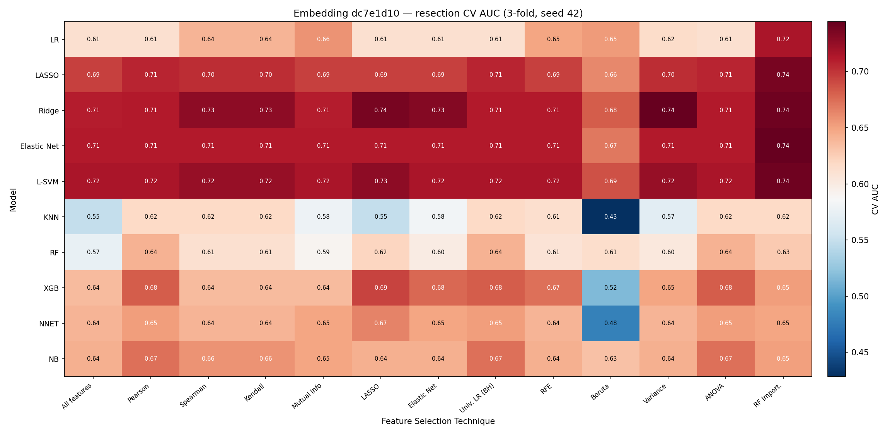
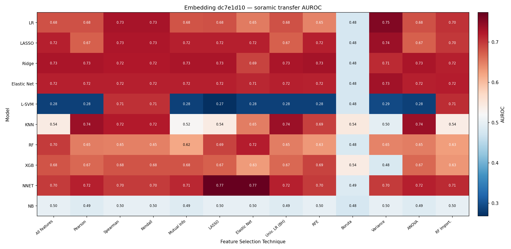
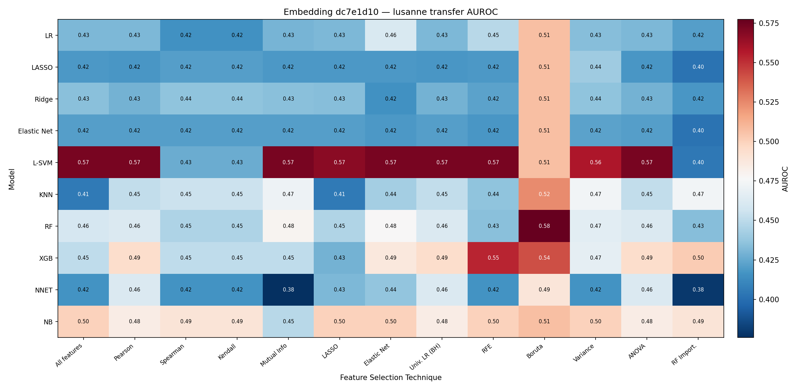
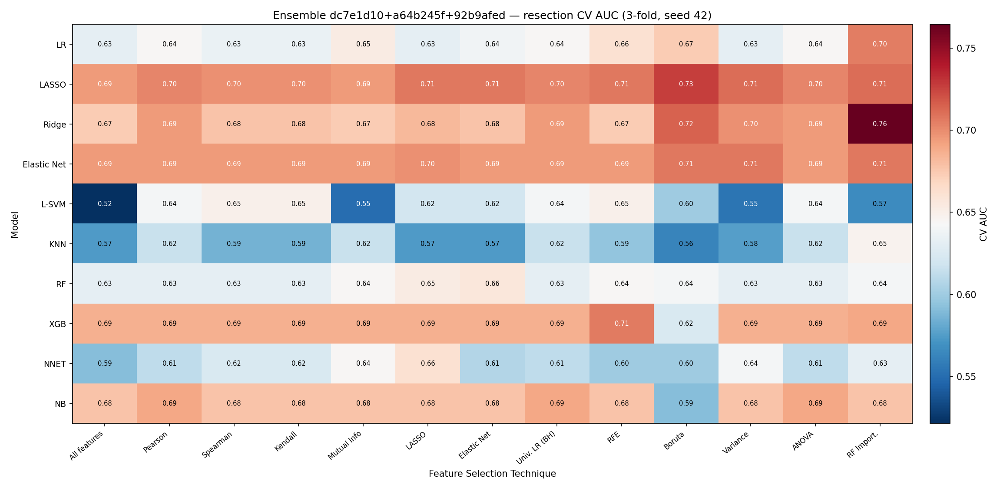
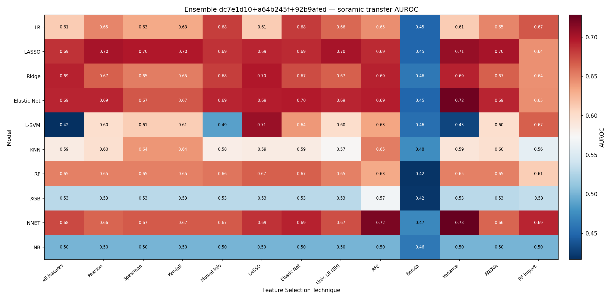
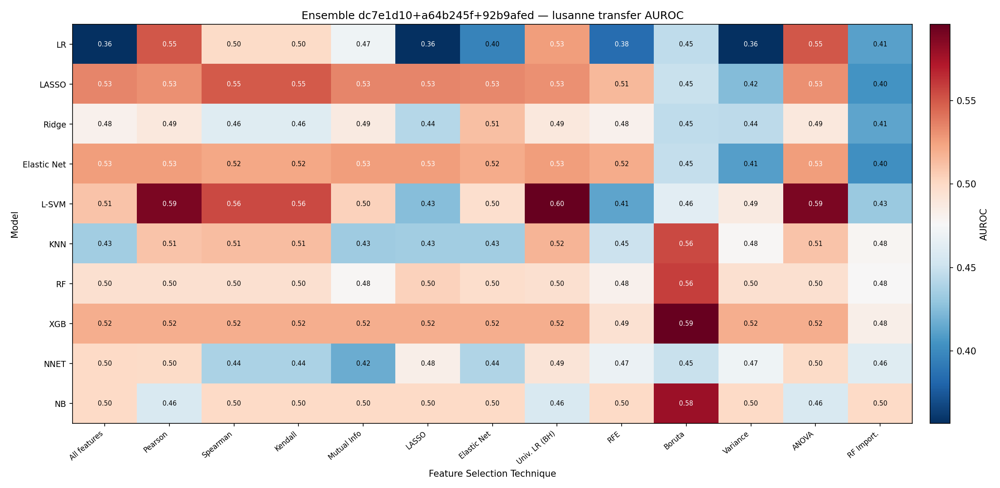
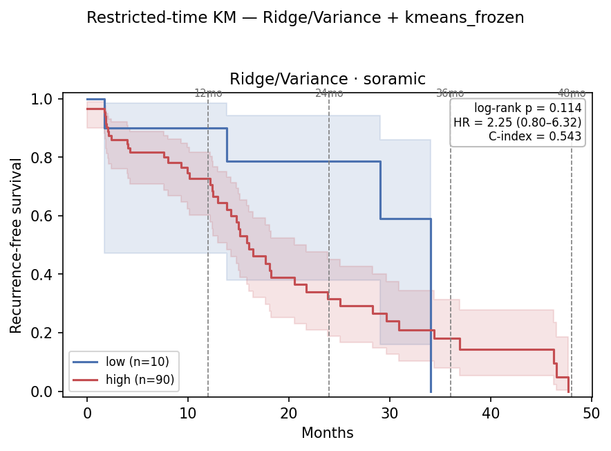
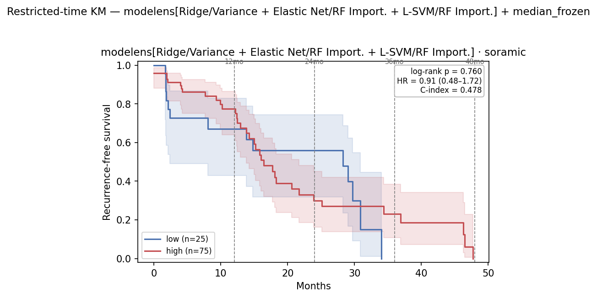
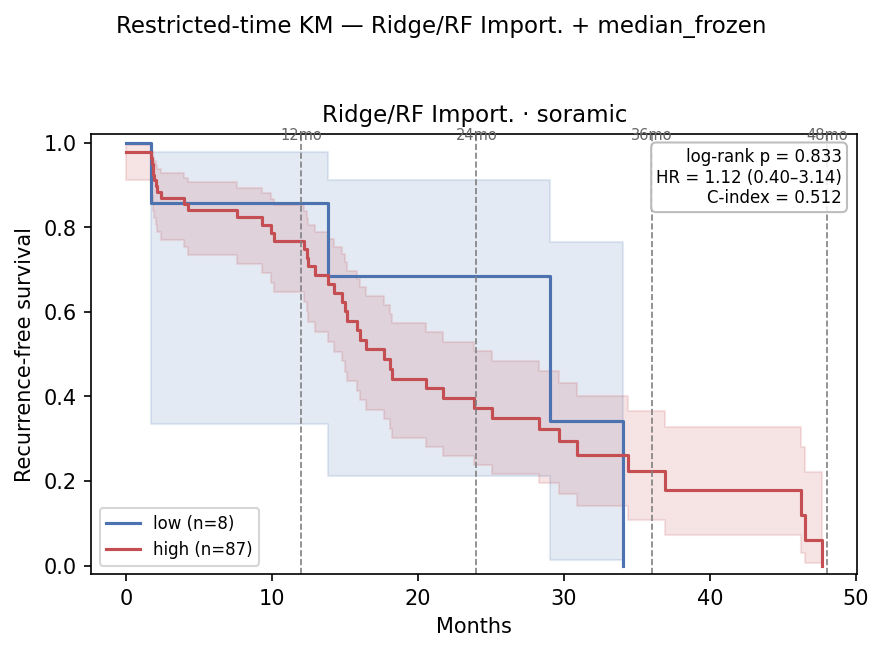
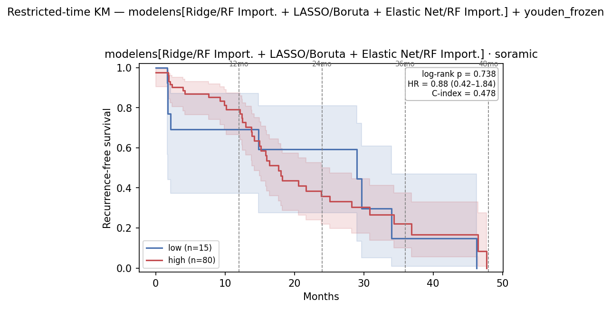

# Embedding Grid Eval v4 — n=all Encoders Only, Top-3-by-CV Ensemble — 2026-07-27

Successor to [`0720_embedding_grid_eval_v3.md`](0720_embedding_grid_eval_v3.md). One change carried
from the n=all-only ablation [`0727_ablation_eval_v4.md`](../0727/0727_ablation_eval_v4.md):

- **Only image encoders trained with n=all slices are used.** The Setting B embedding ensemble is now
  the **top 3 by resection CV AUC** in the 0727 v4 ablation §4 — `dc7e1d10 + a64b245f + 92b9afed`
  (CV ranks 1/2/3), replacing v3's `a6f970d6 + dc7e1d10 + 982a6fa2` (two of which, `a6f970d6` and
  `982a6fa2`, were n=10 encoders and are dropped). Setting A stays the single top encoder `dc7e1d10`,
  which is now **CV rank 1** among the n=all encoders (it was rank 2 in the full 17-model ablation).

Everything else — flat non-repeated 3-fold resection CV, the decoupled grid vs. model-ensemble axes,
the four §6 survival heads — is identical in structure to v3, re-run on the new ensemble membership.

## Table of Contents
- [1. Key findings](#1-key-findings)
- [2. Setup](#2-setup)
- [3. Method](#3-method)
- [4. Setting A — dc7e1d10 (single embedding)](#4-setting-a--dc7e1d10-single-embedding)
- [5. Setting B — 3-embedding ensemble](#5-setting-b--3-embedding-ensemble)
- [6. Restricted-time survival — Soramic (4 heads)](#6-restricted-time-survival--soramic-4-heads)
- [7. File references](#7-file-references)

## 1. Key findings

| embedding | best single model | top-3 model ensemble |
|---|---:|---:|
|dc7e1d10 (best on Resection)|0.709|0.697|
|top 3 on Resection - ensemble|0.644|0.623|

Soramic transfer AUROC. Setting A (`dc7e1d10`) is unchanged from v3. The new all-n=all ensemble
transfers **lower on Soramic** than v3's raw-only ensemble (0.644 / 0.623 vs 0.668 / 0.694) but
**higher on Lausanne** (anchor 0.534 vs v3's 0.485; see §5), and — unlike v3 — it is
**not degenerate in the §6 survival analysis**: swapping the two n=10 raw encoders for `a64b245f`
(raw) + `92b9afed` (bbox) removes the upward Soramic score shift that collapsed v3's B1/B2 low arms.

## 2. Setup

| | Resection (train) | Soramic (test) | Lausanne (test) |
|---|---:|---:|---:|
| `dc7e1d10` + `rfs_2year` (Setting A) | 54 (26 pos, 48%) | 57 (39 pos, 68%) | 66 (49 pos, 74%) |
| 3-emb ensemble + `rfs_2year` (Setting B) | 54 (26 pos, 48%) | 54 (36 pos, 67%) | 65 (48 pos, 74%) |

All embeddings image-only 128-dim, read from the survival `resection_img_emb.parquet` /
`ablation_{cohort}_img_emb_{raw,bbox}.parquet` extraction (patient-level, aligned on `SID`) — the
same cache as the 0727 v4 ablation §4, so the grid CV and the ablation CV-rank numbers are directly
comparable. Setting B patients are the SID intersection across the 3 embeddings; because `92b9afed`
is a **bbox** encoder with a slightly smaller usable mask set, the intersection loses 3 Soramic and 1
Lausanne labelled patient vs. the single-encoder counts (54/54/65 vs 54/57/66). `dc7e1d10` and
`a64b245f` load their raw caches, `92b9afed` its bbox cache, automatically per `MODEL_INPUT`.

## 3. Method

- **Grid** — 10 classifiers × 13 feature-selection techniques (130 cells), pipeline
  `SimpleImputer(median) → StandardScaler → selector(k) → classifier`, `select_k ∈ {43, 85, 128}`
  tuned per cell. Ranked by **flat non-repeated 3-fold** resection CV (`GridSearchCV.best_score_`),
  refit, transferred to Soramic/Lausanne. Setting B fits one pipeline per embedding with one
  shared tuned head and averages the scores (`EnsembleGrid`).
- **Model ensemble** — for each classifier take its **max CV AUC across the 13 FS** (its
  "potential"); rank; take the **top-3 distinct** classifiers, each frozen at its argmax-FS cell
  (fs + `select_k` + tuned hyperparameters). Mean-average the 3 members' positive-class scores
  (`HeteroEnsembleGrid`). Ensemble CV = plain 3-fold over the frozen ensemble; transfer = refit
  on all resection. In Setting B each member is itself an embedding ensemble → net mean over
  (embedding × model). Members' configs are chosen on all resection folds, so the ensemble's own
  CV is mildly optimistic — resection CV is a selection signal, the external cohorts are the estimate.

## 4. Setting A — dc7e1d10 (single embedding)

*Unchanged from v3 — `dc7e1d10` is an n=all encoder and is now the CV-rank-1 encoder in the ablation.*

### 4.1 Flat 3-fold grid + anchor check





| | CV AUC | Soramic | Lausanne |
|---|---:|---:|---:|
| Anchor `LASSO`/`All features` | 0.695 ± 0.117 | 0.718 | 0.419 |
| Best single cell — `Ridge`/`Variance`, k=85 | **0.744** | 0.709 | 0.436 |

Grid CV range 0.428–0.744. The anchor matches the ablation §4 `dc7e1d10` LR-head number (0.695 at
`max_iter=5000`, the converged saga fit; forcing `max_iter=20000` also gives 0.6947).

### 4.2 Top-3 model ensemble

Per-classifier potential (best CV across FS): Ridge 0.744, Elastic Net 0.744, L-SVM 0.740,
LASSO 0.736, LR 0.715, XGB 0.693, NB 0.674, NNET 0.665, RF 0.641, KNN 0.618.

| Member | FS | k | CV AUC | Soramic | Lausanne |
|---|---|---:|---:|---:|---:|
| Ridge | Variance | 85 | 0.744 | | |
| Elastic Net | RF Import. | 43 | 0.744 | | |
| L-SVM | RF Import. | 43 | 0.740 | | |
| **Ensemble (mean)** | — | — | **0.728** | **0.697** | **0.397** |

## 5. Setting B — 3-embedding ensemble

*New membership: `dc7e1d10 + a64b245f + 92b9afed` (top 3 by resection CV AUC in the 0727 v4 ablation).*

### 5.1 Flat 3-fold grid (embedding-ensemble cells)





| | CV AUC | Soramic | Lausanne |
|---|---:|---:|---:|
| Anchor `LASSO`/`All features` | 0.694 | 0.685 | 0.534 |
| Best single cell — `Ridge`/`RF Import.`, k=43 | **0.764** | 0.644 | 0.413 |

Grid CV range **0.521–0.764** (top cell `Ridge`/`RF Import.` 0.764, below v3's raw-only ensemble top
of 0.814). Averaging the two raw encoders with the bbox `92b9afed`
lifts the Lausanne anchor (0.534 vs v3's 0.485) at the cost of the Soramic anchor (0.685 vs 0.692).

### 5.2 Top-3 model ensemble (each member an embedding ensemble)

Per-classifier potential: Ridge 0.764, LASSO 0.727, Elastic Net 0.707, XGB 0.706, LR 0.705,
NB 0.690, NNET 0.661, RF 0.657, L-SVM 0.649, KNN 0.647.

| Member | FS | k | CV AUC | Soramic | Lausanne |
|---|---|---:|---:|---:|---:|
| Ridge | RF Import. | 43 | 0.764 | | |
| LASSO | Boruta | 43 | 0.727 | | |
| Elastic Net | RF Import. | 43 | 0.707 | | |
| **Ensemble (mean)** | — | — | **0.740** | **0.623** | **0.428** |

## 6. Restricted-time survival — Soramic (4 heads)

Each of the four §1 heads is carried into the restricted-time domain following the
[`0713_restricted_time_survival_v2.md`](../0713/0713_restricted_time_survival_v2.md) protocol:
score refit on all labelled resection, freeze the high/low cutoff on the in-sample resection scores,
then re-read on Soramic at τ ∈ {12, 24, 36, 48} mo + full follow-up on **RFS and TTR** — readout
**A** (administrative-censoring KM / log-rank / Cox HR / Harrell C) and **B** (RMST: per-arm, ΔRMST
95% CI, point-in-time survival-difference p). Splits are endpoint-independent (frozen from the
`rfs_2year`-based scores), so RFS and TTR share the partition. This section reports **Soramic only**;
resection (in-sample ceiling) and Lausanne to follow. Setting A heads (`dc7e1d10`) score all
**Soramic n = 100** (RFS 50 events, TTR 31 events); Setting B heads score the 3-embedding
intersection **Soramic n = 95** (RFS 47 events, TTR 29 events) — the bbox `92b9afed` cache trims 5
patients. All scored regardless of 2-year label availability (as in v2 §2).

**Cutoff selection (per head).** As in v2 §1, the deployable cutoff must be frozen on resection, so for
each head all three resection-frozen strategies — **median**, **kmeans**, **youden** — are swept and the
one with the **best Soramic power** is chosen: minimum full-follow-up log-rank among cutoffs that leave a
populated low arm (≥ 5 patients) in the correct direction (HR > 1). The sweep (Soramic RFS):

- A1 - dc7e1d10 x best single model
- A2 - dc7e1d10 x top 3 model ensemble
- B1 - top 3 embeddings on Resection - ensemble x best single model
- B2 - top 3 embeddings on Resection - ensemble x top 3 model ensemble

| Head | cutoff | thr | hi/lo | τ=24 log-rank | τ=24 point-p | full log-rank | full HR | selected |
|---|---|---:|---:|---:|---:|---:|---:|:--:|
| **A1** | median | 0.484 | 93 / 7 | 0.044 | 0.077 | 0.147 | 2.33 | |
| **A1** | **kmeans** | 0.505 | 90 / 10 | **0.043** | **0.033** | **0.114** | 2.25 | ★ |
| **A1** | youden | 0.508 | 90 / 10 | 0.043 | 0.033 | 0.114 | 2.25 | (≡ kmeans) |
| **A2** | **median** | 0.512 | 75 / 25 | 0.443 | 0.072 | 0.760 | 0.91 | ★ |
| **A2** | kmeans / youden | 0.485 / 0.513 | 75 / 25 | 0.443 | 0.072 | 0.760 | 0.91 | (≡ median) |
| **B1** | **median** | 0.504 | 87 / 8 | 0.340 | 0.196 | 0.833 | 1.12 | ★ |
| **B1** | kmeans | 0.492 | 88 / 7 | 0.345 | 0.197 | 0.840 | 1.11 | |
| **B1** | youden | 0.507 | 87 / 8 | 0.340 | 0.196 | 0.833 | 1.12 | (≡ median) |
| **B2** | median / kmeans | 0.507 / 0.496 | 82 / 13 | 0.424 | 0.150 | 0.956 | 0.98 | |
| **B2** | **youden** | 0.531 | 80 / 15 | 0.646 | 0.179 | 0.738 | 0.88 | ★ |

Two structural facts drive the picks. **A1/A2 are essentially cutoff-insensitive** — their scores
straddle ~0.5 so all three thresholds land in the same place (A2 identical to 3 decimals; A1's median
edges the low arm down to 7 and slightly weakens it, so kmeans wins). **The key change vs. v3 is that
the new ensemble is no longer degenerate on Soramic.** In v3 the raw-only `a6f970d6 + dc7e1d10 +
982a6fa2` average pushed every Soramic score above the resection-frozen boundaries (100/0 split,
undefined KM). Swapping the two n=10 raw encoders for `a64b245f` (raw) + `92b9afed` (bbox) pulls the
Soramic score distribution back down, so **B1 now carves an 8-patient low arm under all three cutoffs**
(median picked, HR 1.12 in the correct direction) and **B2 carves 13–15** (median/kmeans land HR < 1,
so youden — the only ≥5 low arm chosen by the fallback rule — is selected). Both are now *evaluable*,
but both are **null** (no log-rank clears 0.34). Selected split per head:

| Head | Description | cutoff | Soramic hi/lo | Evaluable? |
|---|---|---|---:|:--:|
| **A1** | dc7e1d10 · Ridge/Variance k=85 (best single) | kmeans | 90 / 10 | ✔ significant τ=24 |
| **A2** | dc7e1d10 · top-3 model ensemble | median | 75 / 25 | ✔ null |
| **B1** | 3-emb ensemble · Ridge/RF Import. k=43 (best single) | median | 87 / 8 | ✔ null |
| **B2** | 3-emb ensemble · top-3 model ensemble | youden | 80 / 15 | ✔ null |

### 6.1 A1 — dc7e1d10 · Ridge/Variance k=85 (best single), kmeans, 90 hi / 10 lo

Soramic RFS KM (full follow-up, frozen kmeans cutoff; τ = 12/24/36/48 mo marked):



RFS:

| τ (mo) | ev hi/lo | HR (95% CI) | log-rank p | C-idx | ‖ | RMST hi/lo | ΔRMST (95% CI) | point-p |
|---:|---:|---|---:|---:|:--:|---:|---:|---:|
| 12 | 19 / 1 | 2.77 (0.37–20.73) | 0.301 | 0.485 | ‖ | 9.9 / 11.0 | −1.0 (−10.7, +8.6) | 0.281 |
| **24** | **37 / 2** | 3.93 (0.94–16.38) | **0.043** | 0.529 | ‖ | 15.5 / 20.6 | −5.1 (−26.1, +15.9) | **0.033** |
| 36 | 42 / 4 | 2.25 (0.80–6.32) | 0.114 | 0.521 | ‖ | 18.5 / 27.5 | −9.1 (−40.1, +22.0) | 0.000† |
| 48 ≈ full | 46 / 4 | 2.25 (0.80–6.32) | 0.114 | 0.521 | ‖ | 20.1 / 27.5 | −7.5 (−42.6, +27.7) | — |
| full | 46 / 4 | 2.25 (0.80–6.32) | 0.114 | 0.521 | ‖ | — | — | — |

TTR:

| τ (mo) | ev hi/lo | HR (95% CI) | log-rank p | C-idx | ‖ | RMST hi/lo | ΔRMST (95% CI) | point-p |
|---:|---:|---|---:|---:|:--:|---:|---:|---:|
| 12 | 16 / 1 | 2.48 (0.33–18.74) | 0.364 | 0.498 | ‖ | 10.0 / 11.0 | −1.0 (−10.6, +8.6) | 0.317 |
| **24** | **28 / 1** | 7.26 (0.98–54.01) | **0.024** | 0.521 | ‖ | 15.0 / 21.8 | −6.8 (−26.7, +13.1) | **0.015** |
| 36 | 29 / 2 | 3.74 (0.88–15.96) | 0.056 | 0.518 | ‖ | 18.2 / 30.5 | −12.3 (−42.9, +18.3) | 0.175 |
| 48 ≈ full | 29 / 2 | 3.74 (0.88–15.96) | 0.056 | 0.518 | ‖ | 20.4 / 37.7 | −17.3 (−59.3, +24.7) | 0.175 |
| full | 29 / 2 | 3.74 (0.88–15.96) | 0.056 | 0.518 | ‖ | — | — | — |

Same shape as v2's dc7e1d10 head: a **significant 2-year Soramic signal** (RFS τ=24 log-rank 0.043 /
point-p 0.033; TTR τ=24 log-rank 0.024 / point-p 0.015), softening past τ=24 (full RFS log-rank 0.114).
The 1–2-event low arm inflates the HR CIs, so read log-rank / point-p. †τ=36 RFS point-p 0.000 is a
degenerate point-in-time variance estimate on the 4-event low arm, not signal (log-rank 0.114 is the
reliable read). A1 remains the **only** of the four heads with a significant horizon.

### 6.2 A2 — dc7e1d10 · top-3 model ensemble, median, 75 hi / 25 lo

Soramic RFS KM (full follow-up, frozen median cutoff; τ = 12/24/36/48 mo marked):



RFS:

| τ (mo) | ev hi/lo | HR (95% CI) | log-rank p | C-idx | ‖ | RMST hi/lo | ΔRMST (95% CI) | point-p |
|---:|---:|---|---:|---:|:--:|---:|---:|---:|
| 12 | 13 / 7 | 0.58 (0.23–1.47) | 0.244 | 0.477 | ‖ | 10.4 / 9.0 | +1.4 (−9.6, +12.4) | 0.350 |
| 24 | 30 / 9 | 1.34 (0.63–2.84) | 0.443 | 0.522 | ‖ | 16.1 / 16.0 | +0.1 (−23.8, +24.1) | 0.072 |
| 36 | 32 / 14 | 0.91 (0.48–1.72) | 0.760 | 0.511 | ‖ | 19.4 / 19.8 | −0.5 (−34.6, +33.6) | 0.000† |
| 48 ≈ full | 36 / 14 | 0.91 (0.48–1.72) | 0.760 | 0.510 | ‖ | 21.4 / 19.8 | +1.6 (−37.1, +40.2) | — |
| full | 36 / 14 | 0.91 (0.48–1.72) | 0.760 | 0.510 | ‖ | — | — | — |

TTR:

| τ (mo) | ev hi/lo | HR (95% CI) | log-rank p | C-idx | ‖ | RMST hi/lo | ΔRMST (95% CI) | point-p |
|---:|---:|---|---:|---:|:--:|---:|---:|---:|
| 12 | 12 / 5 | 0.71 (0.25–2.00) | 0.506 | 0.489 | ‖ | 10.3 / 9.4 | +1.0 (−10.1, +12.0) | 0.754 |
| 24 | 23 / 6 | 1.38 (0.56–3.40) | 0.488 | 0.505 | ‖ | 15.7 / 17.2 | −1.6 (−25.2, +22.0) | 0.066 |
| 36 | 24 / 7 | 1.20 (0.51–2.82) | 0.675 | 0.502 | ‖ | 19.1 / 23.3 | −4.2 (−40.4, +32.0) | 0.320 |
| 48 ≈ full | 24 / 7 | 1.20 (0.51–2.82) | 0.675 | 0.502 | ‖ | 21.6 / 28.4 | −6.8 (−55.2, +41.6) | 0.320 |
| full | 24 / 7 | 1.20 (0.51–2.82) | 0.675 | 0.502 | ‖ | — | — | — |

A more balanced 75/25 split (cutoff-insensitive — all three thresholds coincide), but **null on every
horizon** — no log-rank clears 0.24, HRs straddle 1, C-index ≈ 0.50–0.52. Mean-averaging three
classifiers spreads the low arm out to 25 patients but dissolves the localized τ=24 signal that A1's
sharper 90/10 split carried; the point-p only flirts with the line (RFS/TTR τ=24 ≈ 0.07). †τ=36 RFS
point-p 0.000 is again a degenerate estimate, not signal.

### 6.3 B1 — 3-emb ensemble · Ridge/RF Import. k=43 (best single), median, 87 hi / 8 lo

Unlike v3 (where B1 degenerated to 100/0 and only a C-index was defined), the new ensemble's Soramic
scores drop back below the resection-frozen median, so **B1 is evaluable** — but null.

Soramic RFS KM (full follow-up, frozen median cutoff; τ = 12/24/36/48 mo marked):



RFS:

| τ (mo) | ev hi/lo | HR (95% CI) | log-rank p | C-idx | ‖ | RMST hi/lo | ΔRMST (95% CI) | point-p |
|---:|---:|---|---:|---:|:--:|---:|---:|---:|
| 12 | 16 / 1 | 1.56 (0.21–11.75) | 0.666 | 0.396 | ‖ | 10.2 / 10.5 | −0.3 (−10.4, +9.7) | 0.604 |
| 24 | 34 / 2 | 1.98 (0.47–8.23) | 0.340 | 0.464 | ‖ | 16.4 / 19.1 | −2.7 (−24.7, +19.4) | 0.196 |
| 36 | 39 / 4 | 1.12 (0.40–3.14) | 0.833 | 0.460 | ‖ | 20.0 / 24.2 | −4.2 (−36.8, +28.3) | 0.000† |
| 48 ≈ full | 43 / 4 | 1.12 (0.40–3.14) | 0.833 | 0.459 | ‖ | 22.0 / 24.2 | −2.2 (−39.2, +34.7) | — |
| full | 43 / 4 | 1.12 (0.40–3.14) | 0.833 | 0.459 | ‖ | — | — | — |

TTR:

| τ (mo) | ev hi/lo | HR (95% CI) | log-rank p | C-idx | ‖ | RMST hi/lo | ΔRMST (95% CI) | point-p |
|---:|---:|---|---:|---:|:--:|---:|---:|---:|
| 12 | 14 / 1 | 1.41 (0.19–10.76) | 0.737 | 0.411 | ‖ | 10.3 / 10.5 | −0.3 (−10.3, +9.7) | 0.625 |
| 24 | 26 / 1 | 3.12 (0.42–23.06) | 0.239 | 0.444 | ‖ | 16.0 / 20.8 | −4.8 (−26.2, +16.7) | 0.066 |
| 36 | 27 / 2 | 1.57 (0.37–6.63) | 0.537 | 0.441 | ‖ | 20.1 / 25.1 | −5.0 (−35.8, +25.8) | 0.000† |
| 48 ≈ full | 27 / 2 | 1.57 (0.37–6.63) | 0.537 | 0.441 | ‖ | 23.0 / 25.1 | −2.1 (−39.5, +35.2) | 0.000† |
| full | 27 / 2 | 1.57 (0.37–6.63) | 0.537 | 0.441 | ‖ | — | — | — |

The HR points the right way (>1) at every horizon but never approaches significance (best log-rank
TTR τ=24 = 0.239 on a 1-event low arm). The single best-CV cell on the ensemble carries directional
but not stratifying signal on Soramic. †point-p 0.000 rows are degenerate low-arm variance estimates.

### 6.4 B2 — 3-emb ensemble · top-3 model ensemble, youden, 80 hi / 15 lo

median/kmeans land HR < 1 (wrong direction) here, so the **youden** threshold (0.531) — the only
≥5-patient low arm satisfying the fallback rule — is selected. B2 is evaluable but null, and its HR
runs slightly *below* 1 at most horizons (high-score arm no worse than low-score):

Soramic RFS KM (full follow-up, frozen youden cutoff; τ = 12/24/36/48 mo marked):



RFS:

| τ (mo) | ev hi/lo | HR (95% CI) | log-rank p | C-idx | ‖ | RMST hi/lo | ΔRMST (95% CI) | point-p |
|---:|---:|---|---:|---:|:--:|---:|---:|---:|
| 12 | 13 / 4 | 0.53 (0.17–1.64) | 0.264 | 0.381 | ‖ | 10.5 / 8.9 | +1.6 (−9.7, +12.9) | 0.429 |
| 24 | 31 / 5 | 1.25 (0.48–3.22) | 0.646 | 0.449 | ‖ | 16.7 / 16.3 | +0.4 (−24.1, +24.9) | 0.179 |
| 36 | 35 / 8 | 0.94 (0.43–2.04) | 0.875 | 0.443 | ‖ | 20.2 / 21.1 | −0.9 (−36.6, +34.7) | 0.645 |
| 48 ≈ full | 38 / 9 | 0.88 (0.42–1.84) | 0.738 | 0.442 | ‖ | 22.1 / 22.6 | −0.5 (−42.9, +41.8) | — |
| full | 38 / 9 | 0.88 (0.42–1.84) | 0.738 | 0.442 | ‖ | — | — | — |

TTR:

| τ (mo) | ev hi/lo | HR (95% CI) | log-rank p | C-idx | ‖ | RMST hi/lo | ΔRMST (95% CI) | point-p |
|---:|---:|---|---:|---:|:--:|---:|---:|---:|
| 12 | 12 / 3 | 0.55 (0.15–1.95) | 0.345 | 0.391 | ‖ | 10.5 / 9.1 | +1.3 (−9.8, +12.5) | 0.572 |
| 24 | 23 / 4 | 0.85 (0.29–2.46) | 0.763 | 0.415 | ‖ | 16.6 / 16.1 | +0.5 (−23.3, +24.3) | 0.490 |
| 36 | 24 / 5 | 0.68 (0.26–1.79) | 0.429 | 0.412 | ‖ | 21.0 / 18.8 | +2.2 (−31.4, +35.8) | 0.000† |
| 48 ≈ full | 24 / 5 | 0.68 (0.26–1.79) | 0.429 | 0.412 | ‖ | 24.1 / 18.8 | +5.3 (−34.6, +45.2) | 0.000† |
| full | 24 / 5 | 0.68 (0.26–1.79) | 0.429 | 0.412 | ‖ | — | — | — |

Mean-averaging both axes (embedding × model) fully washes out any Soramic stratification: C-index
≈ 0.38–0.45 (below 0.5), HRs straddle or fall below 1, no horizon significant. †point-p 0.000 rows
are degenerate low-arm variance estimates, not signal.

## 7. File references

| Artifact | Path |
|---|---|
| Grid pipeline + ensembles | `hcc_multimodal/eval/grid.py`, `hcc_multimodal/eval/ensemble.py` (`EnsembleGrid`, `HeteroEnsembleGrid`, `build_member`) |
| Grid runner | `hcc_multimodal/eval/embedding_grid_eval.py` (`--model-ensemble`, `--model-ensemble-top-k`) |
| Setting A CSVs | `results/eval/grid_flat3/dc7e1d10/{grid_cv_auc,grid_cv_auc_matrix,grid_transfer_*,grid_best_by_cv,model_ensemble_members,model_ensemble_best}.csv` |
| Setting B CSVs (v4) | `results/eval/grid_flat3_ensemble_v4/{…same…}.csv` |
| Heatmaps | `reports/0720/flat3/{dc7e1d10,ensemble_v4}/heatmap_{cv_auc,soramic_auroc,lusanne_auroc}.{png,svg}` |
| §6 runner + scoring | `hcc_multimodal/survival/run_restricted.py` (`--members-csv`, `--select-cutoff-by-power`), `hcc_multimodal/survival/grid_scores.py` (`route_grid_scores_hetero`), `restricted.py`, `cutoffs.py`, `hcc_multimodal/eval/ensemble.py` |
| §6 cutoff sweeps | `results/eval/survival/cutoff_sweep_{A1_ridge_var_k85_rfs,A2_modelens_rfs,B1_ridge_rfimport_k43_v4_rfs,B2_modelens_v4_rfs}.csv` (median/kmeans/youden per head) |
| §6 Soramic tables | `results/eval/survival/restricted_time_soramic_{A1_ridge_var_k85,A2_modelens,B1_ridge_rfimport_k43_v4,B2_modelens_v4}_{rfs,ttr}.csv` |
| §6.1–6.4 RFS KM figures | `reports/0720/km/km_restricted_soramic_{A1_ridge_var_k85_rfs,A2_modelens_rfs,B1_ridge_rfimport_k43_v4_rfs,B2_modelens_v4_rfs}.{png,svg}` — full-follow-up Soramic RFS KM at the frozen best-power cutoff, τ marked. Drawn by `run_restricted._draw_km` / `plots._draw_subplot`. Annotation C-index is the hi/lo-dichotomy concordance and differs from the continuous-score C-index in the §6 tables. |
| §6 protocol reference | [`0713_restricted_time_survival_v2.md`](../0713/0713_restricted_time_survival_v2.md) |
| CV-rank baseline (n=all only) | [`0727_ablation_eval_v4.md`](../0727/0727_ablation_eval_v4.md) §4 |
| Prior v3 grid / ensemble | [`0720_embedding_grid_eval_v3.md`](0720_embedding_grid_eval_v3.md) |

Regenerate — Setting A (single embedding: grid + model ensemble; unchanged from v3):
```
python -m hcc_multimodal.eval.embedding_grid_eval --task grid --model-id dc7e1d10 \
  --cv-mode flat --outer-folds 3 --cv-repeats 1 --select-k-fracs 0.333 0.667 1.0 \
  --model-ensemble --model-ensemble-top-k 3 \
  --output-dir results/eval/grid_flat3/dc7e1d10 --fig-dir reports/0720/flat3/dc7e1d10
```
Regenerate — Setting B (new top-3-by-CV n=all ensemble + model ensemble = both axes):
```
python -m hcc_multimodal.eval.embedding_grid_eval --task grid \
  --model-id dc7e1d10 a64b245f 92b9afed --ensemble \
  --cv-mode flat --outer-folds 3 --cv-repeats 1 --select-k-fracs 0.333 0.667 1.0 \
  --model-ensemble --model-ensemble-top-k 3 \
  --output-dir results/eval/grid_flat3_ensemble_v4 --fig-dir reports/0720/flat3/ensemble_v4
```
Decoupling: drop `--model-ensemble` for grid-only; drop `--ensemble` for the single-embedding
axis; both flags together = embedding × model.

Regenerate — §6 restricted-time survival. A1/A2 are unchanged from v3 (single embedding `dc7e1d10`);
B1/B2 use the new ensemble. Each head is one RFS invocation (`--select-cutoff-by-power` writes
`cutoff_sweep_<tag>.csv` and prints the pick) plus a TTR invocation that forces that pick. All use
`--freeze-on insample --cutoffs median_frozen kmeans_frozen youden_frozen --taus 12 24 36 48
--no-resection`. RFS commands (TTR = same head + `--force-cutoff <pick> --time-col TTR_central
--event-col TTR_central_event`):
```
# A1 (kmeans) — single cell
python -m hcc_multimodal.survival.run_restricted --model-id dc7e1d10 --fs Variance --model Ridge \
  --select-k 85 --freeze-on insample --select-cutoff-by-power \
  --cutoffs median_frozen kmeans_frozen youden_frozen --taus 12 24 36 48 --no-resection \
  --output-dir results/eval/survival --tag A1_ridge_var_k85_rfs
# A2 (median) — model ensemble, single embedding
python -m hcc_multimodal.survival.run_restricted --model-id dc7e1d10 \
  --members-csv results/eval/grid_flat3/dc7e1d10/model_ensemble_members.csv --select-k 43 \
  --freeze-on insample --select-cutoff-by-power \
  --cutoffs median_frozen kmeans_frozen youden_frozen --taus 12 24 36 48 --no-resection \
  --output-dir results/eval/survival --tag A2_modelens_rfs
# B1 (median) — single cell, new embedding ensemble
python -m hcc_multimodal.survival.run_restricted --ensemble --model-ids dc7e1d10 a64b245f 92b9afed \
  --fs "RF Import." --model Ridge --select-k 43 --freeze-on insample --select-cutoff-by-power \
  --cutoffs median_frozen kmeans_frozen youden_frozen --taus 12 24 36 48 --no-resection \
  --output-dir results/eval/survival --tag B1_ridge_rfimport_k43_v4_rfs
# B2 (youden) — model ensemble, new embedding ensemble
python -m hcc_multimodal.survival.run_restricted --ensemble --model-ids dc7e1d10 a64b245f 92b9afed \
  --members-csv results/eval/grid_flat3_ensemble_v4/model_ensemble_members.csv --select-k 43 \
  --freeze-on insample --select-cutoff-by-power \
  --cutoffs median_frozen kmeans_frozen youden_frozen --taus 12 24 36 48 --no-resection \
  --output-dir results/eval/survival --tag B2_modelens_v4_rfs
```
The §6.1–6.4 RFS KM figures re-run each head with the pick forced (`--force-cutoff <pick>`) plus
`--km --fig-dir reports/0720/km`. All four heads are now evaluable, so all four have a KM (v3 omitted
B1's degenerate 100/0 case).
