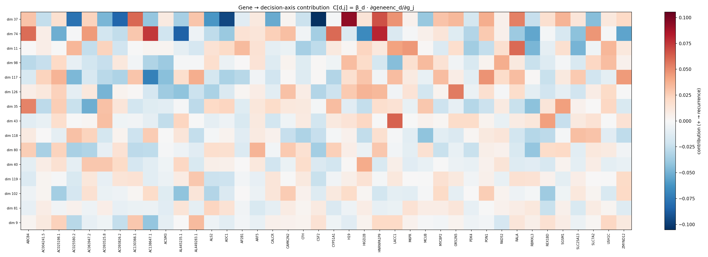

# Mechanistic Gene Attribution — 2026-07-25

Attributes the **Ridge/Variance k=85** downstream RFS classifier's decision back to the 40 genes of `all` for run `92ae6a23`, by decomposing it through the 128-dim shared embedding space. Mechanistic (fixed-model) importance only — no leave-one-out retraining.

**Model provenance.** `92ae6a23` is a refit (`scripts`/`hcc_multimodal.interpretability.refit_gene_encoder`, `--precompute-embeddings`) of `dc7e1d10`: the image encoder and its cached embeddings are reused **verbatim** (resection embedding cache is byte-identical), so the downstream head is identical to `dc7e1d10`'s by construction — its Setting-A grid and survival results (incl. head A1) carry over unchanged. Only the GeneEncoder is re-aligned to that frozen image space under a pinned, sorted gene order, giving an interpretable gene branch.

**Method.** (1) The grid head (`SimpleImputer(median) → StandardScaler → Variance(k=85) → Ridge`, α=100.0) is fit on the 54 resection patients' image embeddings vs `rfs_2year`, then collapsed into a single decision direction `β ∈ R¹²⁸` with `logit(z) = β·z + b`. (2) The GeneEncoder Jacobian `J[d,j] = ∂geneenc(g)_d/∂g_j` (at the cohort-mean gene vector) gives each gene's effect on each shared dim; `C[d,j] = β_d·J[d,j]` is its contribution to the decision axis. (3) Integrated Gradients of `s(g) = β·geneenc(g)` w.r.t. the gene input (200 midpoint steps, baseline = `zero`) aggregated over 60 patients as `mean|IG|` (importance) and `mean IG` (signed; **+ = pushes toward recurrence ≤ 2yr**).

> **Caveat.** Genes never enter the predictor at inference — they shape the image encoder only through the contrastive alignment at training time. This is an *alignment-mediated proxy*: the per-dimension decomposition of the decision axis on a re-aligned gene branch.

- Completeness check (max |Σ_j IG − (s(x)−s(baseline))|): **4.66e-02** = **2.42e-03** of the per-patient target range
- β reconstruction check (max |β·z+b − decision_function|): **4.44e-16**
- Resection 3-fold CV AUROC of the head: **0.744** (dc7e1d10 grid best cell = 0.744)
- Soramic transfer AUROC: **0.709** (dc7e1d10 best cell = 0.709); Lausanne: **0.436**

## Per-gene mechanistic importance (sorted by `mean|IG|`)

Two attribution targets, each decomposed to the genes by Integrated Gradients: the **downstream classification** decision axis (which genes move the RFS logit), and the **contrastive-learning alignment** score (which genes the gene encoder was actually trained to move). Each is reported under both a `zero` and a `cohort-mean` IG baseline.

### Downstream classification
**Method** 
1. Calc `logit(z) = β·z + b` from the downstream Ridge, where β is the rescaled coefficient.
2. Calc s(g) = β·gene_encoder(g) for each patients as a proxy of the 2-year RFS logits.
3. IG: for each patient, scale all the genes from the baseline to the real values in 200 steps. Use the gradients of the 200 steps to approximate the integral. Meaning: when we gradually increase the genes on a scale from 0 to their real values, the contribution of each genes on the (proxy)logit.

#### Baseline = 0
| Gene | mean\|IG\| | signed mean IG | pre-defined gene | rank |
|---|---:|---:|:---:|---:|
| SLC25A13 | 2.2679 | -2.2679 | ✓ | 1 |
| LACC1 | 1.8017 | +1.8017 | — | 2 |
| ALS2 | 1.5598 | -1.3852 | ✓ | 3 |
| ACSM3 | 1.5556 | -1.5556 | ✓ | 4 |
| PON1 | 1.4742 | +1.2648 | ✓ | 5 |
| CFH | 1.4020 | +1.1685 | ✓ | 6 |
| MYCBP2 | 1.2906 | +1.1463 | ✓ | 7 |
| H19 | 1.1578 | +0.8657 | ✓ | 8 |
| SGSM1 | 1.1023 | +0.7519 | — | 9 |
| M6PR | 0.9972 | -0.3269 | ✓ | 10 |
| USH1C | 0.9907 | +0.9712 | ✓ | 11 |
| RALA | 0.9678 | +0.9457 | ✓ | 12 |
| AC025580.2 | 0.9524 | -0.9524 | — | 13 |
| SLC7A2 | 0.8935 | +0.7039 | ✓ | 14 |
| AP2B1 | 0.8748 | -0.0166 | ✓ | 15 |
| ABCB4 | 0.8316 | -0.1834 | ✓ | 16 |
| HNRNPA1P9 | 0.7127 | +0.7004 | — | 17 |
| PDK4 | 0.7063 | -0.0032 | ✓ | 18 |
| REX1BD | 0.6614 | +0.2793 | ✓ | 19 |
| ARF5 | 0.6397 | +0.5756 | ✓ | 20 |
| AL445235.1 | 0.6350 | +0.4057 | — | 21 |
| AC004241.5 | 0.5744 | -0.5171 | — | 22 |
| AC025198.1 | 0.5600 | +0.5600 | — | 23 |
| CAMK2N2 | 0.5484 | +0.4963 | — | 24 |
| AC093826.2 | 0.5395 | -0.5098 | — | 25 |
| AL449283.1 | 0.5005 | +0.5005 | — | 26 |
| AOC1 | 0.4902 | -0.2591 | ✓ | 27 |
| AC093525.8 | 0.4735 | +0.1301 | — | 28 |
| AC063947.2 | 0.3985 | +0.3955 | — | 29 |
| AC138647.1 | 0.3882 | -0.3882 | — | 30 |
| CSF2 | 0.3856 | -0.3856 | — | 31 |
| CYP51A1 | 0.3567 | -0.2950 | ✓ | 32 |
| CALCR | 0.3559 | -0.0439 | ✓ | 33 |
| AC130366.1 | 0.3506 | +0.3384 | — | 34 |
| MCUB | 0.3023 | -0.1469 | ✓ | 35 |
| RAD52 | 0.2869 | +0.0148 | ✓ | 36 |
| OR52N5 | 0.2466 | +0.2412 | — | 37 |
| ZMYND12 | 0.2138 | +0.2138 | — | 38 |
| HIGD2B | 0.1916 | +0.1916 | — | 39 |
| RBMXL3 | 0.1376 | -0.0943 | — | 40 |

#### baseline = cohort-mean 

| Gene | mean\|IG\| | signed mean IG | pre-defined gene | rank |
|---|---:|---:|:---:|---:|
| LACC1 | 2.3079 | +0.1082 | — | 1 |
| ACSM3 | 2.0023 | -0.0953 | ✓ | 2 |
| AC025580.2 | 1.5118 | +0.1636 | — | 3 |
| USH1C | 1.2695 | -0.0962 | ✓ | 4 |
| ALS2 | 1.2414 | -0.2651 | ✓ | 5 |
| PON1 | 1.2304 | +0.2515 | ✓ | 6 |
| CSF2 | 1.1551 | +0.0601 | — | 7 |
| SLC25A13 | 1.1267 | +0.0419 | ✓ | 8 |
| HNRNPA1P9 | 0.9931 | +0.1368 | — | 9 |
| CAMK2N2 | 0.9890 | +0.0107 | — | 10 |
| AC093826.2 | 0.8778 | -0.0261 | — | 11 |
| AC025198.1 | 0.8106 | +0.1668 | — | 12 |
| PDK4 | 0.7911 | +0.1160 | ✓ | 13 |
| AL449283.1 | 0.7870 | +0.0892 | — | 14 |
| AC138647.1 | 0.7716 | +0.0042 | — | 15 |
| AC130366.1 | 0.7626 | -0.0579 | — | 16 |
| ARF5 | 0.7588 | +0.0968 | ✓ | 17 |
| CALCR | 0.7435 | +0.1840 | ✓ | 18 |
| CFH | 0.7433 | -0.1944 | ✓ | 19 |
| RALA | 0.7248 | +0.1655 | ✓ | 20 |
| AOC1 | 0.6301 | +0.3211 | ✓ | 21 |
| M6PR | 0.5919 | +0.0494 | ✓ | 22 |
| AC004241.5 | 0.5370 | -0.0973 | — | 23 |
| H19 | 0.5328 | +0.2707 | ✓ | 24 |
| AP2B1 | 0.5325 | +0.3315 | ✓ | 25 |
| OR52N5 | 0.5248 | +0.0672 | — | 26 |
| SLC7A2 | 0.5140 | +0.1690 | ✓ | 27 |
| HIGD2B | 0.5000 | +0.0707 | — | 28 |
| SGSM1 | 0.4465 | +0.0741 | — | 29 |
| MCUB | 0.4102 | +0.1117 | ✓ | 30 |
| AC063947.2 | 0.4022 | +0.1368 | — | 31 |
| REX1BD | 0.3927 | +0.2281 | ✓ | 32 |
| RAD52 | 0.3880 | -0.0961 | ✓ | 33 |
| AC093525.8 | 0.3856 | -0.0914 | — | 34 |
| AL445235.1 | 0.3841 | +0.0272 | — | 35 |
| ABCB4 | 0.3563 | +0.0109 | ✓ | 36 |
| RBMXL3 | 0.3504 | +0.1559 | — | 37 |
| CYP51A1 | 0.3418 | -0.1049 | ✓ | 38 |
| ZMYND12 | 0.2863 | +0.1064 | — | 39 |
| MYCBP2 | 0.2632 | -0.0199 | ✓ | 40 |

### Contrastive learning alignment
**Method**
1. Target is the cross-modal alignment score `F_i(g) = cos(z_img_i, gene_enc(g))` — patient *i*'s **frozen** image embedding vs the gene encoder output. 
2. IG of `F_i(g)` w.r.t. the gene input (200 midpoint steps), integrated only through the GeneEncoder, aggregated over the 60 patients as `mean|IG|` (importance) and `mean IG` (signed).
3. Sign convention: **signed IG > 0 ⇒ higher expression pulls the gene embedding *toward* the patient's own image**

#### Baseline = 0
| Gene | mean\|IG\| | signed mean IG | pre-defined gene | rank |
|---|---:|---:|:---:|---:|
| ALS2 | 0.0981 | -0.0678 | ✓ | 1 |
| SLC25A13 | 0.0878 | +0.0680 | ✓ | 2 |
| PON1 | 0.0874 | +0.0638 | ✓ | 3 |
| MYCBP2 | 0.0767 | +0.0575 | ✓ | 4 |
| CFH | 0.0738 | +0.0572 | ✓ | 5 |
| ABCB4 | 0.0626 | +0.0561 | ✓ | 6 |
| H19 | 0.0603 | +0.0086 | ✓ | 7 |
| SGSM1 | 0.0548 | +0.0284 | — | 8 |
| M6PR | 0.0541 | -0.0465 | ✓ | 9 |
| CALCR | 0.0520 | +0.0520 | ✓ | 10 |
| REX1BD | 0.0513 | -0.0423 | ✓ | 11 |
| AL445235.1 | 0.0462 | +0.0150 | — | 12 |
| RALA | 0.0455 | +0.0372 | ✓ | 13 |
| PDK4 | 0.0412 | -0.0170 | ✓ | 14 |
| AC025580.2 | 0.0400 | -0.0386 | — | 15 |
| SLC7A2 | 0.0399 | +0.0127 | ✓ | 16 |
| ACSM3 | 0.0350 | +0.0184 | ✓ | 17 |
| AP2B1 | 0.0338 | +0.0001 | ✓ | 18 |
| USH1C | 0.0338 | -0.0288 | ✓ | 19 |
| LACC1 | 0.0325 | +0.0190 | — | 20 |
| ARF5 | 0.0317 | -0.0205 | ✓ | 21 |
| AOC1 | 0.0284 | -0.0138 | ✓ | 22 |
| CYP51A1 | 0.0252 | -0.0031 | ✓ | 23 |
| CSF2 | 0.0251 | -0.0238 | — | 24 |
| AC093525.8 | 0.0239 | -0.0030 | — | 25 |
| ZMYND12 | 0.0208 | -0.0062 | — | 26 |
| RAD52 | 0.0207 | -0.0048 | ✓ | 27 |
| AC004241.5 | 0.0200 | +0.0108 | — | 28 |
| AC025198.1 | 0.0187 | -0.0120 | — | 29 |
| HNRNPA1P9 | 0.0186 | +0.0131 | — | 30 |
| AC063947.2 | 0.0182 | -0.0084 | — | 31 |
| MCUB | 0.0177 | -0.0022 | ✓ | 32 |
| AL449283.1 | 0.0175 | +0.0032 | — | 33 |
| AC093826.2 | 0.0163 | -0.0007 | — | 34 |
| AC138647.1 | 0.0136 | -0.0037 | — | 35 |
| CAMK2N2 | 0.0126 | -0.0021 | — | 36 |
| AC130366.1 | 0.0114 | +0.0079 | — | 37 |
| OR52N5 | 0.0079 | -0.0054 | — | 38 |
| RBMXL3 | 0.0062 | -0.0012 | — | 39 |
| HIGD2B | 0.0060 | -0.0035 | — | 40 |

#### baseline = cohort-mean
| Gene | mean\|IG\| | signed mean IG | pre-defined gene | rank |
|---|---:|---:|:---:|---:|
| CALCR | 0.0412 | -0.0015 | ✓ | 1 |
| ALS2 | 0.0407 | -0.0011 | ✓ | 2 |
| AC025580.2 | 0.0351 | -0.0062 | — | 3 |
| ABCB4 | 0.0324 | -0.0011 | ✓ | 4 |
| PON1 | 0.0306 | -0.0019 | ✓ | 5 |
| M6PR | 0.0304 | +0.0025 | ✓ | 6 |
| REX1BD | 0.0266 | -0.0019 | ✓ | 7 |
| USH1C | 0.0260 | +0.0052 | ✓ | 8 |
| LACC1 | 0.0244 | -0.0084 | — | 9 |
| SLC7A2 | 0.0228 | -0.0009 | ✓ | 10 |
| AC093525.8 | 0.0201 | +0.0040 | — | 11 |
| AOC1 | 0.0167 | -0.0004 | ✓ | 12 |
| CSF2 | 0.0166 | -0.0048 | — | 13 |
| SLC25A13 | 0.0166 | +0.0047 | ✓ | 14 |
| ACSM3 | 0.0165 | +0.0019 | ✓ | 15 |
| AL449283.1 | 0.0163 | -0.0070 | — | 16 |
| PDK4 | 0.0155 | +0.0003 | ✓ | 17 |
| ARF5 | 0.0154 | -0.0027 | ✓ | 18 |
| AL445235.1 | 0.0150 | +0.0019 | — | 19 |
| AC093826.2 | 0.0148 | -0.0033 | — | 20 |
| AC004241.5 | 0.0147 | -0.0005 | — | 21 |
| HNRNPA1P9 | 0.0144 | -0.0029 | — | 22 |
| CAMK2N2 | 0.0140 | -0.0048 | — | 23 |
| RALA | 0.0132 | -0.0005 | ✓ | 24 |
| H19 | 0.0129 | -0.0066 | ✓ | 25 |
| ZMYND12 | 0.0129 | -0.0038 | — | 26 |
| MCUB | 0.0125 | -0.0008 | ✓ | 27 |
| AC130366.1 | 0.0123 | -0.0016 | — | 28 |
| CYP51A1 | 0.0123 | -0.0003 | ✓ | 29 |
| AC025198.1 | 0.0114 | -0.0013 | — | 30 |
| CFH | 0.0113 | +0.0008 | ✓ | 31 |
| AC063947.2 | 0.0113 | +0.0008 | — | 32 |
| RAD52 | 0.0110 | +0.0025 | ✓ | 33 |
| HIGD2B | 0.0107 | -0.0030 | — | 34 |
| AP2B1 | 0.0099 | +0.0012 | ✓ | 35 |
| AC138647.1 | 0.0090 | +0.0020 | — | 36 |
| SGSM1 | 0.0087 | -0.0027 | — | 37 |
| OR52N5 | 0.0064 | -0.0047 | — | 38 |
| RBMXL3 | 0.0062 | -0.0022 | — | 39 |
| MYCBP2 | 0.0057 | -0.0001 | ✓ | 40 |

## Each gene's contribution on each dimension
C[d, j] = β_d · J[d, j], where J[d, j] is the Jacobian on the mean of gene vectors.

## Appendix. Top downstream dimensions by |β| (with bootstrap stability)

Bootstrap = 500 stratified patient resamples. `sel. freq` = fraction of resamples where the selector keeps the dim. `top driver genes` = largest |C[d,j]|.

| dim | β | bootstrap mean±sd | sel. freq | top driver genes (signed C) |
|---|---:|---:|---:|---|
| 37 | +2.591 | +1.612±1.283 | 0.65 | CSF2 (-0.110), H19 (+0.094), HNRNPA1P9 (+0.089) |
| 74 | -2.216 | -1.453±1.674 | 0.70 | AC025198.1 (-0.087), AC138647.1 (+0.085), AL445235.1 (-0.085) |
| 11 | -1.707 | -0.936±0.876 | 0.61 | RBMXL3 (-0.064), RALA (+0.053), LACC1 (+0.047) |
| 98 | +1.593 | +1.023±0.827 | 0.74 | ACSM3 (-0.049), USH1C (+0.047), MCUB (+0.046) |
| 117 | -1.522 | -1.134±0.937 | 0.73 | AC138647.1 (-0.081), AL449283.1 (+0.068), ZMYND12 (+0.059) |
| 126 | +1.507 | +1.149±0.942 | 0.77 | AL445235.1 (-0.055), OR52N5 (+0.055), CSF2 (-0.054) |
| 35 | +1.437 | +0.929±0.852 | 0.62 | ABCB4 (+0.055), AC025198.1 (+0.050), AC063947.2 (-0.048) |
| 43 | -1.400 | -0.870±0.960 | 0.64 | LACC1 (+0.059), REX1BD (+0.046), AC093525.8 (+0.043) |
| 118 | +1.321 | +0.647±0.564 | 0.70 | CAMK2N2 (-0.042), AC138647.1 (+0.039), ZMYND12 (-0.038) |
| 80 | +1.250 | +0.963±0.942 | 0.70 | CSF2 (-0.037), AC025198.1 (+0.035), AC025580.2 (-0.034) |
| 40 | +1.087 | +0.726±0.871 | 0.65 | HIGD2B (+0.048), AC093525.8 (+0.038), AC063947.2 (+0.025) |
| 119 | -0.971 | -0.677±0.958 | 0.74 | AL449283.1 (+0.032), ZMYND12 (+0.029), RALA (+0.025) |
| 102 | +0.959 | +0.342±1.226 | 0.70 | AL445235.1 (-0.045), ALS2 (-0.043), REX1BD (-0.040) |
| 81 | -0.927 | -0.593±0.794 | 0.68 | RBMXL3 (+0.024), AOC1 (+0.024), ACSM3 (-0.021) |
| 9 | +0.899 | +0.578±0.576 | 0.58 | AL449283.1 (+0.056), AC138647.1 (-0.045), AC093826.2 (-0.040) |

**Notes**

- Stage-1 β says *which embedding dims the classifier uses*; stage-2 C and stage-3 IG say *which genes move the patient along those dims*. A gene ranks high only if it drives dims the classifier weights.
- Signed IG > 0 ⇒ higher expression pushes the patient toward 2-year recurrence along the classifier's decision axis.
