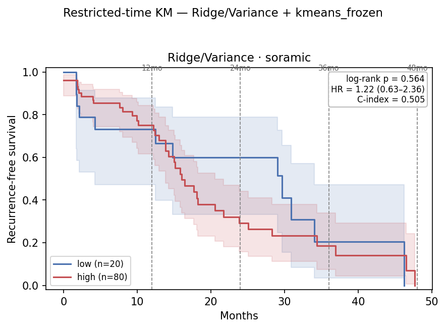
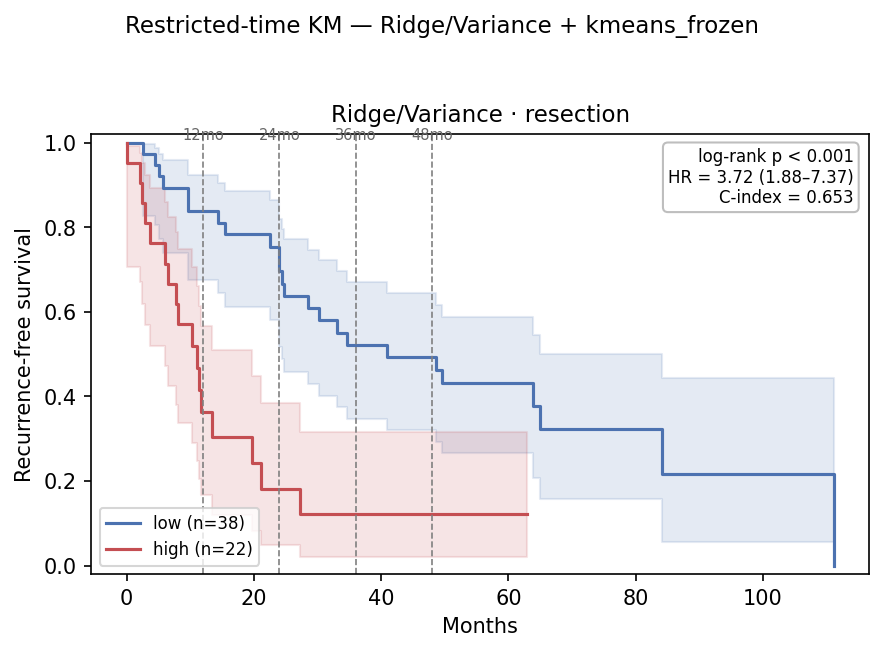
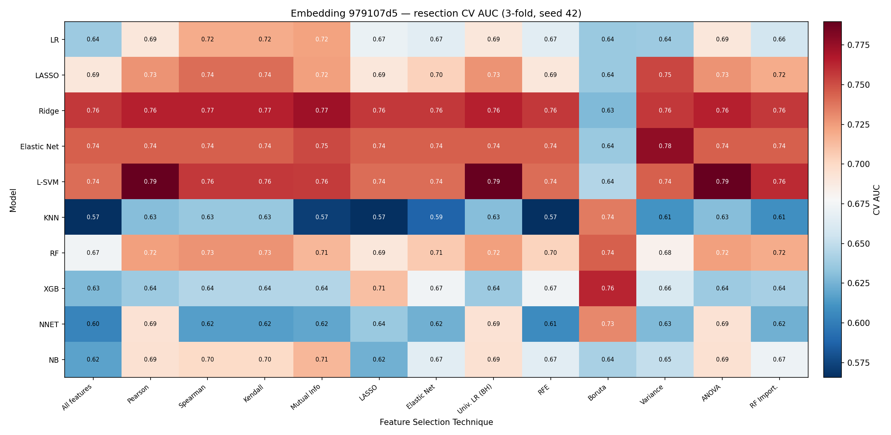
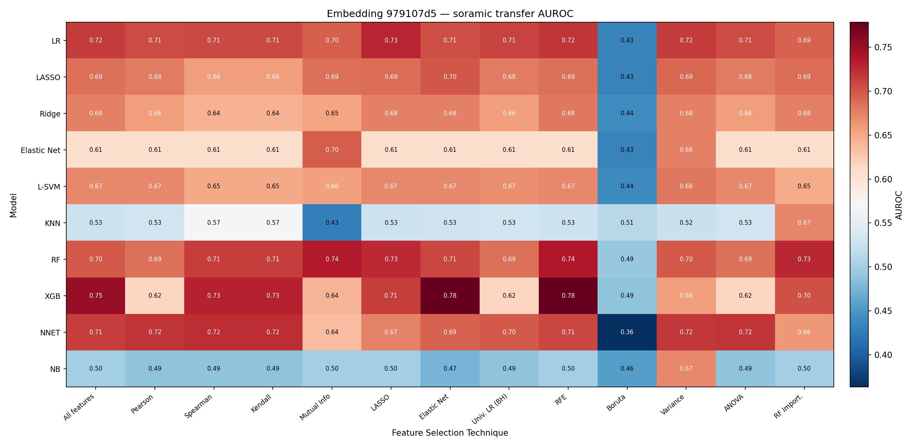
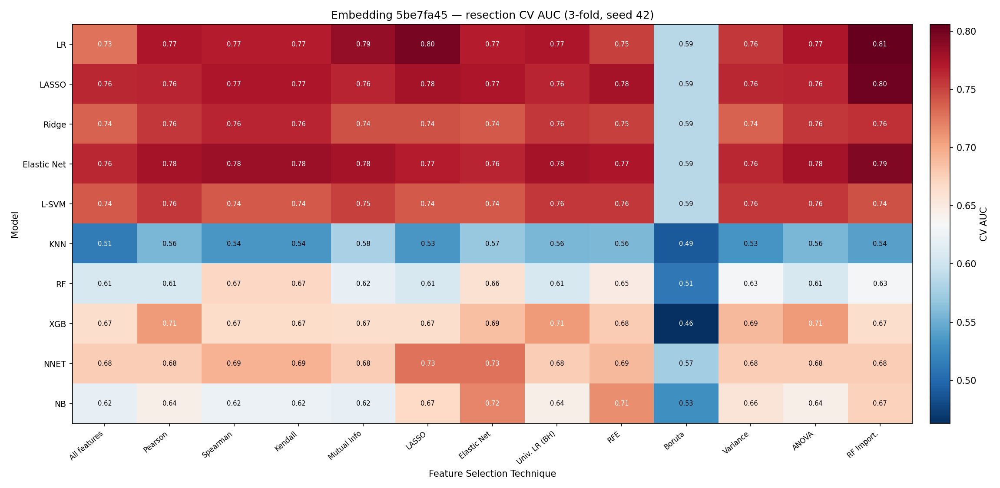
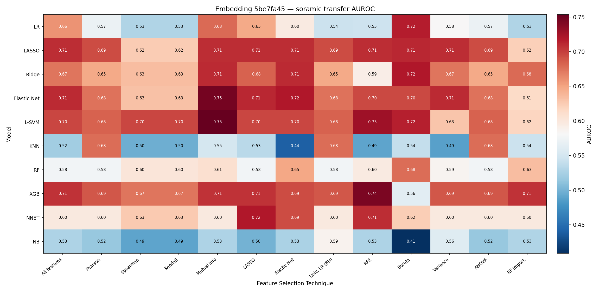

# Reproducing dc7e1d10 with a Deterministic Gene Order — 2026-07-26

`dc7e1d10` (Setting A best encoder in [`0727_embedding_grid_eval_v4.md`](0727_embedding_grid_eval_v4.md))
was trained with a **non-deterministic gene column order** (genes passed as a Python `set`, never
persisted), so its GeneEncoder's gene→slot mapping is unrecoverable and mechanistic gene attribution
is impossible on it. This report retrains `dc7e1d10`'s config under the current code — which pins a
sorted, deterministic gene order — and tests whether the downstream results reproduce, so a valid
interpretable stand-in can be used for gene attribution.

## 0. Why the first attempt failed — a checkpoint-selection confound

An earlier pass (runs `507d94dc`, `8f41f04f`, base `98ddd90b`) appeared to show that deterministic
gene order destroyed the downstream results. It did not. Those runs were trained on code seven commits
newer than `dc7e1d10`'s, and `575272f` had added `--split-unit` with default **`patient`**; `dc7e1d10`
(`511af05`) only ever had slice-level splitting.

Slice-level splitting puts slices from the same patient in both arms, so val loss falls monotonically
and `best_model.pt` — written only when val loss improves (`contrastive/train.py:210`) — ends up being
the **last** epoch. Patient-level splitting is a genuine hold-out, val loss turns upward after epoch
1–2, and `best_model.pt` freezes there. Since both `eval/data.py:41` and `--base_model`
(`contrastive/train.py:134`) read *only* `best_model.pt`, the frozen early checkpoint propagates into
continuation training **and** every downstream evaluation:

| run | split unit | val loss | best checkpoint | effective epochs |
|---|---|---|---|--:|
| `3e598f36` (base) | slice | 1.019 → 0.259, monotone ↓ | ep5 (`best == last`) | 5 |
| `dc7e1d10` | slice | 0.205 → −0.084, monotone ↓ | ep5 (`best == last`) | **10** |
| `507d94dc` | patient | min at ep2 | ep2 (`best ≠ last`, L1 = 64.3) | 7 |
| `98ddd90b` (base) | patient | min at ep1 | ep1 (`best ≠ last`, L1 = 305.5) | 1 |
| `8f41f04f` | patient | min at ep1 | ep1 (`best ≠ last`, L1 = 180.5) | **2** |

The downstream ranking of those runs (`dc7e1d10` > `507d94dc` > `8f41f04f`) tracks effective epochs
(10 > 7 > 2) exactly. `8f41f04f` was not a weak seed — it was a model that had trained for two epochs.
**`507d94dc` and `8f41f04f` are discarded and do not appear below.**

Everything else in `511af05..28d35e5` was ruled out as a confound: `contrastive/loss.py` and
`contrastive/config.py` (`GENE_SET`) are unchanged; the `data.ndim == 4` fix in `transform.py` only
affects the non-cached path, and all 60 patients have a `data/mri_resampled` cache predating both
runs, so the images are bit-identical; `add_rfs_columns`'s new `tolerance_months` defaults to 0.
The resolved 40-gene sorted order is also identical to the one recorded in July, so the RNA matrix
has not moved.

## Method

`dc7e1d10` = base `3e598f36` (5 ep, from scratch) + 5 ep continuation = 10 effective epochs.
Config (both stages): `vit_b_32`, `--freeze_backbone`, `embed_dim 128`, `gene_hidden_dim 256`,
`gene_set all` (40 genes), `n_per_axis all`, `axes 0`, `mri_type raw`, `temperature 0.07`, `lam 0.1`,
`reg_mode per_modality`, `val_split 0.1`, `seed 42`. Both reproduction runs add `--split-unit slice`
so they follow `dc7e1d10`'s original code path and reach the same 10 effective epochs:

| Run | Base | Deterministic order in | Effective epochs | Isolates |
|---|---|---|--:|---|
| `dc7e1d10` | `3e598f36` | — (baseline) | 10 | — |
| **`979107d5`** | `3e598f36` (original, reused) | last 5 ep only | 10 | gene order alone |
| **`5be7fa45`** | `7d9a60aa` (fresh, 5 ep from scratch) | all 10 ep | 10 | gene order + base retrain |

Both are stamped `deterministic_gene_order=True` + the 40-gene sorted order, and both were verified to
satisfy `best_model.pt == last_model.pt` before any downstream step. (`train.py` now writes that stamp
itself, in `_stamp_gene_order`, instead of it being patched in by hand.)

Downstream (identical to 0727 v4): image embeddings extracted for resection / Soramic / Lausanne →
flat non-repeated 3-fold resection-CV grid (10 classifiers × 13 FS, `k∈{43,85,128}`) with top-3 model
ensemble → Soramic restricted-time survival (head A1 = Ridge/Variance k=85, `--freeze-on insample`,
best-power cutoff over median/kmeans/youden, τ∈{12,24,36,48}), per the
[`0713_restricted_time_survival_v2.md`](../0713/0713_restricted_time_survival_v2.md) protocol.

## 1. Embedding grid — Setting A

| Metric | `dc7e1d10` (baseline) | `979107d5` (orig base) | `5be7fa45` (fresh base) |
|---|--:|--:|--:|
| Best-cell resection CV | 0.744 | 0.790 | **0.806** |
| best cell | Ridge/Var k=85 | L-SVM/Pearson k=43 | LR/RF Import. k=43 |
| Anchor LASSO/AllFeat — CV | 0.695 | 0.691 | **0.764** |
| Anchor LASSO/AllFeat — Soramic | **0.718** | 0.685 | 0.708 |
| Best-cell — Soramic | **0.709** | 0.671 | 0.530 |
| Top-3 ensemble — Soramic | **0.697** | 0.668 | 0.620 |
| Anchor / best-cell — Lausanne | 0.419 / 0.436 | 0.456 / 0.430 | **0.507** / **0.513** |

Fixed-head comparison (the A1 cell, evaluated in every run regardless of which cell won):

| A1 head — Ridge/Variance k=85 | `dc7e1d10` | `979107d5` | `5be7fa45` |
|---|--:|--:|--:|
| Resection CV | 0.744 | **0.757** | 0.735 |
| Soramic | **0.709** | 0.675 | 0.674 |
| Lausanne | 0.436 | **0.454** | 0.441 |

## 2. Soramic restricted-time survival — head A1 (Ridge/Variance k=85)

Best-power cutoff sweep (Soramic, full follow-up):

| Run | picked | hi/lo | τ=24 log-rank | τ=24 point-p | full log-rank | full HR |
|---|---|--:|--:|--:|--:|--:|
| `dc7e1d10` | kmeans | 90 / 10 | **0.043** | **0.033** | 0.114 | 2.25 |
| `979107d5` | kmeans | 80 / 20 | 0.210 | 0.047 | 0.564 | 1.22 |
| `5be7fa45` | kmeans | 53 / 47 | 0.248 | 0.279 | 0.067 | 0.59 ⚠︎ |

Selected-head detail:

| Endpoint / τ | `dc7e1d10` | `979107d5` | `5be7fa45` |
|---|--:|--:|--:|
| RFS τ=24 — HR (95% CI) | 3.93 (0.94–16.4) | 1.69 (0.74–3.85) | 0.69 (0.37–1.30) ⚠︎ |
| RFS τ=24 — log-rank | **0.043** ✓ | 0.210 | 0.248 |
| RFS τ=24 — point-p | **0.033** ✓ | 0.047 ✓ | 0.279 |
| TTR τ=24 — HR / log-rank | 7.26 / **0.024** ✓ | 1.26 / 0.614 | 0.60 ⚠︎ / 0.162 |
| C-index (continuous) | ~0.52 | ~0.49–0.52 | ~0.46–0.48 ⚠︎ |

⚠︎ = hazard ratio inverted (HR < 1) / C-index below 0.5: the "high-risk" arm recurs *less*. Null in
either direction, but worth flagging that `5be7fa45`'s dichotomy is anti-correlated with outcome on
Soramic, whereas `979107d5`'s is at least correctly oriented.

## 3. Success criteria

| # | Criterion | `979107d5` | `5be7fa45` |
|---|---|:--:|:--:|
| 1 | Resection CV AUC ≥ baseline (0.744) | ✅ 0.790 best-cell, 0.757 A1 head | ✅ 0.806 best-cell, 0.764 anchor |
| 2 | Soramic transfer ≈ baseline (~0.71) | ⚠️ anchor 0.685, A1 head 0.675, best-cell 0.671 — 0.03–0.04 below | ⚠️ anchor 0.708 ≈ baseline, but best-cell collapses to 0.530 |
| 3 | RFS τ=24 significant | ❌ log-rank 0.210 (point-p 0.047 borderline) | ❌ log-rank 0.248, hazard inverted |

## Findings

- **Gene-order determinism does not damage the embedding.** With training length matched, `979107d5`
  — whose only difference from `dc7e1d10` is the sorted gene column order — tracks the baseline
  closely on every stable read: anchor CV 0.691 vs 0.695, A1-head CV 0.757 vs 0.744, A1-head Soramic
  0.675 vs 0.709, Lausanne 0.454 vs 0.436. This overturns the earlier report's conclusion, which was
  an artefact of the truncated checkpoints described in §0.
- **Retraining the base from scratch costs nothing either.** `5be7fa45` — a fully deterministic
  10-epoch chain built on a fresh base — matches the baseline on the stable reads too: anchor Soramic
  0.708 vs 0.718 (closer than `979107d5`'s 0.685), A1-head Soramic 0.674, and the best Lausanne
  transfer of all three (anchor 0.507, best-cell 0.513). The earlier report's central claim — that
  `dc7e1d10`'s quality was tied to its specific frozen base `3e598f36` — does not survive once
  training length is equalised.
- **The best cell moves, the level does not.** Each run's grid peak lands in a different cell —
  Ridge/Variance k=85 (baseline) → L-SVM/Pearson k=43 (`979107d5`) → LR/RF Import. k=43
  (`5be7fa45`) — at ever-higher CV (0.744 → 0.790 → 0.806) and *worse* transfer
  (0.709 → 0.671 → 0.530). `5be7fa45` is the clearest case: the highest resection CV in the whole
  report has the worst Soramic transfer in it. Which of 130 cells wins a non-repeated 3-fold grid is
  a selection artefact; the anchor and fixed-head reads are what carry across cohorts, and those are
  the ones that reproduce.
- **The A1 survival split reproduces in neither run.** τ=24 log-rank 0.210 (`979107d5`) and 0.248
  (`5be7fa45`) vs the baseline's 0.043. `979107d5` at least keeps the hazard oriented (HR 1.69 > 1,
  RMST point-p 0.047); `5be7fa45` inverts it (HR 0.69, C-index 0.46–0.48).
- **Why: the low arm dissolves.** The frozen kmeans cutoff splits the baseline 90/10, `979107d5`
  80/20, and `5be7fa45` 53/47. The τ=24 signal lived in a sharp 10-patient low arm; small shifts in
  the Soramic score distribution spread that arm out and wash the localized signal away. The low-arm
  size tracks the significance monotonically across all three runs. A1 is a fragile property of one
  cutoff on one cohort, not a robust property of the encoder — which is what Appendix A shows
  directly: `979107d5`'s A1 head separates the *resection* cohort better than the baseline does
  (τ=24 HR 5.13 vs 4.82, C-index 0.779 vs 0.737) and still fails to transfer.

## Conclusion

**Deterministic gene order reproduces `dc7e1d10`'s discrimination; it does not reproduce the A1
survival dichotomy — and neither does anything else, because that dichotomy is not reproducible.**
Both reproduction runs clear criterion 1, sit within 0.01–0.04 of baseline on the stable transfer
reads (criterion 2), and are null at τ=24 (criterion 3). The earlier diagnosis — gene order is
harmless, the base image encoder is to blame — was right about the first half and wrong about the
second; both halves were unmeasurable at the time because the runs had been truncated to 2–7
effective epochs (§0).

**Recommended stand-in: `979107d5`.** It is the tighter reproduction of `dc7e1d10` — same frozen
base, so gene column order is the only difference — its A1 head beats the baseline on resection CV
(0.757 vs 0.744) and in-sample survival separation (Appendix A.3), and its Soramic dichotomy is at
least correctly oriented. Use `5be7fa45` when a fully deterministic chain matters (both stages
trained under a pinned gene order) and cite it as the evidence that base retraining is not the
problem; note that its grid peak is a selection artefact (CV 0.806 / Soramic 0.530) and its Soramic
dichotomy is inverted.

Either way the stand-in must be documented as **null on Soramic survival**. Reporting a τ=24 result
from `dc7e1d10` as a reproducible finding is not supportable: two independent 10-epoch runs of the
same configuration both fail to recover it, and the failure mechanism (low arm growing from 10 to
20 to 47 patients) is visible in the cutoff sweeps.

## Appendix A — `979107d5` A1 Kaplan–Meier curves

Head A1 (Ridge/Variance k=85) at its frozen best-power cutoff (`kmeans_frozen`, threshold 0.516),
full follow-up, τ∈{12,24,36,48} marked. Drawn with `--force-cutoff kmeans_frozen --km` and *without*
`--no-resection`, so the training cohort is scored as the in-sample ceiling alongside the transfer
cohort. The C-index annotated on each figure is the hi/lo-**dichotomy** concordance and differs from
the continuous-score C-index in §2.

### A.1 Soramic (transfer) — 80 high / 20 low



### A.2 Resection (in-sample ceiling) — 22 high / 38 low



### A.3 In-sample ceiling vs baseline

The resection ceiling is **stronger** than `dc7e1d10`'s at every horizon:

| Resection, kmeans_frozen | `dc7e1d10` (24 hi / 36 lo) | `979107d5` (22 hi / 38 lo) |
|---|--:|--:|
| τ=24 — HR / log-rank | 4.82 / 6.3e-05 | **5.13** / **1.5e-05** |
| τ=24 — C-index | 0.737 | **0.779** |
| full — HR / log-rank | 3.08 / 6.2e-04 | **3.72** / 6.8e-05 |

## Appendix B — grid heatmaps

The full 10 classifiers × 13 feature-selection grid behind §1, for both reproduction runs. Rows are
classifiers, columns feature-selection methods; each cell is the best `k∈{43,85,128}` for that pair.
Note the colour scales differ per panel — read the printed numbers, not the hue, when comparing runs.

### B.1 `979107d5` (original base reused)

Resection CV AUC — the selection surface:



Soramic transfer AUROC — what actually generalises:



The linear block (Ridge / Elastic Net / L-SVM) is the CV plateau at 0.74–0.79, but on Soramic that
same block sits at 0.61–0.68 while the tree models — untouched by CV selection — reach 0.74–0.78
(XGB/Elastic Net and XGB/RFE both 0.78). Boruta collapses the whole column on transfer (0.36–0.51).

### B.2 `5be7fa45` (fresh base)





`5be7fa45`'s CV surface is uniformly higher — nearly the entire linear block is 0.73–0.81 — which is
why it takes criterion 1. Its Soramic surface peaks somewhere else entirely (Elastic Net/Mutual Info
and L-SVM/Mutual Info at 0.75, XGB/RFE 0.74), while its CV argmax, LR/RF Import. at 0.81, transfers
at **0.53**. Boruta degenerates in CV here instead (a flat 0.59 column across every linear model).

### B.3 CV does not predict transfer

Spearman rank correlation across all 130 cells, per run:

| Run | CV range | Soramic range | ρ(CV, Soramic) | p | ρ(CV, Lausanne) |
|---|---|---|--:|--:|--:|
| `dc7e1d10` | 0.428–0.744 | 0.268–0.774 | 0.163 | 0.064 | −0.153 |
| `979107d5` | 0.566–0.790 | 0.363–0.778 | 0.016 | 0.854 | 0.020 |
| `5be7fa45` | 0.463–0.806 | 0.409–0.754 | 0.343 | <0.001 | 0.593 |

And the argmax cells never coincide:

| Run | best-CV cell | its Soramic | best-Soramic cell | its CV |
|---|---|--:|---|--:|
| `dc7e1d10` | Ridge/Variance | 0.709 | NNET/LASSO (0.774) | 0.665 |
| `979107d5` | L-SVM/Pearson | 0.671 | XGB/RFE (0.778) | 0.674 |
| `5be7fa45` | LR/RF Import. | 0.530 | L-SVM/Mutual Info (0.754) | 0.752 |

In `dc7e1d10` and `979107d5` the correlation is statistically indistinguishable from zero — selecting
the CV argmax is, with respect to transfer, close to selecting at random from the grid. `dc7e1d10`'s
best cell landing at 0.709 on Soramic was luck, and it is that luck the reproduction runs fail to
repeat, not a property of the encoder. (`5be7fa45` is the one run where CV and transfer *are*
correlated — yet its argmax is still the worst-transferring cell of the three, because a rank
correlation of 0.34 says nothing about the single extreme point.) This is the quantitative form of
the §Findings claim that the anchor and fixed-head reads, not the grid peak, are what reproduce.

## File references

| Artifact | Path |
|---|---|
| Training runs | `training/contrastive/{979107d5,7d9a60aa,5be7fa45}/` (metadata stamped `deterministic_gene_order`) |
| Grid CSVs | `results/eval/grid_flat3/{979107d5,5be7fa45}/` |
| Survival CSVs | `results/eval/survival/restricted_time_{soramic,resection,lusanne}_A1_{979107d5,5be7fa45}_ridge_var_k85_{rfs,ttr}.csv` |
| Cutoff sweeps | `results/eval/survival/cutoff_sweep_A1_{979107d5,5be7fa45}_ridge_var_k85_rfs.csv` |
| Appendix A KM figures | `reports/0727/km/km_restricted_{soramic,resection}_A1_979107d5_ridge_var_k85_rfs.{png,svg}` |
| Appendix B heatmaps | `reports/0727/flat3/{979107d5,5be7fa45}/heatmap_{cv_auc,soramic_auroc,lusanne_auroc}.{png,svg}` — the Lausanne panel is not embedded above |
| Baseline (dc7e1d10) | [`0727_embedding_grid_eval_v4.md`](0727_embedding_grid_eval_v4.md) §4, §6.1; `results/eval/survival/restricted_time_soramic_A1_ridge_var_k85_{rfs,ttr}.csv` |
| Survival protocol | [`0713_restricted_time_survival_v2.md`](../0713/0713_restricted_time_survival_v2.md) |

Regenerate (both reproduction runs share this shape; `5be7fa45` = fresh base then continuation).
**`--split-unit slice` is required** — without it the run stops at 1–2 effective epochs (§0):
```
# stage: base from scratch (omit --base_model);  continuation: add --base_model <BASE>
python -m hcc_multimodal.contrastive.train --freeze_backbone --n_per_axis all --axes 0 \
  --gene_set all --mri_type raw --epochs 5 --seed 42 --split-unit slice [--base_model <BASE>]
# verify before going downstream: val loss monotone ↓ and best_model.pt == last_model.pt
# extract → grid → survival (per FINAL run id)
python -m hcc_multimodal.eval.eval --mode embedding --model-id <FINAL> --ablation-set soramic --target rfs_2year
python -m hcc_multimodal.eval.eval --mode embedding --model-id <FINAL> --ablation-set lusanne --target rfs_2year
python -m hcc_multimodal.eval.embedding_grid_eval --task grid --model-id <FINAL> \
  --cv-mode flat --outer-folds 3 --cv-repeats 1 --select-k-fracs 0.333 0.667 1.0 \
  --model-ensemble --model-ensemble-top-k 3 \
  --output-dir results/eval/grid_flat3/<FINAL> --fig-dir reports/0727/flat3/<FINAL>
python -m hcc_multimodal.survival.run_restricted --model-id <FINAL> --fs Variance --model Ridge \
  --select-k 85 --freeze-on insample --select-cutoff-by-power \
  --cutoffs median_frozen kmeans_frozen youden_frozen --taus 12 24 36 48 --no-resection \
  --output-dir results/eval/survival --tag A1_<FINAL>_ridge_var_k85_rfs
# TTR: same head, forcing the cutoff the RFS sweep picked
python -m hcc_multimodal.survival.run_restricted --model-id <FINAL> --fs Variance --model Ridge \
  --select-k 85 --freeze-on insample --force-cutoff <PICK> \
  --time-col TTR_central --event-col TTR_central_event --taus 12 24 36 48 --no-resection \
  --output-dir results/eval/survival --tag A1_<FINAL>_ridge_var_k85_ttr
# Appendix A KM: same head, cutoff forced, and --no-resection OMITTED so the
# in-sample resection ceiling is drawn too
python -m hcc_multimodal.survival.run_restricted --model-id <FINAL> --fs Variance --model Ridge \
  --select-k 85 --freeze-on insample --force-cutoff <PICK> --taus 12 24 36 48 \
  --km --output-dir results/eval/survival --fig-dir reports/0727/km \
  --tag A1_<FINAL>_ridge_var_k85_rfs
```
