# Embedding Grid Eval v5 — Randomised-Gene-Order Best-Checkpoint Encoders — 2026-08-03

Successor to [`0727_embedding_grid_eval_v4.md`](../0727/0727_embedding_grid_eval_v4.md). One change,
carried from the companion ablation [`0803_gene_ablation_eval_v5.md`](0803_gene_ablation_eval_v5.md):

- **The encoder pool is replaced by the eight randomised-gene-order, 50-epoch-budget runs**, each
  read at its **best-validation-loss checkpoint** (`best_model.pt`). Setting A is the single top
  encoder by resection CV — **`d7085bf5`** (raw · slice · λ=0.1, best epoch 42 of 44), which
  displaces v4's `dc7e1d10`. Setting B is the **top 3 by resection CV AUC** in the 0803 v5 ablation
  §4 — **`d7085bf5 + 78456720 + 5cd1cc2d`** (CV ranks 1/2/3), replacing v4's
  `dc7e1d10 + a64b245f + 92b9afed`.

Everything else — flat non-repeated 3-fold resection CV, the decoupled grid vs. model-ensemble axes,
the four §6 survival heads — is identical in structure to v4, re-run on the new encoders.

> **Caveat on the Setting B membership.** Resection CV picked the ensemble, and two of its three
> members are weak choices on external data: `78456720` transfers at **0.349** on Soramic (the worst
> of the eight, far below chance) and `5cd1cc2d` is an **epoch-1 encoder** — its patient-split
> validation loss rose from epoch 1, so `patience=2` stopped it at epoch 3. Setting B is therefore
> the *CV-selected* ensemble, not a hand-picked good one; §5 should be read as a test of whether
> resection CV can select an ensemble, and the answer there is largely no.

## Table of Contents
- [1. Key findings](#1-key-findings)
- [2. Setup](#2-setup)
- [3. Method](#3-method)
- [4. Setting A — d7085bf5 (single embedding)](#4-setting-a--d7085bf5-single-embedding)
- [5. Setting B — 3-embedding ensemble](#5-setting-b--3-embedding-ensemble)
- [6. Restricted-time survival — Soramic (4 heads)](#6-restricted-time-survival--soramic-4-heads)
- [7. File references](#7-file-references)

## 1. Key findings

| embedding | best single model | top-3 model ensemble |
|---|---:|---:|
|d7085bf5 (best on Resection)|0.694|0.722|
|top 3 on Resection - ensemble|0.713|0.639|

Soramic transfer AUROC. Three of the four cells are in the 0.69–0.72 band — a tighter and slightly
higher spread than v4 (0.623–0.709). The ordering inverts against v4 in both settings: here the
**model ensemble helps** Setting A (0.694 → 0.722, v4: 0.709 → 0.697) and **hurts** Setting B
(0.713 → 0.639, v4: 0.644 → 0.623).

The bigger change is §6. **Both Setting A heads now carry a significant 2-year Soramic signal on
RFS and TTR** — A1 (RFS τ=24 log-rank 0.020, TTR 0.002) and A2 (RFS 0.045, TTR 0.007) — where in v4
only A1 was significant and A2 was null on every horizon. A2's TTR signal also persists to full
follow-up (0.016), which no v4 head managed. The Setting B heads regress: B1 is evaluable but null
(best log-rank 0.053), and **B2 is degenerate** — no resection-frozen cutoff leaves a low arm of
≥5 Soramic patients, so its split is undefined and only the C-index is meaningful.

## 2. Setup

| | Resection (train) | Soramic (test) | Lausanne (test) |
|---|---:|---:|---:|
| `d7085bf5` + `rfs_2year` (Setting A) | 54 (26 pos, 48%) | 57 (39 pos, 68%) | 66 (49 pos, 74%) |
| 3-emb ensemble + `rfs_2year` (Setting B) | 54 (26 pos, 48%) | 56 (38 pos, 68%) | 65 (48 pos, 74%) |

All embeddings image-only 128-dim, read from the survival `resection_img_emb.parquet` /
`ablation_{cohort}_img_emb_{raw,bbox}.parquet` extraction (patient-level, aligned on `SID`) — the
same cache as the 0803 v5 ablation §4, so the grid CV and the ablation CV-rank numbers are directly
comparable. For every encoder here the unsuffixed cache is the **`best_model.pt`** extraction;
`d7085bf5`'s `…__ep010.parquet` caches (its epoch-10 checkpoint, used in the 0803 §1 replicate
table) are not used. Setting B patients are the SID intersection across the 3 embeddings; because
`78456720` is a **bbox** encoder with a slightly smaller usable mask set, the intersection loses 1
Soramic and 1 Lausanne labelled patient vs. the single-encoder counts (54/56/65 vs 54/57/66).
`d7085bf5` and `5cd1cc2d` load their raw caches, `78456720` its bbox cache, resolved per run from
`metadata.json` (`mri_type`).

## 3. Method

- **Grid** — 10 classifiers × 13 feature-selection techniques (130 cells), pipeline
  `SimpleImputer(median) → StandardScaler → selector(k) → classifier`, `select_k ∈ {43, 85, 128}`
  tuned per cell. Ranked by **flat non-repeated 3-fold** resection CV (`GridSearchCV.best_score_`),
  refit, transferred to Soramic/Lausanne. Setting B fits one pipeline per embedding with one
  shared tuned head and averages the scores (`EnsembleGrid`).
- **Model ensemble** — for each classifier take its **max CV AUC across the 13 FS** (its
  "potential"); rank; take the **top-3 distinct** classifiers, each frozen at its argmax-FS cell
  (fs + `select_k` + tuned hyperparameters). Mean-average the 3 members' positive-class scores
  (`HeteroEnsembleGrid`). Ensemble CV = plain 3-fold over the frozen ensemble; transfer = refit
  on all resection. In Setting B each member is itself an embedding ensemble → net mean over
  (embedding × model). Members' configs are chosen on all resection folds, so the ensemble's own
  CV is mildly optimistic — resection CV is a selection signal, the external cohorts are the estimate.

## 4. Setting A — d7085bf5 (single embedding)

*`d7085bf5` is the CV-rank-1 encoder of the eight in the 0803 v5 ablation §4 (0.694 ± 0.040), ahead
of the runner-up by 0.058 and with the tightest fold spread of the top three.*

### 4.1 Flat 3-fold grid + anchor check

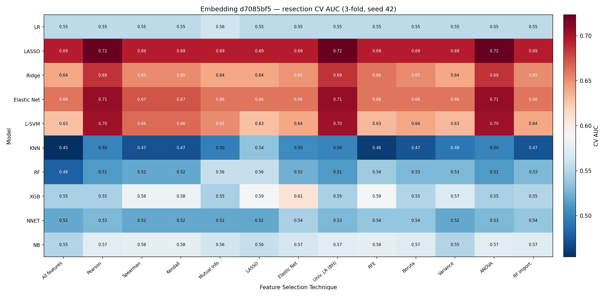
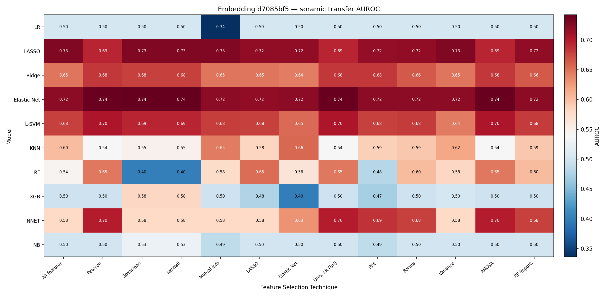
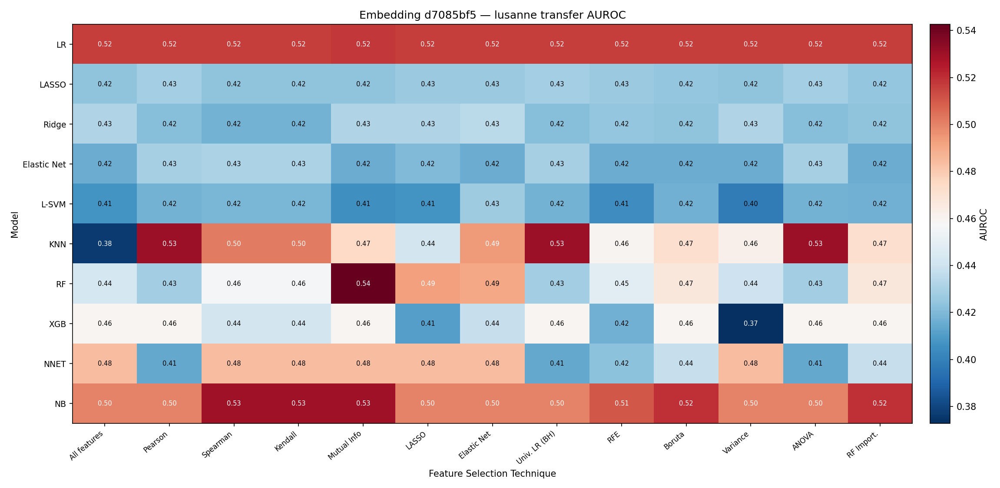

| | CV AUC | Soramic | Lausanne |
|---|---:|---:|---:|
| Anchor `LASSO`/`All features` | 0.694 ± 0.040 | 0.726 | 0.424 |
| Best single cell — `LASSO`/`Pearson`, k=85 | **0.723** | 0.694 | 0.429 |

Grid CV range 0.454–0.723. The anchor matches the ablation §4 `d7085bf5` LR-head number exactly
(0.694 CV / 0.726 Soramic / 0.424 Lausanne). `LASSO`/`Pearson` ties with `LASSO`/`ANOVA` and
`LASSO`/`Univ. LR (BH)` at 0.723 — all three resolve to the same k=85 selection on this embedding,
so the "best cell" is one pipeline reached by three equivalent filters. Note the grid's CV gain over
the anchor (+0.029) is paid for in transfer: the best-CV cell is **worse** on Soramic than the
no-selection anchor (0.694 vs 0.726).

### 4.2 Top-3 model ensemble

Per-classifier potential (best CV across FS): LASSO 0.723, Elastic Net 0.707, L-SVM 0.702,
Ridge 0.686, XGB 0.607, NB 0.576, LR 0.562, RF 0.558, NNET 0.545, KNN 0.535.

| Member | FS | k | CV AUC | Soramic | Lausanne |
|---|---|---:|---:|---:|---:|
| LASSO | Pearson | 85 | 0.723 | | |
| Elastic Net | Pearson | 43 | 0.707 | | |
| L-SVM | Pearson | 43 | 0.702 | | |
| **Ensemble (mean)** | — | — | **0.719** | **0.722** | **0.432** |

All three members select on `Pearson` — the top of this grid is a single FS filter with three
linear classifiers over it, so the ensemble averages three correlated scores. It still recovers
almost all of the anchor's Soramic transfer (0.722 vs 0.726) while keeping the grid's CV level
(0.719), i.e. it is the best CV/transfer compromise of the three Setting A rows. Lausanne is flat
across all of them (0.424–0.432).

## 5. Setting B — 3-embedding ensemble

*New membership: `d7085bf5 + 78456720 + 5cd1cc2d` (top 3 by resection CV AUC in the 0803 v5
ablation §4: 0.694 / 0.636 / 0.628).*

### 5.1 Flat 3-fold grid (embedding-ensemble cells)

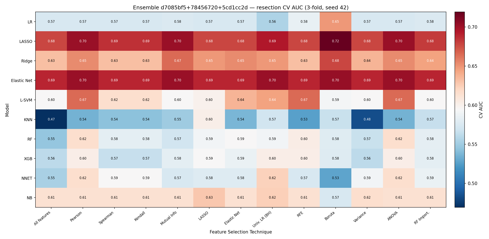
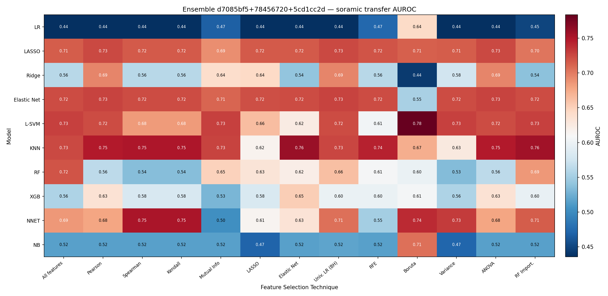
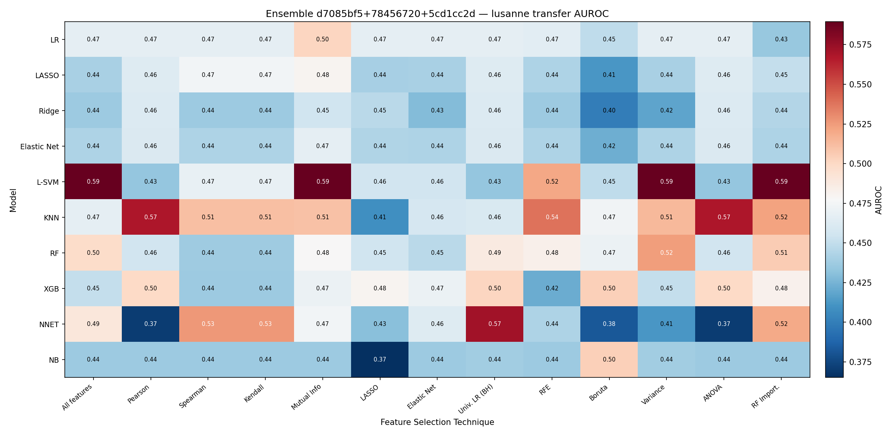

| | CV AUC | Soramic | Lausanne |
|---|---:|---:|---:|
| Anchor `LASSO`/`All features` | 0.677 ± 0.080 | 0.715 | 0.441 |
| Best single cell — `LASSO`/`Boruta`, k=85 | **0.719** | 0.713 | 0.412 |

Grid CV range **0.469–0.719** (top cell `LASSO`/`Boruta` 0.719, below v4's 0.764 and well below
v3's raw-only 0.814). **Averaging in the two weaker encoders costs CV but not Soramic transfer**:
the ensemble anchor is 0.017 below the Setting A anchor on CV (0.677 vs 0.694) and only 0.011 below
on Soramic (0.715 vs 0.726) — `78456720`'s 0.349 solo Soramic transfer does not drag the average
down the way its solo number suggests. Lausanne improves slightly over Setting A (anchor 0.441 vs
0.424) but stays below chance, so the bbox-encoder Lausanne lift that v4 reported (0.534) does not
reappear here. The fold spread roughly doubles (±0.080 vs ±0.040) — averaging three heterogeneous
encoders makes the CV estimate noisier, not steadier.

### 5.2 Top-3 model ensemble (each member an embedding ensemble)

Per-classifier potential: LASSO 0.719, Elastic Net 0.703, Ridge 0.678, L-SVM 0.665, LR 0.649,
NB 0.628, NNET 0.624, RF 0.616, XGB 0.603, KNN 0.601.

| Member | FS | k | CV AUC | Soramic | Lausanne |
|---|---|---:|---:|---:|---:|
| LASSO | Boruta | 85 | 0.719 | | |
| Elastic Net | Boruta | 43 | 0.703 | | |
| Ridge | Boruta | 128 | 0.678 | | |
| **Ensemble (mean)** | — | — | **0.711** | **0.639** | **0.400** |

As in Setting A all three members share one FS filter (`Boruta` here), but unlike Setting A the
model ensemble **costs** 0.074 of Soramic transfer relative to its own best cell (0.713 → 0.639) at
essentially no CV gain (0.719 → 0.711). Averaging over both axes at once (3 embeddings × 3
classifiers = 9 pipelines) is the worst-transferring of the four cells in §1 and, per §6.4, the only
one whose survival split degenerates.

## 6. Restricted-time survival — Soramic (4 heads)

Each of the four §1 heads is carried into the restricted-time domain following the
[`0713_restricted_time_survival_v2.md`](../0713/0713_restricted_time_survival_v2.md) protocol:
score refit on all labelled resection, freeze the high/low cutoff on the in-sample resection scores,
then re-read on Soramic at τ ∈ {12, 24, 36, 48} mo + full follow-up on **RFS and TTR** — readout
**A** (administrative-censoring KM / log-rank / Cox HR / Harrell C) and **B** (RMST: per-arm, ΔRMST
95% CI, point-in-time survival-difference p). Splits are endpoint-independent (frozen from the
`rfs_2year`-based scores), so RFS and TTR share the partition. This section reports the **Soramic**
transfer tables; each head's KM also shows the **Resection in-sample ceiling** curve (same frozen
cutoff, drawn on the training cohort). Lausanne tables are written by the same runs and are listed
in §7 but not analysed here. Setting A heads (`d7085bf5`) score all **Soramic n = 100** (RFS 50
events, TTR 31 events); Setting B heads score the 3-embedding intersection **Soramic n = 98** (RFS
49 events, TTR 30 events) — the bbox `78456720` cache trims 2 patients. All scored regardless of
2-year label availability (as in v2 §2).

**Cutoff selection (per head).** As in v2 §1, the deployable cutoff must be frozen on resection, so for
each head all three resection-frozen strategies — **median**, **kmeans**, **youden** — are swept and the
one with the **best Soramic power** is chosen: minimum full-follow-up log-rank among cutoffs that leave a
populated low arm (≥ 5 patients) in the correct direction (HR > 1). The sweep (Soramic RFS):

- A1 - d7085bf5 x best single model
- A2 - d7085bf5 x top 3 model ensemble
- B1 - top 3 embeddings on Resection - ensemble x best single model
- B2 - top 3 embeddings on Resection - ensemble x top 3 model ensemble

| Head | cutoff | thr | hi/lo | τ=24 log-rank | τ=24 point-p | full log-rank | full HR | selected |
|---|---|---:|---:|---:|---:|---:|---:|:--:|
| **A1** | median | 0.475 | 84 / 16 | 0.020 | 0.013 | 0.084 | 2.11 | |
| **A1** | kmeans | 0.523 | 80 / 20 | 0.095 | 0.031 | 0.259 | 1.56 | |
| **A1** | **youden** | 0.489 | 83 / 17 | **0.020** | **0.013** | **0.083** | 2.12 | ★ |
| **A2** | median | 0.481 | 81 / 19 | 0.097 | 0.031 | 0.263 | 1.55 | |
| **A2** | **kmeans** | 0.463 | 83 / 17 | **0.045** | **0.022** | **0.152** | 1.80 | ★ |
| **A2** | youden | 0.484 | 81 / 19 | 0.097 | 0.031 | 0.263 | 1.55 | (≡ median) |
| **B1** | median | 0.468 | 97 / 1 | 0.328 | — | 0.913 | 1.12 | (low arm < 5) |
| **B1** | **kmeans** | 0.537 | 92 / 6 | **0.053** | 0.126 | **0.220** | 2.06 | ★ |
| **B1** | youden | 0.486 | 96 / 2 | 0.166 | — | 0.470 | 2.05 | (low arm < 5) |
| **B2** | median | 0.473 | **98 / 0** | — | — | — | — | (degenerate) |
| **B2** | kmeans | 0.519 | 96 / 2 | 0.557 | 0.762 | 0.966 | 0.97 | (low arm < 5) |
| **B2** | youden | 0.485 | **98 / 0** | — | — | — | — | (degenerate) |

Three structural facts drive the picks. **A1/A2 are near-balanced and cutoff-sensitive in a benign
way** — all three thresholds land within 0.06 of each other and carve 16–20-patient low arms, the
largest low arms any version of this report has produced; A1's youden and median are effectively
tied (0.0196 vs 0.0200 at τ=24) and youden wins on the full-follow-up tiebreak, while A2's kmeans is
the clear pick. **B1 collapses toward a one-sided split under two of three cutoffs** (97/1 and 96/2),
so only kmeans satisfies the ≥5 rule. **B2 is degenerate**: median and youden put *every* Soramic
patient in the high arm (98/0, no KM defined) and kmeans leaves 2 — averaging over both axes pushes
the whole Soramic score distribution above the resection-frozen boundaries, the same failure mode v3
saw in its B1. B2 falls back to kmeans so a table and a valid C-index still emit, but its split
carries no information. Selected split per head:

| Head | Description | cutoff | Soramic hi/lo | Evaluable? |
|---|---|---|---:|:--:|
| **A1** | d7085bf5 · LASSO/Pearson k=85 (best single) | youden | 83 / 17 | ✔ significant τ=24 (RFS + TTR) |
| **A2** | d7085bf5 · top-3 model ensemble | kmeans | 83 / 17 | ✔ significant τ=24 (RFS + TTR), TTR to full |
| **B1** | 3-emb ensemble · LASSO/Boruta k=85 (best single) | kmeans | 92 / 6 | ✔ null (τ=24 RFS 0.053) |
| **B2** | 3-emb ensemble · top-3 model ensemble | kmeans (fallback) | 96 / 2 | ✘ degenerate — C-index only |

### 6.1 A1 — d7085bf5 · LASSO/Pearson k=85 (best single), youden, 83 hi / 17 lo

Soramic RFS KM (full follow-up, frozen youden cutoff; τ = 12/24/36/48 mo marked):

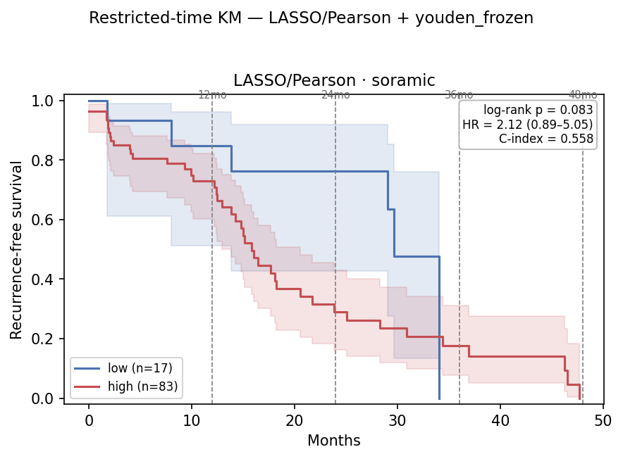

Resection (in-sample ceiling) RFS KM — same frozen youden cutoff:

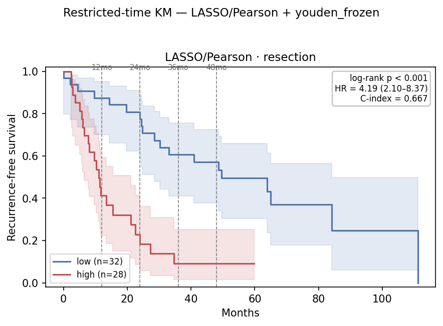

RFS:

| τ (mo) | ev hi/lo | HR (95% CI) | log-rank p | C-idx | ‖ | RMST hi/lo | ΔRMST (95% CI) | point-p |
|---:|---:|---|---:|---:|:--:|---:|---:|---:|
| 12 | 18 / 2 | 1.97 (0.46–8.50) | 0.354 | 0.479 | ‖ | 9.9 / 11.0 | −1.1 (−10.5, +8.2) | 0.389 |
| **24** | **36 / 3** | 3.73 (1.14–12.17) | **0.020** | 0.546 | ‖ | 15.3 / 20.3 | −5.0 (−25.9, +15.9) | **0.013** |
| 36 | 40 / 6 | 2.12 (0.89–5.05) | 0.083 | 0.542 | ‖ | 18.0 / 26.6 | −8.6 (−39.5, +22.3) | 0.000† |
| 48 ≈ full | 44 / 6 | 2.12 (0.89–5.05) | 0.083 | 0.542 | ‖ | 19.6 / 26.6 | −7.0 (−42.0, +28.0) | — |
| full | 44 / 6 | 2.12 (0.89–5.05) | 0.083 | 0.542 | ‖ | — | — | — |

TTR:

| τ (mo) | ev hi/lo | HR (95% CI) | log-rank p | C-idx | ‖ | RMST hi/lo | ΔRMST (95% CI) | point-p |
|---:|---:|---|---:|---:|:--:|---:|---:|---:|
| 12 | 17 / 0 | —‡ | 0.067 | 0.512 | ‖ | 9.8 / 12.0 | −2.2 (−10.0, +5.6) | — |
| **24** | **29 / 0** | —‡ | **0.002** | 0.553 | ‖ | 14.5 / 24.0 | −9.5 (−24.6, +5.5) | — |
| 36 | 30 / 1 | 10.33 (1.39–76.92) | **0.005** | 0.550 | ‖ | 17.3 / 34.3 | −17.0 (−40.6, +6.6) | 0.078 |
| 48 ≈ full | 30 / 1 | 10.33 (1.39–76.92) | **0.005** | 0.550 | ‖ | 19.2 / 43.3 | −24.1 (−57.8, +9.7) | 0.078 |
| full | 30 / 1 | 10.33 (1.39–76.92) | **0.005** | 0.550 | ‖ | — | — | — |

**A1 is the strongest single head this report series has produced.** RFS τ=24 log-rank 0.020 /
point-p 0.013 with an HR whose 95% CI now **excludes 1** (3.73, 1.14–12.17) — v4's A1 had the same
p but a CI straddling 1 (3.93, 0.94–16.38), because its low arm held 10 patients against 17 here.
The TTR read is stronger still and, unlike v4, **holds to full follow-up** (0.005): not a single one
of the 17 low-arm patients recurred within 24 months. The RFS signal still softens past τ=24
(full 0.083). ‡Zero low-arm events make the τ=12/24 TTR Cox HR unidentifiable (the fit runs off to
∞); read the log-rank. †τ=36 RFS point-p 0.000 is a degenerate point-in-time variance estimate on
the 6-event low arm, not signal.

### 6.2 A2 — d7085bf5 · top-3 model ensemble, kmeans, 83 hi / 17 lo

Soramic RFS KM (full follow-up, frozen kmeans cutoff; τ = 12/24/36/48 mo marked):

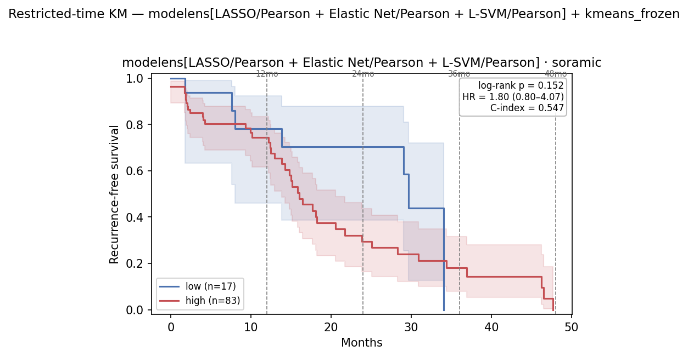

Resection (in-sample ceiling) RFS KM — same frozen kmeans cutoff:

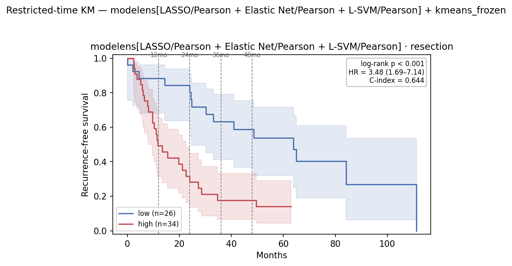

RFS:

| τ (mo) | ev hi/lo | HR (95% CI) | log-rank p | C-idx | ‖ | RMST hi/lo | ΔRMST (95% CI) | point-p |
|---:|---:|---|---:|---:|:--:|---:|---:|---:|
| 12 | 17 / 3 | 1.32 (0.39–4.49) | 0.662 | 0.490 | ‖ | 9.9 / 10.7 | −0.8 (−10.2, +8.7) | 0.774 |
| **24** | **35 / 4** | 2.77 (0.98–7.84) | **0.045** | 0.560 | ‖ | 15.4 / 19.3 | −3.9 (−25.5, +17.7) | **0.022** |
| 36 | 39 / 7 | 1.80 (0.80–4.07) | 0.152 | 0.556 | ‖ | 18.3 / 25.1 | −6.9 (−38.8, +25.1) | 0.000† |
| 48 ≈ full | 43 / 7 | 1.80 (0.80–4.07) | 0.152 | 0.556 | ‖ | 19.8 / 25.1 | −5.3 (−41.3, +30.7) | — |
| full | 43 / 7 | 1.80 (0.80–4.07) | 0.152 | 0.556 | ‖ | — | — | — |

TTR:

| τ (mo) | ev hi/lo | HR (95% CI) | log-rank p | C-idx | ‖ | RMST hi/lo | ΔRMST (95% CI) | point-p |
|---:|---:|---|---:|---:|:--:|---:|---:|---:|
| 12 | 16 / 1 | 3.39 (0.45–25.61) | 0.208 | 0.524 | ‖ | 9.9 / 11.5 | −1.7 (−9.9, +6.6) | 0.370 |
| **24** | **28 / 1** | 9.64 (1.30–71.65) | **0.007** | 0.564 | ‖ | 14.6 / 22.2 | −7.5 (−25.6, +10.5) | **0.017** |
| 36 | 29 / 2 | 5.05 (1.18–21.55) | **0.016** | 0.561 | ‖ | 17.5 / 31.3 | −13.8 (−42.5, +14.9) | 0.072 |
| 48 ≈ full | 29 / 2 | 5.05 (1.18–21.55) | **0.016** | 0.561 | ‖ | 19.5 / 39.3 | −19.8 (−59.8, +20.2) | 0.072 |
| full | 29 / 2 | 5.05 (1.18–21.55) | **0.016** | 0.561 | ‖ | — | — | — |

**The clearest reversal against v4.** There, mean-averaging three classifiers dissolved A1's signal
and left A2 null on every horizon (best log-rank 0.244). Here A2 keeps it: RFS τ=24 log-rank 0.045 /
point-p 0.022, and TTR significant at **every horizon from 24 months out** including full follow-up
(HR 5.05, CI 1.18–21.55, p 0.016) — the only head in v4 or v5 to do so. A2 also carries the highest
C-index of the four heads (0.556–0.564 continuous-score) and the highest τ=24 RFS C-index overall.
The RFS HR CI still just includes 1 at τ=24 (0.98–7.84). Because all three ensemble members select
on the same `Pearson` filter (§4.2), the averaging here is over correlated linear scores and
preserves the ranking rather than washing it out — the mechanism that failed in v4, where the
members spanned three different FS filters. †τ=36 RFS point-p 0.000 is a degenerate estimate.

### 6.3 B1 — 3-emb ensemble · LASSO/Boruta k=85 (best single), kmeans, 92 hi / 6 lo

Soramic RFS KM (full follow-up, frozen kmeans cutoff; τ = 12/24/36/48 mo marked):

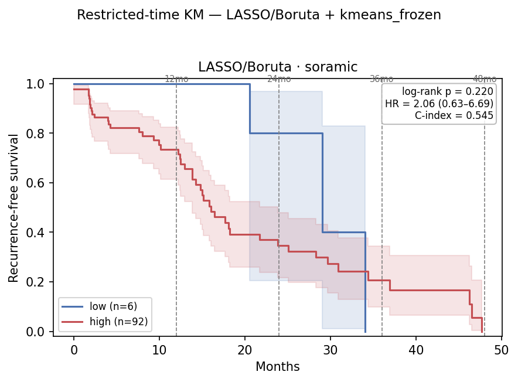

Resection (in-sample ceiling) RFS KM — same frozen kmeans cutoff:

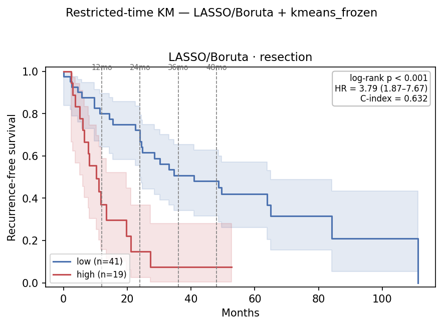

RFS:

| τ (mo) | ev hi/lo | HR (95% CI) | log-rank p | C-idx | ‖ | RMST hi/lo | ΔRMST (95% CI) | point-p |
|---:|---:|---|---:|---:|:--:|---:|---:|---:|
| 12 | 19 / 0 | —‡ | 0.177 | 0.480 | ‖ | 10.0 / 12.0 | −2.0 (−9.4, +5.4) | — |
| 24 | 37 / 1 | 5.69 (0.78–41.63) | 0.053 | 0.543 | ‖ | 15.7 / 23.3 | −7.6 (−23.5, +8.3) | 0.126 |
| 36 | 42 / 3 | 2.06 (0.63–6.69) | 0.220 | 0.538 | ‖ | 19.0 / 29.3 | −10.3 (−35.8, +15.2) | 0.000† |
| 48 ≈ full | 46 / 3 | 2.06 (0.63–6.69) | 0.220 | 0.538 | ‖ | 20.9 / 29.3 | −8.5 (−39.3, +22.4) | — |
| full | 46 / 3 | 2.06 (0.63–6.69) | 0.220 | 0.538 | ‖ | — | — | — |

TTR:

| τ (mo) | ev hi/lo | HR (95% CI) | log-rank p | C-idx | ‖ | RMST hi/lo | ΔRMST (95% CI) | point-p |
|---:|---:|---|---:|---:|:--:|---:|---:|---:|
| 12 | 16 / 0 | —‡ | 0.209 | 0.495 | ‖ | 10.1 / 12.0 | −1.9 (−9.3, +5.4) | — |
| 24 | 27 / 1 | 4.99 (0.67–37.23) | 0.082 | 0.537 | ‖ | 15.5 / 23.1 | −7.7 (−23.2, +7.9) | 0.211 |
| 36 | 28 / 2 | 2.44 (0.57–10.46) | 0.214 | 0.534 | ‖ | 19.5 / 26.9 | −7.4 (−33.2, +18.4) | 0.000† |
| 48 ≈ full | 28 / 2 | 2.44 (0.57–10.46) | 0.214 | 0.534 | ‖ | 22.3 / 26.9 | −4.6 (−38.1, +28.9) | 0.000† |
| full | 28 / 2 | 2.44 (0.57–10.46) | 0.214 | 0.534 | ‖ | — | — | — |

The HR points the right way (>1) at every horizon and the τ=24 direction and magnitude echo A1
(RFS HR 5.69, RFS p 0.053; TTR HR 4.99, p 0.082) — but on a **6-patient low arm with 1 event**,
nothing clears significance and every CI is uninformative. This is the same shape as v4's B1 (null,
directional) but on a smaller low arm (6 vs 8). Averaging in the two weaker encoders shifts the
Soramic score distribution up enough to squeeze the low arm, which costs the power that A1 has at
the identical cutoff family. ‡Zero low-arm events make the τ=12 Cox HR unidentifiable. †point-p
0.000 rows are degenerate low-arm variance estimates.

### 6.4 B2 — 3-emb ensemble · top-3 model ensemble — degenerate (96 hi / 2 lo, fallback kmeans)

**B2 has no valid split.** Both the median and youden resection-frozen thresholds put all 98 Soramic
patients in the high arm (98/0) and kmeans leaves 2, so no cutoff satisfies the ≥5 low-arm rule; the
run falls back to kmeans so a table and a valid continuous-score C-index still emit. The tables
below are reported for completeness — **the log-rank, HR and RMST columns are not interpretable**.

Soramic RFS KM (fallback kmeans cutoff, 96/2 — shown only to document the degeneracy):

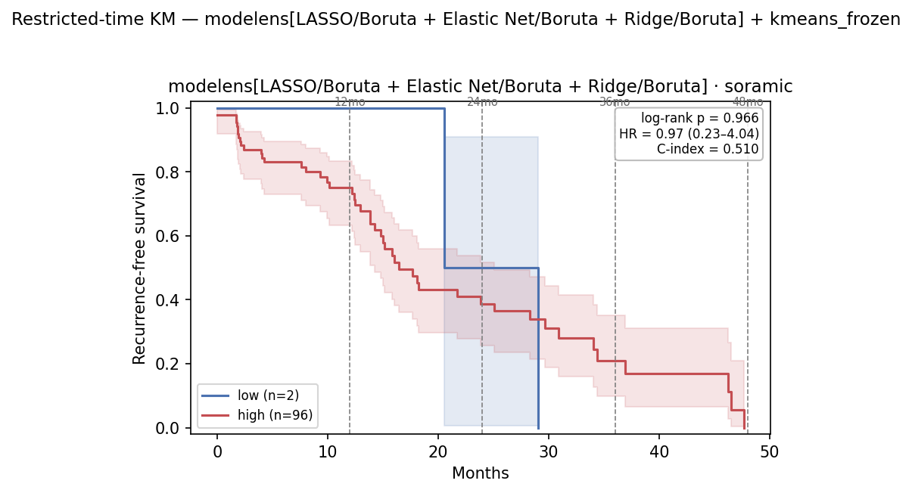

Resection (in-sample ceiling) RFS KM — same fallback cutoff:

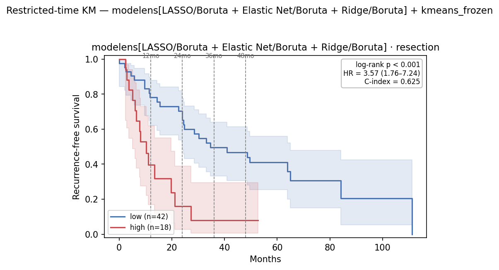

RFS:

| τ (mo) | ev hi/lo | HR (95% CI) | log-rank p | C-idx | ‖ | RMST hi/lo | ΔRMST (95% CI) | point-p |
|---:|---:|---|---:|---:|:--:|---:|---:|---:|
| 12 | 19 / 0 | —‡ | 0.450 | 0.445 | ‖ | 10.1 / 12.0 | −1.9 (−9.1, +5.4) | — |
| 24 | 37 / 1 | 1.80 (0.25–13.20) | 0.557 | 0.494 | ‖ | 16.2 / 22.3 | −6.1 (−22.2, +10.1) | 0.762 |
| 36 | 43 / 2 | 0.97 (0.23–4.04) | 0.966 | 0.491 | ‖ | 20.0 / 24.8 | −4.8 (−30.2, +20.5) | 0.000† |
| 48 ≈ full | 47 / 2 | 0.97 (0.23–4.04) | 0.966 | 0.491 | ‖ | 21.8 / 24.8 | −3.0 (−33.6, +27.6) | — |
| full | 47 / 2 | 0.97 (0.23–4.04) | 0.966 | 0.491 | ‖ | — | — | — |

TTR:

| τ (mo) | ev hi/lo | HR (95% CI) | log-rank p | C-idx | ‖ | RMST hi/lo | ΔRMST (95% CI) | point-p |
|---:|---:|---|---:|---:|:--:|---:|---:|---:|
| 12 | 16 / 0 | —‡ | 0.468 | 0.448 | ‖ | 10.2 / 12.0 | −1.8 (−9.0, +5.4) | — |
| 24 | 27 / 1 | 1.88 (0.25–14.11) | 0.532 | 0.485 | ‖ | 16.1 / 22.3 | −6.2 (−22.0, +9.6) | 0.788 |
| 36 | 28 / 2 | 0.96 (0.22–4.13) | 0.954 | 0.483 | ‖ | 20.6 / 24.8 | −4.2 (−30.8, +22.5) | 0.000† |
| 48 ≈ full | 28 / 2 | 0.96 (0.22–4.13) | 0.954 | 0.483 | ‖ | 23.8 / 24.8 | −1.0 (−35.5, +33.6) | 0.000† |
| full | 28 / 2 | 0.96 (0.22–4.13) | 0.954 | 0.483 | ‖ | — | — | — |

The one number worth reading is the **continuous-score C-index, 0.483–0.494 on RFS and 0.483–0.485
on TTR — at or below chance**. Mean-averaging both axes (3 embeddings × 3 classifiers) produces a
score that neither stratifies nor ranks. v4's B2 was evaluable-but-null with a C-index of 0.38–0.45;
v5's is degenerate with a C-index closer to 0.50. Either way, the double ensemble is the worst of
the four heads in both report versions, and it is the only §6 configuration that has now failed in
two different ways (v3 B1 100/0, v5 B2 98/0) from the same cause: averaging pushes Soramic scores
above every resection-frozen boundary. ‡Unidentifiable Cox HR (zero low-arm events). †degenerate
point-in-time variance estimates.

### 6.5 Read across the four heads

**The single-encoder setting is where the survival signal lives, and this time it survives model
ensembling.** A1 and A2 are both significant at τ=24 on RFS *and* TTR, with 17-patient low arms —
roughly double v4's A1 low arm — so the estimates rest on more data than any previous version's.
Going from one encoder to three costs the signal outright: B1 is directional but null, B2 has no
split at all. The pattern across v3/v4/v5 is consistent — **embedding-level ensembling raises the
Soramic score distribution and squeezes the low arm**, and every degenerate head this series has
produced has been an embedding ensemble.

## 7. File references

| Artifact | Path |
|---|---|
| Grid pipeline + ensembles | `hcc_multimodal/eval/grid.py`, `hcc_multimodal/eval/ensemble.py` (`EnsembleGrid`, `HeteroEnsembleGrid`, `build_member`) |
| Grid runner | `hcc_multimodal/eval/embedding_grid_eval.py` (`--model-ensemble`, `--model-ensemble-top-k`) |
| Setting A CSVs | `results/eval/grid_flat3_bestckpt/d7085bf5/{grid_cv_auc,grid_cv_auc_matrix,grid_transfer_*,model_ensemble_members,model_ensemble_best}.csv` |
| Setting B CSVs (v5) | `results/eval/grid_flat3_ensemble_v5/{…same…,grid_best_by_cv}.csv` |
| Heatmaps | `reports/0803/flat3_bestckpt/d7085bf5/`, `reports/0803/flat3/ensemble_v5/` — `heatmap_{cv_auc,soramic_auroc,lusanne_auroc}.{png,svg}` |
| §6 runner + scoring | `hcc_multimodal/survival/run_restricted.py` (`--members-csv`, `--select-cutoff-by-power`), `hcc_multimodal/survival/grid_scores.py` (`route_grid_scores_hetero`), `restricted.py`, `cutoffs.py`, `hcc_multimodal/eval/ensemble.py` |
| §6 cutoff sweeps | `results/eval/survival/cutoff_sweep_{A1_lasso_pearson_k85_v5,A2_modelens_v5,B1_lasso_boruta_k85_v5,B2_modelens_v5}_rfs.csv` (median/kmeans/youden per head) |
| §6 Soramic tables | `results/eval/survival/restricted_time_soramic_{A1_lasso_pearson_k85_v5,A2_modelens_v5,B1_lasso_boruta_k85_v5,B2_modelens_v5}_{rfs,ttr}.csv` |
| §6 Lausanne tables (not analysed) | `results/eval/survival/restricted_time_lusanne_<same tags>_{rfs,ttr}.csv` |
| §6 Resection in-sample tables | `results/eval/survival/restricted_time_resection_<same tags>_rfs.csv` |
| §6.1–6.4 RFS KM figures | `reports/0803/km/km_restricted_{soramic,resection,lusanne}_<tag>_rfs.{png,svg}` — full-follow-up RFS KM at the frozen cutoff, τ marked. Drawn by `run_restricted._draw_km` / `plots._draw_subplot`. Annotation C-index is the hi/lo-dichotomy concordance and differs from the continuous-score C-index in the §6 tables. |
| §6 protocol reference | [`0713_restricted_time_survival_v2.md`](../0713/0713_restricted_time_survival_v2.md) |
| CV-rank baseline (0803 encoders) | [`0803_gene_ablation_eval_v5.md`](0803_gene_ablation_eval_v5.md) §4 |
| Encoder provenance / epoch table | [`0803_full_epochs_gene_randomized.md`](0803_full_epochs_gene_randomized.md) |
| Prior v4 grid / ensemble | [`0727_embedding_grid_eval_v4.md`](../0727/0727_embedding_grid_eval_v4.md) |

Regenerate — Setting A (single embedding: grid + model ensemble):
```
python -m hcc_multimodal.eval.embedding_grid_eval --task grid --model-id d7085bf5 \
  --cv-mode flat --outer-folds 3 --cv-repeats 1 --select-k-fracs 0.333 0.667 1.0 \
  --model-ensemble --model-ensemble-top-k 3 \
  --output-dir results/eval/grid_flat3_bestckpt/d7085bf5 --fig-dir reports/0803/flat3_bestckpt/d7085bf5
```
Regenerate — Setting B (top-3-by-CV ensemble + model ensemble = both axes):
```
python -m hcc_multimodal.eval.embedding_grid_eval --task grid \
  --model-id d7085bf5 78456720 5cd1cc2d --ensemble \
  --cv-mode flat --outer-folds 3 --cv-repeats 1 --select-k-fracs 0.333 0.667 1.0 \
  --model-ensemble --model-ensemble-top-k 3 \
  --output-dir results/eval/grid_flat3_ensemble_v5 --fig-dir reports/0803/flat3/ensemble_v5
```
Decoupling: drop `--model-ensemble` for grid-only; drop `--ensemble` for the single-embedding
axis; both flags together = embedding × model.

Regenerate — §6 restricted-time survival. Each head is **one RFS invocation** that sweeps the
cutoffs (`--select-cutoff-by-power` writes `cutoff_sweep_<tag>.csv` and prints the pick), draws the
Soramic / Resection / Lausanne KMs (`--km`, resection included since `--no-resection` is omitted),
and writes the RFS tables — followed by a TTR invocation with that pick forced. All use
`--freeze-on insample --cutoffs median_frozen kmeans_frozen youden_frozen --taus 12 24 36 48
--output-dir results/eval/survival --fig-dir reports/0803/km`. RFS commands (TTR = same head +
`--force-cutoff <pick> --time-col TTR_central --event-col TTR_central_event --no-resection`):
```
# A1 (pick: youden) — single cell
python -m hcc_multimodal.survival.run_restricted --model-id d7085bf5 --fs Pearson --model LASSO \
  --select-k 85 --freeze-on insample --select-cutoff-by-power --km \
  --cutoffs median_frozen kmeans_frozen youden_frozen --taus 12 24 36 48 \
  --output-dir results/eval/survival --fig-dir reports/0803/km --tag A1_lasso_pearson_k85_v5_rfs
# A2 (pick: kmeans) — model ensemble, single embedding
python -m hcc_multimodal.survival.run_restricted --model-id d7085bf5 \
  --members-csv results/eval/grid_flat3_bestckpt/d7085bf5/model_ensemble_members.csv --select-k 43 \
  --freeze-on insample --select-cutoff-by-power --km \
  --cutoffs median_frozen kmeans_frozen youden_frozen --taus 12 24 36 48 \
  --output-dir results/eval/survival --fig-dir reports/0803/km --tag A2_modelens_v5_rfs
# B1 (pick: kmeans) — single cell, embedding ensemble
python -m hcc_multimodal.survival.run_restricted --ensemble --model-ids d7085bf5 78456720 5cd1cc2d \
  --fs Boruta --model LASSO --select-k 85 --freeze-on insample --select-cutoff-by-power --km \
  --cutoffs median_frozen kmeans_frozen youden_frozen --taus 12 24 36 48 \
  --output-dir results/eval/survival --fig-dir reports/0803/km --tag B1_lasso_boruta_k85_v5_rfs
# B2 (degenerate; falls back to kmeans) — model ensemble, embedding ensemble
python -m hcc_multimodal.survival.run_restricted --ensemble --model-ids d7085bf5 78456720 5cd1cc2d \
  --members-csv results/eval/grid_flat3_ensemble_v5/model_ensemble_members.csv --select-k 43 \
  --freeze-on insample --select-cutoff-by-power --km \
  --cutoffs median_frozen kmeans_frozen youden_frozen --taus 12 24 36 48 \
  --output-dir results/eval/survival --fig-dir reports/0803/km --tag B2_modelens_v5_rfs
```
B2's sweep finds no cutoff with a low arm ≥ 5, so it prints the degeneracy warning and falls back to
`kmeans_frozen`; its TTR arm must therefore be forced explicitly
(`--force-cutoff kmeans_frozen`) rather than taking a swept pick.
