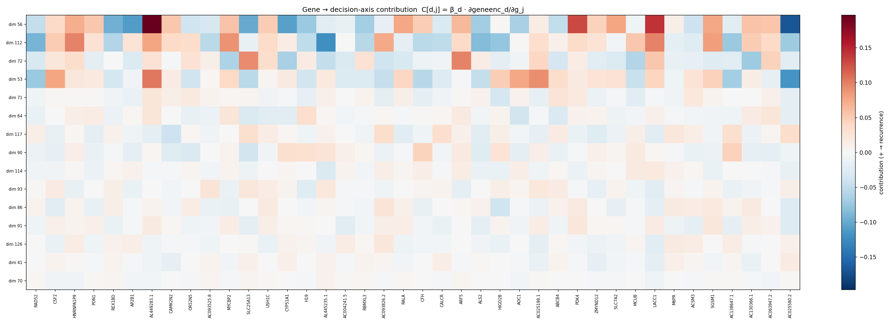

# Mechanistic Gene Attribution v2 — Top-3 Model Ensemble (head A2) — 2026-08-03

Successor to [`0727_mechanistic_interpretability.md`](../0727/0727_mechanistic_interpretability.md). Two changes:

- **The head is the top-3 downstream model ensemble** — survival head **A2** of [`0803_embedding_grid_eval_v5.md`](0803_embedding_grid_eval_v5.md) §4.2 (`LASSO`/`Pearson` k=85 + `Elastic Net`/`Pearson` k=43 + `L-SVM`/`Pearson` k=43) — rather than a single grid cell. The ensemble mean-averages its members' positive-class *probabilities*, so it is **not** a single decision direction and 0727's stage-1 collapse does not apply unchanged; §3 gives the exact treatment.
- **The encoder is `d7085bf5`** (raw · slice · λ=0.1, best epoch 42), the CV-rank-1 encoder of the 0803 v5 pool, read at `best_model.pt` — the same encoder and the same cached embeddings that produced v5 §4 and heads A1/A2.

The 0727 report had to attribute a **refit** gene branch (`77d0103f`, a refit of `dc7e1d10`) because the original run's gene column order was never persisted. `d7085bf5` records its resolved `gene_order` in `metadata.json`, so **this report attributes the co-trained gene branch directly** — no refit, no re-alignment step.

## Table of Contents
- [1. Key findings](#1-key-findings)
- [2. Setup and provenance](#2-setup-and-provenance)
- [3. Method](#3-method)
- [4. Ensemble members and the saturation asymmetry](#4-ensemble-members-and-the-saturation-asymmetry)
- [5. Per-gene mechanistic importance — downstream classification](#5-per-gene-mechanistic-importance--downstream-classification)
- [6. A1 vs A2 on the same encoder](#6-a1-vs-a2-on-the-same-encoder)
- [7. Contrastive-learning alignment](#7-contrastive-learning-alignment)
- [8. Per-dimension contributions](#8-per-dimension-contributions)
- [9. Limitations](#9-limitations)
- [10. File references](#10-file-references)

## 1. Key findings

**Model-ensembling does not change the gene story.** The A2 ensemble's gene ranking and the A1 single-cell ranking on the same encoder agree at **Spearman +0.946** (zero baseline; +0.913 at the cohort-mean baseline), sharing 6 of their top 10 genes. This is the mechanistic counterpart of v5 §6.2, where A2 *preserved* A1's survival signal instead of washing it out.

**What actually moves a gene ranking, in order:**

| Perturbation | Spearman of `mean\|IG\|` |
|---|---:|
| IG baseline (`zero` → cohort-mean, A2) | +0.671 |
| Encoder + head (A2 here → 0727's Ridge/Variance on `77d0103f`) | +0.751 |
| Encoder alone (A1 here → 0727's head on `77d0103f`) | +0.753 |
| Head alone (A1 → A2, same encoder, same baseline) | +0.946 |

The head is the *least* influential of the three: swapping one grid cell for a three-model ensemble moves the ranking by 0.054 of Spearman, while swapping the encoder moves it by 0.247 and swapping the IG baseline by 0.329. Rows 2 and 3 are within 0.001 of each other, i.e. essentially all of the divergence from 0727 is the encoder, none of it the head.

**Top genes (A2, zero baseline):** SGSM1, ALS2, SLC25A13, AL445235.1, MYCBP2, USH1C — 6 of the top 10 are pre-defined genes. `SGSM1` leads on both heads and is *not* pre-defined.

**A saturation asymmetry worth knowing about (§4).** The head is fit on image embeddings but IG pushes *gene* embeddings through it, and the gene branch carries ~4.3× the norm — its members' logits span ±175 there against ±3.5 on the image branch. The two logistic members are therefore saturated over most of the gene branch: they carry 0.481 / 0.447 of the ensemble's gradient where it is scored, but 0.001 / 0.000 at the operating point `z0` where the decision axis is read, leaving the flat-Platt L-SVM to carry 0.999. Along the IG integration path the imbalance is milder but the same direction (0.17 / 0.20 / 0.65 of the path spent responsive). The gene-level attribution is thus read mostly through the one member that stays in its linear regime — and yet still lands on A1's ranking.

## 2. Setup and provenance

| | value |
|---|---|
| Encoder | `d7085bf5` — raw · slice · λ=0.1, `best_model.pt` (epoch 42 of 44) |
| Gene branch | co-trained GeneEncoder, **no refit**; `deterministic_gene_order` with the resolved 40-gene `gene_order` in `metadata.json` |
| Gene set | `all` (40 genes, 20 pre-defined) |
| Head | top-3 model ensemble (LASSO/Pearson k=85 + Elastic Net/Pearson k=43 + L-SVM/Pearson k=43) |
| Fit on | 54 resection patients, `rfs_2year` |
| IG over | 60 resection patients with gene data |
| Resection 3-fold CV AUROC | **0.719** (v5 §4.2 = 0.719) |
| Soramic / Lausanne transfer | **0.722** / **0.432** (v5 §4.2 = 0.722 / 0.432) |

The head is refit here from the same `resection_img_emb.parquet` cache the grid used, and reproduces v5 §4.2's CV and both transfer numbers exactly — the object attributed below is the deployed A2 head, not a lookalike.

## 3. Method

Three stages, as in 0727, with stage 1 generalised to a non-linear composition.

**1 — Unwind each member.** Every member is a `SimpleImputer(median) → StandardScaler → selector → linear model` pipeline, so it collapses exactly to its own direction over the 128 dims: `f_m(z) = β_m·z + b_m`. Its positive-class score is then `sigmoid(a_m·f_m(z) + c_m)` — identity squash `(1, 0)` for logistic regression, Platt `(−A, −B)` for `SVC(probability=True)`. The ensemble score is the mean over members,

        S(z) = (1/M) Σ_m sigmoid( a_m (β_m·z + b_m) + c_m )

which reproduces `HeteroEnsembleGrid.predict_proba` to **2.67e-03** (the residual is libsvm's iterative pairwise-coupling step inside the Platt member, not the unwinding — each member's own `β_m·z + b_m` reproduces its `decision_function` to ≤1e-14, the L-SVM included).

**2 — Decision axis.** `S` is not linear, so there is no global `β`. Stage 2 uses the **local** direction at the operating point `z0 = geneenc(ḡ)`,

        β_eff = ∇_z logit S(z)|_z0 = Σ_m w_m β_m,   w_m = a_m σ_m(1−σ_m) / [M·S(1−S)]

a gradient-weighted mean of the member directions, and `C[d,j] = β_eff,d · J[d,j]` with the GeneEncoder Jacobian `J[d,j] = ∂geneenc(g)_d/∂g_j` at the cohort-mean gene vector.

**3 — Integrated Gradients** of the ensemble's *own* decision function

        s(g) = logit S( geneenc(g) )

w.r.t. the gene input (4000 midpoint steps), aggregated over 60 patients as `mean|IG|` (importance) and `mean IG` (signed; **+ = pushes toward recurrence ≤ 2yr**). Attributing the deployed score itself — rather than a linearised stand-in — is the point of this version; the `logit` keeps the units on the same logit scale as 0727.

> **Numerical note.** `logit S` and the stage-2 weights are evaluated in the log domain (`log S − log(1−S)` via `logsumexp` of `−softplus(∓u)`) and in double precision. On the gene branch the members' logits reach ±175, where a literal `logit(mean sigmoid)` is ±inf and its gradient NaN — this is also where `HeteroEnsembleGrid.decision_function`'s own 1e-9 clip saturates. The identity used is the unclipped, mathematically exact same quantity.

The saturating target needs a finer integration path than a linear one: at 4000 steps the completeness residual is **1.16e-02** = **3.39e-04** of the per-patient target range (0727's single-cell head reached 2.41e-03 at 200 steps). The ranking is stable from ~1000 steps up (Spearman 1.0000 between 1000/4000/16000 steps).

## 4. Ensemble members and the saturation asymmetry

`‖β_m‖` and `nnz` describe each member's own direction over the 128 dims; `squash a` is the slope of its probability squash. `u` is the squashed logit `a_m(β_m·z + b_m) + c_m` — the argument of the sigmoid — over each cohort of embeddings. A member only responds where `|u|` is small: `|u| = 4` leaves only ~7% of its peak gradient and `|u| ≳ 20` is numerically total saturation. `grad share` is the member's fraction of the summed gradient magnitude, i.e. how much it actually moves the ensemble score, at **both** operating points.

| Member | FS | k | CV AUC | ‖β_m‖ | nnz | squash a | u(image) | u(gene) | grad share (image) | grad share (gene) |
|---|---|---:|---:|---:|---:|---:|---:|---:|---:|---:|
| LASSO | Pearson | 85 | 0.723 | 74.1 | 6 | 1.000 | [-2.1, 3.0] | [-167, 103] | 0.481 | 0.001 |
| Elastic Net | Pearson | 43 | 0.707 | 68.7 | 5 | 1.000 | [-2.1, 3.5] | [-175, 109] | 0.447 | 0.000 |
| L-SVM | Pearson | 43 | 0.702 | 39.9 | 43 | 0.224 | [-0.3, 0.5] | [-33, 21] | 0.072 | 0.999 |

Three things follow.

**A2 is effectively a two-member ensemble where it is scored.** The L-SVM's Platt slope is 0.224, so its probabilities span only ~0.4–0.6 on the image branch and it contributes 0.072 of the gradient there against 0.481 / 0.447 for LASSO and Elastic Net. Mean-averaging *probabilities* (not logits) is what does this: a flat squash silently down-weights its member. This is a second mechanism behind v5 §6.2's observation that A2 preserves A1's signal — beyond the shared `Pearson` filter, the third member barely moves the score.

**On the gene branch the weighting inverts.** The head never sees inputs like `geneenc(g)`: the gene embeddings carry ~4.3× the image-embedding norm, which drives the two logistic members to a **median |u| of 48** over the 60 patients — only 3% and 7% of them land inside the responsive band `|u| < 4` — against a median |u| of 6.6 for the L-SVM, 28% of whose patients are inside that band (73% within `|u| < 10`). At the stage-2 operating point `z0` specifically, that leaves the L-SVM carrying 0.999 of the gradient.

The `z0` share is a single point, though, and IG integrates along a path. Averaged over the 200-step path from the zero baseline, the fraction of the path each member spends inside `|u| < 4` is **0.17 / 0.20 / 0.65** (LASSO / Elastic Net / L-SVM): the logistic members are dead at the endpoint but do contribute over roughly a fifth of the path, where the path crosses their transition. So §5's attribution is L-SVM-dominated, not L-SVM-only.

**The two facts partly cancel.** The L-SVM is the member with the widest support (43 non-zero dims vs 6 and 5) and its direction correlates with the other two (cos 0.72 / 0.78), so reading the ensemble through it is not reading a different model — which is why §6's ranking still matches A1's at +0.946. It does mean the gene-level result is **less** of a genuine three-model average than the survival result in v5 §6.2 is.

## 5. Per-gene mechanistic importance — downstream classification

Integrated Gradients of the A2 ensemble's decision function, decomposed to the 40 genes. Reported under both IG baselines, as in 0727. **Signed IG > 0 ⇒ higher expression pushes the patient toward recurrence ≤ 2yr.**

### 5.1 Baseline = 0

| Gene | mean\|IG\| | signed mean IG | pre-defined gene | rank |
|---|---:|---:|:---:|---:|
| SGSM1 | 4.1860 | +4.1860 | — | 1 |
| ALS2 | 3.1814 | -3.1348 | ✓ | 2 |
| SLC25A13 | 2.7881 | -2.6356 | ✓ | 3 |
| AL445235.1 | 2.5528 | -2.4632 | — | 4 |
| MYCBP2 | 2.5519 | -0.9259 | ✓ | 5 |
| USH1C | 2.1351 | +2.0275 | ✓ | 6 |
| H19 | 2.0560 | -1.1805 | — | 7 |
| AC025580.2 | 1.9802 | -1.9802 | — | 8 |
| PDK4 | 1.9769 | +1.8537 | ✓ | 9 |
| ARF5 | 1.9500 | +1.1580 | ✓ | 10 |
| REX1BD | 1.9291 | -1.7709 | ✓ | 11 |
| SLC7A2 | 1.8812 | +1.7209 | ✓ | 12 |
| PON1 | 1.8693 | -0.3314 | ✓ | 13 |
| AP2B1 | 1.7151 | -1.0580 | ✓ | 14 |
| CFH | 1.7020 | -0.2752 | ✓ | 15 |
| LACC1 | 1.5443 | +1.5288 | — | 16 |
| ABCB4 | 1.4750 | +0.5732 | ✓ | 17 |
| HNRNPA1P9 | 1.4095 | +1.4095 | — | 18 |
| AC063947.2 | 1.2592 | +1.2592 | — | 19 |
| ACSM3 | 1.1326 | -0.9565 | ✓ | 20 |
| CALCR | 1.0648 | -0.7710 | ✓ | 21 |
| CYP51A1 | 1.0389 | -1.0389 | ✓ | 22 |
| M6PR | 0.9167 | +0.2463 | ✓ | 23 |
| AL449283.1 | 0.9089 | +0.8549 | — | 24 |
| AOC1 | 0.8212 | +0.4006 | ✓ | 25 |
| RALA | 0.7922 | +0.0940 | ✓ | 26 |
| AC093525.8 | 0.7577 | +0.1827 | — | 27 |
| CAMK2N2 | 0.7130 | -0.5355 | — | 28 |
| RAD52 | 0.7072 | -0.5366 | ✓ | 29 |
| AC130366.1 | 0.6959 | +0.6749 | — | 30 |
| AC093826.2 | 0.6264 | +0.0467 | — | 31 |
| RBMXL3 | 0.5961 | -0.5961 | — | 32 |
| AC004241.5 | 0.5492 | -0.2837 | — | 33 |
| CSF2 | 0.5431 | -0.4797 | — | 34 |
| MCUB | 0.4711 | +0.1223 | ✓ | 35 |
| OR52N5 | 0.4279 | -0.3781 | — | 36 |
| HIGD2B | 0.3279 | -0.3231 | — | 37 |
| ZMYND12 | 0.2853 | +0.2418 | — | 38 |
| AC025198.1 | 0.2580 | +0.1769 | — | 39 |
| AC138647.1 | 0.2325 | -0.0990 | — | 40 |

### 5.2 Baseline = cohort-mean

Completeness residual **2.68e-03** = **8.25e-05** relative.

| Gene | mean\|IG\| | signed mean IG | pre-defined gene | rank |
|---|---:|---:|:---:|---:|
| AC025580.2 | 2.4586 | -0.0436 | — | 1 |
| ALS2 | 2.2689 | -0.2184 | ✓ | 2 |
| PDK4 | 2.1458 | -0.3318 | ✓ | 3 |
| LACC1 | 2.0706 | +0.0450 | — | 4 |
| ARF5 | 2.0211 | -0.0830 | ✓ | 5 |
| HNRNPA1P9 | 1.9261 | +0.0564 | — | 6 |
| USH1C | 1.8632 | +0.3861 | ✓ | 7 |
| AL445235.1 | 1.5094 | +0.0099 | — | 8 |
| AL449283.1 | 1.4681 | -0.1591 | — | 9 |
| SGSM1 | 1.4097 | +0.1806 | — | 10 |
| H19 | 1.3409 | +0.5703 | — | 11 |
| REX1BD | 1.2967 | -0.1747 | ✓ | 12 |
| AC063947.2 | 1.2813 | +0.2828 | — | 13 |
| SLC7A2 | 1.2553 | -0.3008 | ✓ | 14 |
| CYP51A1 | 1.2494 | -0.0618 | ✓ | 15 |
| RAD52 | 1.0913 | -0.0265 | ✓ | 16 |
| CALCR | 1.0821 | -0.0562 | ✓ | 17 |
| SLC25A13 | 1.0262 | +0.0722 | ✓ | 18 |
| PON1 | 0.8390 | +0.0585 | ✓ | 19 |
| AP2B1 | 0.8019 | -0.2865 | ✓ | 20 |
| RBMXL3 | 0.7424 | -0.1476 | — | 21 |
| M6PR | 0.7227 | -0.3804 | ✓ | 22 |
| AC093826.2 | 0.7197 | -0.0552 | — | 23 |
| AOC1 | 0.6931 | +0.0094 | ✓ | 24 |
| ACSM3 | 0.6737 | -0.2137 | ✓ | 25 |
| CSF2 | 0.6441 | -0.5177 | — | 26 |
| ABCB4 | 0.6208 | +0.4683 | ✓ | 27 |
| AC130366.1 | 0.5776 | +0.2239 | — | 28 |
| AC093525.8 | 0.5708 | -0.1205 | — | 29 |
| AC004241.5 | 0.5699 | -0.0854 | — | 30 |
| RALA | 0.5156 | -0.1291 | ✓ | 31 |
| MCUB | 0.5046 | +0.0581 | ✓ | 32 |
| HIGD2B | 0.5021 | -0.0915 | — | 33 |
| AC138647.1 | 0.4399 | -0.0490 | — | 34 |
| CAMK2N2 | 0.4326 | +0.1513 | — | 35 |
| CFH | 0.4243 | -0.2491 | ✓ | 36 |
| OR52N5 | 0.3480 | -0.1286 | — | 37 |
| AC025198.1 | 0.3211 | -0.1458 | — | 38 |
| ZMYND12 | 0.2791 | +0.0271 | — | 39 |
| MYCBP2 | 0.2775 | +0.0566 | ✓ | 40 |

The two baselines agree at Spearman **+0.671** — the same order of baseline sensitivity 0727 reported. The `zero` baseline asks *what does the whole expression vector contribute*; the cohort-mean baseline asks *what does this patient's deviation from the cohort contribute*, which is why absolute-expression genes drop and variable ones rise.

## 6. A1 vs A2 on the same encoder

The comparison 0727 could not make: the same encoder, the same gene branch, the same IG baseline, one grid cell (**A1** — `LASSO`/`Pearson` k=85, v5 §4.1's best cell, CV 0.723 / Soramic 0.694) versus the three-model ensemble (**A2**). A1 is a single linear direction, so its target is 0727's `s(g) = β·geneenc(g)` and no saturation arises.

Spearman of `mean|IG|` = **+0.946**; 6/10 shared top-10 genes (SGSM1, ALS2, SLC25A13, AL445235.1, MYCBP2, USH1C). Ranks below are by A2; `Δrank` is A1 − A2.

| Gene | A2 rank | A1 rank | Δrank | A2 mean\|IG\| | A1 mean\|IG\| | pre-defined gene |
|---|---:|---:|---:|---:|---:|:---:|
| SGSM1 | 1 | 1 | +0 | 4.1860 | 20.8904 | — |
| ALS2 | 2 | 3 | +1 | 3.1814 | 16.0373 | ✓ |
| SLC25A13 | 3 | 6 | +3 | 2.7881 | 12.7726 | ✓ |
| AL445235.1 | 4 | 2 | -2 | 2.5528 | 16.5211 | — |
| MYCBP2 | 5 | 5 | +0 | 2.5519 | 13.5847 | ✓ |
| USH1C | 6 | 4 | -2 | 2.1351 | 13.5860 | ✓ |
| H19 | 7 | 11 | +4 | 2.0560 | 9.8353 | — |
| AC025580.2 | 8 | 18 | +10 | 1.9802 | 7.4721 | — |
| PDK4 | 9 | 14 | +5 | 1.9769 | 9.0504 | ✓ |
| ARF5 | 10 | 13 | +3 | 1.9500 | 9.0672 | ✓ |
| REX1BD | 11 | 8 | -3 | 1.9291 | 10.7690 | ✓ |
| SLC7A2 | 12 | 10 | -2 | 1.8812 | 10.2209 | ✓ |
| PON1 | 13 | 12 | -1 | 1.8693 | 9.7457 | ✓ |
| AP2B1 | 14 | 7 | -7 | 1.7151 | 10.8517 | ✓ |
| CFH | 15 | 9 | -6 | 1.7020 | 10.7548 | ✓ |
| LACC1 | 16 | 19 | +3 | 1.5443 | 7.3640 | — |
| ABCB4 | 17 | 15 | -2 | 1.4750 | 8.7162 | ✓ |
| HNRNPA1P9 | 18 | 16 | -2 | 1.4095 | 7.9196 | — |
| AC063947.2 | 19 | 20 | +1 | 1.2592 | 6.1881 | — |
| ACSM3 | 20 | 17 | -3 | 1.1326 | 7.5459 | ✓ |
| CALCR | 21 | 23 | +2 | 1.0648 | 4.9481 | ✓ |
| CYP51A1 | 22 | 21 | -1 | 1.0389 | 5.8184 | ✓ |
| M6PR | 23 | 22 | -1 | 0.9167 | 5.0233 | ✓ |
| AL449283.1 | 24 | 35 | +11 | 0.9089 | 2.6094 | — |
| AOC1 | 25 | 24 | -1 | 0.8212 | 4.3820 | ✓ |
| RALA | 26 | 29 | +3 | 0.7922 | 3.1937 | ✓ |
| AC093525.8 | 27 | 27 | +0 | 0.7577 | 3.7694 | — |
| CAMK2N2 | 28 | 28 | +0 | 0.7130 | 3.6049 | — |
| RAD52 | 29 | 30 | +1 | 0.7072 | 3.1591 | ✓ |
| AC130366.1 | 30 | 32 | +2 | 0.6959 | 2.9685 | — |
| AC093826.2 | 31 | 26 | -5 | 0.6264 | 3.9933 | — |
| RBMXL3 | 32 | 36 | +4 | 0.5961 | 2.2791 | — |
| AC004241.5 | 33 | 25 | -8 | 0.5492 | 4.1051 | — |
| CSF2 | 34 | 31 | -3 | 0.5431 | 3.1454 | — |
| MCUB | 35 | 34 | -1 | 0.4711 | 2.7590 | ✓ |
| OR52N5 | 36 | 38 | +2 | 0.4279 | 1.2775 | — |
| HIGD2B | 37 | 33 | -4 | 0.3279 | 2.8322 | — |
| ZMYND12 | 38 | 37 | -1 | 0.2853 | 1.7615 | — |
| AC025198.1 | 39 | 40 | +1 | 0.2580 | 0.7907 | — |
| AC138647.1 | 40 | 39 | -1 | 0.2325 | 0.9229 | — |

The `mean|IG|` *magnitudes* are not comparable between the two columns — A1's target is a raw linear score (‖β‖ = 74.1) and A2's is a logit of a probability average — only the ordering is.

## 7. Contrastive-learning alignment

Head-independent: which genes the GeneEncoder was actually *trained* to move. Target is the cross-modal alignment score `F_i(g) = cos(z_img_i, geneenc(g))` — patient *i*'s **frozen** image embedding against the gene encoder output — with IG integrated only through the GeneEncoder (200 midpoint steps, 60 patients). **Signed IG > 0 ⇒ higher expression pulls the gene embedding *toward* that patient's own image.** These tables describe `d7085bf5`'s gene branch and are shared by heads A1 and A2.

### 7.1 Baseline = 0

| Gene | mean\|IG\| | signed mean IG | pre-defined gene | rank |
|---|---:|---:|:---:|---:|
| SLC25A13 | 0.1940 | -0.1883 | ✓ | 1 |
| MYCBP2 | 0.1577 | +0.1513 | ✓ | 2 |
| SGSM1 | 0.1179 | +0.1081 | — | 3 |
| CFH | 0.0941 | +0.0823 | ✓ | 4 |
| PON1 | 0.0851 | +0.0836 | ✓ | 5 |
| AP2B1 | 0.0824 | +0.0778 | ✓ | 6 |
| ACSM3 | 0.0808 | -0.0778 | ✓ | 7 |
| AC025580.2 | 0.0787 | -0.0783 | — | 8 |
| REX1BD | 0.0775 | -0.0754 | ✓ | 9 |
| H19 | 0.0616 | -0.0229 | — | 10 |
| ALS2 | 0.0610 | -0.0337 | ✓ | 11 |
| LACC1 | 0.0531 | +0.0518 | — | 12 |
| M6PR | 0.0529 | -0.0413 | ✓ | 13 |
| AL445235.1 | 0.0503 | -0.0041 | — | 14 |
| ABCB4 | 0.0484 | +0.0211 | ✓ | 15 |
| ARF5 | 0.0435 | -0.0318 | ✓ | 16 |
| RALA | 0.0416 | +0.0292 | ✓ | 17 |
| USH1C | 0.0407 | +0.0219 | ✓ | 18 |
| SLC7A2 | 0.0390 | +0.0102 | ✓ | 19 |
| PDK4 | 0.0378 | -0.0152 | ✓ | 20 |
| RAD52 | 0.0341 | -0.0341 | ✓ | 21 |
| AOC1 | 0.0309 | +0.0274 | ✓ | 22 |
| AC004241.5 | 0.0305 | +0.0243 | — | 23 |
| CAMK2N2 | 0.0291 | +0.0199 | — | 24 |
| AL449283.1 | 0.0263 | +0.0236 | — | 25 |
| CYP51A1 | 0.0260 | -0.0238 | ✓ | 26 |
| AC093826.2 | 0.0253 | -0.0233 | — | 27 |
| AC130366.1 | 0.0236 | +0.0236 | — | 28 |
| AC063947.2 | 0.0231 | +0.0205 | — | 29 |
| CALCR | 0.0230 | -0.0133 | ✓ | 30 |
| MCUB | 0.0226 | +0.0119 | ✓ | 31 |
| AC093525.8 | 0.0224 | +0.0166 | — | 32 |
| AC025198.1 | 0.0188 | +0.0168 | — | 33 |
| HNRNPA1P9 | 0.0168 | +0.0164 | — | 34 |
| HIGD2B | 0.0160 | -0.0113 | — | 35 |
| CSF2 | 0.0121 | -0.0024 | — | 36 |
| ZMYND12 | 0.0106 | +0.0100 | — | 37 |
| OR52N5 | 0.0105 | -0.0055 | — | 38 |
| RBMXL3 | 0.0099 | -0.0085 | — | 39 |
| AC138647.1 | 0.0097 | +0.0050 | — | 40 |

### 7.2 Baseline = cohort-mean

| Gene | mean\|IG\| | signed mean IG | pre-defined gene | rank |
|---|---:|---:|:---:|---:|
| AC025580.2 | 0.0518 | -0.0166 | — | 1 |
| LACC1 | 0.0425 | -0.0154 | — | 2 |
| ACSM3 | 0.0419 | -0.0129 | ✓ | 3 |
| PON1 | 0.0404 | -0.0068 | ✓ | 4 |
| AL449283.1 | 0.0301 | -0.0136 | — | 5 |
| RAD52 | 0.0300 | -0.0006 | ✓ | 6 |
| SLC25A13 | 0.0299 | -0.0120 | ✓ | 7 |
| REX1BD | 0.0287 | -0.0094 | ✓ | 8 |
| M6PR | 0.0287 | -0.0061 | ✓ | 9 |
| AC093826.2 | 0.0246 | -0.0026 | — | 10 |
| ALS2 | 0.0244 | -0.0121 | ✓ | 11 |
| AP2B1 | 0.0241 | -0.0002 | ✓ | 12 |
| CAMK2N2 | 0.0220 | -0.0079 | — | 13 |
| CALCR | 0.0212 | -0.0081 | ✓ | 14 |
| RALA | 0.0212 | -0.0001 | ✓ | 15 |
| SGSM1 | 0.0209 | -0.0079 | — | 16 |
| AL445235.1 | 0.0199 | +0.0003 | — | 17 |
| MYCBP2 | 0.0185 | +0.0025 | ✓ | 18 |
| AC025198.1 | 0.0183 | -0.0023 | — | 19 |
| PDK4 | 0.0160 | -0.0032 | ✓ | 20 |
| CYP51A1 | 0.0159 | -0.0046 | ✓ | 21 |
| ARF5 | 0.0159 | -0.0036 | ✓ | 22 |
| AOC1 | 0.0159 | -0.0023 | ✓ | 23 |
| AC130366.1 | 0.0152 | -0.0065 | — | 24 |
| SLC7A2 | 0.0150 | -0.0042 | ✓ | 25 |
| CFH | 0.0145 | -0.0052 | ✓ | 26 |
| USH1C | 0.0144 | +0.0009 | ✓ | 27 |
| CSF2 | 0.0137 | -0.0052 | — | 28 |
| ABCB4 | 0.0131 | -0.0024 | ✓ | 29 |
| AC063947.2 | 0.0122 | +0.0011 | — | 30 |
| AC004241.5 | 0.0119 | -0.0017 | — | 31 |
| H19 | 0.0118 | +0.0002 | — | 32 |
| HNRNPA1P9 | 0.0116 | -0.0021 | — | 33 |
| ZMYND12 | 0.0110 | -0.0063 | — | 34 |
| OR52N5 | 0.0104 | +0.0008 | — | 35 |
| RBMXL3 | 0.0099 | -0.0010 | — | 36 |
| MCUB | 0.0090 | -0.0028 | ✓ | 37 |
| AC093525.8 | 0.0082 | -0.0003 | — | 38 |
| HIGD2B | 0.0080 | -0.0017 | — | 39 |
| AC138647.1 | 0.0074 | +0.0023 | — | 40 |

Alignment importance and A2's downstream importance correlate at Spearman **+0.814** (A1: +0.818) at the zero baseline — the genes the encoder was trained to align on are largely the genes the classifier's axis reads, but the two are not the same ranking.

## 8. Per-dimension contributions

`C[d,j] = β_eff,d · J[d,j]` over the top 15 dims by |β_eff|. Bootstrap = 500 stratified patient resamples of the whole ensemble, with β_eff re-read at the same fixed `z0`. `nonzero freq` = fraction of resamples where the dim carries non-zero weight in β_eff, i.e. some member both selects it and is not saturated at `z0`.

| dim | β_eff | bootstrap mean±sd | nonzero freq | top driver genes (signed C) |
|---|---:|---:|---:|---|
| 56 | -3.466 | -14.218±17.892 | 0.79 | AL449283.1 (+0.197), AC025580.2 (-0.168), LACC1 (+0.143) |
| 112 | -2.484 | -7.825±13.975 | 0.58 | AL445235.1 (-0.121), LACC1 (+0.098), HNRNPA1P9 (+0.097) |
| 72 | -2.398 | -11.792±12.490 | 0.92 | ARF5 (+0.097), SLC25A13 (+0.093), AC130366.1 (-0.070) |
| 53 | +2.007 | +3.924±11.669 | 0.67 | AC025580.2 (-0.117), AL449283.1 (+0.104), AC025198.1 (+0.092) |
| 71 | -0.891 | -1.700±5.523 | 0.49 | HIGD2B (-0.034), ABCB4 (+0.025), AL449283.1 (+0.024) |
| 64 | -0.875 | -2.573±5.576 | 0.67 | AOC1 (-0.036), H19 (+0.033), ABCB4 (-0.029) |
| 117 | -0.779 | -1.874±3.451 | 0.59 | CAMK2N2 (-0.041), AC025580.2 (+0.035), AC093826.2 (+0.034) |
| 90 | -0.775 | -2.106±3.158 | 0.86 | AC138647.1 (+0.046), CFH (+0.044), SLC25A13 (-0.035) |
| 114 | -0.661 | -1.801±2.593 | 0.82 | AL445235.1 (-0.029), LACC1 (+0.020), MCUB (+0.017) |
| 93 | -0.645 | -0.678±2.068 | 0.55 | AC093525.8 (+0.025), H19 (-0.024), SLC25A13 (+0.023) |
| 86 | +0.578 | +1.750±3.928 | 0.60 | HIGD2B (-0.039), AC025580.2 (-0.026), AC093826.2 (+0.025) |
| 91 | -0.517 | -1.135±1.936 | 0.79 | AC025580.2 (-0.026), SGSM1 (+0.023), PDK4 (+0.022) |
| 126 | -0.377 | -3.135±11.255 | 0.48 | AC093826.2 (+0.023), LACC1 (-0.020), M6PR (+0.018) |
| 41 | -0.319 | -0.240±1.085 | 0.61 | LACC1 (-0.019), AC025580.2 (+0.017), CAMK2N2 (-0.016) |
| 70 | -0.200 | -0.211±0.993 | 0.47 | LACC1 (-0.008), AL445235.1 (+0.008), CSF2 (-0.007) |

**The bootstrap spread is wide** — every sd exceeds its mean. Two compounding causes: the L1/elastic-net members reselect different dims per resample (as in 0727), and β_eff's overall scale carries a `1/[S(1−S)]` factor that swings by orders of magnitude as a resampled head moves in and out of saturation at `z0`. Read the *ordering* and the driver genes, not the magnitudes; the per-gene IG in §5 is the stable readout.



## 9. Limitations

- **Alignment-mediated proxy.** Genes never enter the predictor at inference — they shape the image encoder only through the contrastive alignment at training time. This is a decomposition of the decision axis on the co-trained gene branch, not a causal gene effect. Unlike 0727 there is no refit in the path, so the branch is the trained one, but the caveat is unchanged.
- **The gene branch is out of the head's domain (§4).** Attribution runs the head far outside the input range it was fit on, which is what saturates two of three members. The result is exact for the composed function, but it is the composed function evaluated off-distribution.
- **Fixed-model importance.** No leave-one-out retraining; nothing here says the model would lose accuracy if a top gene were dropped.
- **n = 54 fit / 60 attributed.** The bootstrap in §8 is the only stability estimate, and it is wide.

## 10. File references

| Artifact | Path |
|---|---|
| Attribution driver | `hcc_multimodal/interpretability/mechanistic_gene_attribution.py` (`--members-csv` = ensemble mode) |
| Alignment IG driver | `hcc_multimodal/interpretability/gene_integrated_gradients.py` |
| A2 results (§5) | `results/eval/soramic/gene_ablation/mechanistic_gene_attribution_v2_ens_zero.json`, `mechanistic_gene_attribution_v2_ens_mean.json` |
| A1 results (§6) | `results/eval/soramic/gene_ablation/mechanistic_gene_attribution_v2_A1_zero.json`, `mechanistic_gene_attribution_v2_A1_mean.json` |
| Alignment results (§7) | `results/eval/soramic/gene_ablation/integrated_gradients_d7085bf5_zero.json`, `integrated_gradients_d7085bf5_mean.json` |
| Heatmap (§8) | `reports/0803/0803_mechanistic_interpretability_v2_heatmap.png` |
| A1 standalone report (auto-written, §6's head) | [`0803_mechanistic_interpretability_v2_A1.md`](0803_mechanistic_interpretability_v2_A1.md) |
| Ensemble membership | `results/eval/grid_flat3_bestckpt/d7085bf5/model_ensemble_members.csv` |
| Head A1/A2 definition + survival | [`0803_embedding_grid_eval_v5.md`](0803_embedding_grid_eval_v5.md) §4.2, §6.2 |
| Encoder provenance | [`0803_full_epochs_gene_randomized.md`](0803_full_epochs_gene_randomized.md) |
| Prior version (refit branch, `dc7e1d10`) | [`0727_mechanistic_interpretability.md`](../0727/0727_mechanistic_interpretability.md) |

Regenerate — A2 ensemble attribution (this report's §4, §5, §8; the `zero` run also writes the heatmap and the auto-generated single-baseline report):
```
python -m hcc_multimodal.interpretability.mechanistic_gene_attribution \
  --model-id d7085bf5 \
  --members-csv results/eval/grid_flat3_bestckpt/d7085bf5/model_ensemble_members.csv \
  --baseline zero --steps 4000 --n-boot 500 --top-k 15 \
  --ref-cv-label "0803 v5 §4.2 model ensemble = 0.719" \
  --ref-soramic-label "0803 v5 §4.2 = 0.722" \
  --output results/eval/soramic/gene_ablation/mechanistic_gene_attribution_v2_ens_zero.json \
  --report reports/0803/0803_mechanistic_interpretability_v2.md
```
Swap `--baseline mean` (and the output path) for §5.2. Regenerate — A1 single cell (§6):
```
python -m hcc_multimodal.interpretability.mechanistic_gene_attribution \
  --model-id d7085bf5 --fs Pearson --model LASSO --select-k 85 \
  --model-params '{"model__C": 1.0}' \
  --baseline zero --steps 200 --n-boot 500 --top-k 15 \
  --ref-cv-label "0803 v5 §4.1 best cell = 0.723" --ref-soramic-label "0803 v5 §4.1 = 0.694" \
  --output results/eval/soramic/gene_ablation/mechanistic_gene_attribution_v2_A1_zero.json \
  --report reports/0803/0803_mechanistic_interpretability_v2_A1.md
```
Regenerate — alignment IG (§7):
```
python -m hcc_multimodal.interpretability.gene_integrated_gradients \
  --model-id d7085bf5 --baseline zero --steps 200 \
  --output results/eval/soramic/gene_ablation/integrated_gradients_d7085bf5_zero.json --report ''
```
This report is the composite of those runs; the drivers each write one baseline at a time.
