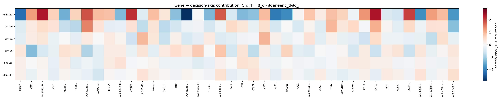

# Mechanistic Gene Attribution — 2026-07-30

Attributes the **LASSO/Pearson k=85** downstream RFS classifier's decision back to the 40 genes of `all` for run `d7085bf5`, by decomposing it through the 128-dim shared embedding space. Mechanistic (fixed-model) importance only — no leave-one-out retraining.

**Model provenance.** `d7085bf5` is attributed **directly** — no gene-encoder refit. It was trained with its resolved gene column order persisted (`deterministic_gene_order`, `gene_order` in `metadata.json`), so the trained GeneEncoder's gene→slot mapping is recoverable and the co-trained gene branch is itself interpretable. Image encoder, gene encoder and the cached embeddings the head is fit on all come from the same `best_model.pt` checkpoint.

**Method.** (1) The grid head (`SimpleImputer(median) → StandardScaler → Pearson(k=85) → LASSO`) is fit on the 54 resection patients' image embeddings vs `rfs_2year`, then collapsed into a single decision direction `β ∈ R¹²⁸` with `logit(z) = β·z + b`. (2) The GeneEncoder Jacobian `J[d,j] = ∂geneenc(g)_d/∂g_j` (at the cohort-mean gene vector) gives each gene's effect on each shared dim; `C[d,j] = β_d·J[d,j]` is its contribution to the decision axis. (3) Integrated Gradients of `s(g) = β·geneenc(g)` w.r.t. the gene input (200 midpoint steps, baseline = `zero`) aggregated over 60 patients as `mean|IG|` (importance) and `mean IG` (signed; **+ = pushes toward recurrence ≤ 2yr**).

> **Caveat.** Genes never enter the predictor at inference — they shape the image encoder only through the contrastive alignment at training time. This is an *alignment-mediated proxy*: the per-dimension decomposition of the decision axis on the co-trained gene branch.

- Completeness check (max |Σ_j IG − (s(x)−s(baseline))|): **4.83e-01** = **2.92e-03** of the per-patient target range
- β reconstruction check (max |β·z+b − decision_function|): **9.99e-16**
- Resection 3-fold CV AUROC of the head: **0.723** (0803 v5 §4.1 best cell = 0.723)
- Soramic transfer AUROC: **0.694** (0803 v5 §4.1 = 0.694); Lausanne: **0.429**

## 1. Per-gene mechanistic importance (sorted by `mean|IG|`)

| Gene | mean\|IG\| | signed mean IG | rank |
|---|---:|---:|---:|
| SGSM1 | 20.8904 | +20.7054 | 1 |
| AL445235.1 | 16.5211 | -16.5211 | 2 |
| ALS2 | 16.0373 | -15.5831 | 3 |
| USH1C | 13.5860 | +12.9553 | 4 |
| MYCBP2 | 13.5847 | -5.6051 | 5 |
| SLC25A13 | 12.7726 | -10.8217 | 6 |
| AP2B1 | 10.8517 | -8.5161 | 7 |
| REX1BD | 10.7690 | -8.9854 | 8 |
| CFH | 10.7548 | +4.3723 | 9 |
| SLC7A2 | 10.2209 | +7.9983 | 10 |
| H19 | 9.8353 | -5.9133 | 11 |
| PON1 | 9.7457 | -3.3069 | 12 |
| ARF5 | 9.0672 | +4.7804 | 13 |
| PDK4 | 9.0504 | +8.1657 | 14 |
| ABCB4 | 8.7162 | -6.5167 | 15 |
| HNRNPA1P9 | 7.9196 | +7.9196 | 16 |
| ACSM3 | 7.5459 | -6.9602 | 17 |
| AC025580.2 | 7.4721 | -6.8845 | 18 |
| LACC1 | 7.3640 | +7.0996 | 19 |
| AC063947.2 | 6.1881 | +6.1881 | 20 |
| CYP51A1 | 5.8184 | -5.8184 | 21 |
| M6PR | 5.0233 | +0.9427 | 22 |
| CALCR | 4.9481 | -3.8669 | 23 |
| AOC1 | 4.3820 | +2.4692 | 24 |
| AC004241.5 | 4.1051 | -0.6686 | 25 |
| AC093826.2 | 3.9933 | +2.6017 | 26 |
| AC093525.8 | 3.7694 | +0.2177 | 27 |
| CAMK2N2 | 3.6049 | -1.9477 | 28 |
| RALA | 3.1937 | -2.3727 | 29 |
| RAD52 | 3.1591 | +0.4200 | 30 |
| CSF2 | 3.1454 | -2.7373 | 31 |
| AC130366.1 | 2.9685 | +2.9685 | 32 |
| HIGD2B | 2.8322 | -2.8322 | 33 |
| MCUB | 2.7590 | +2.4131 | 34 |
| AL449283.1 | 2.6094 | +2.0496 | 35 |
| RBMXL3 | 2.2791 | -2.2791 | 36 |
| ZMYND12 | 1.7615 | +1.5616 | 37 |
| OR52N5 | 1.2775 | -0.5653 | 38 |
| AC138647.1 | 0.9229 | -0.5742 | 39 |
| AC025198.1 | 0.7907 | +0.1209 | 40 |

## 2. Top downstream dimensions by |β| (with bootstrap stability)

Bootstrap = 500 stratified patient resamples. `sel. freq` = fraction of resamples where the selector keeps the dim. `top driver genes` = largest |C[d,j]|.

| dim | β | bootstrap mean±sd | sel. freq | top driver genes (signed C) |
|---|---:|---:|---:|---|
| 112 | -60.023 | -30.187±37.906 | 0.51 | AL445235.1 (-2.912), LACC1 (+2.369), HNRNPA1P9 (+2.349) |
| 56 | -25.597 | -37.134±33.643 | 0.72 | AL449283.1 (+1.455), AC025580.2 (-1.239), LACC1 (+1.057) |
| 72 | -24.390 | -32.965±31.045 | 0.74 | ARF5 (+0.992), SLC25A13 (+0.946), AC130366.1 (-0.716) |
| 96 | -19.980 | -9.128±20.449 | 0.28 | CSF2 (-1.251), AL449283.1 (-0.866), AC093826.2 (+0.797) |
| 115 | +11.385 | +2.657±8.314 | 0.15 | CFH (+0.441), AC093525.8 (+0.425), AC004241.5 (-0.353) |
| 117 | -10.134 | -4.256±9.947 | 0.23 | CAMK2N2 (-0.530), AC025580.2 (+0.456), AC093826.2 (+0.447) |

**Notes**

- Stage-1 β says *which embedding dims the classifier uses*; stage-2 C and stage-3 IG say *which genes move the patient along those dims*. A gene ranks high only if it drives dims the classifier weights.
- Signed IG > 0 ⇒ higher expression pushes the patient toward 2-year recurrence along the classifier's decision axis.
