# Image Saliency — 2026-08-10

Attributes the deployed 2-year RFS **model ensemble** (`LASSO`/`Pearson` k=85, `Elastic Net`/`Pearson` k=43, `L-SVM`/`Pearson` k=43) on run `d7085bf5` back to MRI voxels, through the frozen image encoder. The main text shows one exemplar per outcome × prediction category (18 patients across `resection`, `soramic`, `lusanne`). A further 12 confident hits, taken at the next probability ranks, are in Appendix D. §6 adds four patients (two `resection`, two `lusanne`) found by a separate screen over those whole cohorts — the confident hits whose extreme slices actually land at the liver.

> **Head.** Every cohort is scored and attributed by the single downstream head fit on the **whole** resection cohort. Resection $p$ is therefore **in-sample and optimistic** — it is not a performance estimate and does not correspond to the cross-validated AUROC in the thesis tables. It is used here only to rank patients into the six categories, so that every panel in this report is attributing the same head. Pass `--resection-head oof` for out-of-fold probabilities with each resection patient attributed by its own held-out fold's head.

## 1. Key findings

1. **The model's strongest evidence usually does not sit on the lesion, and that does not separate hits from misses.** Pooling every patient run, including the Appendix D extras, the most positive slice falls inside the tumour's slice extent for **3 of 18** confident hits (`tp_*`/`tn_*`) and **1 of 12** misses — by cohort, hits are `resection` 0 of 6, `soramic` 2 of 6, `lusanne` 1 of 6. With only a handful of exemplars per cell this is an observation, not a test; the per-case detail is in Appendix B.
2. **A large share of the extreme slices are at the edge of the volume.** The most negative slice lies in the outermost 10% of the stack for **18 of 30** patients, and the most positive slice for **13 of 30**. Those slices are body wall, air, or a small off-anatomy bright artefact — not liver. §6 shows the exceptions, and Appendix E measures how rare they are by screening every confident hit in two cohorts. On `resection` (38 hits) only **3** have their most positive slice inside the tumour's extent and the median extreme sits **79.5 mm** from the nearest tumour-bearing slice; on `lusanne` (33 hits) it is **2**, at a median **136.5 mm**. The two cohorts fail differently: `resection` extremes are usually *empty* slices, `lusanne` extremes are legible abdominal sections that are simply nowhere near the liver.
3. **Integrated Gradients needs a blur baseline here.** With a zero baseline the completeness residual does not converge at any practical step count (relative 1.24/4.48/5.46 at 64 steps, still 0.34/0.68/0.73 at 256, non-monotone): a uniform image sits in LayerNorm's near-singular region. The blur baseline converges monotonically to 0.010/0.017/0.034 at 256 steps, which is what §3 reports.
4. **On some cohorts a large part of the decision magnitude comes from slices that contain no anatomy at all** — a preprocessing artefact whose share of $\sum_s |c_s|$ runs `resection` 3.6%–56.8%; `soramic` 0.0%–0.1%; `lusanne` 0.0%–0.1%. Mechanism, quantification and cohort asymmetry are in Appendix C. The two ends of that resection range are not unrelated to finding 2 — the §6 patients, the ones whose decision does peak at the liver, are also the two resection patients with the *fewest* constant slices (2.6% and 4.3%).

## 2. Method

The patient embedding is the mean over **every** one of the $S$ slices along axis 0 of the volume (`n_per_axis=None`), and all $M$ ensemble members are linear, so with the encoder $f$, the embedding and the ensemble score

$$\bar z \;=\; \frac{1}{S}\sum_{s=1}^{S} f(x_s), \qquad \hat p(z) \;=\; \frac{1}{M}\sum_{m=1}^{M} \sigma\!\big(a_m(\beta_m^\top z + b_m) + c_m\big),$$

the local decision direction $\beta_{\mathrm{eff}} = \nabla_z\,\operatorname{logit}\hat p(\bar z)$ yields an **exact** additive decomposition

$$c_s \;=\; \frac{\beta_{\mathrm{eff}}^\top f(x_s)}{S}, \qquad \sum_{s=1}^{S} c_s \;=\; \beta_{\mathrm{eff}}^\top \bar z .$$

Which slices matter is therefore read off the model rather than chosen by hand. The two figures below attribute at the voxel level within those slices: **Integrated Gradients** (256 midpoint steps, baseline `blur`) on the top-16 slices by $|c_s|$, with the most positive and most negative slice forced in, and **Gradient×Input** on every slice, stacked into a 3D volume and projected along the slicing axis. Both are mapped back to the native voxel grid, inverting the backbone's hidden 224→256 resize and 224 centre crop, and rescaled to preserve their signed sum.

The per-slice profile $c_s$ itself is plotted in Appendix A; the constant-input slices it exposes, and how they are excluded from the extreme-slice selection, are described in Appendix C.

## 3. Validation gates

- Recomputed $\bar z$ vs the cached embedding the thesis tables use: max **2.05e-06** over 32 patients
- Decomposition identity $\sum_s c_s$ vs $\beta_{\mathrm{eff}}^\top \bar z$: max **2.24e-05**
- Head reconstruction (closed-form ensemble score vs `predict_proba`): **2.67e-03** — the residual is libsvm's iterative pairwise-coupling step in the Platt-scaled `L-SVM` member, not the unwinding (same behaviour as the gene-side report)
- IG completeness $\sum \mathrm{IG} - \Delta c_s$, each residual against its own slice's target change: worst-patient median **0.097**, worst single slice **0.819** (max absolute 1.61e-03)

## 4. Selected cases

Every patient is attributed with the head fit on all labelled resection patients, so $\beta_{\mathrm{eff}}$ differs between patients only through their own embedding. Resection $p$ is in-sample (see the note at the top).

| Cohort | Case | SID | $y$ | $p$ | slices | $\sum_s c_s$ | $\|\beta_{\mathrm{eff}}\|$ | nnz | max-pos slice | max-neg slice | tumour slices |
|---|---|---:|---:|---:|---:|---:|---:|---:|---:|---:|---:|
| resection | tp_high | 162 | 1 | 0.840 | 421 | +0.3404 | 20.5 | 45 | 372 | 407 | 27 |
| resection | tn_low | 49 | 0 | 0.210 | 400 | -1.9087 | 30.5 | 45 | 388 | 333 | 32 |
| resection | fp_high | 186 | 0 | 0.703 | 430 | -0.4528 | 39.7 | 45 | 349 | 145 | 57 |
| resection | fp_borderline | 10 | 0 | 0.506 | 401 | -1.4504 | 49.0 | 45 | 361 | 33 | 86 |
| resection | fn_borderline | 7 | 1 | 0.497 | 473 | -1.4901 | 49.1 | 45 | 308 | 42 | 44 |
| resection | fn_low | 113 | 1 | 0.222 | 440 | -1.9718 | 32.9 | 45 | 192 | 84 | 60 |
| soramic | tp_high | 1905004 | 1 | 0.924 | 450 | +0.8328 | 7.5 | 45 | 352 | 35 | 43 |
| soramic | tn_low | 1201006 | 0 | 0.164 | 420 | -1.7177 | 22.7 | 45 | 418 | 277 | 38 |
| soramic | fp_high | 1001007 | 0 | 0.778 | 345 | -0.0122 | 31.0 | 45 | 15 | 110 | 28 |
| soramic | fp_borderline | 1301008 | 0 | 0.536 | 380 | -1.3136 | 48.3 | 45 | 154 | 27 | 16 |
| soramic | fn_borderline | 1011005 | 1 | 0.480 | 380 | -1.5554 | 49.0 | 45 | 2 | 376 | 90 |
| soramic | fn_low | 1901014 | 1 | 0.231 | 450 | -1.8428 | 31.6 | 45 | 442 | 398 | 44 |
| lusanne | tp_high | 9 | 1 | 0.856 | 380 | +0.3835 | 15.2 | 45 | 39 | 1 | 33 |
| lusanne | tn_low | 56 | 0 | 0.182 | 390 | -2.0373 | 29.9 | 45 | 127 | 377 | 11 |
| lusanne | fp_high | 57 | 0 | 0.835 | 440 | +0.2477 | 16.3 | 45 | 91 | 6 | 17 |
| lusanne | fp_borderline | 25 | 0 | 0.500 | 380 | -1.4757 | 49.0 | 45 | 176 | 377 | 28 |
| lusanne | fn_borderline | 32 | 1 | 0.456 | 380 | -1.6469 | 48.8 | 45 | 349 | 379 | 21 |
| lusanne | fn_low | 6 | 1 | 0.156 | 380 | -1.6697 | 21.2 | 45 | 2 | 230 | 50 |

$\sum_s c_s = \beta_{\mathrm{eff}}^\top \bar z$ is the **linear part** of the score at that patient's operating point; the member intercepts carry the rest, so its sign need not track $p$. `max-pos`/`max-neg slice` are the extremes among slices that carry anatomy (Appendix C).

## 5. Figures

### resection

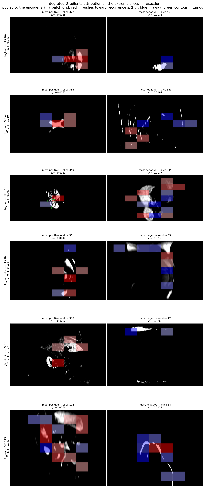

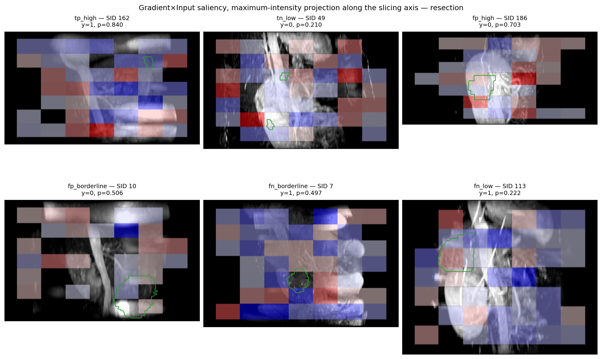

### soramic

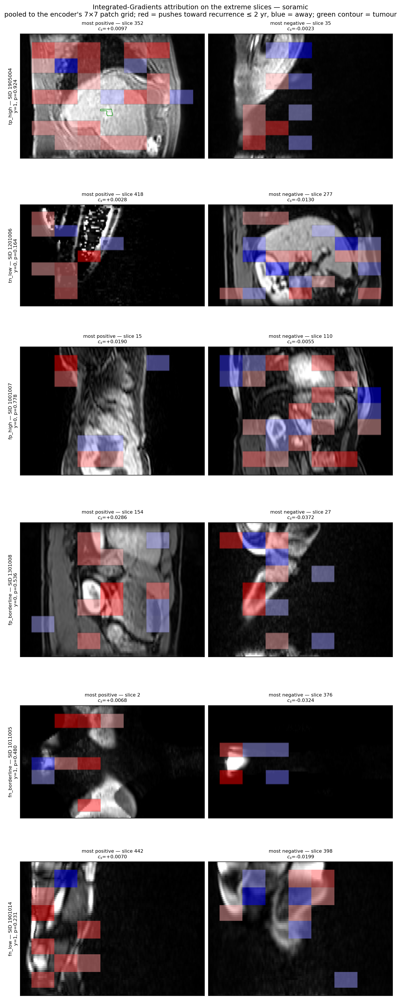

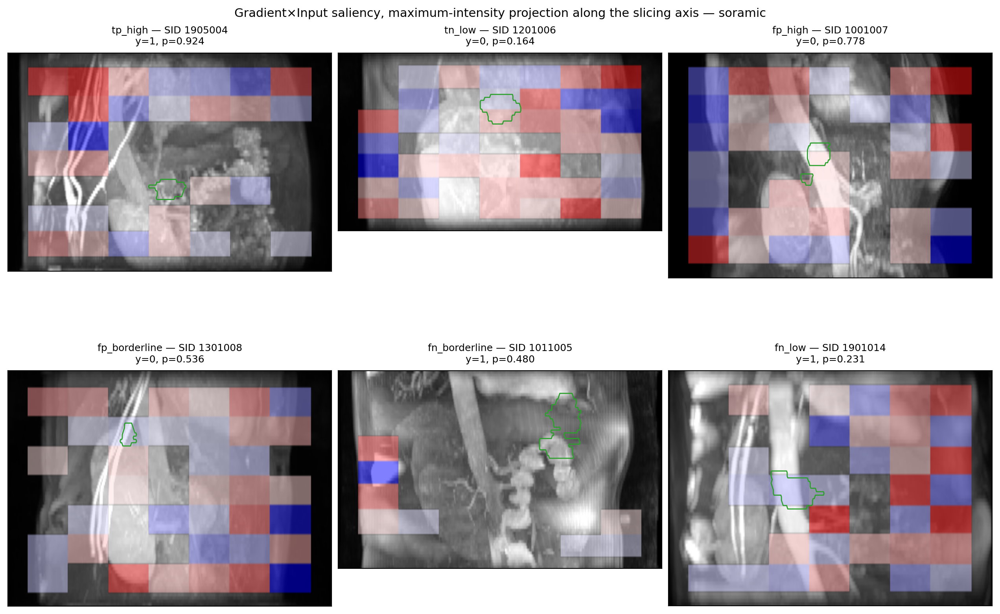

### lusanne

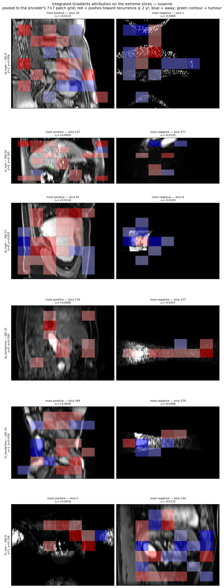

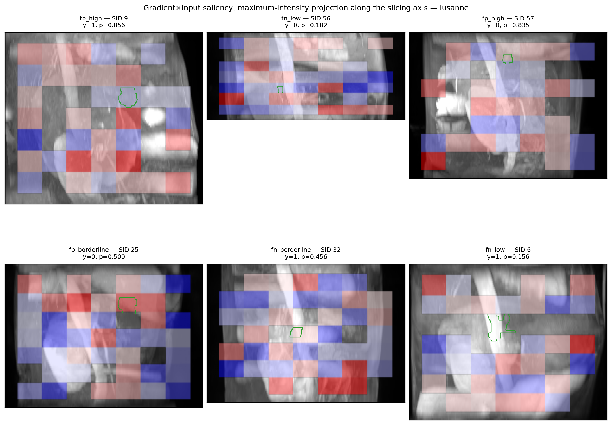

## 6. Liver-centred exemplars

Findings 1 and 2 say the extremes usually sit away from the lesion and often at the edge of the volume, which is why several §5 panels are body wall and air rather than anatomy a reader can interpret. The four patients below are the counter-examples, and they were *found* rather than assumed. The runner's `--screen` pass recomputes $c_s$ over the whole volume for **every** confident hit in the cohort — forward-only, no Integrated Gradients, so it costs about a tenth of the full pipeline — takes the same two extreme slices the figures would show, and measures how far each falls from the nearest tumour-bearing slice together with how much anatomy that slice carries. There is no liver or body segmentation anywhere in this dataset, so proximity to the tumour is the available proxy for *this slice is at the liver*; the slice itself need not contain tumour. The full screen is Appendix E.

| Cohort | Case | SID | $y$ | $p$ | slices | $\sum_s c_s$ | $\|\beta_{\mathrm{eff}}\|$ | nnz | max-pos slice | max-neg slice | tumour slices |
|---|---|---:|---:|---:|---:|---:|---:|---:|---:|---:|---:|
| resection | tp_liver | 61 | 1 | 0.701 | 388 | -0.4862 | 41.5 | 45 | 249 | 349 | 50 |
| resection | tn_liver | 135 | 0 | 0.328 | 391 | -2.0135 | 44.4 | 45 | 208 | 186 | 40 |
| lusanne | tp_liver | 28 | 1 | 0.617 | 379 | -0.9329 | 46.0 | 45 | 79 | 364 | 128 |
| lusanne | tn_liver | 52 | 0 | 0.462 | 460 | -1.6229 | 48.9 | 45 | 446 | 181 | 19 |

All four were picked out of the screen and then chosen between by eye, because the ranking has two axes — distance to the lesion and how much anatomy the slice carries — and neither dominates.

**`resection`.** **SID 61**'s positive slice 249 is 14 mm from the lesion at 28.5% anatomy, against a cohort mean of 4.8%; it is the only patient in the resection screen whose most positive slice is both within 30 mm of the lesion and more than 10% anatomy. Its negative slice is not — 349 is a lateral slice at 1.9% anatomy, just under the screen's floor, which is why its `liver_score` is `∞`. **SID 135** is the other way round: neither extreme is as close (54 mm and 76 mm), but both slices are full mid-abdominal sections at ~20% anatomy — the only resection patient clearing 10% on *both* extremes, so the only one where both panels can be read.

**`lusanne`.** This cohort is in much better shape, and **SID 28** is the strongest case in the whole report: its most positive slice, 79, falls **inside the tumour's slice extent**, carries 64% anatomy, and the green tumour contour is visible in the panel with the attribution wrapped around it. Its negative slice 364 is 168 mm away but still legible abdominal anatomy, so both panels read. **SID 52** is a compromise forced by the data: `lusanne` has only **5** confident true negatives, and three of them (SIDs 56, 36, 55) are already in §5 and Appendix D. Of the two left, SID 52 has the best liver-adjacent extreme in the cohort's TN pool — negative slice 181 at 21 mm and 54.9% anatomy — but its positive slice 446 is a 3.9% sliver. Worth noting in passing that §5's existing `lusanne` `tn_low` (SID 56) already satisfies what was asked: its positive slice 127 is inside the tumour extent at 57.3% anatomy. For `lusanne` it was the *true positive* that was missing, not the true negative.

These are therefore exemplars of **what the model looks at on the occasions when it looks at the liver at all** — selected for anatomical legibility, not by probability rank. They are excluded from every count in §1 and from Appendix B, which would otherwise be measuring the rule that selected them. Note also that none is a *confident* hit in the sense §5 uses — at $p$ = 0.701, 0.328, 0.617 and 0.462 all four sit well inside the pack, while the most confident predictions go the other way: the §5 exemplars SID 162 ($p=0.840$, `resection`) and SID 49 ($p=0.210$) peak 139 mm and 65 mm from the lesion on slices carrying 2.8% and 1.2% anatomy. Confidence and anatomical legibility are unrelated here, which is itself worth stating: nothing about how sure the model is tells you whether it is looking at the organ.

### resection

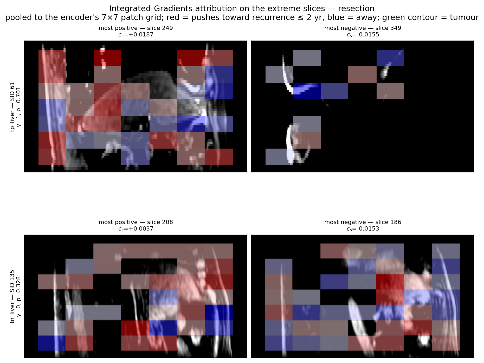

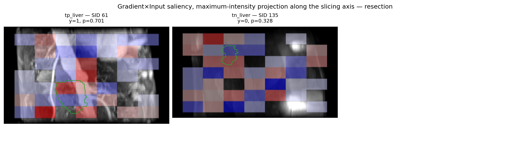

### lusanne

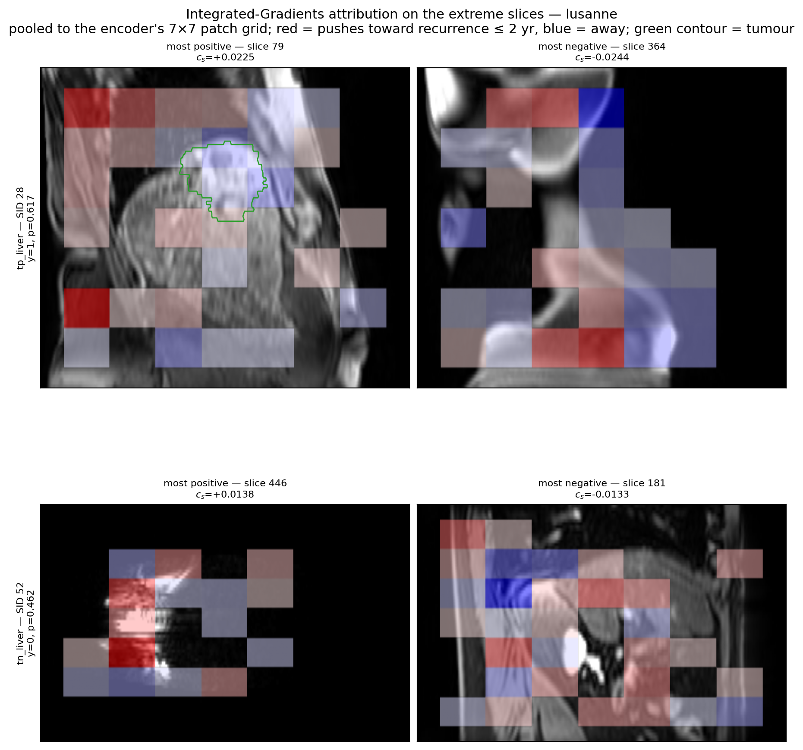

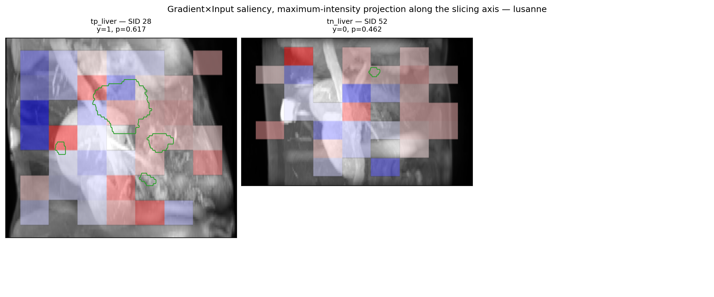

## 7. Caveats

- **Spatial resolution.** `vit_b_32` gives a 7×7 patch grid over the 224px input; after the anisotropic resize of an elongated sagittal slice one patch covers tens of millimetres. The attribution is regional, not textural — which is why both figures are pooled to that grid.
- **Frozen backbone** (`freeze_backbone=True`): only the projection MLP was trained, so the spatial features are ImageNet's.
- **Centre crop.** The backbone transform resizes 224→256 and centre-crops back to 224, so a ~6% border of every slice is never seen by the encoder and is given exactly zero attribution.
- **$\beta_{\mathrm{eff}}$ is patient-specific** — the local gradient of a mean of sigmoids. $c_s$ decomposes the linearised logit exactly, not $\operatorname{logit}\hat p$ itself.
- **Per-slice p99 normalisation** means the attribution is with respect to the model's input, not raw MRI intensity.
- **The MIP discards the slice axis.** A positive and a negative peak on the same ray compete, and only the larger survives, so a blank region in the MIP is not evidence of no contribution. Colour scales are per-panel, so saturation is not comparable between patients.
- **Deployed vs training input.** The encoder was trained on the raw resection volumes (resampled on load) but the deployed embeddings are extracted from the preprocessed root without resampling. The attribution follows the **deployed** path — the one behind every number in the thesis tables.

## 8. Regenerate

```
# the §6 pins came out of this screen (forward-only, minutes rather than hours)
python -m hcc_multimodal.interpretability.image_saliency --screen \
  --model-id d7085bf5 --cohorts resection lusanne --resection-head full \
  --output-dir results/eval/interpretability/image_saliency/d7085bf5

python -m hcc_multimodal.interpretability.image_saliency \
  --model-id d7085bf5 --members-csv results/eval/grid_flat3_bestckpt/d7085bf5/model_ensemble_members.csv \
  --cohorts resection soramic lusanne --resection-head full --extra-tp 2 --extra-tn 2 \
  --pin-case resection:tp_liver=61 --pin-case resection:tn_liver=135 \
  --pin-case lusanne:tp_liver=28 --pin-case lusanne:tn_liver=52 \
  --top-k-slices 16 --ig-steps 256 \
  --output-dir results/eval/interpretability/image_saliency/d7085bf5
python -m hcc_multimodal.interpretability.image_saliency_plots \
  --input-dir results/eval/interpretability/image_saliency/d7085bf5 --fig-dir reports/0810/image_saliency
```

The plotting module writes figures only; this report is maintained by hand.

---

## Appendix A — Per-slice contribution profiles

$c_s$ against slice index for every case — main, extra, and the two §6 pins. The tumour's extent along the slicing axis is shaded green and constant-input slices (Appendix C) grey. This is the figure that shows *how the score is distributed over the volume* before any voxel-level attribution: the two figures in §5 are zoom-ins on the extremes of these curves.

### resection

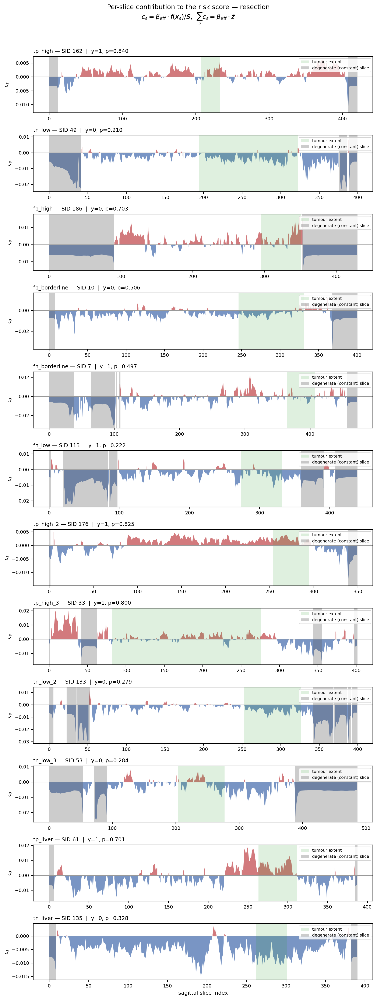


### soramic

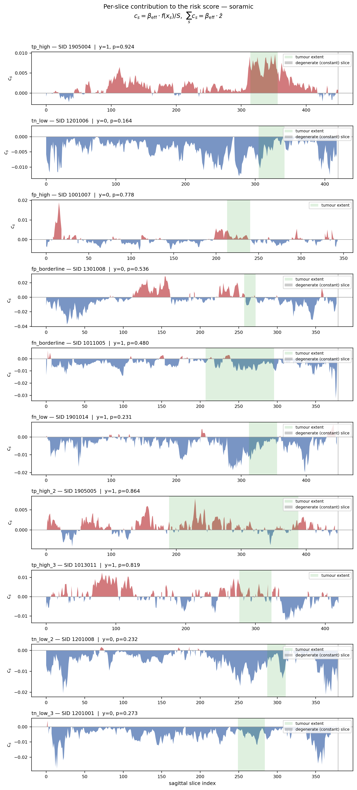


### lusanne

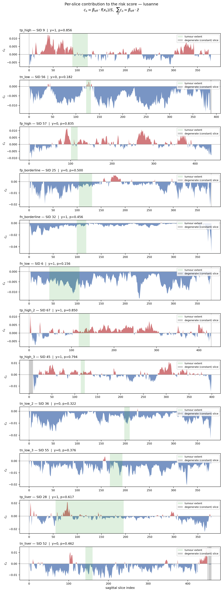

## Appendix B — Where the extreme slices sit relative to the tumour

Slice-level overlap only: whether the index of the extreme slice falls within the first and last slice containing tumour. No voxel-level masking is involved.

The §6 pins are **not** in this table: they were selected on the quantity it reports, so counting them here would be circular.

| Cohort | Case | SID | tumour slice extent | max-pos slice | in tumour? | max-neg slice | in tumour? |
|---|---|---:|---:|---:|:-:|---:|:-:|
| resection | tp_high | 162 | 207–233 | 372 | no | 407 | no |
| resection | tn_low | 49 | 194–323 | 388 | no | 333 | no |
| resection | fp_high | 186 | 295–351 | 349 | **yes** | 145 | no |
| resection | fp_borderline | 10 | 246–331 | 361 | no | 33 | no |
| resection | fn_borderline | 7 | 364–407 | 308 | no | 42 | no |
| resection | fn_low | 113 | 273–332 | 192 | no | 84 | no |
| resection | tp_high_2 | 176 | 254–295 | 5 | no | 329 | no |
| resection | tp_high_3 | 33 | 82–276 | 25 | no | 338 | no |
| resection | tn_low_2 | 133 | 252–326 | 54 | no | 57 | no |
| resection | tn_low_3 | 53 | 204–277 | 202 | no | 341 | no |
| soramic | tp_high | 1905004 | 314–356 | 352 | **yes** | 35 | no |
| soramic | tn_low | 1201006 | 305–342 | 418 | no | 277 | no |
| soramic | fp_high | 1001007 | 213–240 | 15 | no | 110 | no |
| soramic | fp_borderline | 1301008 | 257–272 | 154 | no | 27 | no |
| soramic | fn_borderline | 1011005 | 207–296 | 2 | no | 376 | no |
| soramic | fn_low | 1901014 | 312–355 | 442 | no | 398 | no |
| soramic | tp_high_2 | 1905005 | 189–388 | 229 | **yes** | 40 | no |
| soramic | tp_high_3 | 1013011 | 277–323 | 80 | no | 344 | no |
| soramic | tn_low_2 | 1201008 | 287–311 | 186 | no | 363 | no |
| soramic | tn_low_3 | 1201001 | 249–284 | 2 | no | 14 | no |
| lusanne | tp_high | 9 | 90–122 | 39 | no | 1 | no |
| lusanne | tn_low | 56 | 122–132 | 127 | **yes** | 377 | no |
| lusanne | fp_high | 57 | 101–117 | 91 | no | 6 | no |
| lusanne | fp_borderline | 25 | 104–131 | 176 | no | 377 | no |
| lusanne | fn_borderline | 32 | 99–119 | 349 | no | 379 | no |
| lusanne | fn_low | 6 | 42–105 | 2 | no | 230 | no |
| lusanne | tp_high_2 | 67 | 117–143 | 3 | no | 15 | no |
| lusanne | tp_high_3 | 45 | 113–122 | 306 | no | 399 | no |
| lusanne | tn_low_2 | 36 | 198–209 | 226 | no | 377 | no |
| lusanne | tn_low_3 | 55 | 168–194 | 7 | no | 328 | no |

Extremes are over slices carrying anatomy (constant-input slices excluded). $c_s$ is signed, so a tumour slice can legitimately contribute negatively — the point of the column is *whether the model's strongest evidence sits on the lesion at all*.

## Appendix C — Constant-input (degenerate) slices

`_normalize_slice` (`eval/data.py`, mirrored in `contrastive/data.py`) does `np.clip(s, 0, p99)`. When a slice's 99th percentile is **negative** — a background-only slice of a volume whose background is negative — `a_min > a_max`, so numpy returns `p99` at every pixel, and the following `if p99 > 0` rescale is skipped. The slice reaches the encoder as a **constant image at a large negative value** (~-54 in ImageNet-normalised units, against [-2.12, 2.64] for a real slice): far outside anything the backbone saw in training, carrying no anatomy, and still averaged into the patient embedding.

Such slices are flagged by the mechanism itself (`percentile(slice, 99) <= 0` on the source volume) rather than by testing the tensor for constancy, which is unreliable: two bilinear resizes leave float32 noise on the constant, and the ImageNet normalisation then gives each channel its own constant. They are excluded from the extreme-slice selection — a constant image has no spatial story to tell — but they remain inside the mean-pooled embedding, so their share of $\sum_s |c_s|$ is reported here instead.

| Cohort | Case | SID | slices | degenerate | share of $\sum_s \|c_s\|$ |
|---|---|---:|---:|---:|---:|
| resection | tp_high | 162 | 421 | 26 (6.2%) | 11.6% |
| resection | tn_low | 49 | 400 | 64 (16.0%) | 38.7% |
| resection | fp_high | 186 | 430 | 168 (39.1%) | 55.8% |
| resection | fp_borderline | 10 | 401 | 41 (10.2%) | 18.9% |
| resection | fn_borderline | 7 | 473 | 95 (20.1%) | 33.5% |
| resection | fn_low | 113 | 440 | 143 (32.5%) | 54.6% |
| resection | tp_high_2 | 176 | 350 | 13 (3.7%) | 10.2% |
| resection | tp_high_3 | 33 | 402 | 38 (9.5%) | 16.5% |
| resection | tn_low_2 | 133 | 400 | 89 (22.2%) | 56.8% |
| resection | tn_low_3 | 53 | 487 | 174 (35.7%) | 50.1% |
| resection | tp_liver | 61 | 388 | 10 (2.6%) | 3.6% |
| resection | tn_liver | 135 | 391 | 17 (4.3%) | 6.9% |
| soramic | tp_high | 1905004 | 450 | 1 (0.2%) | 0.1% |
| soramic | tn_low | 1201006 | 420 | 1 (0.2%) | 0.0% |
| soramic | fp_high | 1001007 | 345 | 0 (0.0%) | 0.0% |
| soramic | fp_borderline | 1301008 | 380 | 1 (0.3%) | 0.0% |
| soramic | fn_borderline | 1011005 | 380 | 1 (0.3%) | 0.0% |
| soramic | fn_low | 1901014 | 450 | 1 (0.2%) | 0.0% |
| soramic | tp_high_2 | 1905005 | 450 | 1 (0.2%) | 0.1% |
| soramic | tp_high_3 | 1013011 | 420 | 0 (0.0%) | 0.0% |
| soramic | tn_low_2 | 1201008 | 380 | 1 (0.3%) | 0.0% |
| soramic | tn_low_3 | 1201001 | 380 | 1 (0.3%) | 0.0% |
| lusanne | tp_high | 9 | 380 | 1 (0.3%) | 0.1% |
| lusanne | tn_low | 56 | 390 | 3 (0.8%) | 0.0% |
| lusanne | fp_high | 57 | 440 | 1 (0.2%) | 0.0% |
| lusanne | fp_borderline | 25 | 380 | 2 (0.5%) | 0.1% |
| lusanne | fn_borderline | 32 | 380 | 2 (0.5%) | 0.1% |
| lusanne | fn_low | 6 | 380 | 2 (0.5%) | 0.0% |
| lusanne | tp_high_2 | 67 | 430 | 2 (0.5%) | 0.1% |
| lusanne | tp_high_3 | 45 | 400 | 9 (2.2%) | 0.0% |
| lusanne | tn_low_2 | 36 | 380 | 1 (0.3%) | 0.0% |
| lusanne | tn_low_3 | 55 | 380 | 1 (0.3%) | 0.0% |
| lusanne | tp_liver | 28 | 379 | 1 (0.3%) | 0.0% |
| lusanne | tn_liver | 52 | 460 | 10 (2.2%) | 0.2% |

This is a property of the **deployed** pipeline, not of this analysis: every cached embedding and every AUROC in the thesis was produced with it. It is reported, not fixed — changing `_normalize_slice` would invalidate all of them.

## Appendix D — Additional confident hits

The next-ranked true positives and true negatives by predicted probability. They are kept out of §5 so that each outcome × prediction category is represented there by a single exemplar, but they are what the pooled counts in finding 1 are based on: a pattern seen in one confident hit is not distinguishable from a coincidence.

| Cohort | Case | SID | $y$ | $p$ | slices | $\sum_s c_s$ | $\|\beta_{\mathrm{eff}}\|$ | nnz | max-pos slice | max-neg slice | tumour slices |
|---|---|---:|---:|---:|---:|---:|---:|---:|---:|---:|---:|
| resection | tp_high_2 | 176 | 1 | 0.825 | 350 | +0.1742 | 16.6 | 45 | 5 | 329 | 42 |
| resection | tp_high_3 | 33 | 1 | 0.800 | 402 | +0.1149 | 27.4 | 45 | 25 | 338 | 195 |
| resection | tn_low_2 | 133 | 0 | 0.279 | 400 | -2.0304 | 39.9 | 45 | 54 | 57 | 75 |
| resection | tn_low_3 | 53 | 0 | 0.284 | 487 | -2.0302 | 40.2 | 45 | 202 | 341 | 74 |
| soramic | tp_high_2 | 1905005 | 1 | 0.864 | 450 | +0.3608 | 11.5 | 45 | 229 | 40 | 145 |
| soramic | tp_high_3 | 1013011 | 1 | 0.819 | 420 | +0.2158 | 24.5 | 45 | 80 | 344 | 47 |
| soramic | tn_low_2 | 1201008 | 0 | 0.232 | 380 | -1.8785 | 32.3 | 45 | 186 | 363 | 25 |
| soramic | tn_low_3 | 1201001 | 0 | 0.273 | 380 | -1.9457 | 37.5 | 45 | 2 | 14 | 36 |
| lusanne | tp_high_2 | 67 | 1 | 0.850 | 430 | +0.3537 | 16.2 | 45 | 3 | 15 | 27 |
| lusanne | tp_high_3 | 45 | 1 | 0.794 | 400 | +0.0856 | 30.7 | 45 | 306 | 399 | 10 |
| lusanne | tn_low_2 | 36 | 0 | 0.322 | 380 | -2.0499 | 44.5 | 45 | 226 | 377 | 12 |
| lusanne | tn_low_3 | 55 | 0 | 0.376 | 380 | -1.8946 | 46.6 | 45 | 7 | 328 | 27 |

### resection

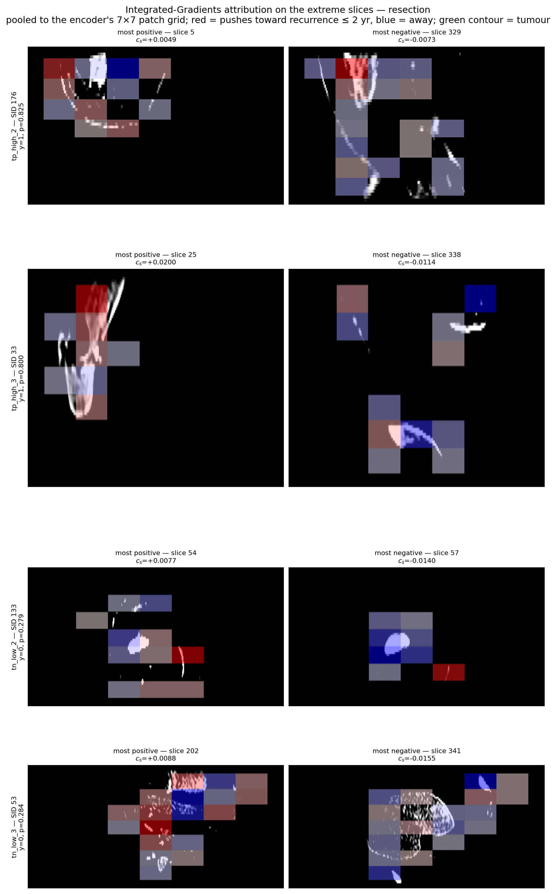

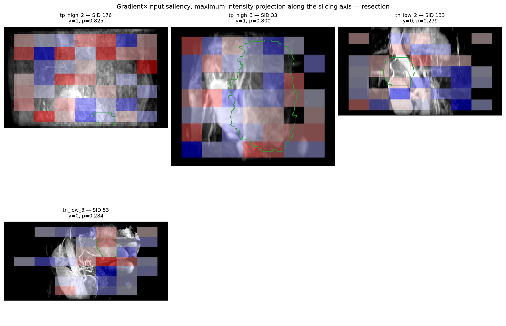


### soramic

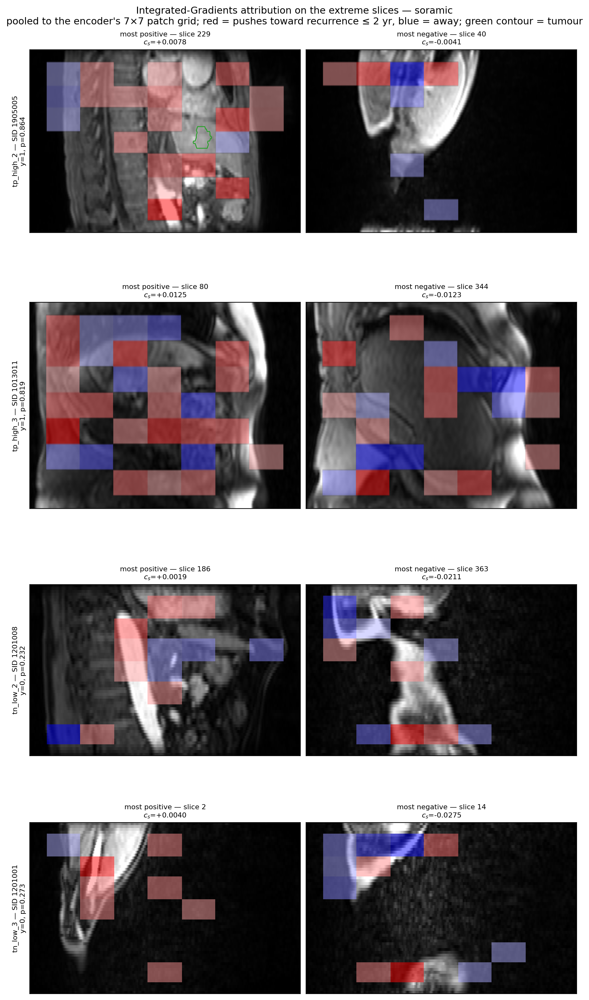

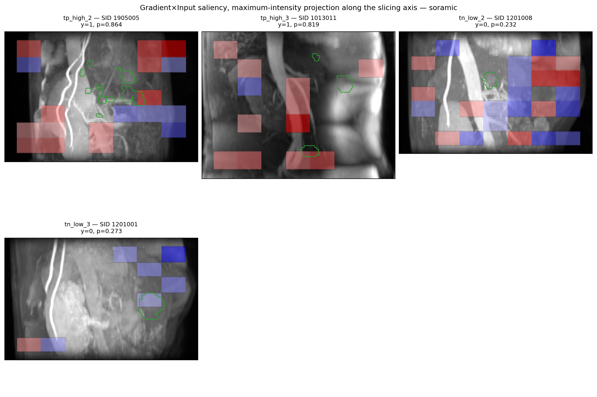


### lusanne

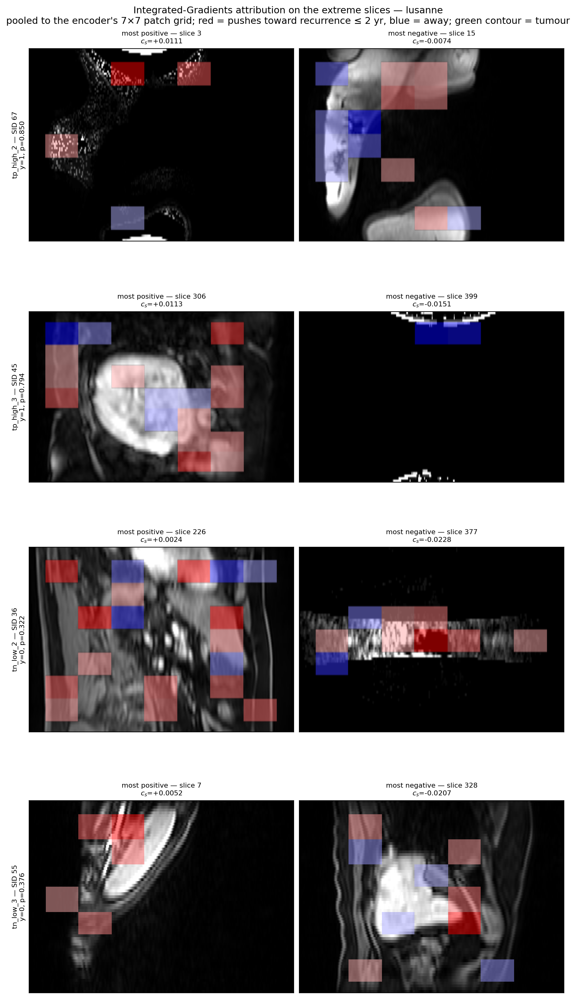

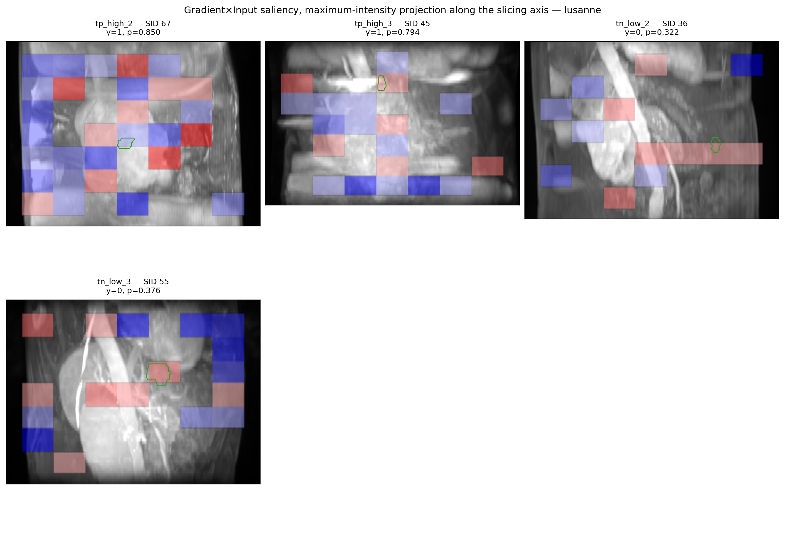

## Appendix E — Screening every confident hit for liver-adjacent extremes

The §6 pins came from here. For each confident hit (`y=1, p>0.5` or `y=0, p<0.5`) the runner's `--screen` pass recomputes $c_s$ over the whole volume — forward-only, so it costs a fraction of the full pipeline — takes the same two extreme slices the figures would show, and measures their distance to the nearest tumour-bearing slice. `fg` is the fraction of the slice above 10% of the volume's 99th percentile: a lateral body-wall or air slice scores near zero. `liver score` is the worse of the two distances, so a low score means **both** panels are at the liver; it is `∞` when either extreme falls below the 2% anatomy floor, since a distance measured on an empty slice means nothing.

Unlike finding 1, which is counted over a handful of exemplars, this covers every confident hit, so it is the report's actual answer to *how often does the decision peak anywhere near the liver*.

### resection

**38** patients screened (15 tp, 23 tn):

- **23 of 38** have at least one extreme slice below the anatomy floor — the extreme is body wall or air.
- Over all 76 extreme slices the median distance to the lesion is **79.5 mm**, and only **16** are within 30 mm.
- Only **3 of 38** have their most positive slice inside the tumour's slice extent (SIDs 25, 75, 92); for the most negative slice it is 5 (SIDs 3, 39, 75, 123, 129).
- Of the 15 patients that clear the floor on both extremes, the median liver score is **135 mm**, and only two are under 60 mm — SID 5 at 30 mm and SID 28 at 54 mm, both with a positive slice of ~2% anatomy.

So the §5 figures are not unlucky exemplars. On this cohort the decision genuinely peaks away from the liver for the large majority of patients, and §6 had to be assembled from the tail of the distribution rather than from its centre.

Rows sorted by kind then $p$; ★ marks the two taken into §6. Distances in mm; resection volumes are 1 mm along the slicing axis, so they equal slice counts.

| SID | kind | $p$ | max-pos slice | fg | dist | max-neg slice | fg | dist | liver score |
|---:|:-:|---:|---:|---:|---:|---:|---:|---:|---:|
| 49 | tn | 0.210 | 388 | 1.2% | 65 | 333 | 0.8% | 10 | ∞ |
| 133 | tn | 0.279 | 54 | 0.9% | 198 | 57 | 1.2% | 195 | ∞ |
| 53 | tn | 0.284 | 202 | 4.0% | 2 | 341 | 5.5% | 64 | 64 |
| 148 | tn | 0.306 | 221 | 0.8% | 78 | 365 | 1.1% | 49 | ∞ |
| 135 ★ | tn | 0.328 | 208 | 21.2% | 54 | 186 | 19.2% | 76 | 76 |
| 90 | tn | 0.331 | 64 | 2.6% | 135 | 297 | 1.2% | 30 | ∞ |
| 129 | tn | 0.333 | 41 | 1.7% | 194 | 266 | 4.9% | 0 | ∞ |
| 149 | tn | 0.341 | 91 | 3.9% | 134 | 64 | 1.8% | 161 | ∞ |
| 2 | tn | 0.344 | 25 | 1.3% | 166 | 71 | 6.0% | 120 | ∞ |
| 36 | tn | 0.351 | 68 | 4.1% | 264 | 288 | 4.4% | 44 | 264 |
| 32 | tn | 0.352 | 330 | 2.8% | 104 | 276 | 6.1% | 50 | 104 |
| 21 | tn | 0.363 | 151 | 8.5% | 143 | 248 | 5.2% | 46 | 143 |
| 64 | tn | 0.364 | 369 | 1.7% | 184 | 47 | 0.6% | 117 | ∞ |
| 76 | tn | 0.383 | 239 | 7.2% | 56 | 350 | 1.0% | 22 | ∞ |
| 5 | tn | 0.397 | 201 | 2.2% | 25 | 126 | 14.9% | 30 | 30 |
| 3 | tn | 0.400 | 274 | 4.4% | 33 | 318 | 0.7% | 0 | ∞ |
| 62 | tn | 0.404 | 103 | 8.8% | 135 | 225 | 3.7% | 13 | 135 |
| 188 | tn | 0.436 | 23 | 2.2% | 177 | 168 | 4.2% | 32 | 177 |
| 123 | tn | 0.440 | 74 | 1.0% | 172 | 294 | 2.6% | 0 | ∞ |
| 141 | tn | 0.451 | 336 | 1.3% | 103 | 37 | 1.3% | 165 | ∞ |
| 39 | tn | 0.475 | 63 | 2.6% | 168 | 261 | 12.5% | 0 | 168 |
| 130 | tn | 0.478 | 394 | 2.8% | 101 | 364 | 1.3% | 71 | ∞ |
| 92 | tn | 0.478 | 269 | 7.3% | 0 | 177 | 7.4% | 80 | 80 |
| 30 | tp | 0.540 | 100 | 9.3% | 120 | 40 | 2.4% | 180 | 180 |
| 31 | tp | 0.545 | 106 | 2.1% | 98 | 124 | 6.0% | 80 | 98 |
| 38 | tp | 0.565 | 345 | 7.1% | 55 | 64 | 16.6% | 187 | 187 |
| 75 | tp | 0.577 | 332 | 0.6% | 0 | 319 | 2.1% | 0 | ∞ |
| 47 | tp | 0.594 | 92 | 4.0% | 98 | 301 | 1.1% | 85 | ∞ |
| 28 | tp | 0.608 | 278 | 2.2% | 54 | 260 | 5.1% | 36 | 54 |
| 13 | tp | 0.609 | 135 | 8.3% | 128 | 84 | 1.1% | 179 | ∞ |
| 29 | tp | 0.667 | 222 | 5.5% | 55 | 11 | 0.9% | 266 | ∞ |
| 115 | tp | 0.677 | 17 | 1.9% | 263 | 413 | 1.3% | 79 | ∞ |
| 80 | tp | 0.679 | 90 | 4.8% | 220 | 104 | 8.2% | 206 | 220 |
| 61 ★ | tp | 0.701 | 249 | 28.5% | 14 | 349 | 1.9% | 37 | ∞ |
| 25 | tp | 0.703 | 322 | 6.2% | 0 | 426 | 1.2% | 88 | ∞ |
| 33 | tp | 0.800 | 25 | 4.0% | 57 | 338 | 1.3% | 62 | ∞ |
| 176 | tp | 0.825 | 5 | 1.5% | 249 | 329 | 3.4% | 34 | ∞ |
| 162 | tp | 0.840 | 372 | 2.8% | 139 | 407 | 1.0% | 174 | ∞ |

### lusanne

**33** confident hits screened (28 tp, 5 tn) — the true-negative pool is only 5, which is why §6's `lusanne` TN is a compromise.

- The slices themselves are far more legible than resection's: mean anatomy on the positive extreme is **32.5%** against resection's 4.8%. Still **19 of 33** fall below the floor on one of their two extremes, against 23 of 38 on resection.
- But they are *further from the lesion*: median distance over all 66 extreme slices is **136.5 mm** against resection's 79.5 mm, and only **6** are within 30 mm.
- **2 of 33** have their most positive slice inside the tumour's slice extent (SIDs 28, 56); no patient has its most negative slice there.
- Of the 14 that clear the floor on both extremes, the median liver score is **173 mm**.

So the two cohorts fail in different ways. On `resection` the extreme slice is usually *empty* — the volume edge, plus the constant-slice artefact of Appendix C. On `lusanne` it is usually a perfectly good abdominal section that simply is not near the liver. Neither is what you would want from a liver model, but only the first is a preprocessing problem.

| SID | kind | $p$ | max-pos slice | fg | dist | max-neg slice | fg | dist | liver score |
|---:|:-:|---:|---:|---:|---:|---:|---:|---:|---:|
| 56 | tn | 0.182 | 127 | 57.3% | 0 | 377 | 5.9% | 245 | 245 |
| 36 | tn | 0.322 | 226 | 68.9% | 17 | 377 | 0.0% | 168 | ∞ |
| 55 | tn | 0.376 | 7 | 16.4% | 161 | 328 | 38.1% | 134 | 161 |
| 52 ★ | tn | 0.462 | 446 | 3.9% | 286 | 181 | 54.9% | 21 | 286 |
| 11 | tn | 0.485 | 315 | 54.6% | 149 | 4 | 0.0% | 125 | ∞ |
| 30 | tp | 0.516 | 2 | 0.0% | 72 | 378 | 0.0% | 267 | ∞ |
| 43 | tp | 0.520 | 173 | 67.4% | 98 | 423 | 1.9% | 348 | ∞ |
| 44 | tp | 0.521 | 410 | 29.7% | 265 | 30 | 23.3% | 80 | 265 |
| 18 | tp | 0.541 | 27 | 16.9% | 40 | 7 | 5.3% | 60 | 60 |
| 50 | tp | 0.552 | 375 | 30.3% | 277 | 399 | 0.0% | 301 | ∞ |
| 64 | tp | 0.558 | 3 | 0.0% | 162 | 419 | 0.0% | 238 | ∞ |
| 49 | tp | 0.567 | 73 | 55.1% | 2 | 395 | 0.0% | 285 | ∞ |
| 26 | tp | 0.593 | 3 | 0.0% | 121 | 423 | 4.9% | 264 | ∞ |
| 40 | tp | 0.604 | 225 | 70.7% | 160 | 204 | 75.4% | 139 | 160 |
| 10 | tp | 0.610 | 38 | 39.6% | 81 | 3 | 0.0% | 116 | ∞ |
| 48 | tp | 0.611 | 42 | 36.6% | 41 | 6 | 15.9% | 77 | 77 |
| 28 ★ | tp | 0.617 | 79 | 64.0% | 0 | 364 | 31.3% | 168 | 168 |
| 62 | tp | 0.618 | 95 | 60.6% | 19 | 423 | 0.5% | 210 | ∞ |
| 46 | tp | 0.619 | 2 | 0.0% | 91 | 359 | 29.6% | 158 | ∞ |
| 41 | tp | 0.620 | 413 | 34.4% | 178 | 8 | 2.0% | 126 | ∞ |
| 27 | tp | 0.660 | 12 | 4.7% | 66 | 5 | 2.7% | 73 | 73 |
| 5 | tp | 0.666 | 50 | 14.8% | 57 | 381 | 8.2% | 249 | 249 |
| 4 | tp | 0.669 | 16 | 11.6% | 56 | 423 | 1.7% | 296 | ∞ |
| 53 | tp | 0.676 | 396 | 21.5% | 261 | 403 | 9.3% | 268 | 268 |
| 59 | tp | 0.681 | 59 | 14.8% | 197 | 459 | 0.1% | 187 | ∞ |
| 29 | tp | 0.707 | 264 | 67.5% | 69 | 424 | 0.0% | 229 | ∞ |
| 15 | tp | 0.735 | 365 | 44.4% | 194 | 435 | 0.1% | 264 | ∞ |
| 61 | tp | 0.758 | 8 | 10.3% | 112 | 244 | 55.0% | 94 | 112 |
| 2 | tp | 0.785 | 17 | 20.0% | 114 | 393 | 12.7% | 184 | 184 |
| 1 | tp | 0.790 | 368 | 29.1% | 178 | 26 | 9.2% | 108 | 178 |
| 45 | tp | 0.794 | 306 | 53.1% | 184 | 399 | 0.0% | 277 | ∞ |
| 67 | tp | 0.850 | 3 | 0.2% | 114 | 15 | 31.6% | 102 | ∞ |
| 9 | tp | 0.856 | 39 | 74.8% | 51 | 1 | 0.0% | 89 | ∞ |

`soramic` was not screened; run `--screen --cohorts soramic` to add it. Its §5 extremes already carry anatomy, and it is the cohort where finding 1 does best (2 of 6 hits peak inside the tumour extent).
