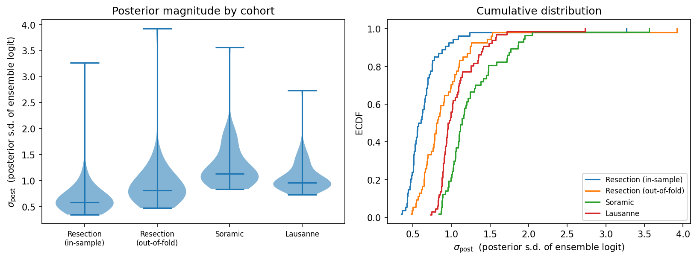
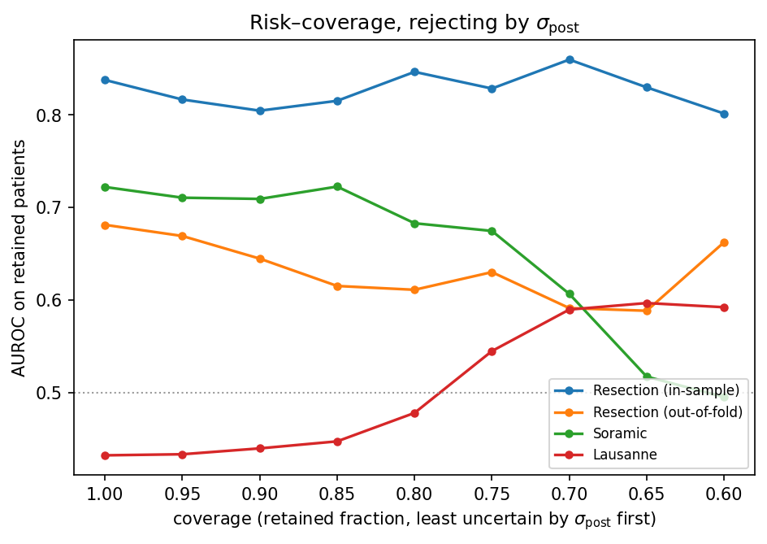

# Laplace model uncertainty for the frozen top-3 downstream ensemble

*Data generated 2026-08-09 · git `bc6e97ce` · encoder `d7085bf5` · analysis
`hcc_multimodal.eval.laplace_uncertainty`*

This report describes the **parameter uncertainty of the deployed downstream head** — how much
the model's own weights are pinned down by the 54 resection patients it was fitted on, and what
that implies per patient. It is model (epistemic) uncertainty only: no patient-level resampling
is done anywhere, so nothing here is a statement about sampling variability.

The posterior is added **without changing the predictor**. Each member's MAP weights come from
the deployed fit untouched and only a Hessian is computed, so `p_hat` is identical to the
ensemble's own `predict_proba` to machine precision (max deviation exactly 0.0, asserted at run
time) and every number in thesis Tables 4.4 and 4.5 remains valid.

The reported quantity throughout is

$$\sigma_{\mathrm{post}}(z) \;=\; \sqrt{\tfrac{1}{3}\sum_{m=1}^{3}\operatorname{Var}\big[u_m(z)\big]}$$

the **posterior standard deviation of the ensemble logit**, over all three deployed members. Full
derivation in Appendix A.

---

## Summary

**Result 1 — the model's parameters are loosely determined, and both external cohorts sit well
outside the region where they are determined at all.** Median $\sigma_{\mathrm{post}}$ is 0.59 on
the resection patients the head was fitted on, 0.81 on held-out resection patients, and rises to
**1.14 on Soramic and 0.96 on Lausanne**. A value near 1.1 means the ensemble logit for a typical
Soramic patient is uncertain to roughly ±2.2 at 95% — enough to move a prediction across most of
the probability range. The ordering is the expected one (in-sample < out-of-fold < external), and
these figures are a *lower bound*: three separate approximations in Appendix G all bias them
downward.

Both external cohorts are ~1.7–1.8 σ from the training cohort in every direction the head reads,
against 0.8 σ for resection itself (Appendix D). The head is extrapolating on both — and by
nearly identical amounts, Soramic if anything slightly further.

**Result 2 — the deployed model is already under-confident, so $\sigma_{\mathrm{post}}$ implies
*too much* shrinkage, not too little.** Calibration is the only measurement here that connects
predicted probabilities to observed outcomes on an absolute scale, and therefore the only
external check on whether the Result 1 magnitudes are correctly sized. The check fails in an
informative direction: applying the Laplace shrinkage that $\sigma_{\mathrm{post}}$ implies moves
the calibration slope *away* from 1 on **every** cohort, and worsens the Brier score on three of
four.

The cleanest evidence is in-sample. On the resection patients the head was fitted on, the
calibration slope is **2.61 (95% CI 1.07–4.14)** — significantly above 1. An unregularised
logistic would give exactly 1 there by construction; a slope of 2.6 measures how far the L1
penalty has over-shrunk the coefficients, retaining just 6 of 85. The deployed MAP is therefore
already conservative, and adding parameter-uncertainty shrinkage on top pushes further in the
wrong direction.

**Result 3 — rejecting the most uncertain patients helps only where the model is already
broken.** On Soramic, where the head works, retained AUROC *falls* from 0.722 to 0.495 by 60%
coverage. On out-of-fold resection it is flat. On Lausanne, where the head starts below chance at
0.432, it *rises* to 0.592. Rejection by $\sigma_{\mathrm{post}}$ does not behave like a useful
abstention rule on cohorts where the score is informative.

Results 1 and 3 are linked structurally rather than incidentally. In a linear model both
$\lvert\mu\rvert$ and $\sigma_{\mathrm{post}}^2$ grow with the design norm
$\lVert\varphi_*\rVert$, so a patient far from the training centroid is *simultaneously* more
uncertain in the parameter sense and more confident in the score sense — the two are
anti-correlated at −0.63 (Appendix F). Where the score carries the signal, rejecting by
$\sigma_{\mathrm{post}}$ discards exactly the patients that carry the ranking.

**One consequence for the thesis.** §4.3 attributes the Lausanne failure to distribution shift,
on cohort-level KS distances across all 128 embedding dimensions. But the deployed head reads
only **6** of those dimensions, and in those six Soramic and Lausanne are indistinguishable in
distance (Appendix D). Distance from the training distribution cannot be what separates AUROC
0.722 from 0.432. Meanwhile the Lausanne score is not degenerate — it has the *widest* spread of
any cohort (Appendix E) — so the failure looks like a decision axis that stays alive but
decouples from the label, not extrapolation into unexplored space. §4.3 should be revised
accordingly.

---

## Main result 1 — Magnitude of $\sigma_{\mathrm{post}}$ by cohort

| Cohort | n | median | q25 | q75 |
|---|---|---|---|---|
| Resection (in-sample) | 54 | 0.587 | 0.503 | 0.705 |
| Resection (out-of-fold) | 54 | 0.812 | 0.666 | 1.039 |
| Soramic | 57 | **1.135** | 1.020 | 1.452 |
| Lausanne | 66 | **0.963** | 0.891 | 1.132 |



In-sample resection is the smallest by construction — its Hessian is built from the very rows
being scored — and out-of-fold resection is the honest reference for the training distribution.
Both external cohorts exceed it.

Note that Soramic scores *higher* than Lausanne, i.e. the cohort where the model works carries
the larger posterior. $\sigma_{\mathrm{post}}$ measures distance from the region where the
parameters are constrained, and on that measure Soramic is marginally further out. It is not a
measure of whether the model will be right.

## Main result 2 — Calibration

The Laplace predictive mean
$\sigma\!\big(\mu/\sqrt{1+\pi s^2/8}\big)$ shrinks each logit by an amount **fixed by
$\sigma_{\mathrm{post}}$**, so if that magnitude is right the shrinkage should move the
calibration slope toward 1.

Slope 1 and intercept 0 is perfect calibration; slope < 1 means predictions are too extreme (the
overfitting signature), slope > 1 that they are not extreme enough.

| Cohort | variant | slope (95% CI) |
|---|---|---|
| Resection (in-sample) | MAP | **2.61 (1.07–4.14)** |
| Resection (in-sample) | Laplace | 2.90 (1.23–4.57) |
| Resection (out-of-fold) | MAP | 1.20 (0.12–2.28) | 0.05 | 
| Resection (out-of-fold) | Laplace | 1.39 (0.08–2.70) | 
| Soramic | MAP | 1.19 (0.36–2.01) |
| Soramic | Laplace | 1.55 (0.48–2.63) |
| Lausanne | MAP | **−0.37 (−1.02–0.29)** |
| Lausanne | Laplace | −0.48 (−1.30–0.34) |


## Main result 3 — Risk–coverage

AUROC of the unchanged `p_hat` on the least-uncertain fraction of each cohort, patients ranked by
$\sigma_{\mathrm{post}}$ and the most uncertain discarded first. Coverage sweeps 1.0 → 0.6; below
0.6 the retained sets fall to ~20–25 patients and AUROC stops being meaningful, so the sweep is
cut there.



| Cohort | full | @0.8 | @0.6 | mean over sweep | retained at 0.6 (pos/neg) |
|---|---|---|---|---|---|
| Resection (in-sample) | 0.838 | 0.847 | 0.802 | 0.827 | 32 (13/19) |
| Resection (out-of-fold) | 0.681 | 0.611 | 0.662 | 0.633 | 32 (12/20) |
| Soramic | 0.722 | 0.683 | **0.495** | 0.649 | 34 (26/8) |
| Lausanne | 0.432 | 0.478 | **0.592** | 0.506 | 40 (28/12) |

Soramic and Lausanne move in opposite directions and cross at ~0.68 coverage. The Lausanne rise is
monotone from 0.432 to ~0.59 over the whole sweep, which is the one place $\sigma_{\mathrm{post}}$
carries usable information: it identifies the subset of Lausanne patients on which the frozen head
still ranks correctly. Both resection curves are broadly flat, so on the training distribution
rejection neither helps nor hurts much.

**This should be read as suggestive, not established.** At 60% coverage the retained Lausanne set
is 40 patients (28 positive, 12 negative), where an AUROC near 0.59 sits well inside the noise
band; the Soramic set is more imbalanced still at 26/8. No permutation null band was computed, so
no test is attached. What supports the reading is the consistency of the trend rather than any
single point.

Risk–coverage tests whether the uncertainty *ranking* carries information. It does not test
whether the *magnitude* in Result 1 is correctly sized — that is what Main result 2 answers. The
two are independent checks and they disagree in an interpretable way: the ranking is weakly
informative only where the score has failed, while the magnitude is, if anything, too large.

---

# Appendices

## Appendix A — Method

### A.1 The deployed head

A frozen three-member ensemble, selected from a 10 classifier × 13 feature-selector grid by flat
3-fold CV on the resection cohort and specified in `model_ensemble_members.csv`:

| member | selector | k | hyperparameters |
|---|---|---|---|
| LASSO logistic | Pearson | 85 | `C = 1.0`, `l1_ratio = 1.0` |
| Elastic-net logistic | Pearson | 43 | `C = 1.0`, `l1_ratio = 0.8` |
| Linear SVM | Pearson | 43 | `C = 0.1`, Platt-calibrated |

Each member is a pipeline `median-impute → standardise → select-k → classifier`; the ensemble
score is the unweighted mean of the three positive-class probabilities. Writing each member's
squash as $\sigma(a_m u_m + c_m)$ — identity $(1,0)$ for the logistic members, the fitted Platt
pair for the SVM — the deployed score is

$$S(z) = \frac{1}{M}\sum_{m=1}^{M}\sigma\big(u_m(z)\big), \qquad M = 3 .$$

Fitted models are not persisted in the repo, so the ensemble is rebuilt deterministically from
the spec CSV with `RANDOM_STATE = 42`; Appendix B confirms the rebuild reproduces the published
AUROCs exactly.

### A.2 Post-hoc Laplace

Laplace approximation replaces the intractable posterior with a Gaussian obtained by expanding
the log posterior to second order about a mode. With $\mathcal{L}(\theta) = -\log p(\theta \mid
\mathcal{D})$ expanded at $\hat\theta$, the first-order term vanishes at a stationary point and

$$p(\theta \mid \mathcal{D}) \approx \mathcal{N}\big(\hat\theta,\; H^{-1}\big), \qquad H = \nabla^2\mathcal{L}(\hat\theta).$$

The *post-hoc* form is what makes this usable under the frozen-model constraint: $\hat\theta$ is
taken to be the already-fitted weights and only $H$ is computed — no refitting, no change of
objective, no change to any prediction. The cost is that $\hat\theta$ is not exactly the mode of
the Gaussian-prior posterior being approximated, so the first-order term does not truly vanish
(Appendix C, Appendix G).

### A.3 The two logistic members

Each member is treated in **its own fitted parameter space**, where its penalty — and hence its
implied prior — lives. Let $T_m$ be the fitted `impute → standardise → select` prefix and
$\tilde Z_m = T_m(Z)$ over the $n = 54$ resection rows.

**Active set.** $A_m = \{j : \hat w_{mj} \neq 0\}$. Both members are L1-penalised, and at an L1
solution the penalty is piecewise linear on the active set — it contributes a gradient offset but
**no curvature**. The Gaussian curvature therefore comes from the likelihood plus whatever L2 the
member carries, evaluated on $A_m$ only.

**Hessian.** With $\Phi_m = [\tilde Z_m[:, A_m],\, \mathbf{1}]$, $\phi = [w_A, b]$, and
$S = \operatorname{diag}(p_i(1-p_i))$ at the *deployed* probabilities,

$$H_m = \Phi_m^{\top} S\, \Phi_m + \Lambda_m, \qquad \Sigma_m = H_m^{-1},$$

factorised by Cholesky.

**Prior precision.** Resolved from each member's own objective rather than invented. sklearn's
elastic-net objective is $\tfrac{1-\rho}{2}w^{\top}w + \rho\lVert w\rVert_1 + C\sum\mathrm{nll}$;
dividing by $C$ puts it in negative-log-posterior form, so the L2 part supplies precision
$\lambda = (1-\rho)/C$.

- Elastic-net member: $\rho = 0.8$, $C = 1.0$ → $\lambda = 0.2$, nothing to tune.
- LASSO member: $\rho = 1$, so it supplies **none**. With 6 active coefficients against 54
  patients, $\Phi^{\top}S\Phi$ is full rank on the active set by itself ($\operatorname{cond} =
  261$), so $\lambda = 0$ and the posterior is determined entirely by the data. An
  evidence-maximisation fallback exists for ill-conditioned active-set Hessians; it did not fire.
  Appendix H sweeps $\lambda$ to confirm nothing depends on this.

The intercept receives the same precision as the weights, keeping $H$ positive definite.

**Predictive moments.** For $z_*$ with $\varphi_* = [T_m(z_*)[A_m],\, 1]$,

$$\mu_m = \varphi_*^{\top}\hat\phi_m, \qquad s_m^2 = \varphi_*^{\top}\Sigma_m\varphi_* .$$

$s_m^2$ is a Mahalanobis-type quadratic form that grows in directions the training data did not
constrain. This is the whole mechanism by which "far from training data" becomes "uncertain".

### A.4 The SVM member

Hinge loss is not a negative log-likelihood, so the SVM has no posterior over $\beta$. It does
have a genuine likelihood over its **Platt parameters**: the deployed score is
$\sigma(af(z)+c)$ with $(a,c) = (-\texttt{probA\_}, -\texttt{probB\_})$, and Platt scaling is an
ordinary two-parameter logistic regression on the margins. With $\Psi = [f(Z), \mathbf{1}]$ and
$q_i = \sigma(af_i + c)$,

$$H_{\text{Platt}} = \Psi^{\top}\operatorname{diag}\big(q_i(1-q_i)\big)\Psi \in \mathbb{R}^{2\times 2},
\qquad \operatorname{Var}[u_{\text{svm}}](z_*) = \psi_*^{\top}H_{\text{Platt}}^{-1}\psi_* .$$

This captures the member's **calibration** uncertainty only, not its direction, and its geometry
differs from the logistic members': it grows with $f(z_*)^2$, i.e. along the decision axis, not
with distance from the training manifold.

### A.5 Combining, and why the logit scale

Contributions are placed on the shared **ensemble-logit** scale, so
$\operatorname{Var}[u_m] = a_m^2 s_m^2$ — with $a_m = 1$ for the logistic members and no extra
factor for the Platt member, whose squash is already inside $(a, c)$. Hence

$$\sigma_{\mathrm{post}} = \sqrt{\tfrac{1}{3}\sum_{m=1}^{3}\operatorname{Var}[u_m]},
\qquad
\sigma_{\mathrm{post}}^{(2)} = \sqrt{\tfrac{1}{2}\!\!\sum_{m\,\in\,\text{logistic}}\!\!\operatorname{Var}[u_m]} .$$

The logit scale is deliberate. Probability-scale spread is squashed near 0 and 1, so a
confidently-wrong extrapolating patient would otherwise score as *certain*; the logit scale keeps
the magnitude of the uncertainty from being confounded with where the prediction happens to sit.

$\sigma_{\mathrm{post}}$ (all three members) is the primary statistic — it is the posterior of the
whole deployed ensemble. $\sigma_{\mathrm{post}}^{(2)}$ treats the SVM as deterministic; the two
correlate at 0.995, so the choice changes the scale but nothing else.

The probability-scale counterpart is obtained by Monte Carlo: draw $\phi^{(s)} \sim
\mathcal{N}(\hat\phi_m, \Sigma_m)$ per member via the Cholesky factor, push through the ensemble,
take the s.d. over 4000 draws. The MC *mean* is never used as a prediction — the deployed MAP
score is.

### A.6 Variants and baselines

| name | what it is |
|---|---|
| $\sigma_{\mathrm{post}}$ (`u_epi_3`) | **primary** — posterior s.d. of the ensemble logit, all three members |
| $\sigma_{\mathrm{post}}^{(2)}$ (`u_epi_2`) | same, SVM treated as deterministic |
| $\sigma_{\mathrm{post}}^{\mathrm{full}}$ (`u_epi_2_full`) | same Laplace over the *full* 85/43-dim selected space, prior on the inactive coordinates — sensitivity for the frozen sparse support |
| `sd_prob` | MC posterior s.d. on the probability scale |
| `conf` | $-\lvert\hat p - 0.5\rvert$ — plain confidence, no posterior needed. The baseline that matters: does the posterior say anything the score does not? |
| `maha` | Mahalanobis distance to the resection embeddings, Ledoit–Wolf shrunk covariance (necessary at $n=54$ in 128 dimensions). The standard label-free OOD detector |

### A.7 Calibration

Two probability vectors are compared per cohort: the deployed MAP score, and the **Laplace
predictive mean**, obtained by applying the MacKay probit correction per member and averaging,

$$\hat p_{\text{Laplace}}(z) = \frac{1}{M}\sum_{m} \sigma\!\left(\frac{\mu_m}{\sqrt{1 + \pi s_m^2/8}}\right).$$

The Laplace variant is reported **alongside** the deployed score, never in place of it — the
frozen-model constraint is untouched. Its only role is as a test of the Result 1 magnitudes: the
shrinkage factor $1/\sqrt{1+\pi s_m^2/8}$ is determined entirely by $s_m^2$, so whether it moves
the calibration slope toward or away from 1 is a direct verdict on whether $\sigma_{\mathrm{post}}$
is correctly sized. Median shrinkage here is ≈0.80 on Soramic and ≈0.84 on Lausanne; the SVM
member barely shrinks (≈0.96) because its two-parameter Platt posterior is tightly determined by
54 patients.

Calibration itself is the Cox form: an unpenalised logistic regression of $y$ on
$\operatorname{logit}(\hat p)$, reporting slope and intercept with Wald standard errors from the
same 2×2 logistic Hessian used for the Platt posterior in A.4.

### A.8 Why slope/intercept rather than ECE

At n≈60, five equal-count bins leave ~12 patients each, and expected calibration error becomes
dominated by the binning choice — a different bin count changes the conclusion. Slope/intercept
uses every patient, has no binning degrees of freedom, and is the standard in the
clinical-prediction-model literature (TRIPOD / Steyerberg). The reliability diagram is drawn as
illustration only; no number in this report is read off it.

### A.9 Resection reference

In-sample resection uncertainty is biased low by construction. Resection is therefore reported
twice: **in-sample** (all 54, transparent but optimistic) and **out-of-fold**
(`StratifiedKFold(3, shuffle, seed=42)`; per fold the three frozen members are refit on the
training part and the Hessian built from the training part only). Thresholds and cross-cohort
comparisons use the out-of-fold version.

## Appendix B — Reproduction and internal checks

| Cohort | n | AUROC | Expected |
|---|---|---|---|
| Resection (3-fold CV) | 54 | 0.7191 | 0.7191 |
| Soramic | 57 | 0.7222 | 0.7222 |
| Lausanne | 66 | 0.4322 | 0.4322 |

- **Invariance**: `p_hat` matches the deployed `predict_proba` with max deviation 0.0.
- **Fold logic**: resection $\sigma_{\mathrm{post}}$ median is 0.587 in-sample against 0.812
  out-of-fold; the in-sample value must be the smaller one, and it is.
- **Sampler**: the MacKay probit approximation of each member's predictive mean agrees with
  sampling from the same posterior to 8.7e-3 / 5.4e-3 / 4.5e-3 (LASSO / elastic net / SVM). The
  residual does not shrink below ~5e-3 as draws increase, so it is the probit approximation's own
  bias at this variance scale, not a covariance–sampler disagreement.

## Appendix C — Member posteriors

| member | n_selected | n_active | n_params | l1_ratio | C | λ | branch | cond(H) | ‖residual ∇‖ |
|---|---|---|---|---|---|---|---|---|---|
| LASSO | 85 | 6 | 7 | 1.0 | 1.0 | 0.0 | data-only | 261 | 2.47 |
| Elastic Net | 43 | 5 | 6 | 0.8 | 1.0 | 0.2 | natural | 61 | 1.79 |

| member | a (Platt) | c (Platt) | a in-sample refit | c in-sample refit | cond(H) | ‖residual ∇‖ |
|---|---|---|---|---|---|---|
| L-SVM | 0.224 | 0.010 | 2.042 | 0.518 | 2.44 | 8.19 |

The L1 members are drastically sparse — 6 of 85 and 5 of 43 coefficients retained — so the
posteriors span only 7 and 6 dimensions. The active-set Hessians are well conditioned with no
prior invented, but a patient out of distribution in the ~121 ignored directions receives **no
extra variance whatsoever**. This is the central limitation of the analysis.

The SVM's deployed Platt slope (0.224) is far from its in-sample refit (2.042), because libsvm
fits `probA_/probB_` on internal CV folds where margins are less separated. The Platt Hessian is
therefore evaluated well away from the in-sample mode, so the SVM's contribution carries more
approximation error than the logistic members'. The refit values were **not** substituted into the
model.

**Member decision directions (cosine, 128-d):** LASSO–ElasticNet 0.936, LASSO–SVM 0.719,
ElasticNet–SVM 0.777. The two logistic members are nearly collinear — the ensemble has less
directional diversity than three members suggests.

## Appendix D — Where each cohort sits in the directions the head reads

Standardised by the resection-fitted scaler, so resection is 0 ± 1 by construction and external
rows read as sigmas from the training cohort.

| member | cohort | active dims | mean \|z\| | median ‖z‖ | median \|μ\| | median s² |
|---|---|---|---|---|---|---|
| LASSO | resection | 6 | 0.824 | 2.131 | 0.651 | 0.505 |
| LASSO | Soramic | 6 | 1.771 | 4.400 | 1.530 | 1.982 |
| LASSO | Lausanne | 6 | 1.705 | 4.229 | 0.897 | 1.355 |
| Elastic Net | resection | 5 | 0.822 | 1.995 | 0.599 | 0.416 |
| Elastic Net | Soramic | 5 | 1.957 | 4.754 | 1.295 | 1.611 |
| Elastic Net | Lausanne | 5 | 1.856 | 4.389 | 0.861 | 1.286 |

Both external cohorts are roughly twice as far from the origin as resection in the active
directions, and the same distance as each other — which is why $\sigma_{\mathrm{post}}$ inflates
on both and cannot rank one against the other. The `median |μ|` column carries a separate signal:
Lausanne sits at 0.897 against Soramic's 1.530 despite comparable ‖z‖, i.e. Lausanne patients land
closer to the decision boundary.

## Appendix E — Decision-axis spread

| cohort | median `p_hat` | IQR | std |
|---|---|---|---|
| Resection (in-sample) | 0.478 | 0.197 | 0.148 |
| Resection (out-of-fold) | 0.470 | 0.177 | 0.135 |
| Soramic | 0.684 | 0.170 | 0.175 |
| Lausanne | 0.547 | 0.278 | 0.194 |

Lausanne has the widest score spread of any cohort, so the failure is not that the model stopped
discriminating — the discrimination it produces no longer tracks the outcome.

## Appendix F — Cohort separation, flag rates and detector correlations

Separation AUROC = each statistic used as a score to tell Lausanne patients from Soramic
patients. Flag rate = fraction above the resection out-of-fold 95th percentile.

| statistic | sep. AUROC | Mann–Whitney p | flag Soramic | flag Lausanne |
|---|---|---|---|---|
| $\sigma_{\mathrm{post}}$ | 0.305 | 0.0002 | 0.211 | 0.091 |
| $\sigma_{\mathrm{post}}^{(2)}$ | 0.305 | 0.0002 | 0.263 | 0.076 |
| $\sigma_{\mathrm{post}}^{\mathrm{full}}$ | 0.488 | 0.82 | 0.070 | 0.000 |
| `sd_prob` | 0.354 | 0.005 | 0.140 | 0.030 |
| `conf` | 0.605 | 0.047 | 0.000 | 0.015 |
| `maha` | 0.467 | 0.53 | 0.351 | 0.242 |

No epistemic statistic exceeds 0.5; all of them are *lower* on Lausanne, and the flag rates fire
2–3× more often on Soramic than on Lausanne. Only `conf` separates in the expected direction, and
weakly.

Spearman correlations, external cohorts only:

| | $\sigma_{\mathrm{post}}$ | $\sigma^{\mathrm{full}}_{\mathrm{post}}$ | `conf` | `maha` | ‖z‖ |
|---|---|---|---|---|---|
| $\sigma_{\mathrm{post}}$ | 1.000 | 0.506 | **−0.629** | 0.645 | 0.397 |
| $\sigma^{\mathrm{full}}_{\mathrm{post}}$ | 0.506 | 1.000 | −0.186 | **0.897** | 0.810 |
| `maha` | 0.645 | 0.897 | −0.274 | 1.000 | 0.790 |

Two readings. Lifting the sparse support makes Laplace uncertainty essentially *become*
Mahalanobis distance (0.897) — the expected theoretical result for a linear model, which doubles
as an implementation check and shows the full-support variant adds nothing over the standard OOD
baseline. And $\sigma_{\mathrm{post}}$ is anti-correlated with `conf` at −0.629, the structural
fact that explains Main result 2.

## Appendix G — Caveats

Every one of these biases the reported uncertainty **downward**, so Main result 1 is a
conservative lower bound.

1. **The first-order term does not vanish.** KKT at an L1 solution leaves the smooth part's
   gradient at ±λ_L1 on the active set (residual norms 2.47 and 1.79 in Appendix C). Standard for
   post-hoc Laplace, but it should be stated.
2. **Member posteriors are treated as independent**, though all three were fitted on the same 54
   patients — this overstates the averaging gain and narrows the intervals.
3. **The sparse support is frozen**; uncertainty about *which* coefficients are non-zero is not
   represented anywhere.
4. **β_SVM uncertainty is absent** — only Platt calibration is carried, and per Appendix C that
   Hessian sits far from its in-sample mode.
5. **The encoder is frozen** and treated as a deterministic feature extractor. A last-layer
   Laplace on it would be ill-defined: it was trained with NT-Xent, not on the RFS label.
6. **The 130-cell grid search that selected this pipeline is not represented at all**, and is very
   likely a larger variance source than everything measured here.
7. **No data uncertainty by construction** — everything is conditional on the observed patients.

## Appendix H — Sensitivity to the prior precision

λ = 0 was used for the pure-L1 member. Sweeping it confirms nothing depends on that choice. (The
sweep applies λ to both logistic members, so the tabulated `u` is
$\sigma_{\mathrm{post}}^{(2)}$.)

| λ | median u (Soramic) | median u (Lausanne) | separation AUROC |
|---|---|---|---|
| 0 | 1.352 | 1.175 | 0.313 |
| 0.01 | 1.348 | 1.173 | 0.313 |
| 0.1 | 1.309 | 1.140 | 0.316 |
| 1 | 1.203 | 1.033 | 0.291 |
| 10 | 0.855 | 0.759 | 0.258 |
| 100 | 0.422 | 0.387 | 0.296 |

Separation stays in 0.26–0.32 across four decades. The monotone collapse of median u toward 0 as
λ grows is the end-to-end check that the prior enters the Hessian correctly.

## Appendix I — File references

| Artifact | Path |
|---|---|
| Member spec (deployed head) | `results/eval/grid_flat3_bestckpt/d7085bf5/model_ensemble_members.csv` |
| Full results | `results/eval/uncertainty/laplace_d7085bf5.json` |
| Per-patient scores | `results/eval/uncertainty/laplace_d7085bf5_per_patient.csv` |
| Main result 1 figure | `reports/0810/0810_laplace_uncertainty_by_cohort.png` (+ `.svg`) |
| Main result 2 figure | `reports/0810/0810_laplace_uncertainty_calibration.png` (+ `.svg`) |
| Main result 3 figure | `reports/0810/0810_laplace_uncertainty_risk_coverage.png` (+ `.svg`) |

Regenerate the data (this write-up is authored from the JSON, not generated from it):

```bash
python -m hcc_multimodal.eval.laplace_uncertainty \
  --model-id d7085bf5 \
  --members-csv results/eval/grid_flat3_bestckpt/d7085bf5/model_ensemble_members.csv \
  --cohorts soramic lusanne \
  --primary-rule u_epi_3 --n-draws 4000 --coverage-min 0.6 --calibration-bins 5 \
  --output results/eval/uncertainty/laplace_d7085bf5.json \
  --fig-dir reports/0810
```
