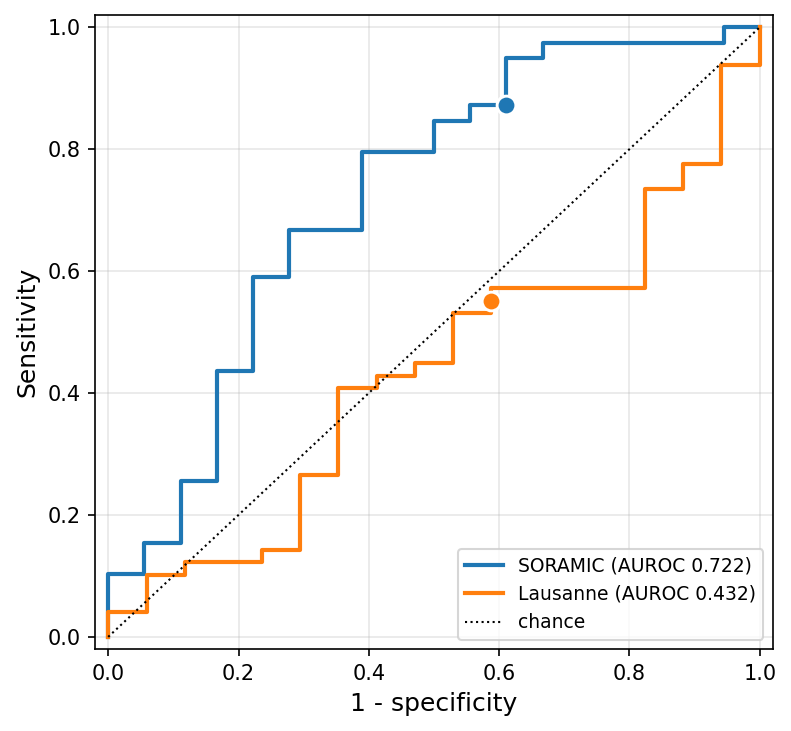

# Calibration of the Deployed Ensemble — 2026-08-31

**Reviewer:** *"Add calibration for the deployed ensemble — you propose this as risk
stratification, and an uncalibrated risk model can't be used that way."*

## Deployed model (new definition)

Frozen top-3 model ensemble on embedding `d7085bf5` — LASSO/Pearson k=85 + Elastic Net/Pearson
k=43 + L-SVM/Pearson k=43 — **plus a Platt recalibration layer**:

```
logit(p) = A · logit(S) + B        A = 1.2005   B = 0.0489
```

fitted once on the out-of-fold scores of all 54 resection patients, then frozen and applied to
every cohort. Classification threshold **0.5325**, chosen on the resection out-of-fold calibrated
scores by Youden's J, then frozen.

## 1. Classification performance (calibrated)

| Cohort | n | prev | AUROC (95% CI) | PR-AUC (95% CI) | no-skill | Brier | Sens | Spec | PPV | NPV | F1 |
|---|--:|--:|--:|--:|--:|--:|--:|--:|--:|--:|--:|
| SORAMIC | 57 | 0.684 | 0.722 (0.557–0.860) | 0.828 (0.696–0.941) | 0.684 | 0.180 | 0.872 | 0.389 | 0.756 | 0.583 | 0.810 |
| Lausanne | 66 | 0.742 | 0.432 (0.284–0.586) | 0.732 (0.598–0.869) | 0.742 | 0.310 | 0.551 | 0.412 | 0.730 | 0.241 | 0.628 |

Confusion matrices at threshold 0.5325:

| Cohort | TP | FP | FN | TN |
|---|--:|--:|--:|--:|
| SORAMIC | 34 | 11 | 5 | 7 |
| Lausanne | 27 | 10 | 22 | 7 |



Lausanne's PR-AUC (0.732) sits **below its no-skill baseline** (0.742), consistent with AUROC
0.432. The baseline moves 0.481 → 0.684 → 0.742 across cohorts, which is why it is reported
alongside.

## 2. Discrimination is unchanged by calibration

Platt is strictly monotone, so every rank statistic is invariant. Verified on SORAMIC: AUROC
0.722 → 0.722, PR-AUC 0.828 → 0.828, and with the threshold carried through the same map the
confusion matrix is identical (35/11/4/7 at the survival cutoff). `tab:external_downstream` is
therefore the same table calibrated or not.

## 3. Risk groups are unchanged by calibration

The survival head splits at a k-means boundary frozen on resection (0.463). Re-deriving it on
Platt-recalibrated scores and re-splitting:

| Cohort | cutoff | high / low | patients moved |
|---|--:|--:|--:|
| Resection | 0.463 → 0.467 | 34/26 → 34/26 | **0** |
| SORAMIC | 0.463 → 0.467 | 83/17 → 83/17 | **0** |

The uncalibrated rows reproduce the published splits exactly. Since log-rank *p*, HR and RMST are
functions of (time, event, group) alone and the group vector is identical, every row of
`tab:external_survival` is unchanged to every digit.

## 4. Why these choices

**Fit the calibrator on out-of-fold, not in-sample, scores.** In-sample resection predictions are
over-separated, so a Platt fitted on them gets A = 2.61; applied to SORAMIC that over-stretches the
probabilities to a calibration slope of 0.455. The OOF-fitted A = 1.2005 gives 0.988 (uncalibrated:
1.186).

**No nested-CV estimate of calibrated performance on resection.** Not a refusal to calibrate on
resection — the calibrator *is* fitted there. The quantity that cannot be estimated at n=54 is a
nested-CV estimate: the inner calibrator sees only 24–36 patients and the *sign* of the Platt slope
is decided by noise (per-fold `a_` = +0.032, +0.144, +0.479), moving AUROC across 0.28–0.59. This
keeps the existing stance — resection CV is a selection signal, external cohorts are the estimate.

**Platt, not isotonic.** Isotonic fitted on 54 patients collapses to five plateaus
(0.20, 0.34, 0.50, 0.92, 1.00): calibration slope **0.11** against a target of 1, AUROC 0.722 →
0.677, and it moves 18 of 60 resection patients across the survival boundary. Being piecewise
constant its gradient is zero almost everywhere, which would also void the gradient-based
interpretability results.

**Youden vs 0.50.** Both were computed; they nearly coincide here (0.533 vs 0.500) because the
resection prevalence is 48%, close to the equal-weight assumption Youden implies. They give the
same SORAMIC operating point. Youden is used as the training-fixed threshold.

## 5. Thesis change list

| Location | Change |
|---|---|
| `tab:external_downstream` | Numbers unchanged; label as **uncalibrated**. |
| **New table** | §1 above — calibrated classification performance, SORAMIC + Lausanne. Caption notes the threshold was fixed on training data only. |
| Methods | (a) calibration protocol with A/B and why OOF not in-sample; (b) threshold protocol (Youden, frozen); (c) why no nested resection estimate — §4. |
| Appendix | Confusion matrices + ROC figure. |
| Survival | Numbers unchanged. Add: scores are calibrated; groups identical (0 patients reassigned), so log-rank *p* / HR / RMST are unchanged. |
| Interpretability | Add: attribution target is the ensemble logit, Platt is affine there, so all attributions scale by A = 1.2005 — gene ranking, member shares and saliency maps unchanged. **Update the predicted-probability labels on the saliency panels** (main.tex ~1239): 0.630 → 0.665, 0.900 → 0.936. |

## 6. Files

| Artifact | Path |
|---|---|
| Runner | `scripts/ensemble_calibration.py` |
| Classification table | `results/eval/calibration/ensemble_d7085bf5/classification_d7085bf5.csv` |
| Calibration metrics | `results/eval/calibration/ensemble_d7085bf5/calibration_d7085bf5.csv` |
| Risk-group stability | `results/eval/calibration/ensemble_d7085bf5/stratification_d7085bf5.csv` |
| Per-patient scores | `results/eval/calibration/ensemble_d7085bf5/scores_d7085bf5.csv` |
| ROC figure | `reports/0831/calibration/roc_d7085bf5.{png,svg}` |
| Reliability figure | `reports/0831/calibration/reliability_d7085bf5.{png,svg}` |
| Ensemble definition | `results/eval/grid_flat3_bestckpt/d7085bf5/model_ensemble_members.csv` |

```bash
python scripts/ensemble_calibration.py \
  --model-id d7085bf5 \
  --members-csv results/eval/grid_flat3_bestckpt/d7085bf5/model_ensemble_members.csv \
  --cohorts soramic lusanne \
  --out-dir results/eval/calibration/ensemble_d7085bf5 \
  --fig-dir reports/0831/calibration
```

Commit `ff2d2dd`.
